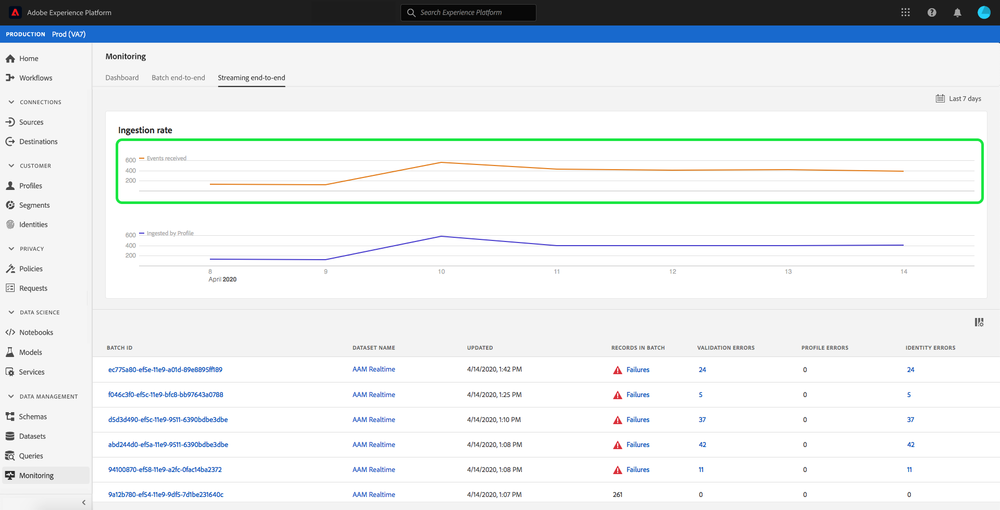
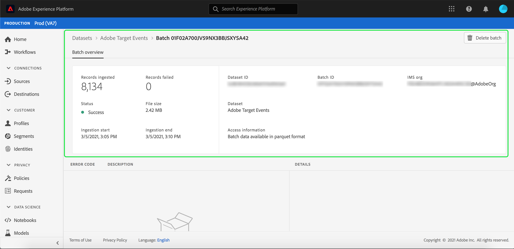

# Surveillance de l’ingestion des données

L’ingestion des données vous permet d’ingérer vos données dans Adobe Experience Platform. Vous pouvez utiliser l’ingestion par lots, qui vous permet d’insérer vos données à l’aide de divers types de fichiers (tels que des fichiers CSV), ou l’ingestion par flux, qui vous permet d’ingérer vos données dans les [!DNL Experience Platform] à l’aide de points d’entrée en continu en temps réel.

Ce guide d’utilisation décrit les étapes à suivre pour surveiller vos données dans l’interface utilisateur de Adobe Experience Platform. Ce guide nécessite que vous possédiez déjà un Adobe ID et un accès à Adobe Experience Platform.

## Surveillance de l’ingestion des données en continu de bout en bout {#monitor-streaming-end-to-end-data-ingestion}

>[!CONTEXTUALHELP]
>id="platform_ingestion_streaming_ingestionrate"
>title="Taux d&#39;ingestion"
>abstract="Le nombre d&#39;événements traités avec succès par seconde."
>text="Learn more in the documentation"
>additional-url="https://experienceleague.adobe.com/docs/experience-platform/dataflows/ui/monitor-sources.html?lang=fr" text="Surveiller les flux de données pour les sources dans l’interface utilisateur"

>[!TIP]
>
>Pour calculer le nombre total d’événements à une date particulière, utilisez l’expression : `total events / day = ingestion rate * 60 * 60 * 24`.

Dans l’[interface utilisateur d’Experience Platform](https://platform.adobe.com), sélectionnez **[!UICONTROL Surveillance]** dans le menu de navigation de gauche, suivi de **[!UICONTROL Diffusion en continu de bout en bout]**.

La page de surveillance **[!UICONTROL Diffusion en continu de bout en bout]** apparaît. Cet espace de travail fournit un graphique qui affiche le taux d’événements diffusés en continu reçus par [!DNL Experience Platform], un graphique qui affiche le taux d’événements diffusés qui ont été traités avec succès par [[!DNL Real-Time Customer Profile]](../../profile/home.md), ainsi qu’une liste détaillée des données entrantes.

Par défaut, le graphique du haut indique le taux d’ingestion au cours des sept derniers jours. Cette période peut être ajustée pour afficher différentes périodes en sélectionnant le bouton en surbrillance.

Le graphique du bas indique le taux d’événements diffusés en continu traités avec succès par [!DNL Profile] au cours des sept derniers jours. Cette période peut être ajustée pour afficher différentes périodes en sélectionnant le bouton en surbrillance.

>[!NOTE]
>
>Pour que les données s’affichent dans ce graphique, elles doivent être activées **explicitement** pour [!DNL Profile]. Pour savoir comment activer les données de diffusion en continu pour les [!DNL Profile], lisez le guide d’utilisation [jeux de données](../../catalog/datasets/user-guide.md#enable-a-dataset-for-real-time-customer-profile).

Sous les graphiques se trouve une liste de tous les enregistrements d’ingestion en flux continu qui correspondent à la période affichée ci-dessus. Chaque lot répertorié affiche son identifiant, le nom du jeu de données, le moment de sa dernière mise à jour, le nombre d’enregistrements dans le lot ainsi que le nombre d’erreurs (le cas échéant). Vous pouvez sélectionner n’importe lequel des enregistrements pour obtenir des informations plus détaillées sur cet enregistrement.

### Affichage des enregistrements en continu

Lorsque vous affichez les détails d’un enregistrement diffusé en continu réussi, des informations comme le nombre d’enregistrements ingérés, la taille du fichier et les heures de début et de fin de l’ingestion s’affichent.

Les détails de l’échec d’un enregistrement en continu affichent les mêmes informations qu’un enregistrement réussi.

En outre, les enregistrements en échec fournissent des détails sur les erreurs qui se sont produites lors du traitement du lot. Dans l’exemple ci-dessous, une erreur d’analyse s’est produite lors de la conversion ou de la validation des données.

>[!NOTE]
>
>En cas d’erreur dans les lignes ingérées, ces lignes ne sont **pas** ignorées à moins que le message résultant n’entraîne un XDM non valide.

## Surveillance de l’ingestion des données du lot de bout en bout

Dans le [[!DNL Experience Platform UI]](https://platform.adobe.com), sélectionnez **[!UICONTROL Surveillance]** dans le menu de navigation de gauche.

La page de surveillance de **[!UICONTROL lot de bout en bout]** apparaît et affiche une liste des lots ingérés précédemment. Vous pouvez sélectionner n’importe quel lot pour obtenir des informations plus détaillées sur cet enregistrement.

### Affichage des lots

Lorsque vous affichez les détails d’un lot réussi, des informations comme le nombre d’enregistrements ingérés, la taille du fichier et les heures de début et de fin de l’ingestion s’affichent.

Les détails d’un lot en échec affichent les mêmes informations qu’un lot réussi en plus du nombre d’enregistrements en échec.

En outre, les lots en échec fournissent des détails sur les erreurs qui se sont produites lors du traitement du lot. Dans l’exemple ci-dessous, une erreur s’est produite avec le lot ingéré, car il contient le nombre maximal d’identités pour la personne.

>[!NOTE]
>
>En cas d’erreur dans les lignes ingérées, ces lignes ne sont **pas** ignorées à moins que le message résultant n’entraîne un XDM non valide.

