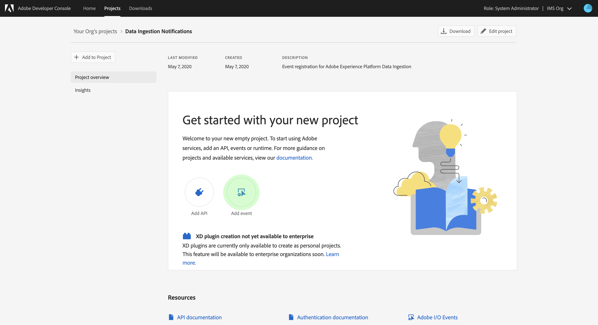

# Notifications d’ingestion de données

Le processus d’ingestion de données dans Adobe Experience Platform se compose de plusieurs étapes. Once you identify data files that need to be ingested into [!DNL Platform], the ingestion process begins and each step occurs consecutively until the data is either successfully ingested or fails. Il est possible d’initier le processus d’ingestion à l’aide de l’[API Data Ingestion d’Adobe ](https://www.adobe.io/apis/experienceplatform/home/api-reference.html#!acpdr/swagger-specs/ingest-api.yaml) ou de l’interface utilisateur Experience Platform.[!DNL Experience Platform]

Data loaded into [!DNL Platform] must go through multiple steps in order to reach its destination, the [!DNL Data Lake] or the [!DNL Real-time Customer Profile] data store. Chaque étape implique le traitement des données, leur validation, puis leur stockage avant de passer à l’étape suivante. En fonction de la quantité de données ingérée, ce processus peut devenir chronophage et il existe toujours une possibilité qu’il échoue en raison d’erreurs de validation, de sémantique ou de traitement. En cas d’échec, les problèmes de données doivent être résolus, puis l’ensemble du processus d’ingestion doit être redémarré en utilisant des fichiers de données corrigés.

To assist in monitoring the ingestion process, [!DNL Experience Platform] makes it possible to subscribe to a set of events that are published by each step of the process, notifying you to the status of the ingested data and any possible failures.

## Événements de notification d’état disponibles

Vous trouverez ci-dessous une liste des notifications d’état d’ingestion de données disponibles auxquels vous pouvez vous abonner.

>[!NOTE]
>
>Il n’y a qu’une seule rubrique d’événement fournie pour toutes les notifications d’ingestion de données. Vous pouvez utiliser le code d’événement pour faire la distinction entre les différents états.

| Service Platform | État | Description des événements | Code d’événement |
| ---------------- | ------ | ----------------- | ---------- |
| Entrée de données | success | Ingestion - Réussite du lot | ing_load_success |
| Entrée de données | failure | Ingestion - Échec du lot | ing_load_failure |
| Real-time Customer Profile | success | Service de profil - Réussite du lot de chargement de données | ps_load_success |
| Real-time Customer Profile | failure | Service de profil - Échec du lot de chargement de données | ps_load_failure |
| Graphique d’identités | success | Graphique d’identités - Réussite du lot de chargement de données | ig_load_success |
| Graphique d’identités | failure | Graphique d’identités - Échec du lot de chargement de données | ig_load_failure |

## Schéma de payload de notification

The data ingestion notification event schema is an [!DNL Experience Data Model] (XDM) schema containing fields and values that provide details regarding the status of the data being ingested. Please visit the public XDM [!DNL GitHub] repo in order to view the latest [notification payload schema](https://github.com/adobe/xdm/blob/master/schemas/notifications/ingestion.schema.json).

## S’abonner aux notifications d’état d’assimilation de données

Par le biais des [événements Adobe I/O](https://www.adobe.io/apis/experienceplatform/events.html), vous pouvez vous abonner à plusieurs types de notification en utilisation des webhooks. Les sections ci-dessous décrivent les étapes à suivre pour s&#39;abonner aux notifications [!DNL Platform] pour les événements d&#39;assimilation de données à l&#39;aide d&#39;Adobe Developer Console.

### Créer un projet dans la console de développement Adobe

Go to [Adobe Developer Console](https://www.adobe.com/go/devs_console_ui_fr) and sign in with your Adobe ID. Suivez ensuite les étapes décrites dans le didacticiel sur la [création d&#39;un projet](https://www.adobe.io/apis/experienceplatform/console/docs.html#!AdobeDocs/adobeio-console/master/projects-empty.md) vide dans la documentation de la Console développeur d&#39;Adobes.

### ajouter les [!DNL Experience Platform] événements au projet

Une fois que vous avez créé un nouveau projet, accédez à l’écran d’aperçu de ce projet. From here, click **[!UICONTROL Add event]**.

The _[!UICONTROL Add events]_ dialog appears. Cliquez sur **[!UICONTROL Experience Platform]** pour filtrer la liste des options disponibles, puis sur Notifications **[!UICONTROL de]** plateforme avant de cliquer sur **[!UICONTROL Suivant]**.

L’écran suivant affiche une liste de types d&#39;événement auxquels s’abonner. Sélectionnez Notification **[!UICONTROL d’importation de]** données, puis cliquez sur **[!UICONTROL Suivant]**.

L’écran suivant vous invite à créer un JSON Web Token (JWT). Vous avez la possibilité de générer automatiquement une paire de clés ou de télécharger votre propre clé publique générée dans le terminal.

Pour les besoins de ce didacticiel, la première option est suivie. Cochez la case d&#39;option **[!UICONTROL Générer une paire]** de clés, puis cliquez sur le bouton **[!UICONTROL Générer la paire]** de clés dans le coin inférieur droit.

Lorsque la paire de clés est générée, elle est automatiquement téléchargée par le navigateur. Vous devez stocker ce fichier vous-même, car il n’est pas conservé dans la Console développeur.

L’écran suivant vous permet de vérifier les détails de la paire de clés nouvellement générée. Cliquez sur **[!UICONTROL Suivant]** pour continuer.

Dans l’écran suivant, indiquez le nom et la description de l’enregistrement du événement. Il est recommandé de créer un nom unique et facilement identifiable afin de différencier cette inscription de événement des autres sur le même projet.

Plus loin dans le même écran, vous pouvez éventuellement configurer la manière de recevoir des événements. **[!UICONTROL Webhook]** vous permet de fournir une adresse webhook personnalisée pour recevoir des événements, tandis que l’action **** Runtime vous permet de faire de même à l’aide de [Adobe I/O Runtime](https://www.adobe.io/apis/experienceplatform/runtime/docs.html).

Ce didacticiel ignore cette étape de configuration facultative. Une fois que vous avez terminé, cliquez sur **[!UICONTROL Enregistrer les événements]** configurés pour terminer l’enregistrement du événement.

La page des détails de l&#39;enregistrement de événement nouvellement créé s&#39;affiche, dans laquelle vous pouvez consulter les événements reçus, effectuer le suivi du débogage et modifier sa configuration.

## Étapes suivantes

Une fois que vous avez enregistré [!DNL Platform] des notifications à votre projet, vous pouvez vue recevoir des événements du tableau de bord du projet. Pour obtenir des instructions détaillées sur la manière de suivre vos événements, reportez-vous au guide [Suivi des événements Adobe I/O](https://www.adobe.io/apis/experienceplatform/events/docs.html#!adobedocs/adobeio-events/master/support/tracing.md).
