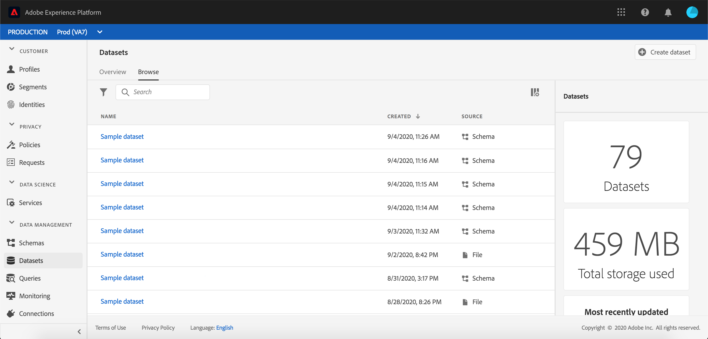
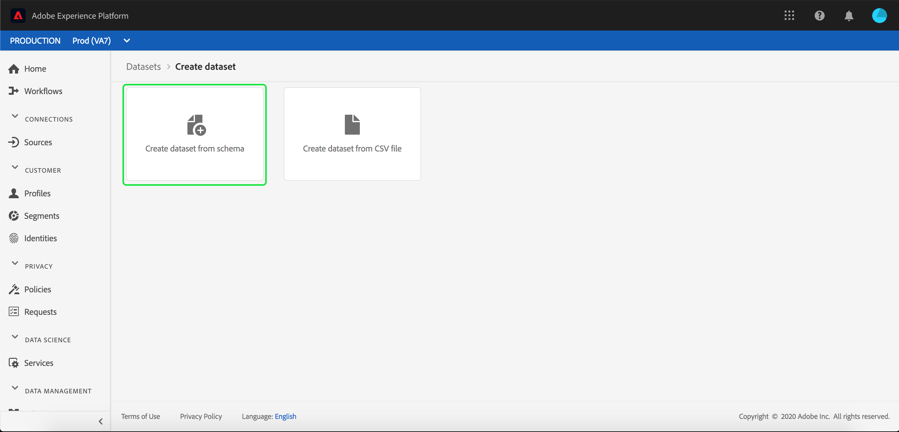
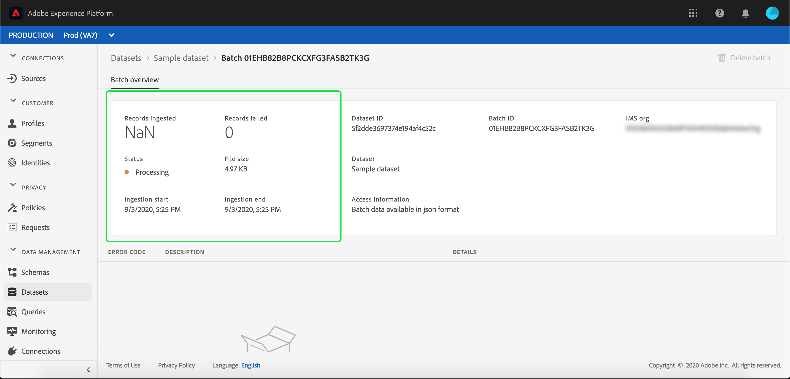

# Ingestion de données dans Adobe Experience Platform

Adobe Experience Platform vous permet d’importer facilement des données dans [!DNL Platform] sous forme de fichiers de commandes. Parmi les exemples de données à ingérer, citons les données de profil provenant d&#39;un fichier plat dans un système de gestion de la relation client (tel qu&#39;un fichier Parquet) ou les données conformes à un schéma [!DNL Experience Data Model] (XDM) connu dans le registre des Schémas.

## Prise en main

Pour suivre ce tutoriel, vous devez avoir accès à [!DNL Experience Platform]. Si vous n&#39;avez pas accès à une organisation IMS dans [!DNL Experience Platform], contactez votre administrateur système avant de continuer.

Si vous préférez ingérer des données à l’aide des API Data Ingestion, lisez d’abord le [guide de développement de l’ingestion par lots](../batch-ingestion/api-overview.md).

## Espace de travail des jeux de données

L&#39;espace de travail Datasets dans [!DNL Experience Platform] vous permet de vue et de gérer tous les jeux de données créés par votre organisation IMS, ainsi que de en créer de nouveaux.

Affichez l’espace de travail des jeux de données en cliquant sur **[!UICONTROL Jeux de données]** dans le volet de navigation de gauche. L&#39;espace de travail Jeux de données contient une liste de jeux de données, y compris des colonnes indiquant le nom, la création (date et heure), la source, le schéma et l&#39;état du dernier lot, ainsi que la date et l&#39;heure de la dernière mise à jour du jeu de données.

>[!NOTE]
>
>Cliquez sur l’icône de filtre en regard de la barre de recherche pour utiliser les fonctionnalités de filtrage afin de n’afficher que les jeux de données activés pour [!DNL Profile].

## Création d’un jeu de données

Pour créer un jeu de données, cliquez sur **[!UICONTROL Créer un jeu de données]** dans le coin supérieur droit de l’espace de travail des jeux de données.

Dans l&#39;écran **[!UICONTROL Créer un jeu de données]**, indiquez si vous souhaitez &quot;[!UICONTROL Créer un jeu de données à partir du Schéma]&quot; ou &quot;[!UICONTROL Créer un jeu de données à partir du fichier CSV]&quot;.

Dans ce tutoriel, un schéma sera utilisé pour créer le jeu de données. Cliquez sur **[!UICONTROL Créer un jeu de données à partir d’un schéma]** pour continuer.

## Sélectionner le schéma d’un jeu de données

Dans l’écran **[!UICONTROL Sélectionner un schéma]**, choisissez un schéma en cliquant sur la case d’option située à côté du schéma que vous souhaitez utiliser. Pour ce tutoriel, le jeu de données sera créé à l’aide du schéma Loyalty Members. L’utilisation de la barre de recherche pour filtrer les schémas est un moyen utile de trouver le schéma exact dont vous avez besoin.

Une fois que vous avez sélectionné la case d’option en regard du schéma que vous souhaitez utiliser, cliquez sur **[!UICONTROL Suivant]**.

## Configuration d’un jeu de données

Dans l&#39;écran **[!UICONTROL Configurer le jeu de données]**, vous devrez donner un nom à votre jeu de données et peut également fournir une description du jeu de données.

**Remarques sur les noms des jeux de données :**

- Les noms des jeux de données doivent être courts et descriptifs afin qu’ils puissent être facilement retrouvés par la suite dans la bibliothèque.
- Les noms des jeux de données doivent être uniques, ce qui signifie qu’ils doivent également être suffisamment précis pour ne pas être réutilisés à l’avenir.
- Il est recommandé de fournir des informations supplémentaires sur le jeu de données à l’aide du champ de description, car cela peut aider d’autres utilisateurs à différencier les jeux de données à l’avenir.

Une fois que le jeu de données possède un nom et une description, cliquez sur **[!UICONTROL Terminer]**.

## Activité du jeu de données

Un jeu de données vide a désormais été créé et vous avez été renvoyé à l’onglet **[!UICONTROL Activité du jeu de données]** dans l’espace de travail des jeux de données. Vous devriez voir le nom du jeu de données dans le coin supérieur gauche de l’espace de travail, ainsi qu’une notification indiquant « Aucun lot n’a été ajouté ». Cela est normal puisque vous n’avez encore ajouté aucun lot à ce jeu de données.

L&#39;onglet **[!UICONTROL Informations]** situé à droite de l&#39;espace de travail Datasets contient des informations relatives à votre nouveau jeu de données, telles que l&#39;ID, le nom, la description, le nom de la table, le schéma, la diffusion en continu et la source. L’onglet Informations contient également des informations sur le moment de création du jeu de données et sa date de dernière modification.

L’onglet Informations contient également un bouton activer/désactiver de **[!UICONTROL Profile]** qui permet d’activer votre jeu de données pour l’utiliser avec [!DNL Real-time Customer Profile]. L&#39;utilisation de cette bascule, et [!DNL Real-time Customer Profile], sera expliquée plus en détail dans la section qui suit.

## Activer le jeu de données pour [!DNL Real-time Customer Profile]

Les jeux de données sont utilisés pour ingérer des données dans [!DNL Experience Platform], et ces données sont en fin de compte utilisées pour identifier des individus et rassembler des informations provenant de sources multiples. Cette information regroupée est appelée [!DNL Real-Time Customer Profile]. Pour que [!DNL Platform] sache quelles informations doivent être incluses dans [!DNL Real-Time Profile], les jeux de données peuvent être marqués pour inclusion à l&#39;aide de la bascule **[!UICONTROL Profil]**.

Par défaut, ce bouton est désactivé. Si vous choisissez de basculer sur [!DNL Profile], toutes les données saisies dans le jeu de données seront utilisées pour identifier un individu et assembler son [!DNL Real-Time Profile].

Pour en savoir plus sur [!DNL Real-time Customer Profile] et sur l&#39;utilisation des identités, consultez la documentation [Identity Service](../../identity-service/home.md).

Pour activer le jeu de données pour [!DNL Real-time Customer Profile], cliquez sur l&#39;option **[!UICONTROL Profil]** dans l&#39;onglet **[!UICONTROL Info]**.

Une boîte de dialogue s’affiche vous demandant de confirmer que vous souhaitez activer le jeu de données pour [!DNL Real-time Customer Profile].

Cliquez sur **[!UICONTROL Activer]** et le bouton activer/désactiver devient bleu, indiquant qu’il est activé.

## Ajout de données à un jeu de données

Les données peuvent être ajoutées à un jeu de données de différentes manières. Vous pouvez choisir d&#39;utiliser des API [!DNL Data Ingestion] ou un partenaire ETL tel que [!DNL Unifi] ou [!DNL Informatica]. Dans ce tutoriel, les données seront ajoutées au jeu de données à l’aide de l’onglet **[!UICONTROL Ajouter des données]** dans l’interface utilisateur.

Pour commencer à ajouter des données au jeu de données, cliquez sur l’onglet **[!UICONTROL Ajouter des données]**. Vous pouvez désormais faire glisser et déposer des fichiers ou rechercher sur votre ordinateur les fichiers à ajouter.

>[!NOTE]
>
>La plate-forme prend en charge deux types de fichiers pour l’assimilation de données, Parquet ou JSON. Vous pouvez ajouter jusqu’à cinq fichiers à la fois, la taille maximale de chaque fichier étant de 10 Go.

## Chargement d’un fichier

Une fois que vous faites glisser et déposez (ou parcourez et sélectionnez) un fichier Parquet ou JSON que vous souhaitez télécharger, [!DNL Platform] commence immédiatement à traiter le fichier et une boîte de dialogue **[!UICONTROL Télécharger]** s&#39;affiche sur l&#39;onglet **[!UICONTROL Ajouter les données]** qui indique la progression du transfert du fichier.

## Mesures de jeux de données

Une fois le chargement du fichier terminé, l’onglet **[!UICONTROL Activité du jeu de données]** n’indique plus qu’« aucun lot n’a été ajouté ». L&#39;onglet **[!UICONTROL Activité des ensembles de données]** affiche désormais les mesures des ensembles de données. Toutes les mesures indiqueront « 0 » à cette étape, car le lot n’a pas encore été chargé.

En bas de l’onglet se trouve une liste présentant l’**[!UICONTROL identifiant du lot]** des données qui venaient d’être ingérées via le processus [« Ajouter des données à un jeu de données »](#add-data-to-dataset). Sont également incluses les informations relatives au lot, y compris la date d&#39;assimilation, le nombre d&#39;enregistrements assimilés et l&#39;état actuel du lot.

## Détails du lot

Cliquez sur l’**[!UICONTROL identifiant du lot]** pour afficher un **[!UICONTROL aperçu du lot]**, indiquant des détails supplémentaires sur le lot. Une fois le chargement du lot terminé, les informations relatives au lot sont mises à jour afin d’afficher le nombre d’enregistrements ingérés et la taille du fichier. L’état devient également &quot;Succès&quot; ou &quot;Échec&quot;. Si le lot échoue, la section **[!UICONTROL Code d’erreur]** contiendra des informations détaillées sur les erreurs survenues lors de l’ingestion.

Pour plus d’informations et pour obtenir des questions fréquentes sur l’ingestion par lots, consultez le [guide de dépannage de l’ingestion par lots](../batch-ingestion/troubleshooting.md).

Pour revenir à l’écran **[!UICONTROL Activité du jeu de données]**, cliquez sur le nom du jeu de données (**[!UICONTROL Loyalty Details]**) dans le chemin de navigation.

## Prévisualisation d’un jeu de données

Une fois que le jeu de données est prêt, une option **[!UICONTROL Prévisualisation du jeu de données]** s’affiche en haut de l’onglet **[!UICONTROL Activité du jeu de données]**.

Cliquez sur **[!UICONTROL Prévisualisation du jeu de données]** pour ouvrir une boîte de dialogue présentant les données d’exemple du jeu de données. Si le jeu de données a été créé à l’aide d’un schéma, les informations concernant le schéma du jeu de données s’affichent sur le côté gauche de la prévisualisation. Vous pouvez développer le schéma à l’aide des flèches pour voir la structure du schéma. Chaque en-tête de colonne dans la prévisualisation des données représente un champ dans le jeu de données.

## Étapes suivantes et ressources supplémentaires

Maintenant que vous avez créé un jeu de données et que vous avez assimilé avec succès des données dans [!DNL Experience Platform], vous pouvez répéter ces étapes pour créer un nouveau jeu de données ou assimiler davantage de données dans le jeu existant.

Pour en savoir plus sur l&#39;assimilation par lots, consultez la [Présentation de l&#39;assimilation par lots](../batch-ingestion/overview.md) et complétez votre apprentissage en regardant la vidéo ci-dessous.

>[!WARNING]
>
>L&#39;interface utilisateur [!DNL Platform] affichée dans la vidéo suivante est obsolète. Reportez-vous à la documentation ci-dessus pour obtenir les dernières captures d&#39;écran et fonctionnalités de l&#39;interface utilisateur.

>[!VIDEO](https://video.tv.adobe.com/v/27269?quality=12&learn=on)
