# Ingestion de données dans Adobe Experience Platform

Adobe Experience Platform vous permet d’importer facilement des données dans [!DNL Experience Platform] sous forme de fichiers de lots. Parmi les exemples de données à ingérer, citons notamment les données de profil d’un fichier plat dans un système CRM (un fichier Parquet, par exemple) ou les données conformes à un schéma [!DNL Experience Data Model] (XDM) connu dans le registre des schémas.

## Prise en main

Pour suivre ce tutoriel, vous devez avoir accès à [!DNL Experience Platform]. Si vous n’avez pas accès à une organisation dans [!DNL Experience Platform], contactez votre administrateur système avant de continuer.

Si vous préférez ingérer des données à l’aide des API Data Ingestion, lisez d’abord le [guide de développement de l’ingestion par lots](../batch-ingestion/api-overview.md).

## Espace de travail des jeux de données

L’espace de travail Jeux de données dans [!DNL Experience Platform] vous permet d’afficher et de gérer tous les jeux de données créés par votre organisation et d’en créer.

Affichez l’espace de travail Jeux de données en cliquant sur **[!UICONTROL Datasets]** dans le volet de navigation de gauche. L’espace de travail Jeux de données contient une liste de jeux de données, y compris des colonnes indiquant le nom, la date et l’heure de création, la source, le schéma et le statut du dernier lot, ainsi que la date et l’heure de la dernière mise à jour du jeu de données.

>[!NOTE]
>
>Cliquez sur l’icône de filtre à côté de la barre de recherche pour utiliser les fonctionnalités de filtrage afin d’afficher uniquement les jeux de données activés pour la [!DNL Profile].

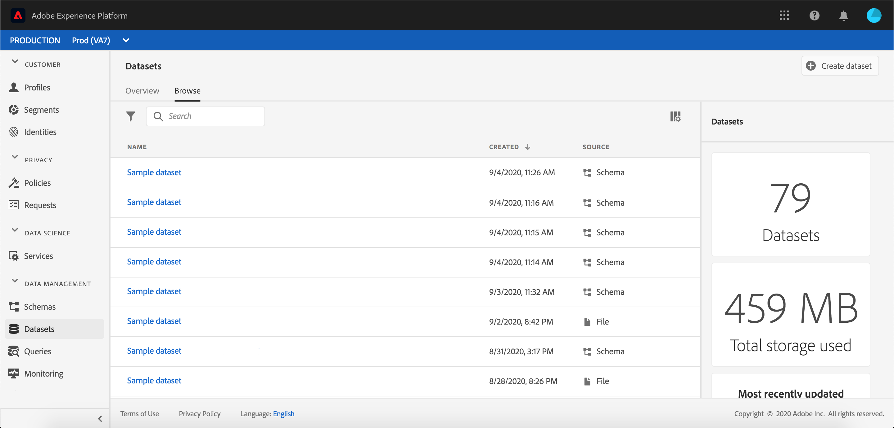

## Créer un jeu de données

Pour créer un jeu de données, cliquez sur **[!UICONTROL Create Dataset]** dans le coin supérieur droit de l’espace de travail Jeux de données .

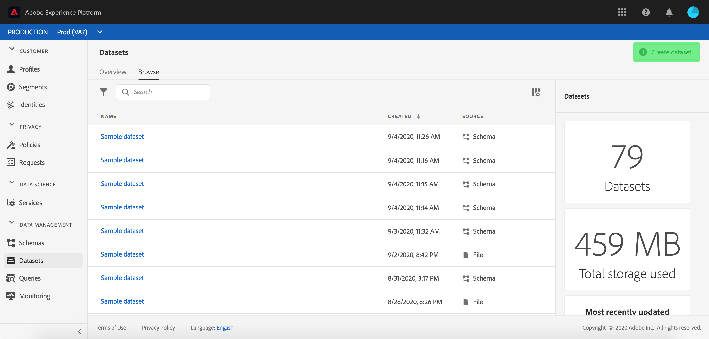

Sur l’écran **[!UICONTROL Create Dataset]**, choisissez si vous souhaitez afficher « [!UICONTROL Create Dataset from Schema] » ou « [!UICONTROL Create Dataset from CSV File] ».

Dans ce tutoriel, un schéma sera utilisé pour créer le jeu de données. Cliquez sur **[!UICONTROL Create Dataset from Schema]** pour continuer.

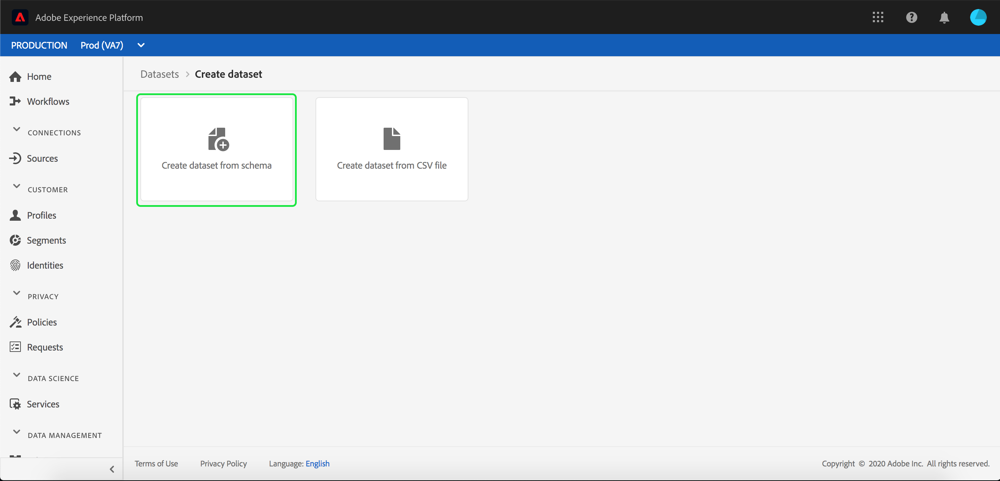

## Sélectionner le schéma d’un jeu de données

Sur l’écran **[!UICONTROL Select Schema]**, choisissez un schéma en cliquant sur le bouton radio en regard du schéma que vous souhaitez utiliser. Pour ce tutoriel, le jeu de données sera créé à l’aide du schéma Loyalty Members. L’utilisation de la barre de recherche pour filtrer les schémas est un moyen utile de trouver le schéma exact dont vous avez besoin.

Une fois que vous avez sélectionné le bouton radio en regard du schéma que vous souhaitez utiliser, cliquez sur **[!UICONTROL Next]**.

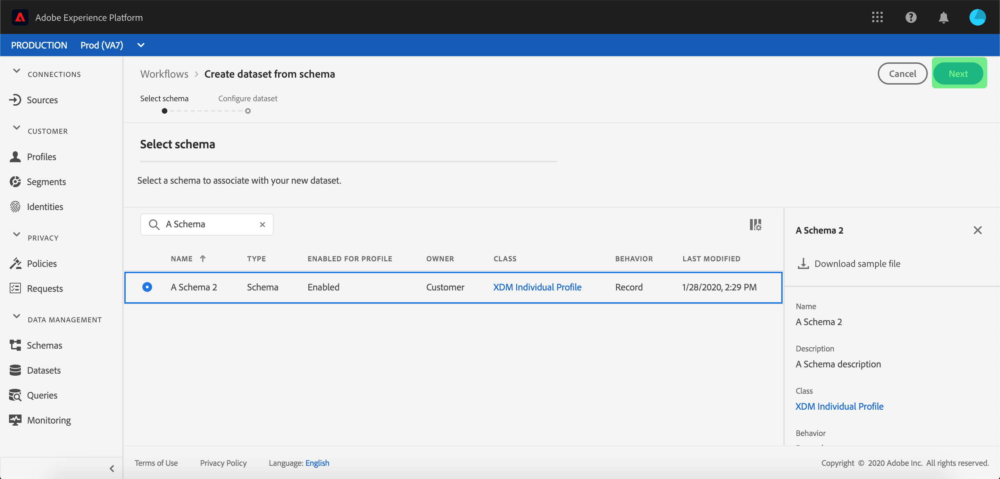

## Configuration d’un jeu de données

Sur l’écran **[!UICONTROL Configure Dataset]**, vous devrez donner un nom à votre jeu de données et peut également fournir une description du jeu de données.

**Remarques sur les noms des jeux de données :**

- Les noms des jeux de données doivent être courts et descriptifs afin qu’ils puissent être facilement retrouvés par la suite dans la bibliothèque.
- Les noms des jeux de données doivent être uniques, ce qui signifie qu’ils doivent également être suffisamment précis pour ne pas être réutilisés à l’avenir.
- Il est recommandé de fournir des informations supplémentaires sur le jeu de données à l’aide du champ de description, car cela peut aider d’autres utilisateurs à différencier les jeux de données à l’avenir.

Une fois que le jeu de données a un nom et une description, cliquez sur **[!UICONTROL Finish]**.

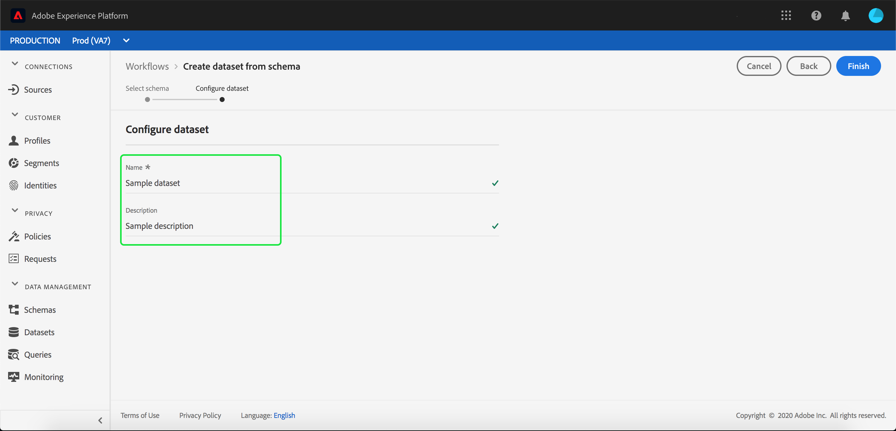

## Activité du jeu de données

Un jeu de données vide a été créé et vous êtes revenu à l’onglet **[!UICONTROL Dataset Activity]** dans l’espace de travail Jeux de données . Vous devriez voir le nom du jeu de données dans le coin supérieur gauche de l’espace de travail, ainsi qu’une notification indiquant « Aucun lot n’a été ajouté ». Cela est normal puisque vous n’avez encore ajouté aucun lot à ce jeu de données.

Sur le côté droit de l’espace de travail Jeux de données , vous verrez l’onglet **[!UICONTROL Info]** contenant des informations relatives à votre nouveau jeu de données, telles que l’identifiant du jeu de données, le nom, la description, le nom de la table, le schéma, la diffusion en continu et la source. L’onglet Infos contient également des informations sur la date de création du jeu de données et sa date de dernière modification.

L’onglet Infos contient également un bouton **[!UICONTROL Profile]** qui est utilisé pour activer votre jeu de données à utiliser avec [!DNL Real-Time Customer Profile]. L’utilisation de ce bouton (bascule) et de ce [!DNL Real-Time Customer Profile] sera expliquée en détail dans la section qui suit.

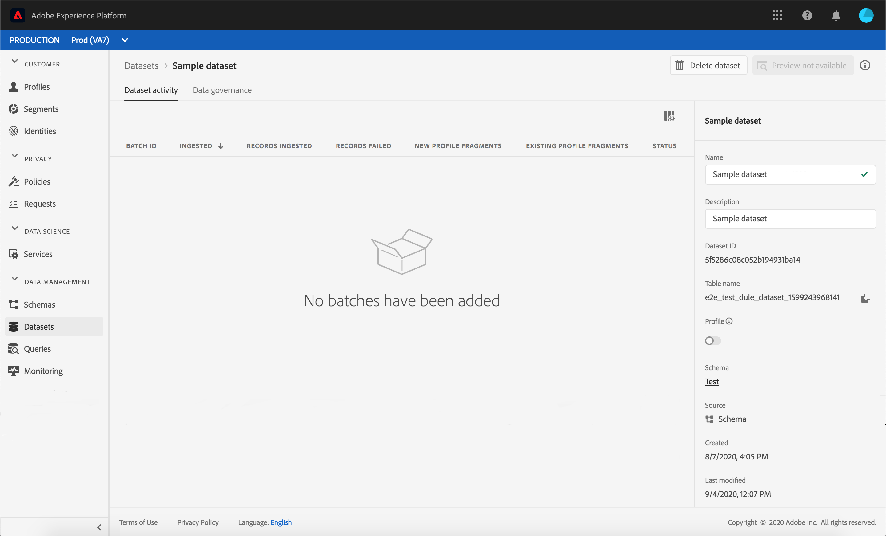

## Activer le jeu de données pour [!DNL Real-Time Customer Profile] {#enable-for-profile}

Les jeux de données sont utilisés pour ingérer des données dans [!DNL Experience Platform], et ces données sont finalement utilisées pour identifier des individus et rassembler des informations provenant de plusieurs sources. Cette information regroupée s&#39;appelle un [!DNL Real-Time Customer Profile]. Pour que les [!DNL Experience Platform] sachent quelles informations doivent être incluses dans le [!DNL Real-Time Profile], les jeux de données peuvent être marqués pour inclusion à l’aide du bouton **[!UICONTROL Profile]** .

Par défaut, ce bouton est désactivé. Si vous choisissez d’activer [!DNL Profile], toutes les données ingérées dans le jeu de données seront utilisées pour aider à identifier un individu et à rassembler ses [!DNL Real-Time Profile].

Pour en savoir plus sur l’[!DNL Real-Time Customer Profile] et l’utilisation des identités, consultez la documentation du [Service d’identités](../../identity-service/home.md).

Pour activer le jeu de données pour [!DNL Real-Time Customer Profile], cliquez sur le bouton **[!UICONTROL Profile]** dans l’onglet **[!UICONTROL Info]** .

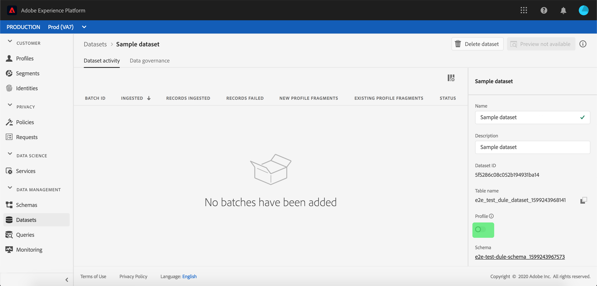

Une boîte de dialogue s’affiche vous demandant de confirmer que vous souhaitez activer le jeu de données pour [!DNL Real-Time Customer Profile].

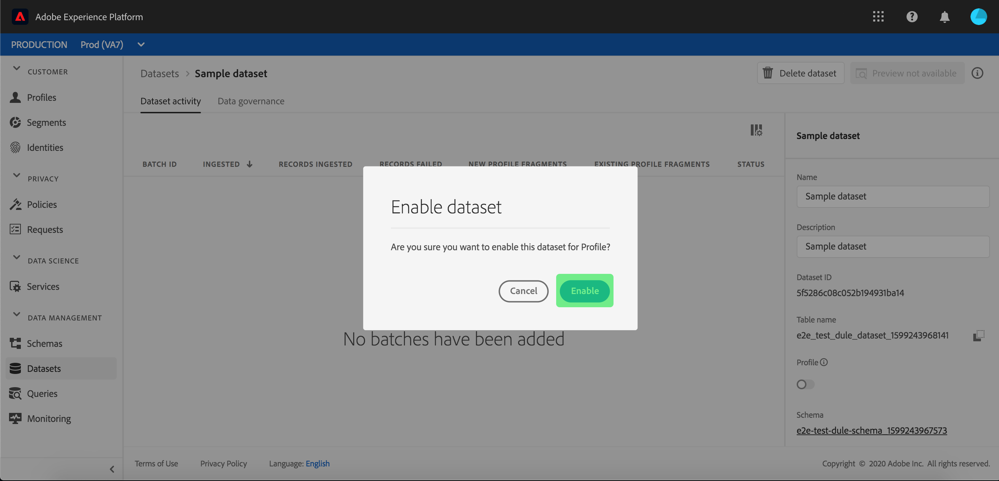

Cliquez sur **[!UICONTROL Enable]** et le bouton bascule devient bleu, ce qui indique qu’il est activé.

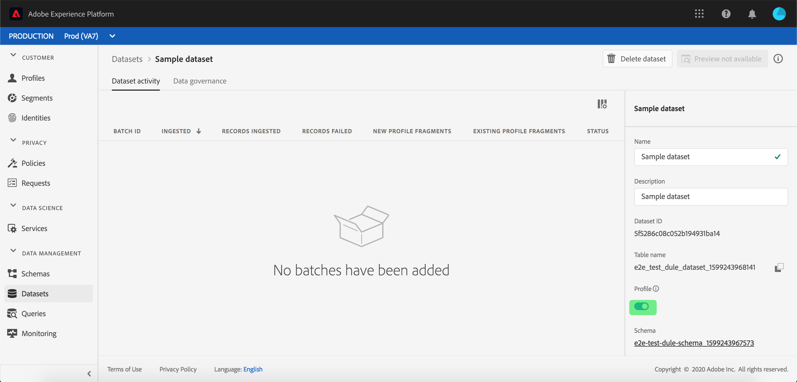

## Ajout de données à un jeu de données

Les données peuvent être ajoutées à un jeu de données de différentes manières. Vous pouvez choisir d’utiliser des API [!DNL Data Ingestion] ou un partenaire ETL tel que [!DNL Unifi] ou [!DNL Informatica]. Pour ce tutoriel, les données seront ajoutées au jeu de données à l’aide de l’onglet **[!UICONTROL Add Data]** dans l’interface utilisateur.

Pour commencer à ajouter des données au jeu de données, cliquez sur l’onglet **[!UICONTROL Add Data]** . Vous pouvez désormais faire glisser et déposer des fichiers ou rechercher sur votre ordinateur les fichiers à ajouter.

>[!NOTE]
>
>Experience Platform prend en charge deux types de fichiers pour l’ingestion de données : Parquet ou JSON. Vous pouvez ajouter jusqu’à cinq fichiers à la fois, la taille maximale de chaque fichier étant de 1 Go.

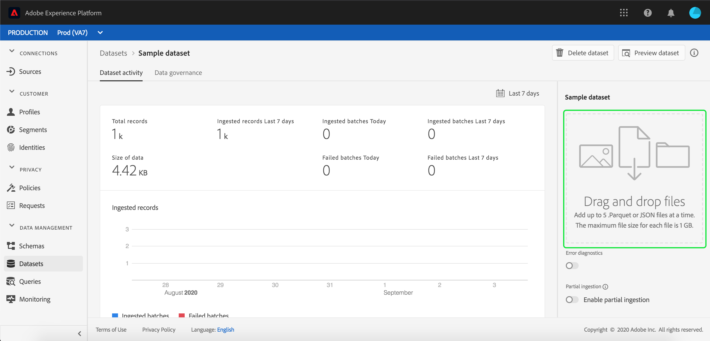

## Chargement d’un fichier {#upload-file}

Une fois que vous avez effectué un glisser-déposer (ou que vous avez recherché et sélectionné) d’un fichier Parquet ou JSON que vous souhaitez charger, [!DNL Experience Platform] commencez immédiatement à traiter le fichier et une boîte de dialogue de **[!UICONTROL Uploading]** s’affiche sur l’onglet **[!UICONTROL Add Data]** pour indiquer la progression du chargement de votre fichier.

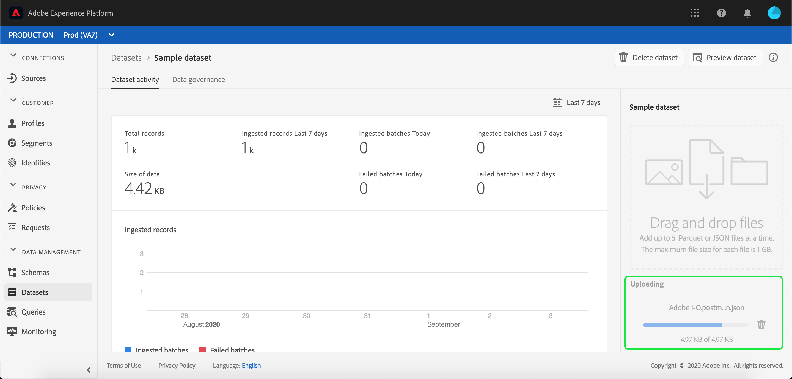

## Mesures de jeux de données

Une fois le chargement du fichier terminé, l’onglet **[!UICONTROL Dataset Activity]** n’indique plus qu’« Aucun lot n’a été ajouté ». Au lieu de cela, l’onglet **[!UICONTROL Dataset Activity]** affiche désormais les mesures du jeu de données. Toutes les mesures indiqueront « 0 » à cette étape, car le lot n’a pas encore été chargé.

Au bas de l’onglet se trouve une liste affichant la **[!UICONTROL Batch ID]** des données qui viennent d’être ingérées par le processus [« Ajouter des données au jeu de données »](#add-data-to-dataset). Vous y trouverez également des informations relatives au lot, notamment la date d’ingestion, le nombre d’enregistrements ingérés et l’état actuel du lot.

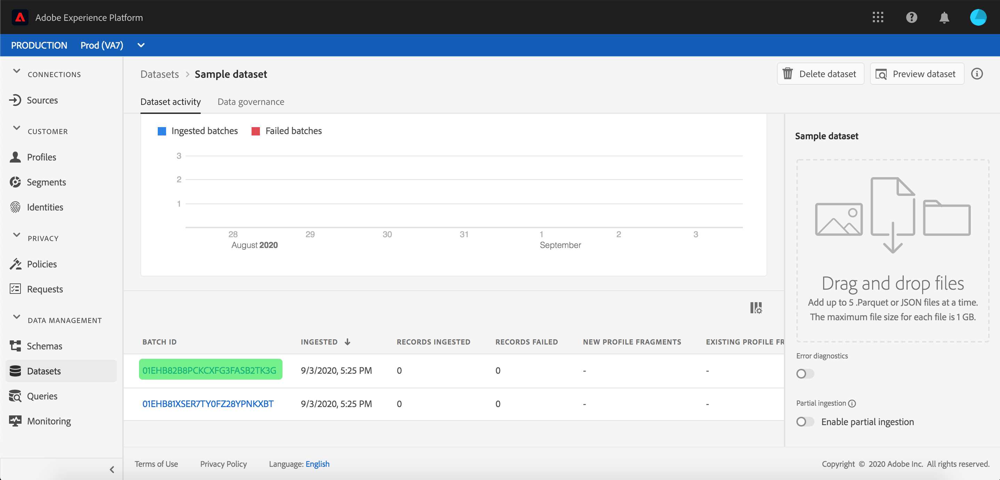

## Détails du lot

Cliquez sur le **[!UICONTROL Batch ID]** pour afficher un **[!UICONTROL Batch Overview]** affichant des détails supplémentaires sur le lot. Une fois le chargement du lot terminé, les informations relatives au lot sont mises à jour pour afficher le nombre d’enregistrements ingérés et la taille de fichier. Le statut passe également sur « Succès » ou « Échec ». Si le lot échoue, la section **[!UICONTROL Error Code]** contient des détails sur les erreurs survenues lors de l’ingestion.

Pour plus d’informations et pour obtenir des questions fréquentes sur l’ingestion par lots, consultez le [guide de dépannage de l’ingestion par lots](../batch-ingestion/troubleshooting.md).

Pour revenir à l’écran de **[!UICONTROL Dataset Activity]**, cliquez sur le nom du jeu de données (**[!UICONTROL Loyalty Details]**) dans le chemin de navigation.

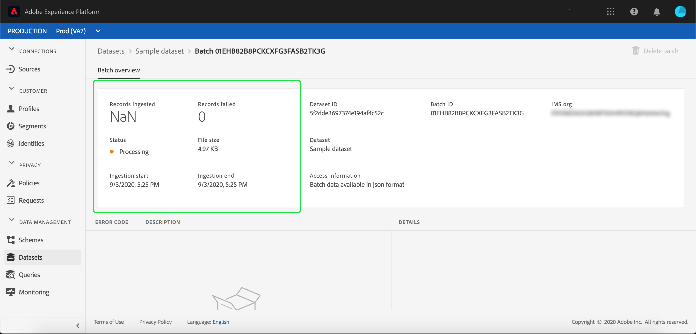

## Prévisualisation d’un jeu de données

Une fois que le jeu de données est prêt, une option à **[!UICONTROL Preview Dataset]** s’affiche en haut de l’onglet **[!UICONTROL Dataset Activity]** .

Cliquez sur **[!UICONTROL Preview Dataset]** pour ouvrir une boîte de dialogue affichant des exemples de données du jeu de données. Si le jeu de données a été créé à l’aide d’un schéma, les informations concernant le schéma du jeu de données s’affichent sur le côté gauche de la prévisualisation. Vous pouvez développer le schéma à l’aide des flèches pour voir la structure du schéma. Chaque en-tête de colonne dans la prévisualisation des données représente un champ dans le jeu de données.

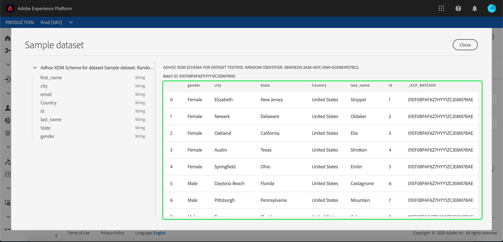

## Étapes suivantes et ressources supplémentaires

Maintenant que vous avez créé un jeu de données et que vous avez ingéré des données avec succès dans [!DNL Experience Platform], vous pouvez répéter ces étapes pour créer un nouveau jeu de données ou ingérer davantage de données dans le jeu de données existant.

Pour en savoir plus sur l’ingestion par lots, veuillez lire la [présentation de l’ingestion par lots](../batch-ingestion/overview.md) et compléter votre apprentissage en regardant la vidéo ci-dessous.

>[!WARNING]
>
>Lʼinterface utilisateur de [!DNL Experience Platform] affichée dans la vidéo suivante est obsolète. Consultez la documentation pour découvrir les dernières captures dʼécran et fonctionnalités de lʼinterface utilisateur.

>[!VIDEO](https://video.tv.adobe.com/v/27269?quality=12&learn=on)
