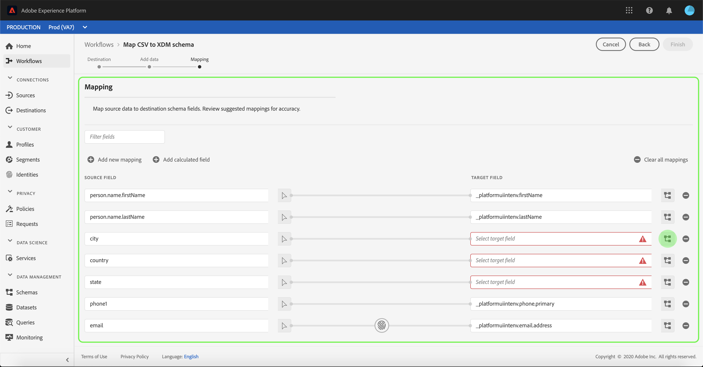
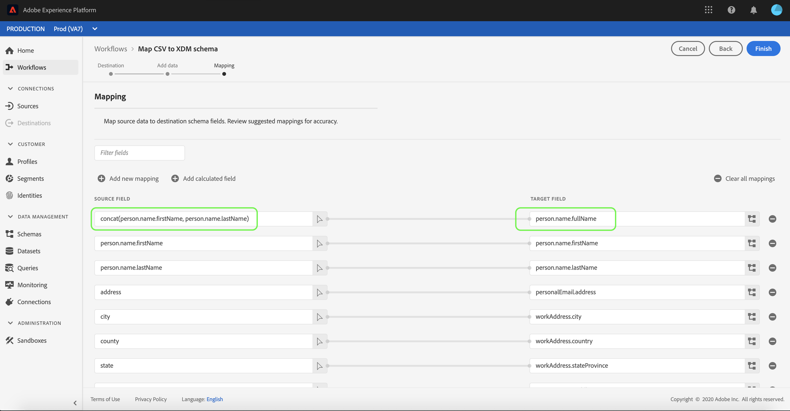

# Mappage d’un fichier CSV à un schéma XDM

In order to ingest CSV data into [!DNL Adobe Experience Platform], the data must be mapped to an [!DNL Experience Data Model] (XDM) schema. This tutorial covers how to map a CSV file to an XDM schema using the [!DNL Platform] user interface.

En outre, l’annexe du présent tutoriel fournit des informations supplémentaires sur l’utilisation des [fonctions de mappage](#mapping-functions).

## Prise en main

This tutorial requires a working understanding of the following components of [!DNL Platform]:

- [[ ! Modèle de données d’expérience DNL (système XDM)]](../../xdm/home.md): Cadre normalisé selon lequel [!DNL Platform] organiser les données d’expérience client.
- [[ ! Apport du lot DNL]](../batch-ingestion/overview.md): Méthode par laquelle [!DNL Platform] ingère les données des fichiers de données fournis par l’utilisateur.

Vous devez également avoir créé un jeu de données dans lequel ingérer vos données CSV pour suivre ce tutoriel. Pour connaître les étapes de création d’un jeu de données dans l’interface utilisateur, consultez le [tutoriel sur l’ingestion de données](./ingest-batch-data.md).

## Choix d’une destination

Connectez-vous à [[ !DNL Adobe Experience Platform]](https://platform.adobe.com) , puis sélectionnez **[!UICONTROL Workflows]** dans la barre de navigation de gauche pour accéder à l’espace de travail **[!UICONTROL Workflows]** .

Dans l’écran **[!UICONTROL Workflows]** , sélectionnez **[!UICONTROL Mapper le fichier CSV au schéma]** XDM sous la section d’assimilation **[!UICONTROL des]** données, puis sélectionnez **[!UICONTROL Lancement.]**

The **[!UICONTROL Map CSV to XDM schema]** workflow appears, starting on the **[!UICONTROL Destination]** step. Choisissez un jeu de données dans lequel les données entrantes doivent être assimilées. Vous pouvez soit utiliser un jeu de données existant, soit en créer un nouveau.

**Utilisation d’un jeu de données existant**

Pour importer vos données CSV dans un jeu de données existant, sélectionnez **[!UICONTROL Utiliser un jeu de données]** existant. Vous pouvez récupérer un jeu de données existant à l&#39;aide de la fonction de recherche ou en faisant défiler la liste des jeux de données existants dans le panneau.

Pour intégrer vos données CSV dans un nouveau jeu de données, sélectionnez **[!UICONTROL Créer un nouveau jeu de données]** et saisissez un nom et une description pour le jeu de données dans les champs fournis. Sélectionnez un schéma en utilisant la fonction de recherche ou en faisant défiler la liste des schémas fournis. Sélectionnez **[!UICONTROL Suivant]** pour continuer.

## Ajout de données

L’étape **[!UICONTROL Ajouter les données]** apparaît. Faites glisser votre fichier CSV dans l’espace prévu à cet effet ou sélectionnez **[!UICONTROL Choisir les fichiers]** pour entrer manuellement votre fichier CSV.

The **[!UICONTROL Sample data]** section appears once the file is uploaded, showing the first ten rows of data. Once you have confirmed that the data has uploaded as expected, select **[!UICONTROL Next]**.

## Mappage des champs CSV aux champs de schéma XDM

L’étape **[!UICONTROL Mappage]** apparaît. Les colonnes du fichier CSV sont répertoriées sous **[!UICONTROL Champ source]**, et les champs de schéma XDM correspondants sont répertoriés sous **[!UICONTROL Champ cible]**. Les champs cibles non sélectionnés sont indiqués en rouge. Vous pouvez utiliser l’option de filtre de champs pour restreindre la liste des champs source disponibles.

Pour mapper une colonne CSV à un champ XDM, sélectionnez l’icône de schéma en regard du champ de cible correspondant à la colonne.

La fenêtre **[!UICONTROL Sélectionner un champ de schéma]** apparaît. Ici, vous pouvez parcourir la structure du schéma XDM et localiser le champ vers lequel vous souhaitez mapper la colonne CSV. Cliquez sur un champ XDM pour le sélectionner, puis sur **[!UICONTROL Sélectionner]**.

L’écran **[!UICONTROL Mappage]** réapparaît, le champ XDM sélectionné s’affichant désormais sous **[!UICONTROL Champ cible]**.

Si vous ne souhaitez pas mapper une colonne CSV spécifique, vous pouvez supprimer le mappage en cliquant sur l’**icône de suppression** en regard du champ cible. Vous pouvez également supprimer tous les mappages en cliquant sur le bouton **** Effacer tous les mappages.

If you want to add a new mapping, select **[!UICONTROL Add new mapping]** at the top of the **[!UICONTROL Source Field]** list.

Lors du mappage des champs, vous pouvez également inclure des fonctions pour calculer les valeurs en fonction des champs sources d’entrée. Pour plus d’informations, consultez la section relative aux [fonctions de mappage](#mapping-functions) de l’annexe.

### ajouter le champ calculé

Les champs calculés permettent de créer des valeurs en fonction des attributs du schéma d’entrée. Ces valeurs peuvent ensuite être attribuées à des attributs dans le schéma de cible et recevoir un nom et une description pour faciliter la référence.

Sélectionnez le bouton **[!UICONTROL Ajouter le champ]** calculé pour continuer.

Le panneau **[!UICONTROL Créer un champ]** calculé s’affiche. La boîte de dialogue de gauche contient les champs, fonctions et opérateurs pris en charge dans les champs calculés. Sélectionnez l’un des onglets à début pour ajouter des fonctions, des champs ou des opérateurs à l’éditeur d’expressions.

| Tabulation | Description |
| --------- | ----------- |
| Champs | L’onglet Champs liste les champs et les attributs disponibles dans le schéma source. |
| Fonctions | L&#39;onglet Fonctions liste les fonctions disponibles pour transformer les données. |
| Opérateurs   | L’onglet opérateurs liste les opérateurs disponibles pour transformer les données. |

Vous pouvez ajouter manuellement des champs, des fonctions et des opérateurs à l’aide de l’éditeur d’expressions situé au centre. Sélectionnez l’éditeur à début de la création d’une expression.

Sélectionnez **[!UICONTROL Enregistrer]** pour continuer.

L’écran de mappage s’affiche à nouveau avec votre nouveau champ source. Appliquez le champ de cible approprié et sélectionnez **[!UICONTROL Terminer]** pour terminer le mappage.

## Surveiller votre flux de données

Une fois votre fichier CSV mappé et créé, vous pouvez surveiller les données qui y sont ingérées. Pour plus d’informations sur la surveillance des flux de données, voir le didacticiel sur la [surveillance des flux](../../ingestion/quality/monitor-data-flows.md)de données en flux continu.

## Étapes suivantes

En suivant ce tutoriel, vous avez mappé un fichier CSV plat à un schéma XDM et l’avez ingéré dans [!DNL Platform]. This data can now be used by downstream [!DNL Platform] services such as [!DNL Real-time Customer Profile]. Pour plus d’informations, consultez la présentation du Profil client [[ !DNL en temps réel]](../../profile/home.md) .

## Annexe

La section suivante fournit des informations supplémentaires sur le mappage des colonnes CSV aux champs XDM.

### Fonctions de mappage

Certaines fonctions de mappage peuvent être utilisées pour calculer des valeurs en fonction de ce qui est saisi dans les champs sources. Pour utiliser une fonction, saisissez-la sous **[!UICONTROL Champ source]** avec la syntaxe et les entrées appropriées.

Par exemple, pour concaténer les champs CSV **city** et **country** et les attribuer au champ XDM **city**, définissez le champ source en tant que `concat(city, ", ", county)`.

Le tableau ci-dessous répertorie toutes les fonctions de mappage prises en charge, y compris les exemples d’expressions et leurs résultats.

| Fonction | Description | Exemple d’expression | Exemple de résultat |
| -------- | ----------- | ----------------- | ------------- |
| concat | Concatène les chaînes données. | concat(&quot;Hi, &quot;, &quot;there&quot;, &quot;!&quot;) | `"Hi, there!"` |
| explode | Divise la chaîne sur base d’un regex et renvoie un tableau de parties. | explode(&quot;Hi, there!&quot;, &quot; &quot;) | `["Hi,", "there"]` |
| instr | Renvoie l’emplacement/l’index d’une sous-chaîne. | instr(&quot;adobe.com&quot;, &quot;com&quot;) | 6 |
| replacestr | Remplace la chaîne de recherche si elle est présente dans la chaîne d’origine. | replacestr(&quot;This is a string re test&quot;, &quot;re&quot;, &quot;replace&quot;) | &quot;This is a string replace test&quot; |
| substr | Renvoie une sous-chaîne d’une longueur donnée. | substr(&quot;This is a substring test&quot;, 7, 8) | &quot; a subst&quot; |
| lower / lcase | Convertit une chaîne en minuscules. | lower(&quot;HeLLo&quot;) lcase(&quot;HeLLo&quot;) | &quot;hello&quot; |
| upper / ucase | Convertit une chaîne en majuscules. | upper(&quot;HeLLo&quot;) ucase(&quot;HeLLo&quot;) | &quot;HELLO&quot; |
| split | Divise une chaîne d’entrée sur un séparateur. | split(&quot;Hello world&quot;, &quot; &quot;) | `["Hello", "world"]` |
| join | Joint une liste d’objets à l’aide du séparateur. | `join(" ", ["Hello", "world"]`) | &quot;Hello world&quot; |
| coalesce | Renvoie le premier objet non nul dans une liste donnée. | coalesce(null, null, null, &quot;first&quot;, null, &quot;second&quot;) | &quot;first&quot; |
| decode | Étant donné qu’une clé et une liste de paires clé-valeur sont aplaties dans un tableau, la fonction renvoie la valeur si la clé est trouvée ou renvoie une valeur par défaut si elle est présente dans le tableau. | decode(&quot;k2&quot;, &quot;k1&quot;, &quot;v1&quot;, &quot;k2&quot;, &quot;v2&quot;, &quot;default&quot;) | &quot;v2&quot; |
| iif | Évalue une expression booléenne donnée et renvoie la valeur spécifiée en fonction du résultat. | iif(&quot;s&quot;.equalsIgnoreCase(&quot;S&quot;), &quot;True&quot;, &quot;False&quot;) | &quot;True&quot; |
| min | Renvoie le minimum des arguments donnés. Utilise l’ordre naturel. | min(3, 1, 4) | 1 |
| max | Renvoie le maximum des arguments donnés. Utilise l’ordre naturel. | max(3, 1, 4) | 4 |
| first | Récupère le premier argument donné. | first(&quot;1&quot;, &quot;2&quot;, &quot;3&quot;) | &quot;1&quot; |
| last | Récupère le dernier argument donné. | last(&quot;1&quot;, &quot;2&quot;, &quot;3&quot;) | &quot;3&quot; |
| uuid / guid | Génère un identifiant pseudo-aléatoire. | uuid() guid() | {UNIQUE_ID} |
| now | Récupère l’heure actuelle. | now() | `2019-10-23T10:10:24.556-07:00[America/Los_Angeles]` |
| timestamp | Récupère l’heure Unix actuelle. | timestamp() | 1571850624571 |
| format | Formate la date d’entrée selon un format spécifié. | format({DATE}, &quot;yyyy-MM-dd HH:mm:ss&quot;) | &quot;2019-10-23 11:24:35&quot; |
| dformat | Convertit une date et une heure en chaîne de date selon un format spécifié. | dformat(1571829875, &quot;dd-MMM-yyyy hh:mm&quot;) | &quot;23-Oct-2019 11:24&quot; |
| date | Convertit une chaîne de date en objet ZonedDateTime (format ISO 8601). | date(&quot;23-Oct-2019 11:24&quot;) | &quot;2019-10-23T11:24:00+00:00&quot; |
| date_part | Récupère les parties de la date. Les valeurs de composant suivantes sont prises en charge :   &quot;year&quot; &quot;yyyy&quot; &quot;yy&quot;  &quot;quarter&quot; &quot;qq&quot; &quot;q&quot;  &quot;month&quot; &quot;mm&quot; &quot;m&quot;  &quot;dayofyear&quot; &quot;dy&quot; &quot;y&quot;  &quot;day&quot; &quot;dd&quot; &quot;d&quot;  &quot;week&quot; &quot;ww&quot; &quot;w&quot;  &quot;weekday&quot; &quot;dw&quot; &quot;w&quot;  &quot;hour&quot; &quot;hh&quot; &quot;hh24&quot; &quot;hh12&quot;  &quot;minute&quot; &quot;mi&quot; &quot;n&quot;  &quot;second&quot; &quot;ss&quot; &quot;s&quot;  &quot;millisecond&quot; &quot;ms&quot; | date_part(date(&quot;2019-10-17 11:55:12&quot;), &quot;MM&quot;) | 10 |
| set_date_part | Remplace un composant à une date donnée. Les composants suivants sont acceptés :   &quot;year&quot; &quot;yyyy&quot; &quot;yy&quot;  &quot;month&quot; &quot;mm&quot; &quot;m&quot;  &quot;day&quot; &quot;dd&quot; &quot;d&quot;  &quot;hour&quot; &quot;hh&quot;  &quot;minute&quot; &quot;mi&quot; &quot;n&quot;  &quot;second&quot; &quot;ss&quot; &quot;s&quot; | set_date_part(&quot;m&quot;, 4, date(&quot;2016-11-09T11:44:44.797&quot;) | &quot;2016-04-09T11:44:44.797&quot; |
| make_date_time / make_timestamp | Crée une date à partir de parties. | make_date_time(2019, 10, 17, 11, 55, 12, 999, &quot;America/Los_Angeles&quot;) | `2019-10-17T11:55:12.0&#x200B;00000999-07:00[America/Los_Angeles]` |
| current_timestamp | Renvoie la date et l’heure actuelles. | current_timestamp() | 1571850624571 |
| current_date | Renvoie la date actuelle sans composant d’heure. | current_date() | &quot;18-Nov-2019&quot; |