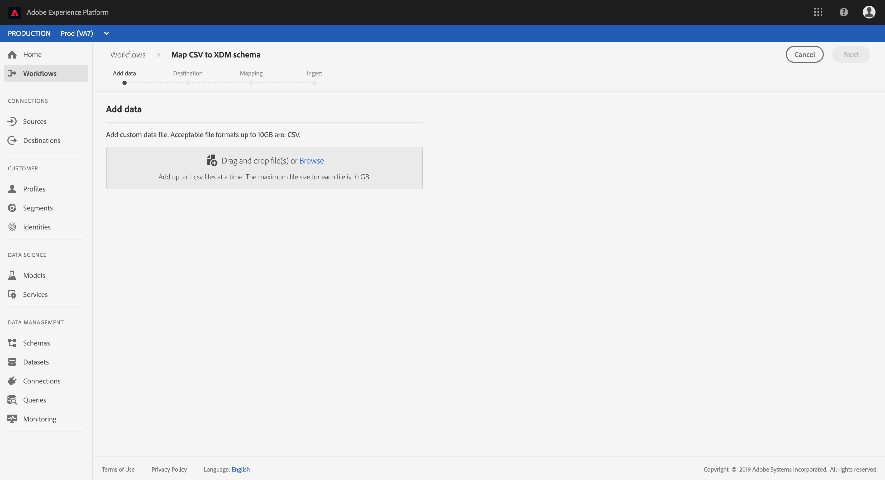
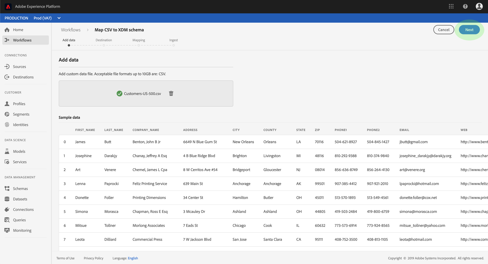

# Mappage d’un fichier CSV à un XDM 

Pour importer des données CSV dans Adobe Experience Platform, les données doivent être mappées à un  de modèle de données d’expérience (XDM). Ce didacticiel explique comment mapper un fichier CSV à un XDM à l’aide de l’interface utilisateur de la plateforme d’expérience.

En outre, l&#39;annexe du présent didacticiel fournit des informations supplémentaires sur l&#39;utilisation des fonctions [de](#mapping-functions)cartographie.

## Prise en main

Ce didacticiel nécessite une compréhension pratique des composants suivants d’Adobe Experience Platform :

- [Modèle de données d’expérience (système XDM)](../../xdm/home.md): Cadre normalisé selon lequel la plateforme d’expérience organise les données d’expérience client.
- [Importation](../batch-ingestion/overview.md)par lot : Méthode par laquelle la plateforme imprime des données à partir de fichiers de données fournis par l’utilisateur.

Ce didacticiel nécessite également que vous ayez déjà créé un jeu de données dans lequel intégrer vos données CSV. Pour connaître les étapes de création d’un jeu de données dans l’interface utilisateur, consultez le didacticiel [sur l’assimilation des](./ingest-batch-data.md)données.

## Données Ajouter

Dans l’interface utilisateur de la plate-forme d’expérience, cliquez sur **dans le volet de navigation de gauche, puis cliquez sur** Associer CSV au **** XDM. Dans le rail de droite qui s’affiche, cliquez sur **Lancer**.

Le flux de travail de _mappage CSV/XDM_ s’affiche, en commençant par l’étape de données __ Ajouter.

Faites glisser votre fichier CSV dans l’espace prévu à cet effet ou cliquez sur **Parcourir** pour sélectionner directement un fichier. Une section _Exemple de données_ s’affiche une fois le fichier téléchargé, avec les dix premières lignes de données. Une fois que vous avez confirmé que les données ont été téléchargées comme prévu, cliquez sur **Suivant**.

## Choisir une destination

The _Destination_ step appears. Dans le  fourni, sélectionnez le jeu de données dans lequel les données CSV seront assimilées, puis cliquez sur **Suivant**.

## Mappage des champs CSV aux champs  XDM

The _Mapping_ step appears. Les colonnes du fichier CSV sont répertoriées sous Champ __ source, et les champs XDM  correspondants sont répertoriés sous Champ __. Les champs  non sélectionnés sont indiqués en rouge.

Pour mapper une colonne CSV à un champ XDM, cliquez sur l’icône de  en regard du champ de correspondant de la colonne.

La fenêtre _Sélectionner  champ_ de apparaît. Ici, vous pouvez parcourir la structure du XDM et localiser le champ vers lequel vous souhaitez mapper la colonne CSV. Cliquez sur un champ XDM pour le sélectionner, puis sur **Sélectionner**.

L’écran _Mappage_ s’affiche à nouveau, le champ XDM sélectionné s’affichant désormais sous Champ _de_ du.

Si vous ne souhaitez pas mapper une colonne CSV spécifique, vous pouvez supprimer le mappage en cliquant sur l’icône **Supprimer** en regard du champ de  du. Si vous souhaitez ajouter un nouveau mappage, cliquez sur **Ajouter nouveau mappage** au bas de la  de.

Lors du mappage de champs, vous pouvez également inclure des fonctions pour calculer les valeurs en fonction des champs de source d’entrée. Pour plus d’informations, voir la section relative aux fonctions [de](#mapping-functions) mappage dans l’annexe.

Répétez les étapes ci-dessus pour continuer à mapper les colonnes CSV aux champs XDM. Une fois que vous avez terminé, cliquez sur **Suivant**.

## Incorporer des données

L’étape _Assimilation_ s’affiche, ce qui vous permet de consulter les détails de votre fichier source et de votre jeu de données . Cliquez sur **Assimiler** pour  l’assimilation des données CSV. Selon la taille du fichier CSV, ce processus peut prendre plusieurs minutes. L’écran se met à jour une fois l’assimilation terminée, indiquant la réussite ou l’échec. Click **Finish** to complete the workflow.

## Étapes suivantes

En suivant ce didacticiel, vous avez mappé un fichier CSV aplati à un XDM et l’avez assimilé à une plateforme. Ces données peuvent désormais être utilisées par les services Plateforme en aval, tels que les  du client en temps réel. Pour plus d’informations, reportez-vous à l’aperçu [du de clients en temps](../../profile/home.md) réel.

## Annexe

La section suivante fournit des informations supplémentaires sur le mappage des colonnes CSV aux champs XDM.

### Fonctions de mappage

Certaines fonctions de mappage peuvent être utilisées pour calculer et calculer des valeurs en fonction de ce qui est entré dans les champs source. Pour utiliser une fonction, saisissez-la sous Champ __ source avec la syntaxe et les entrées appropriées.

Par exemple, pour concaténer les champs CSV **ville** et **pays** et les affecter au champ XDM de **ville** , définissez le champ source comme `concat(city, ", ", county)`étant.

Le tableau ci-dessous  toutes les fonctions de mappage prises en charge, y compris les exemples  de et les sorties qui en résultent.

| Fonction | Description | Exemple de  de  | Exemple de sortie |
| -------- | ----------- | ----------------- | ------------- |
| concat | Concatène les chaînes données. | concat(&quot;Salut, &quot;, &quot;là&quot;, &quot;!&quot;) | `"Hi, there!"` |
| exploser | Scinde la chaîne en fonction d’un regex et renvoie un tableau de parties. | explode(&quot;Salut, là !&quot;, &quot; &quot;) | `["Hi,", "there"]` |
| entity | Renvoie l’emplacement/l’index d’une sous-chaîne. | vice(&quot;adobe.com&quot;, &quot;com&quot;) | 6 |
| rétracteur | Remplace la chaîne de recherche si elle est présente dans la chaîne d’origine. | replacester(&quot;Ceci est une chaîne re test&quot;, &quot;re&quot;, &quot;replace&quot;) | &quot;Test de remplacement de chaîne&quot; |
| substr | Renvoie une sous-chaîne d’une longueur donnée. | highing(&quot;Il s’agit d’un test de sous-chaîne&quot;, 7, 8) | &quot;a subst&quot; |
| lower / lcase | Convertit une chaîne en minuscules. | lower(&quot;HeLLo&quot;) lcase(&quot;HeLLo&quot;) | &quot;salut&quot; |
| upper / ucase | Convertit une chaîne en majuscules. | upper(&quot;HeLLo&quot;) ucase(&quot;HeLLo&quot;) | &quot;BONJOUR&quot; |
| fractionner | Scinde une chaîne d’entrée sur un séparateur. | split(&quot;Hello world&quot;, &quot; &quot;) | `["Hello", "world"]` |
| join | Rejoint un  d’objets à l’aide du séparateur. | `join(" ", ["Hello", "world"]`) | &quot;Bonjour le monde&quot; |
| collier | Renvoie le premier objet non nul dans un  donné. | coalesce(null, null, null, &quot;first&quot;, null, &quot;second&quot;) | &quot;first&quot; |
| décoder | Compte tenu d’une clé et d’un de paires clé-valeur aplaties en tant que tableau, la fonction renvoie la valeur si une clé est trouvée ou renvoie une valeur par défaut si elle est présente dans le tableau. | decode(&quot;k2&quot;, &quot;k1&quot;, &quot;v1&quot;, &quot;k2&quot;, &quot;v2&quot;, &quot;default&quot;) | &quot;v2&quot; |
| iif | Evalue un  booléen donné  et renvoie la valeur spécifiée en fonction du résultat. | iif(&quot;s&quot;.equalsIgnoreCase(&quot;S&quot;), &quot;True&quot;, &quot;False&quot;) | &quot;True&quot; |
| min | Renvoie le minimum des arguments donnés. Utilise l’ordre naturel. | min(3, 1, 4) | 1 |
| max | Renvoie le maximum des arguments donnés. Utilise l’ordre naturel. | max(3, 1, 4) | 4 |
| first | Récupère le premier argument donné. | first(&quot;1&quot;, &quot;2&quot;, &quot;3&quot;) | &quot;1&quot; |
| last | Récupère le dernier argument donné. | last(&quot;1&quot;, &quot;2&quot;, &quot;3&quot;) | &quot;3&quot; |
| uuid / guid | Génère un ID pseudo-aléatoire. | uuid() guid() | {UNIQUE_ID} |
| now | Récupère l’heure actuelle. | now() | `2019-10-23T10:10:24.556-07:00[America/Los_Angeles]` |
| timestamp | Récupère l&#39;heure Unix actuelle. | timestamp() | 1571850624571 |
| format | Formate la date d’entrée selon un format spécifié. | format({DATE}, &quot;aaaa-MM-jj HH:mm:ss&quot;) | &quot;2019-10-23 11:24:35&quot; |
| dformat | Convertit un horodatage en chaîne de date selon un format spécifié. | dformat(1571829875, &quot;dd-MMM-yyyy hh:mm&quot;) | &quot;23-Oct-2019 11:24&quot; |
| date | Convertit une chaîne de date en objet ZonedDateTime (format ISO 8601). | date(&quot;23-Oct-2019 11:24&quot;) | &quot;2019-10-23T11:24:00+00:00&quot; |
| date_part | Récupère les parties de la date. Les valeurs de composant suivantes sont prises en charge :   &quot;année&quot; &quot; &quot;aaaa&quot;  &quot; &quot;trimestre&quot; &quot;qq&quot;  &quot;q&quot;&quot;mois&quot;&quot;mm&quot;&quot;m&quot;le&quot;jour&quot;de l&quot;année&quot;&quot;le&quot;&quot;le&quot;jour&quot;y&quot;le&quot;&quot;le&quot;le&quot;le&quot;le&quot;le&quot;le&quot;le&quot;le&quot;le&quot;le&quot;le&quot;le&quot;le&quot;le&quot;le&quot;le&quot;le&quot;&quot;le&quot;le&quot;&quot;le&quot;le&quot;le&quot;le&quot;le&quot;le&quot;le&quot;le&quot;le&quot;le&quot;le&quot;le&quot;le&quot;le&quot;le&quot;le&quot;le&quot;le&quot;le&quot;le&quot;le&quot;le&quot;le&quot;le&quot;&quot;&quot;le&quot;le&quot;&quot;le&quot;le&quot;&quot;le&quot;le&quot;le&quot;le&quot;le&quot;le&quot;le&quot;&quot;le&quot;le&quot;le&quot;le&quot;le&quot;le&quot;le&quot;le&quot;le&quot;le&quot;le&quot;&quot;le&quot;le&quot;le&quot;le&quot;le&quot;le&quot;le&quot;le&quot;&quot;le&quot;le&quot;le&quot;le&quot;le&quot;le&quot;&quot;&quot;le&quot;le&quot;&quot;hh&quot;&quot;hh24&quot;&quot;hh12&quot;&quot;minute&quot;mi&quot;n&quot;&quot;second&quot;s&quot;&quot;s&quot;&quot;milliseconde&quot;m&quot;ms&quot;                                   | date_part(date(&quot;2019-10-17 11:55:12&quot;), &quot;MM&quot;) | 10 |
| set_date_part | Remplace un composant à une date donnée. Les composants suivants sont acceptés :   &quot;année&quot; &quot;aaaa&quot; &quot;aaaa&quot;  &quot;mois&quot; &quot;mm&quot; &quot;m&quot;  &quot;jour&quot;&quot;dd&quot;&quot;d&quot;&quot;heure&quot;&quot;hh&quot;&quot;minute&quot;mi&quot;n&quot;&quot;second&quot;s&quot;&quot;s&quot;&quot;s&quot;s&quot;&quot;&quot;              | set_date_part(&quot;m&quot;, 4, date(&quot;2016-11-09T11:44:44.797&quot;) | &quot;2016-04-09T11:44:44.797&quot; |
| make_date_time / make_timestamp | Crée une date à partir de pièces. | make_date_time(2019, 10, 17, 11, 55, 12, 999, &quot;America/Los_Angeles&quot;) | `2019-10-17T11:55:12.0&#x200B;00000999-07:00[America/Los_Angeles]` |
| current_timestamp | Renvoie l’horodatage actuel. | current_timestamp() | 1571850624571 |
| current_date | Renvoie la date actuelle sans composant d’heure. | current_date() | &quot;18-Nov-2019&quot; |