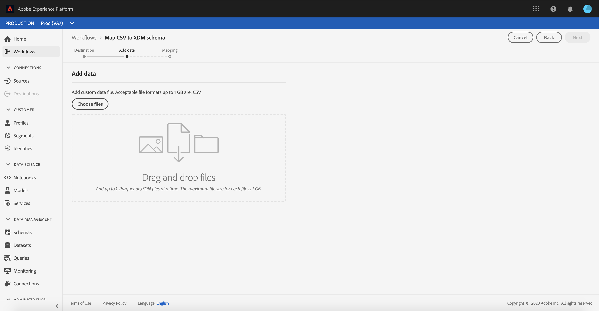

# Mapper un fichier CSV à un schéma XDM existant

>[!NOTE]
>
>Ce document explique comment mapper un fichier CSV à un schéma XDM existant. Pour plus d’informations sur l’utilisation de l’outil de recommandation de schéma généré par l’IA (actuellement en version bêta), consultez le document sur le [mappage d’un fichier CSV à l’aide de recommandations de machine learning](./recommendations.md).

Pour ingérer des données CSV dans [!DNL Adobe Experience Platform], les données doivent être mappées à un schéma (XDM) [!DNL Experience Data Model]. Ce tutoriel explique comment mapper un fichier CSV à un schéma XDM à l’aide de l’interface utilisateur [!DNL Experience Platform].

## Prise en main

Ce tutoriel nécessite une connaissance pratique des composants suivants de [!DNL Experience Platform] :

- [[!DNL Experience Data Model (XDM System)]](../../../xdm/home.md) : cadre normalisé selon lequel [!DNL Experience Platform] organise les données de l’expérience client.
- [Ingestion par lots](../../batch-ingestion/overview.md) : méthode employée par [!DNL Experience Platform] pour ingérer des données à partir de fichiers de données fournis par l’utilisateur.
- [Préparation de données Adobe Experience Platform](../../batch-ingestion/overview.md) : une suite de fonctionnalités permettant de mapper et de transformer des données ingérées pour les rendre conformes aux schémas XDM. La documentation relative aux [Fonctions de préparation des données](../../../data-prep/functions.md) est particulièrement pertinente pour le mappage de schéma.

Vous devez également avoir créé un jeu de données dans lequel ingérer vos données CSV pour suivre ce tutoriel. Pour connaître les étapes de création d’un jeu de données dans l’interface utilisateur, consultez le [tutoriel sur l’ingestion de données](../ingest-batch-data.md).

## Choisir une destination

Connectez-vous à [[!DNL Adobe Experience Platform]](https://platform.adobe.com) puis sélectionnez **[!UICONTROL Workflows]** à partir de la barre de navigation de gauche pour accéder à l’espace de travail **[!UICONTROL Workflows]**.

Dans l’écran **[!UICONTROL Workflows]**, sélectionnez **[!UICONTROL Mapper le fichier CSV au schéma XDM]** sous la section **[!UICONTROL Ingestion des données]**, puis sélectionnez **[!UICONTROL Lancement]**.

Le workflow **[!UICONTROL Mapper CSV à un schéma XDM]** apparaît, en commençant par l’étape **[!UICONTROL Destination]**. Sélectionnez un jeu de données dans lequel ingérer les données entrantes. Vous pouvez utiliser un jeu de données existant ou en créer un nouveau.

**Utiliser un jeu de données existant**

Pour ingérer vos données CSV dans un jeu de données existant, sélectionnez **[!UICONTROL Jeu de données existant]**. Vous pouvez soit récupérer un jeu de données existant à l’aide de la fonction de recherche, ou en faisant défiler la liste des jeux de données existants dans le panneau.

Pour ingérer vos données CSV dans un nouveau jeu de données, sélectionnez **[!UICONTROL Créer un jeu de données]** et saisissez un nom et une description pour le jeu de données dans les champs fournis. Sélectionnez un schéma à l’aide de la fonction de recherche ou en faisant défiler la liste des schémas fournis. Cliquez sur **[!UICONTROL Suivant]** pour continuer.

## Ajouter des données

L’étape **[!UICONTROL Ajouter les données]** apparaît. Faites glisser votre fichier CSV dans l’espace prévu à cet effet ou sélectionnez **[!UICONTROL Choisir les fichiers]** pour saisir manuellement votre fichier CSV.

La section **[!UICONTROL Données d’exemple]** apparaît une fois le fichier chargé, affichant les dix premières lignes de données. Une fois que vous avez confirmé que les données ont été chargées comme prévu, cliquez sur **[!UICONTROL Suivant]**.

## Mappage des champs CSV aux champs de schéma XDM

L’étape **[!UICONTROL Mappage]** apparaît. Les colonnes du fichier CSV sont répertoriées sous **[!UICONTROL Champ source]**, et les champs de schéma XDM correspondants sont répertoriés sous **[!UICONTROL Champ cible]**.

[!DNL Experience Platform] fournit automatiquement des recommandations intelligentes pour les champs mappés automatiquement en fonction du schéma ou du jeu de données cible que vous avez sélectionné. Vous pouvez ajuster manuellement les règles de mappage en fonction de vos cas d’utilisation.

Pour accepter toutes les valeurs de mappage de génération automatique, cochez la case « [!UICONTROL Accepter tous les champs cibles] ».

Parfois, plusieurs recommandations sont disponibles pour le schéma source. Dans ce cas, la vignette de mappage affiche la recommandation dominante, suivie d’un cercle bleu contenant le nombre de recommandations supplémentaires disponibles. Si vous sélectionnez l’icône en forme d’ampoule, une liste des recommandations supplémentaires s’affiche. Vous pouvez choisir l’une des autres recommandations en cochant la case en regard de la recommandation que vous souhaitez mapper à la place.

Vous pouvez également choisir de mapper manuellement votre schéma source à votre schéma cible. Pointez sur le schéma source à mapper, puis sélectionnez l’icône plus.

La fenêtre contextuelle **[!UICONTROL Mapper la source au champ cible]** s’affiche. À partir de là, vous pouvez sélectionner le champ à mapper, puis **[!UICONTROL Enregistrer]** pour ajouter votre nouveau mappage.

Si vous souhaitez supprimer l’un des mappages, pointez sur ce mappage, puis sélectionnez l’icône moins.

### Ajouter un champ calculé {#add-calculated-field}

Les champs calculés permettent de créer des valeurs en fonction des attributs du schéma d’entrée. Ces valeurs peuvent ensuite être affectées à des attributs dans le schéma cible. Vous pouvez également leur fournir un nom et une description pour en faciliter la référence.

Sélectionnez le bouton **[!UICONTROL Ajouter un champ calculé]** pour continuer.

Le panneau **[!UICONTROL Créer un champ calculé]** sʼaffiche. La boîte de dialogue de gauche contient les champs, fonctions et opérateurs pris en charge dans les champs calculés. Sélectionnez lʼun des onglets pour commencer à ajouter des fonctions, des champs ou des opérateurs à lʼéditeur dʼexpression.

| Tabulation | Description |
| --------- | ----------- |
| Champs | Lʼonglet Champs répertorie les champs et attributs disponibles dans le schéma source. |
| Fonctions | Lʼonglet Fonctions répertorie les fonctions disponibles pour transformer les données. Pour en savoir plus sur les fonctions que vous pouvez utiliser dans les champs calculés, consultez le guide dʼ [utilisation des fonctions Data Prep (Mapper)](../../../data-prep/functions.md). |
| Opérateurs | Lʼonglet Opérateurs répertorie les opérateurs disponibles pour la transformation des données. |

Vous pouvez ajouter manuellement des champs, des fonctions et des opérateurs à lʼaide de lʼéditeur dʼexpression situé au centre. Sélectionnez lʼéditeur pour commencer à créer une expression.

Sélectionnez **[!UICONTROL Enregistrer]** pour continuer.

Lʼécran des mappings réapparaît avec le champ source que vous venez de créer. Appliquez le champ cible correspondant et sélectionnez **[!UICONTROL Terminer]** pour terminer le mapping.

## Surveiller l’ingestion des données

Une fois votre fichier CSV mappé et créé, vous pouvez surveiller les données ingérées par celui-ci. Pour plus d’informations sur la surveillance de l’ingestion des données, consultez le tutoriel sur la [surveillance de l’ingestion des données](../../../ingestion/quality/monitor-data-ingestion.md).

## Étapes suivantes

En suivant ce tutoriel, vous avez mappé un fichier CSV plat à un schéma XDM et l’avez ingéré dans [!DNL Experience Platform]. Ces données peuvent désormais être utilisées par les services de [!DNL Experience Platform] en aval, comme [!DNL Real-Time Customer Profile]. Pour de plus d’informations, rendez-vous sur la présentation de [[!DNL Real-Time Customer Profile]](../../../profile/home.md).

>[!TIP]
>
>Vous pouvez également utiliser des algorithmes de machine learning (ML) pour **générer un schéma à partir de données d’exemple** à partir de l’espace de travail Schéma . Ce workflow crée automatiquement un schéma en fonction de la structure et du contenu de votre fichier , en s’assurant que le schéma correspond au format de vos données. Cela vous permet de gagner du temps et d’améliorer la précision lors de la définition de la structure, des champs et des types de données pour les jeux de données complexes volumineux. Pour plus d’informations sur ce workflow[&#128279;](../../../xdm/ui/ml-assisted-schema-creation.md) consultez le guide de création de schéma assistée par machine learning .
