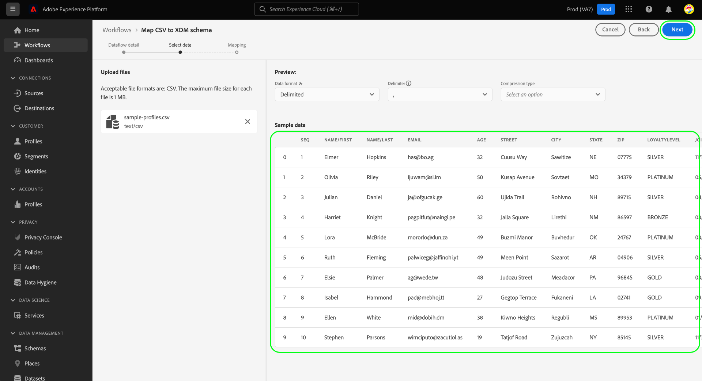

# Mapper un fichier CSV à un schéma XDM à l’aide de recommandations générées par l’IA

>[!NOTE]
>
>Pour plus d’informations sur les fonctionnalités de mappage CSV généralement disponibles dans Experience Platform, consultez le document sur le [mappage d’un fichier CSV à un schéma existant](./existing-schema.md).

Pour ingérer des données CSV dans [!DNL Adobe Experience Platform], les données doivent être mappées à un schéma (XDM) [!DNL Experience Data Model]. Vous pouvez choisir de mapper à [un schéma existant](./existing-schema.md), mais si vous ne savez pas exactement quel schéma utiliser ou comment il doit être structuré, vous pouvez utiliser des recommandations dynamiques basées sur des modèles de machine-learning (ML) dans l’interface utilisateur d’Experience Platform.

## Prise en main

Ce tutoriel nécessite une connaissance pratique des composants suivants de [!DNL Experience Platform] :

* [[!DNL Experience Data Model (XDM System)]](../../../xdm/home.md) : cadre normalisé selon lequel [!DNL Experience Platform] organise les données de l’expérience client.
   * Vous devez au minimum comprendre le concept de [comportements dans XDM](../../../xdm/home.md#data-behaviors), afin que vous puissiez décider de mapper vos données à une classe de [!UICONTROL profil] (comportement d’enregistrement) ou à une classe [!UICONTROL ExperienceEvent] (comportement de série temporelle).
* [Ingestion par lots](../../batch-ingestion/overview.md) : méthode employée par [!DNL Experience Platform] pour ingérer des données à partir de fichiers de données fournis par l’utilisateur.
* [Préparation de données Adobe Experience Platform](../../batch-ingestion/overview.md) : suite de fonctionnalités permettant de mapper et de transformer des données ingérées pour les rendre conformes aux schémas XDM. La documentation relative aux [fonctions de préparation des données](../../../data-prep/functions.md) est spécifiquement pertinente pour le mappage de schéma.

## Fournir des détails sur le flux de données

Dans l’interface utilisateur d’Experience Platform, sélectionnez **[!UICONTROL Sources]** dans le volet de navigation de gauche. Sur la vue **[!UICONTROL Catalogue]**, accédez à la catégorie **[!UICONTROL Système local]**. Sous **[!UICONTROL Chargement de fichier local]**, sélectionnez **[!UICONTROL Ajouter des données]**.

![Le catalogue [!UICONTROL Sources] dans l’interface utilisateur d’Experience Platform, avec [!UICONTROL Ajouter des données] sous [!UICONTROL Chargement de fichier local] en cours de sélection.](../../images/tutorials/map-csv-recommendations/local-file-upload.png)

Le workflow **[!UICONTROL Mapper CSV à un schéma XDM]** apparaît, en commençant par l’étape **[!UICONTROL Détails du flux de données]**.

Sélectionner **[!UICONTROL Créer un nouveau schéma à l’aide de recommandations ML]** provoque l’affichage de nouvelles commandes. Sélectionnez la classe appropriée pour les données CSV que vous souhaitez mapper ([!UICONTROL Profil] ou [!UICONTROL ExperienceEvent]). Vous pouvez éventuellement utiliser le menu déroulant pour sélectionner le secteur d’activité approprié à votre entreprise ou laisser ce champ vide si les catégories fournies ne vous concernent pas. Si votre organisation fonctionne sous un modèle [business-to-business (B2B)](../../../xdm/tutorials/relationship-b2b.md), cochez la case **[!UICONTROL Données B2B]**.

![L’étape [!UICONTROL Détails du flux de données] avec l’option de recommandation ML sélectionnée. [!UICONTROL Profil] est sélectionné pour la classe et [!UICONTROL Télécommunications] est sélectionné pour le secteur](../../images/tutorials/map-csv-recommendations/select-class-and-industry.png)

À partir de là, indiquez un nom pour le schéma qui sera créé à partir des données CSV, ainsi qu’un nom pour le jeu de données de sortie qui contiendra les données ingérées sous ce schéma.

Vous pouvez éventuellement configurer les fonctionnalités supplémentaires suivantes pour le flux de données :

| Nom d’entrée | Description |
| --- | --- |
| [!UICONTROL Description] | Une description pour le flux de données. |
| [!UICONTROL Diagnostics d’erreur] | Lorsque cette option est activée, des messages d’erreur sont générés pour les lots nouvellement ingérés, qui peuvent être affichés lors de la récupération du lot correspondant dans l’[API](../../batch-ingestion/api-overview.md). |
| [!UICONTROL Ingestion partielle] | Lorsque cette option est activée, les enregistrements valides pour les données du nouveau lot sont ingérés avec un seuil d’erreur spécifié. Ce seuil vous permet de configurer le pourcentage d’erreurs acceptables avant l’échec de l’ensemble du lot. |
| [!UICONTROL Détails du flux de données] | Attribuez un nom et une description facultative au flux de données qui amènera les données CSV dans Experience Platform. Un nom par défaut est automatiquement attribué au flux de données lors du démarrage de ce workflow. La modification du nom est facultative. |
| [!UICONTROL Alertes] | Dans une liste d’[alertes produits](../../../observability/alerts/overview.md), sélectionnez les alertes que vous souhaitez recevoir concernant le statut du flux de données une fois qu’il a été lancé. |

{style="table-layout:auto"}

Lorsque vous avez terminé de configurer le flux de données, sélectionnez **[!UICONTROL Suivant]**.

![La section [!UICONTROL Détails du flux de données] est terminée.](../../images/tutorials/map-csv-recommendations/dataflow-detail-complete.png)

## Sélectionner les données

Lors de l’étape **[!UICONTROL Sélectionner des données]**, utilisez la colonne de gauche pour charger votre fichier CSV. Vous pouvez sélectionner **[!UICONTROL Choisir les fichiers]** pour ouvrir une boîte de dialogue de l’explorateur de fichiers à partir de laquelle sélectionner le fichier, ou vous pouvez également faire glisser le fichier directement dans la colonne.

![Le bouton [!UICONTROL Choisir les fichiers] et la zone de glisser-déposer sont mis en surbrillance lors de l’étape [!UICONTROL Sélectionner des données].](../../images/tutorials/map-csv-recommendations/upload-files.png)

Une fois le fichier chargé, une section de données d’exemple s’affiche. Elle présente les dix premières lignes des données reçues afin que vous puissiez vérifier qu’elles ont bien été chargées. Sélectionnez **[!UICONTROL Suivant]** pour continuer.

## Configurer les mappages de schéma

Les modèles ML sont exécutés pour générer un nouveau schéma basé sur votre configuration de flux de données et votre fichier CSV chargé. Une fois le processus terminé, l’étape [!UICONTROL Mappage] est renseignée pour afficher les mappages de chaque champ individuel avec une vue entièrement navigable de la structure de schéma générée.

![L’étape [!UICONTROL Mappage] de l’interface utilisateur, affichant tous les champs CSV mappés et la structure de schéma résultante.](../../images/tutorials/map-csv-recommendations/schema-generated.png)

>[!NOTE]
>
>Vous pouvez filtrer tous les champs de votre schéma en fonction de divers critères au cours du workflow de mappage des champs source-cible. Le comportement par défaut consiste à afficher tous les champs mappés. Pour modifier les champs affichés, sélectionnez l’icône de filtre à côté du champ de saisie de recherche et choisissez parmi les options de liste déroulante.  {width="100" zoomable="yes"}

À partir de là, vous pouvez éventuellement [modifier les mappages des champs](#edit-mappings) ou [modifier les groupes de champs auxquels ils sont associés](#edit-schema) selon vos besoins. Lorsque vous êtes satisfait(e), sélectionnez **[!UICONTROL Terminer]** pour terminer le mappage et lancer le flux de données que vous avez configuré précédemment. Les données CSV sont ingérées dans le système et renseignent un jeu de données en fonction de la structure de schéma générée, qui sera prêt à être utilisé par les services Experience Platform en aval.

![Le bouton [!UICONTROL Terminer] sélectionné, finalisant le processus de mappage CSV.](../../images/tutorials/map-csv-recommendations/finish-mapping.png)

### Modifier les mappages de champs {#edit-mappings}

Utilisez l’aperçu du mappage des champs pour modifier les mappages existants ou les supprimer entièrement. Pour plus d’informations sur la gestion d’un jeu de mappages dans l’interface utilisateur, reportez-vous à la section [Guide de l’interface utilisateur pour le mappage de la préparation des données](../../../data-prep/ui/mapping.md#mapping-interface).

### Modifier des groupes de champs {#edit-field-groups}

Les champs CSV sont automatiquement mappés à des groupes de champs existants à l’aide de modèles ML. Si vous souhaitez modifier le groupe de champs d’un champ CSV particulier, sélectionnez **[!UICONTROL Modifier]** à côté de l’arborescence du schéma.

![Le bouton [!UICONTROL Modifier] sélectionné à côté de l’arborescence du schéma.](../../images/tutorials/map-csv-recommendations/edit-schema-structure.png)

Une boîte de dialogue s’affiche, vous permettant de modifier le nom d’affichage, le type de données et le groupe de champs de n’importe quel champ du mappage. Sélectionnez l’icône Modifier () à côté d’un champ source pour modifier ses détails dans la colonne de droite avant de sélectionner **[!UICONTROL Appliquer]**.

Lorsque vous avez terminé d’ajuster les recommandations de schéma pour vos champs sources, sélectionnez **[!UICONTROL Enregistrer]** pour appliquer les modifications.

## Étapes suivantes

Ce guide explique comment mapper un fichier CSV à un schéma XDM à l’aide de recommandations générées par l’IA, ce qui vous permet d’importer ces données dans Experience Platform par ingestion par lots.

Pour savoir comment mapper un fichier CSV à un schéma existant, reportez-vous à la section [workflow de mappage de schéma existant](./existing-schema.md). Pour plus d’informations sur la diffusion en continu de données vers Experience Platform en temps réel par le biais de connexions source préconfigurées, reportez-vous à la section [présentation des sources](../../../sources/home.md).

Vous pouvez également utiliser des algorithmes de machine learning (ML) pour **générer un schéma à partir d’exemples de données CSV**. Ce workflow crée automatiquement un schéma en fonction de la structure et du contenu de votre fichier CSV. Ce schéma nouvellement créé correspond au format de vos données afin de vous faire gagner du temps et d’accroître la précision lors de la définition de la structure, des champs et des types de données pour les jeux de données complexes et volumineux. Pour plus d’informations sur ce workflow[&#128279;](../../../xdm/ui/ml-assisted-schema-creation.md) consultez le guide de création de schéma assistée par machine learning .
