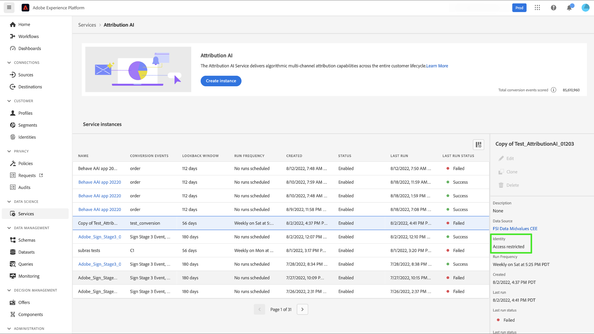
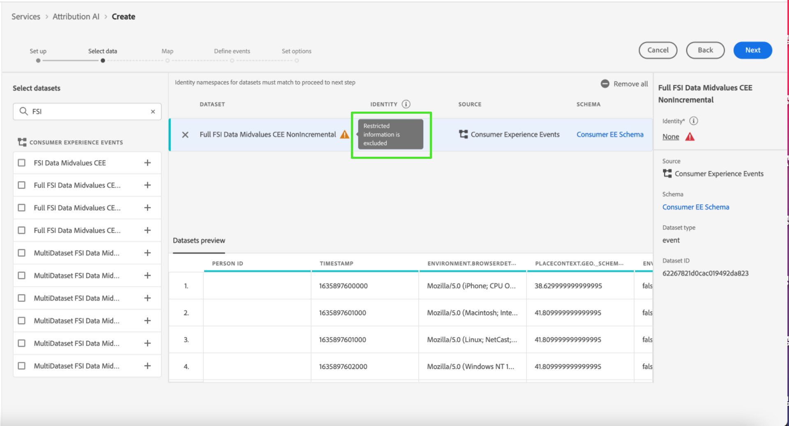
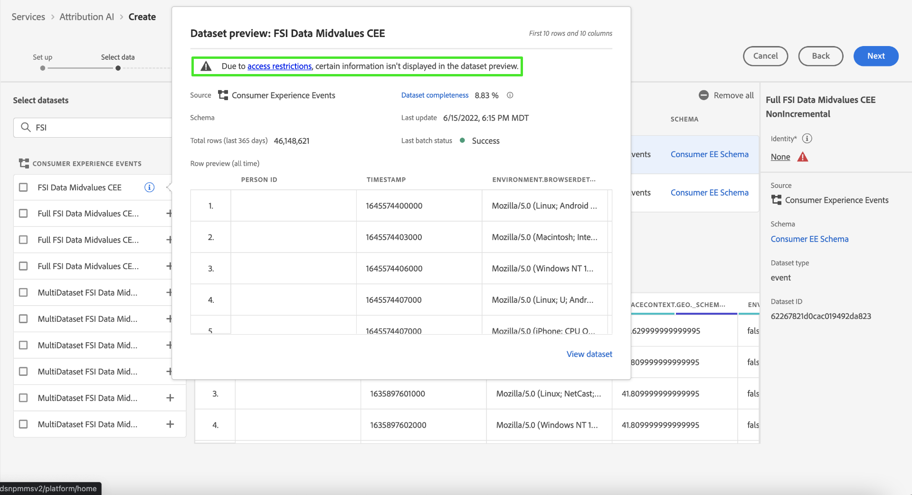
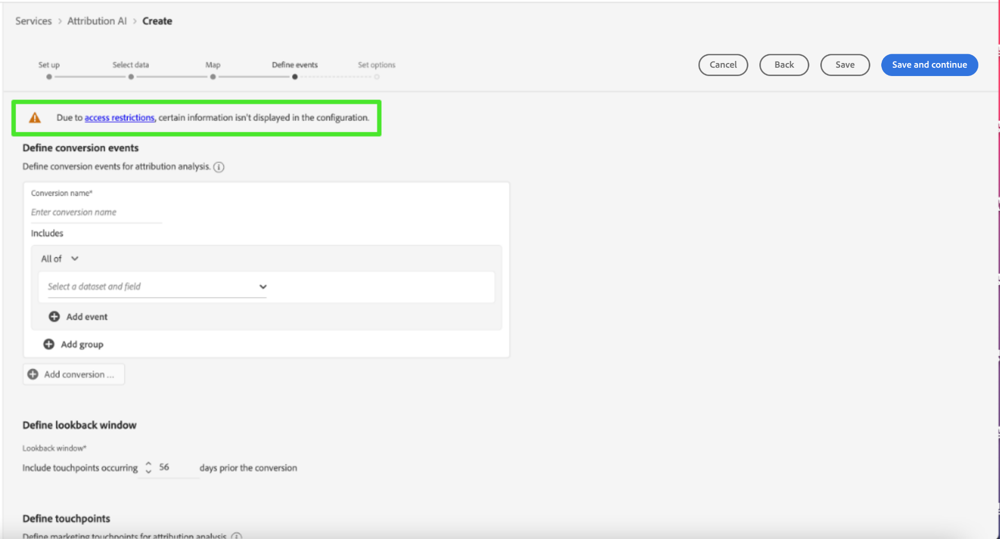

# Contrôle d’accès dans Attribution AI

Le contrôle d’accès pour Attribution AI est fourni via Adobe Experience Platform dans l’[Adobe Admin Console](https://adminconsole.adobe.com/). Cette fonctionnalité exploite les profils de produit dans l’Admin Console, liant les utilisateurs et utilisatrices à des autorisations et des sandbox.

Pour plus d’informations sur le contrôle d’accès, consultez la [présentation du contrôle d’accès](../../../access-control/home.md).

## Contrôle d’accès basé sur les attributs

>[!IMPORTANT]
>
>Le contrôle d’accès basé sur les attributs est actuellement disponible dans une version limitée uniquement.

[Le contrôle d’accès basé sur les attributs](../../../access-control/abac/overview.md) est une fonctionnalité d’Adobe Experience Platform qui permet aux administrateurs et administratrices de contrôler l’accès à des objets et/ou fonctionnalités spécifiques en fonction d’attributs. Les attributs peuvent être des métadonnées ajoutées à un objet, comme un libellé ajouté à un champ ou à un segment de schéma. Un administrateur définit des politiques d’accès qui comprennent des attributs afin de gérer les autorisations d’accès des utilisateurs.

Cette fonctionnalité vous permet d’étiqueter les champs de schéma d’un modèle de données d’expérience (XDM) avec des libellés définissant l’utilisation de l’organisation ou des données. En parallèle, les administrateurs peuvent utiliser l’interface d’administration des utilisateurs et des rôles pour définir des politiques d’accès relatives aux champs de schéma XDM. Cela permet ainsi une meilleure gestion des accès accordés aux utilisateurs ou aux groupes d’utilisateurs (utilisateurs internes, externes ou tiers). Enfin, le contrôle d’accès basé sur les attributs permet aux administrateurs de gérer l’accès à des segments spécifiques.

Grâce au contrôle d’accès basé sur les attributs, les administrateurs peuvent contrôler l’accès des utilisateurs aux données personnelles sensibles (SPD) et aux informations d’identification personnelle (PII) sur l’ensemble des workflows et ressources d’Experience Platform. Les administrateurs et administratrices peuvent définir des rôles d’utilisation qui n’ont accès qu’à des champs spécifiques et aux données correspondant à ces champs.

En raison du contrôle d’accès basé sur les attributs, certains champs et certaines fonctionnalités peuvent avoir un accès limité et ne pas être disponibles pour certains modèles de service Attribution AI. Par exemple, « Identité », « Définition de score » et « Clone ».

En haut de la **page Insights** dans l’espace de travail d’Attribution AI, les détails affichés dans la barre latérale ont un accès restreint.

Si vous sélectionnez des jeux de données avec des schémas restreints sur la page **[!UICONTROL Créer un workflow de modèle]**, un signe d’avertissement s’affiche à côté du nom du jeu de données avec le message : [!UICONTROL Les informations restreintes sont exclues].

Lorsque vous prévisualisez des jeux de données avec un schéma limité sur la page **[!UICONTROL Créer un workflow de modèle]**, un avertissement s’affiche pour vous informer qu’[!UICONTROL En raison des restrictions d’accès, certaines informations ne s’affichent pas dans l’aperçu du jeu de données.]

Après avoir créé un modèle contenant des informations restreintes, passez à l’étape **[!UICONTROL Définir un objectif]**, un avertissement s’affiche en haut de l’écran : [!UICONTROL En raison des restrictions d’accès, certaines informations ne s’affichent pas dans la configuration.]

## Étapes suivantes

En lisant ce guide, les principes du contrôle dʼaccès dans [!DNL Experience Platform] vous ont été présentés. Vous pouvez désormais poursuivre en consultant le [guide dʼutilisation du contrôle dʼaccès](../overview.md) pour obtenir des instructions détaillées sur lʼutilisation dʼ[!DNL Admin Console] afin de créer des profils de produit et attribuer des autorisations dans [!DNL Experience Platform].
