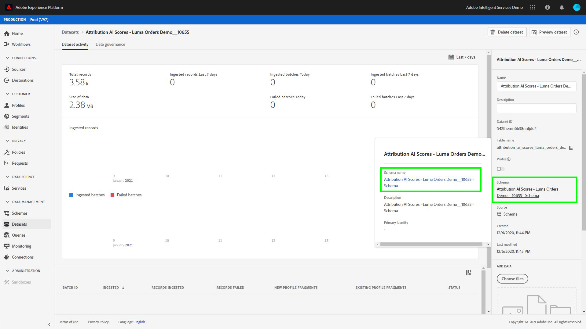

# Analyse des scores d’attribution à l’aide de Query Service

Chaque ligne des données représente une conversion, dans laquelle les informations des points de contact associés sont stockées sous la forme d’un tableau de structs sous la colonne `touchpointsDetail`.

| Informations sur les points de contact | Colonne |
| ---------------------- | ------ |
| Nom du point de contact | `touchpointsDetail. touchpointName` |
| Canal point de contact | `touchpointsDetail.touchPoint.mediaChannel` |
| Scores algorithmiques Attribution AI point de contact | <li>`touchpointsDetail.scores.algorithmicSourced`</li> <li> `touchpointsDetail.scores.algorithmicInfluenced` </li> |

## Recherche de vos chemins de données

Dans l’interface utilisateur de Adobe Experience Platform, sélectionnez **[!UICONTROL Jeux de données]** dans le volet de navigation de gauche. La page **[!UICONTROL Jeux de données]** s’affiche. Ensuite, sélectionnez l’onglet **[!UICONTROL Parcourir]** et recherchez le jeu de données de sortie pour vos scores Attribution AI.


Sélectionnez votre jeu de données de sortie. La page d’activité du jeu de données s’affiche.


Dans la page de l’activité du jeu de données, sélectionnez **[!UICONTROL Prévisualiser le jeu de données]** dans le coin supérieur droit pour prévisualiser vos données et vous assurer qu’elles ont été ingérées comme prévu.


Après avoir prévisualisé vos données, sélectionnez le schéma dans le rail de droite. Une fenêtre contextuelle s’affiche avec le nom et la description du schéma. Sélectionnez l’hyperlien du nom du schéma pour rediriger vers le schéma de notation.



À l’aide du schéma de notation, vous pouvez sélectionner ou rechercher une valeur. Une fois sélectionné, le rail latéral **[!UICONTROL Propriétés du champ]** s’ouvre et vous permet de copier le chemin d’accès à utiliser dans la création de requêtes.


## Accès à Query Service

Pour accéder à Query Service à partir de l’interface utilisateur de Platform, commencez par sélectionner **[!UICONTROL Requêtes]** dans le volet de navigation de gauche, puis sélectionnez l’onglet **[!UICONTROL Parcourir]**. Une liste de vos requêtes précédemment enregistrées est chargée.


Sélectionnez ensuite **[!UICONTROL Créer une requête]** dans le coin supérieur droit. L’éditeur de requêtes se charge. À l’aide de l’éditeur de requêtes, vous pouvez commencer à créer des requêtes à l’aide de vos données de notation.


Pour plus d’informations sur Query Editor, consultez le [guide de l’utilisateur de Query Editor](../../query-service/ui/user-guide.md).

## Modèles de requête pour l’analyse du score d’attribution

Les requêtes ci-dessous peuvent être utilisées comme modèle pour différents scénarios d’analyse des scores. Vous devez remplacer `_tenantId` et `your_score_output_dataset` par les valeurs appropriées trouvées dans votre schéma de sortie de notation.

>[!NOTE]
>
> Selon la manière dont vos données ont été ingérées, les valeurs utilisées ci-dessous, telles que `timestamp`, peuvent être dans un format différent.

### Exemples de validation

**Nombre total de conversions par événement de conversion (dans une fenêtre de conversion)**

```sql
    SELECT conversionName,
           SUM(scores.firstTouch) as total_conversions,
           SUM(scores.algorithmicSourced) as total_attributed_conversions
    FROM
        (SELECT
                _tenantId.your_score_output_dataset.conversionName
                    as conversionName,
                inline(_tenantId.your_score_output_dataset.touchpointsDetail),
                timestamp as conversion_timestamp
         FROM
                your_score_output_dataset
        )
    WHERE
        conversion_timestamp >= '2020-07-16'
      AND
        conversion_timestamp <  '2020-10-14'
    GROUP BY
        conversionName
```

**Nombre total d’événements de conversion uniquement (dans une fenêtre de conversion)**

```sql
    SELECT
        _tenantId.your_score_output_dataset.conversionName as conversionName,
        COUNT(1) as convOnly_cnt
    FROM
        your_score_output_dataset
    WHERE
        _tenantId.your_score_output_dataset.touchpointsDetail.touchpointName[0] IS NULL AND
        timestamp >= '2020-07-16' AND
        timestamp <  '2020-10-14'
    GROUP BY
        conversionName
```

### Exemple d’analyse des tendances

**Nombre de conversions par jour**

```sql
    SELECT conversionName,
           DATE(conversion_timestamp) as conversion_date,
           SUM(scores.firstTouch) as convertion_cnt
    FROM
        (SELECT
                _tenantId.your_score_output_dataset.conversionName as conversionName,
                inline(_tenantId.your_score_output_dataset.touchpointsDetail),
                timestamp as conversion_timestamp
         FROM
                your_score_output_dataset
        )
    GROUP BY
        conversionName, DATE(conversion_timestamp)
    ORDER BY
        conversionName, DATE(conversion_timestamp)
    LIMIT 20
```

### Exemple d&#39;analyse de distribution

**Nombre de points de contact sur les chemins de conversion par type défini (dans une fenêtre de conversion)**

```sql
    SELECT conversionName,
           touchpointName,
           COUNT(1) as tp_count
    FROM
        (SELECT
                _tenantId.your_score_output_dataset.conversionName as conversionName,
                inline(_tenantId.your_score_output_dataset.touchpointsDetail),
                timestamp as conversion_timestamp
         FROM
                your_score_output_dataset
        )
    WHERE
        conversion_timestamp >= '2020-07-16' AND
        conversion_timestamp < '2020-10-14' AND
        touchpointName IS NOT NULL
    GROUP BY
        conversionName, touchpointName
    ORDER BY
        conversionName, tp_count DESC
```

### Exemples de génération d’informations

**Ventilation des unités incrémentielles par point de contact et date de conversion (dans une fenêtre de conversion)**

```sql
    SELECT conversionName,
           touchpointName,
           DATE(conversion_timestamp) as conversion_date,
           SUM(scores.algorithmicSourced) as incremental_units
    FROM
        (SELECT
                _tenantId.your_score_output_dataset.conversionName as conversionName,
                inline(_tenantId.your_score_output_dataset.touchpointsDetail),
                timestamp as conversion_timestamp
         FROM
                your_score_output_dataset
        )
    WHERE
        conversion_timestamp >= '2020-07-16' AND
        conversion_timestamp < '2020-10-14'  AND
        touchpointName IS NOT NULL
    GROUP BY
        conversionName, touchpointName, DATE(conversion_timestamp)
    ORDER BY
        conversionName, touchpointName, DATE(conversion_timestamp)
```

**Ventilation des unités incrémentielles par date de point de contact et de point de contact (dans une fenêtre de conversion)**

```sql
    SELECT conversionName,
           touchpointName,
           DATE(touchpoint.timestamp) as touchpoint_date,
           SUM(scores.algorithmicSourced) as incremental_units
    FROM
        (SELECT
                _tenantId.your_score_output_dataset.conversionName as conversionName,
                inline(_tenantId.your_score_output_dataset.touchpointsDetail),
                timestamp as conversion_timestamp
         FROM
                your_score_output_dataset
        )
    WHERE
        conversion_timestamp >= '2020-07-16' AND
        conversion_timestamp < '2020-10-14'  AND
        touchpointName IS NOT NULL
    GROUP BY
        conversionName, touchpointName, DATE(touchpoint.timestamp)
    ORDER BY
        conversionName, touchpointName, DATE(touchpoint.timestamp)
    LIMIT 20
```

**Scores agrégés pour un certain type de point de contact pour tous les modèles de notation (dans une fenêtre de conversion)**

```sql
    SELECT
           conversionName,
           touchpointName,
           SUM(scores.algorithmicSourced) as total_incremental_units,
           SUM(scores.algorithmicInfluenced) as total_influenced_units,
           SUM(scores.uShape) as total_uShape_units,
           SUM(scores.decayUnits) as total_decay_units,
           SUM(scores.linear) as total_linear_units,
           SUM(scores.lastTouch) as total_lastTouch_units,
           SUM(scores.firstTouch) as total_firstTouch_units
    FROM
        (SELECT
                _tenantId.your_score_output_dataset.conversionName as conversionName,
                inline(_tenantId.your_score_output_dataset.touchpointsDetail),
                timestamp as conversion_timestamp
         FROM
                your_score_output_dataset
        )
    WHERE
        conversion_timestamp >= '2020-07-16' AND
        conversion_timestamp < '2020-10-14'  AND
        touchpointName = 'display'
    GROUP BY
        conversionName, touchpointName
    ORDER BY
        conversionName, touchpointName
```

**Avancé - Analyse de longueur de chemin**

Obtenez une distribution de longueur de chemin pour chaque type d’événement de conversion :

```sql
    WITH agg_path AS (
          SELECT
            _tenantId.your_score_output_dataset.conversionName as conversionName,
            sum(size(_tenantId.your_score_output_dataset.touchpointsDetail)) as path_length
          FROM
            your_score_output_dataset
          WHERE
            _tenantId.your_score_output_dataset.touchpointsDetail.touchpointName[0] IS NOT NULL AND
            timestamp >= '2020-07-16' AND
            timestamp <  '2020-10-14'
          GROUP BY
            _tenantId.your_score_output_dataset.conversionName,
            eventMergeId
    )
    SELECT
        conversionName,
        path_length,
        count(1) as conversionPath_count
    FROM
        agg_path
    GROUP BY
        conversionName, path_length
    ORDER BY
        conversionName, path_length
```

**Avancé - nombre distinct de points de contact sur l’analyse des chemins de conversion**

Obtenez la distribution du nombre de points de contact distincts sur un chemin de conversion pour chaque type d’événement de conversion :

```sql
    WITH agg_path AS (
      SELECT
        _tenantId.your_score_output_dataset.conversionName as conversionName,
        size(array_distinct(flatten(collect_list(_tenantId.your_score_output_dataset.touchpointsDetail.touchpointName)))) as num_dist_tp
      FROM
        your_score_output_dataset
      WHERE
        _tenantId.your_score_output_dataset.touchpointsDetail.touchpointName[0] IS NOT NULL AND
        timestamp >= '2020-07-16' AND
        timestamp <  '2020-10-14'
      GROUP BY
        _tenantId.your_score_output_dataset.conversionName,
        eventMergeId
    )
    SELECT
        conversionName,
        num_dist_tp,
        count(1) as conversionPath_count
    FROM
     agg_path
    GROUP BY
        conversionName, num_dist_tp
    ORDER BY
        conversionName, num_dist_tp
```

### Exemple d&#39;aplatissement du schéma et d&#39;explosion

Cette requête aplatit la colonne struct en plusieurs colonnes uniques et éclate les tableaux en plusieurs lignes. Cela permet de transformer les scores d’attribution en un format CSV. La sortie de cette requête comporte une conversion et l’un des points de contact correspondant à cette conversion dans chaque ligne.

>[!TIP]
>
> Dans cet exemple, vous devez remplacer `{COLUMN_NAME}` en plus de `_tenantId` et `your_score_output_dataset`. La variable `COLUMN_NAME` peut prendre les valeurs des noms de colonne transmis (colonnes de rapports) facultatifs qui ont été ajoutés lors de la configuration de votre modèle Attribution AI. Consultez votre schéma de sortie de notation pour trouver les valeurs `{COLUMN_NAME}` nécessaires pour terminer cette requête.

```sql
SELECT 
  segmentation,
  conversionName,
  scoreCreatedTime,
  aaid, _id, eventMergeId,
  conversion.eventType as conversion_eventType,
  conversion.quantity as conversion_quantity,
  conversion.eventSource as conversion_eventSource,
  conversion.priceTotal as conversion_priceTotal,
  conversion.timestamp as conversion_timestamp,
  conversion.geo as conversion_geo,
  conversion.receivedTimestamp as conversion_receivedTimestamp,
  conversion.dataSource as conversion_dataSource,
  conversion.productType as conversion_productType,
  conversion.passThrough.{COLUMN_NAME} as conversion_passThru_column,
  conversion.skuId as conversion_skuId,
  conversion.product as conversion_product,
  touchpointName,
  touchPoint.campaignGroup as tp_campaignGroup, 
  touchPoint.mediaType as tp_mediaType,
  touchPoint.campaignTag as tp_campaignTag,
  touchPoint.timestamp as tp_timestamp,
  touchPoint.geo as tp_geo,
  touchPoint.receivedTimestamp as tp_receivedTimestamp,
  touchPoint.passThrough.{COLUMN_NAME} as tp_passThru_column,
  touchPoint.campaignName as tp_campaignName,
  touchPoint.mediaAction as tp_mediaAction,
  touchPoint.mediaChannel as tp_mediaChannel,
  touchPoint.eventid as tp_eventid,
  scores.*
FROM (
  SELECT
        _tenantId.your_score_output_dataset.segmentation,
        _tenantId.your_score_output_dataset.conversionName,
        _tenantId.your_score_output_dataset.scoreCreatedTime,
        _tenantId.your_score_output_dataset.conversion,
        _id,
        eventMergeId,
        map_values(identityMap)[0][0].id as aaid,
        inline(_tenantId.your_score_output_dataset.touchpointsDetail)
  FROM
        your_score_output_dataset
)
```
