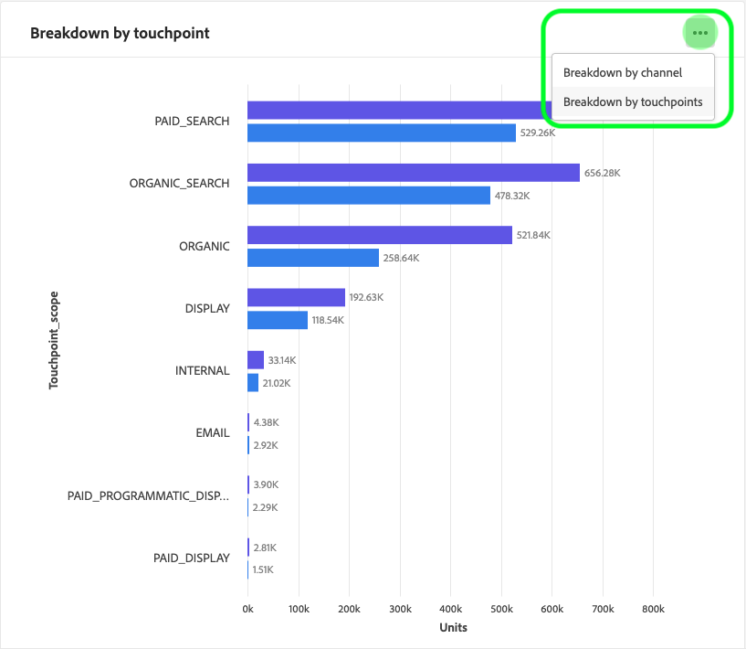

# Découverte des informations dans l’API d’attribution

Les instances de service AI d’attribution fournissent des informations qui peuvent être utilisées pour faciliter la prise et la mesure des décisions marketing liées aux performances marketing et au retour sur investissement. La sélection d’une instance de service fournit des visualisations et des  pour vous aider à comprendre l’impact de chaque interaction client dans chaque phase du parcours client.

Ce sert de guide pour l’interaction avec les informations d’instance de service dans l’interface utilisateur des services intelligents Adobe.

## Prise en main

Pour utiliser les informations relatives à l’API d’attribution, vous devez disposer d’une instance de service avec un état d’exécution réussi. Pour créer une nouvelle instance de service, consultez le guide [de l’interface utilisateur](./user-guide.md)d’API d’attribution. Si vous avez récemment créé une instance de service et qu’elle est toujours en cours d’entraînement et de notation, veuillez compter 24 heures pour qu’elle se termine.

## Présentation des instances de service

In the Adobe Experience Platform UI, click **Services** in the left navigation. Le navigateur *Services* s’affiche et affiche les services intelligents Adobe disponibles. In the container for Attribution AI, click **Open**.

La page du service AI d’attribution s’affiche. Cette page  les instances de service d’attribution AI et affiche des informations les concernant, notamment le nom de l’instance, le de conversion, la fréquence d’exécution de l’instance et l’état de la dernière mise à jour. Cliquez sur le nom d’une instance de service pour commencer.

>[!NOTE] Seules les instances de service ayant terminé des exécutions de notation réussies peuvent être sélectionnées.

Ensuite, la page d’informations de cette instance de service s’affiche, dans laquelle vous recevez des visualisations et un certain nombre de pour interagir avec vos données. Les visualisations et les  de sont expliquées plus en détail dans ce guide.

### Détails de l’instance de service

Pour  plus d’informations sur une instance de service, cliquez sur **Afficher plus** en haut à droite.

Un  détaillé s’affiche. Pour plus d&#39;informations sur l&#39;une des propriétés répertoriées, veuillez consulter le guide [d&#39;utilisation](./user-guide.md)Attribution AI.

### Modification d’une instance

Pour modifier une instance, cliquez sur *Modifier* dans le volet de navigation supérieur droit.

La boîte de dialogue Modifier s’affiche, vous permettant de modifier la description et la fréquence de notation de l’instance. Pour confirmer vos modifications et fermer la boîte de dialogue, cliquez sur *Modifier* dans le coin inférieur droit.

### Autres actions

Le bouton Actions ** Plus se trouve dans le volet de navigation supérieur droit en regard de *Modifier*. Cliquez sur **Plus pour** ouvrir une liste déroulante qui vous permet de sélectionner l’une des opérations suivantes :

- **Supprimer**: Supprime l’instance.
- **Télécharger des données** récapitulatives : Télécharge un fichier CSV contenant les données de résumé.
- **Accéder aux scores**: Le fait de cliquer sur les scores ** d’accès vous redirige vers les scores d’ [accès du didacticiel](./download-scores.md)sur l’IA de l’attribution.
- **exécuter l&#39;historique**: Une fenêtre contextuelle contenant un  de toutes les exécutions de score associées à l’instance de service s’affiche.

## Filtrage de vos données

Les informations sur l’API d’attribution vous permettent de filtrer vos données et de mettre automatiquement à jour les visuels de l’interface utilisateur en fonction de votre  de sélectionné.

>[!NOTE] Par défaut, chaque filtre est défini sur &quot;Tous&quot;, à l’exception du filtre du modèle *d’* attribution qui est défini sur &quot;Conversions attribuées incrémentielles et influentes&quot;.

###  de conversion

Lorsque vous créez une instance dans l’attribut AI, l’un des champs obligatoires est &quot; de conversion&quot;. Les  de conversion sont des objectifs commerciaux qui identifient l’impact des  de marketing, tels que les commandes de commerce électronique, les achats en magasin et les visites sur le site Web.

A partir de l’instance, la liste déroulante des ** de conversion vous permet de sélectionner l’un des  définis pour votre instance afin de filtrer vos données. La sélection d’un spécifique  les visualisations de l’interface utilisateur pour ne renseigner que les conversions appartenant à ces .

### Modèle d’attribution

Cliquez sur le modèle *d’* attribution pour ouvrir une liste déroulante contenant tous les différents modèles d’attribution disponibles. Vous pouvez sélectionner plusieurs modèles pour comparer les résultats. Pour plus d&#39;informations sur les différents modèles d&#39;attribution et leur fonctionnement, consultez l&#39;aperçu AI [de l&#39;](./overview.md) attribution qui contient un tableau contenant des informations sur chaque modèle.

### Produit

Le filtre *Produit* vous permet de sélectionner un produit initialement assimilé à la création de votre instance. Cliquez sur la liste déroulante et utilisez la fonction de recherche pour sélectionner rapidement tous les produits à comparer.

### Géographie

Le filtre *Géographie* renseigne les codes de pays en fonction des modèles régionaux. Selon vos données, ce filtre peut être présent ou non.

>[!NOTE] Les codes pays comportent deux caractères. Vous trouverez ici une  complète sur [ISO 3166-1 alpha-2](https://datahub.io/core/country-list).

### Région

>[!NOTE] Ce filtre n’est présent que si vous avez exécuté la modélisation [facultative basée sur une](./user-guide.md#region-based-modeling-optional) région d’étape dans le guide de l’interface utilisateur de l’API d’attribution lors de la création de votre instance de service.

Ce filtre vous permet de sélectionner les régions que vous avez configurées dans le processus de création d’instances.

### Canal

En cliquant sur le filtre ** du, vous affichez une liste déroulante contenant tous vos  marketing disponibles. Vous pouvez sélectionner plusieurs  de pour les comparer.

### Date range (Plage de dates)

Cliquez sur l&#39;icône de calendrier pour ouvrir la fenêtre contextuelle de la période. Les dates de  de début et de fin de conversion déterminent la quantité de données renseignées dans l’interface utilisateur. Vous pouvez choisir de restreindre ou d’élargir la plage de dates afin de cibler ou d’étendre la quantité de données renseignées.

## Présentation de vos données

La carte *Aperçu* affiche le total des conversions par modèle d’attribution. Le nombre total change en fonction de la spécificité de votre recherche à l’aide du  de décrit précédemment dans cette  de. La sélection d’autres modèles ajoute des cercles supplémentaires à l’aperçu, chacun avec sa propre couleur correspondant à la légende.

## Tendances hebdomadaires

La carte des tendances ** hebdomadaires ventile votre conversion totale par période définie au cours du processus de filtrage.

Cliquez sur les points de suspension dans le coin supérieur droit de la carte des tendances ** hebdomadaires pour afficher une liste déroulante qui vous permet de sélectionner des tendances quotidiennes, hebdomadaires ou mensuelles.

Placer le pointeur de la souris sur la ligne de données d’un modèle d’attribution spécifique crée une fenêtre contextuelle qui affiche le nombre total de conversions pour cette date.

## Ventilation par 

La *ventilation par carte de* permet de déterminer le nombre total de conversions par rapport à chaque  de. Cette carte peut être utilisée pour aider à prendre des décisions sur l&#39;efficacité de chaque  et le retour sur investissement.

Cliquez sur les points de suspension dans l’angle supérieur droit de la *ventilation par carte de* pour ouvrir une liste déroulante vous permettant de renseigner les données en fonction des points de contact.

## Principales campagnes

La carte Campagnes ** principales présente un aperçu de vos campagnes et des performances de la campagne dans chaque . Cette carte peut vous aider à informer votre équipe de l&#39;efficacité d&#39;une campagne spécifique pour un  donné et vous donner des indications sur les investissements à effectuer.

## Étapes suivantes

Une fois que vous avez terminé de filtrer les données et que vous avez pu afficher les informations appropriées, vous avez la possibilité d’accéder aux scores. Pour obtenir un guide détaillé sur la façon d’accéder à vos scores, consultez le didacticiel [Accès aux scores dans Attribution AI](./download-scores.md) . De plus, vous pouvez télécharger vos données de résumé, comme indiqué dans [d’autres actions](#more-actions). La sélection de &quot;Télécharger les données récapitulatives&quot; télécharge les données récapitulatives regroupées par date.