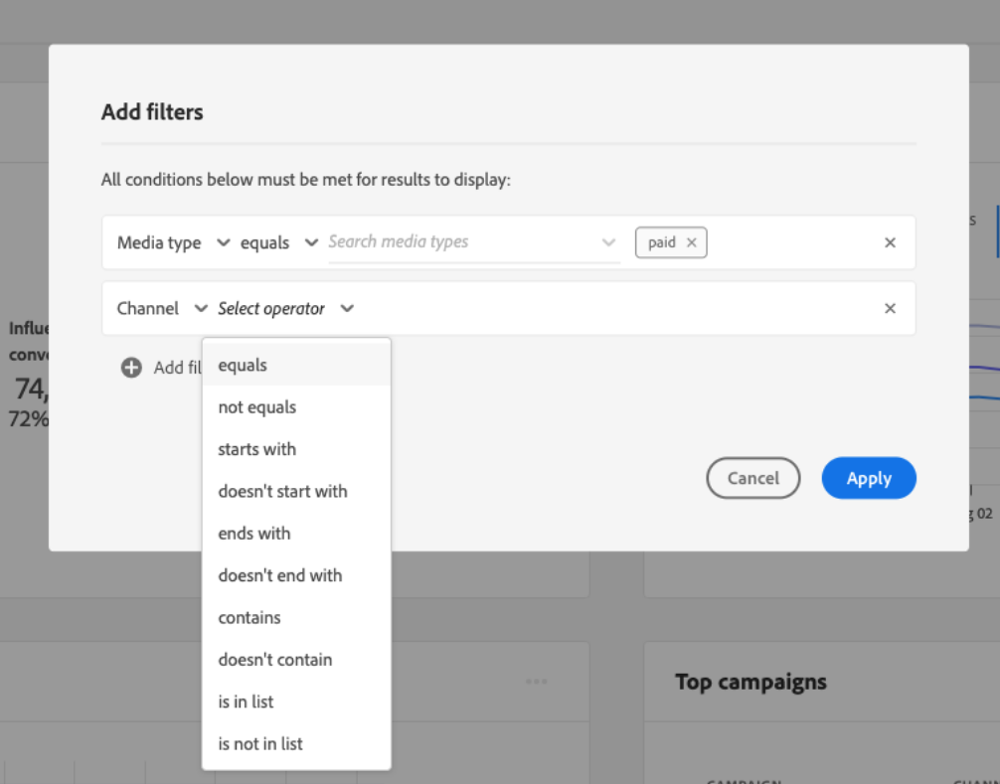

# Découvrez des informations dans Attribution AI

Les instances de service Attribution AI fournissent des informations qui peuvent être utilisées pour prendre et mesurer des décisions marketing liées aux performances marketing et au retour sur investissement. La sélection d’une instance de service fournit des visualisations et des filtres pour vous aider à comprendre l’impact de chaque interaction client au cours de chacune des phases du parcours client.

Ce document sert de guide pour interagir avec les informations des instances de service dans l’interface utilisateur Adobe Intelligent Services.

## Prise en main

Pour utiliser les informations relatives à Attribution AI, vous devez avoir à disposition une instance de service dont l’état d’exécution est réussi. Pour créer une nouvelle instance de service, consultez le [guide de l’interface utilisateur d’Attribution AI](./user-guide.md). Si vous avez récemment créé une instance de service et qu’elle est toujours en cours de formation et de notation, comptez 24 heures pour qu’elle se termine.

## Aperçu des informations des instances de service

Dans l’interface utilisateur de [!DNL Adobe Experience Platform], sélectionnez **[!UICONTROL Services]** dans le volet de navigation de gauche. Le navigateur **[!UICONTROL Services]** s’affiche et affiche les services Adobe intelligents disponibles. Dans le conteneur d’IA dédiée à l’attribution, sélectionnez **[!UICONTROL Open]**.

La page de service d’Attribution AI s’affiche. Cette page répertorie les instances de service d’Attribution AI et affiche les informations les concernant, notamment le nom de l’instance, les événements de conversion, la fréquence à laquelle l’instance est exécutée et l’état de la dernière mise à jour. Sélectionnez un nom d’instance de service pour commencer.

>[!NOTE]
>
>Seules les instances de service qui ont terminé les exécutions de notation réussies peuvent être sélectionnées.

Ensuite, la page d’informations pour cette instance de service apparaît sur laquelle vous trouverez des visualisations et différents filtres pouvant interagir avec vos données. Les visualisations et les filtres sont expliqués de manière plus détaillée dans ce guide.

### Détails des instances de service

Pour afficher des détails supplémentaires sur une instance de service, sélectionnez **[!UICONTROL Show more]** dans le coin supérieur droit.

Une liste détaillée s’affiche. Pour plus d’informations sur l’une des propriétés répertoriées, veuillez consulter le [guide d’utilisation d’Attribution AI](./user-guide.md).

### Modification d’une instance

Pour modifier une instance, sélectionnez **[!UICONTROL Edit]** dans le volet de navigation supérieur droit.

La boîte de dialogue de modification s’affiche, vous permettant de modifier le nom, la description et la fréquence de notation de l’instance. Si le statut de l’instance est désactivé, la fréquence de notation ne peut pas être modifiée. Pour confirmer vos modifications et fermer la boîte de dialogue, sélectionnez **[!UICONTROL Save]** dans le coin inférieur droit.

### Actions supplémentaires {#more-actions}

Le bouton **[!UICONTROL More actions]** se trouve dans le volet de navigation supérieur droit à côté de **[!UICONTROL Edit]**. La sélection de **[!UICONTROL More actions]** ouvre une liste déroulante qui vous permet de sélectionner l’une des opérations suivantes :

- **[!UICONTROL Clone]** : clone l’instance.
- **[!UICONTROL Delete]** : supprime l’instance.
- **[!UICONTROL Download summary data]** : télécharge un fichier CSV contenant les données récapitulatives.
- **[!UICONTROL Access scores]** : la sélection de **[!UICONTROL Access scores]** vous redirige vers le tutoriel [accès aux scores pour l’IA dédiée à l’attribution](./download-scores.md).
- **[!UICONTROL View run history]** : une fenêtre contextuelle contenant une liste de toutes les exécutions de notation associées à l’instance de service s’affiche.

## Filtrage de vos données

Les informations d’Attribution AI vous permettent de filtrer vos données et de mettre à jour automatiquement les visuels de l’interface utilisateur en fonction des filtres sélectionnés.

### Événement de conversion

Lorsque vous créez une nouvelle instance dans Attribution AI, le champ « Événements de conversion » fait partie des champs obligatoires. Les événements de conversion sont des objectifs professionnels qui identifient l’impact des activités marketing comme les commandes e-commerce, les achats en magasin et les visites sur le site web.

Depuis l’instance , la liste déroulante **[!UICONTROL Conversion events]** vous permet de sélectionner l’un des événements définis pour votre instance afin de filtrer vos données. Sélectionner des événements spécifiques modifie les visualisations de l’interface utilisateur pour ne gérer que les conversions appartenant à ces événements.

### Modèle d’attribution

La sélection de **[!UICONTROL Attribution Model]** ouvre une liste déroulante avec tous les modèles d’attribution disponibles. Vous pouvez sélectionner plusieurs modèles pour en comparer les résultats. Pour plus d’informations sur les différents modèles d’attribution et la manière dont ils fonctionnent, rendez-vous sur l’aperçu [Attribution AI](./overview.md) sur lequel vous trouverez un tableau contenant des informations sur chaque modèle.

### Région

>[!NOTE]
>
>Ce filtre n’est présent que si vous avez effectué l’étape facultative [modélisation fondée sur la région](./user-guide.md#region-based-modeling-optional) dans le guide de l’interface utilisateur d’Attribution AI lors de la création de votre instance de service.

Ce filtre vous permet de sélectionner les régions que vous avez configurées au cours du processus de création d’instances.

### Ajouter des filtres

Vous pouvez ajouter des filtres supplémentaires en sélectionnant l’icône **filtre** pour ouvrir la fenêtre contextuelle de **[!UICONTROL Add filters]**. La fenêtre contextuelle **[!UICONTROL Add filters]** vous permet de filtrer par canal, géographie, type de média et produit. Seuls les filtres applicables pour une instance de service sont renseignés par la fenêtre contextuelle. Par exemple, si vous n’avez pas fourni de données géographiques ou de type de média, ces attributs de filtre ne seront pas disponibles pour votre instance.

- **[!UICONTROL Channel]:** la sélection de l’attribut de canal permet de filtrer n’importe quel canal marketing disponible. Vous pouvez sélectionner plusieurs canaux pour les comparer.
- **[!UICONTROL Geography]:** la sélection de l’attribut géographie permet de filtrer les codes pays en fonction de modèles régionaux. Selon vos données, ce filtre peut être présent ou non. Les codes pays comportent deux caractères. Voir la liste complète des codes pays [ici](https://datahub.io/core/country-list).
- **[!UICONTROL Media type]:** la sélection de l’attribut de type de média permet de filtrer n’importe quel type de média défini.
- **[!UICONTROL Product]:** la sélection de l’attribut de produit vous permet de filtrer tous les produits initialement ingérés lors de la création de votre instance.

### Période

Sélectionnez l’icône de calendrier pour ouvrir la fenêtre contextuelle de période. Les dates de début et de fin de l’événement de conversion déterminent la quantité de données générées dans l’interface utilisateur. Vous pouvez choisir de limiter ou d’élargir la période pour vous concentrer sur une quantité de données générée ou l’élargir.

## Aperçu de vos données

La carte **[!UICONTROL Overview]** affiche le nombre total de conversions par modèle d’attribution. Le nombre total change en fonction de la manière dont votre recherche est spécifique à l’aide des filtres soulignés précédemment dans ce document. Sélectionner plus de modèles ajoute des cercles supplémentaires à l’Aperçu, dont chacun se voit définir une couleur correspondant à la légende.

## Tendances hebdomadaires

La carte **[!UICONTROL Weekly trends]** répartit la conversion totale en fonction de la période définie pendant le processus de filtrage.

Lorsque vous sélectionnez les points de suspension en haut à droite de la vignette **Tendances hebdomadaires**, une liste déroulante s’affiche, vous permettant de sélectionner les tendances quotidiennes, hebdomadaires ou mensuelles.

Survoler la ligne des données avec votre souris d’un modèle d’attribution spécifique crée une fenêtre contextuelle qui affiche le nombre total de conversions pour cette date.

## Répartition par canal

La carte **[!UICONTROL Breakdown by channel]** est utilisée pour déterminer le nombre total de conversions par rapport à chaque canal. Vous pouvez utiliser cette fiche pour vous aider à prendre des décisions sur l’efficacité de chaque canal et le retour sur investissement.

Sélectionnez les points de suspension en haut à droite de la carte **[!UICONTROL Breakdown by channel]** pour ouvrir une liste déroulante qui vous permet de renseigner les données en fonction des points de contact.

## Campagnes principales

La carte **[!UICONTROL Top campaigns]** affiche un aperçu de vos campagnes et des performances de la campagne dans chaque canal. Cette carte peut informer votre équipe de l’efficacité d’une campagne spécifique pour un canal donné et fournir des informations telles que les campagnes dans lesquelles vous devriez investir davantage.

## Répartition par position du point de contact

La sélection de l’onglet **[!UICONTROL Path Analysis]** charge les graphiques **[!UICONTROL Breakdown by touchpoint position]** et **[!UICONTROL Top conversion paths]**.

Le graphique **[!UICONTROL Breakdown by touchpoint position]** est une répartition des conversions attribuées par position du point de contact comparé sur tous les chemins de conversion. Ce graphique vous aide à comprendre les points de contact les plus efficaces à différentes étapes du chemin de conversion. Les étapes sont démarreur, joueur et plus proche.

- **Starter :** indique que le point de contact était la première touche d’un chemin de conversion.
- **Lecteur :** indique que le point de contact n’était ni le premier ni le dernier contact menant à une conversion.
- **Plus proche :** indique que le point de contact était la dernière touche avant une conversion.

>[!NOTE]
>
>La somme des contributions en pourcentage pour un modèle d’attribution à tous les points de contact et postes doit être égale à 100.

## Principaux chemins de conversion

Le graphique **[!UICONTROL Top conversion paths]** montre les scores influencés et algorithmiques sur les principaux chemins de conversion dans les régions sélectionnées. Ce graphique vous permet de visualiser les points de contact qui contribuent aux conversions et le score d’attribution de chaque point de contact. Vous pouvez utiliser ces informations pour afficher les chemins les plus fréquents dans une certaine région et voir si des modèles émergent entre les différents ensembles de points de contact.

## Efficacité des points de contact

Sélectionnez l’onglet **[!UICONTROL Touchpoint Effectiveness]** pour charger la carte de **[!UICONTROL Touchpoint effectiveness]**. Cette carte utilise la distribution de données de l’IA dédiée à l’attribution pour afficher des informations pour chaque point de contact. Les données de ce tableau ne sont générées que pour des périodes spécifiques, comme indiqué par la date de **[!UICONTROL As of]** en haut à droite de la carte.

Vous pouvez utiliser les informations de la carte de **[!UICONTROL Touchpoint effectiveness]** pour comprendre comment un point de contact contribue à une conversion. Vous pouvez également évaluer l’efficacité de chaque point de contact avec les mesures de performances suivantes :

**Chemins touchés** : cette mesure affiche un pourcentage de chemins générant ou non une conversion pour le point de contact. Vous verrez des conversions attribuées plus élevées si le ratio des chemins (pourcentage) générant une conversion par rapport aux chemins ne générant pas de conversion est élevé.

**Mesure d’efficacité** : cette mesure affiche les étoiles sur une échelle de un à cinq. L’échelle indique l’importance relative d’un point de contact pour effectuer une conversion.

>[!NOTE]
>
>Un volume de points de contact plus élevé ne garantit pas une mesure d’efficacité plus élevée.

**Volume total** : nombre agrégé de fois qu’un point de contact a été touché par un utilisateur. Cela inclut les points de contact qui apparaissent sur un chemin générant une conversion, ainsi que sur les chemins ne générant pas de conversion.

## Étapes suivantes

Lorsque vous avez terminé de filtrer les données et que vous pouvez afficher les informations appropriées, vous avez la possibilité d’accéder aux scores. Pour obtenir un guide détaillé sur la manière dont vous pouvez accéder à vos scores, consultez le tutoriel [Accéder aux scores dans Attribution AI](./download-scores.md). De plus, vous pouvez également télécharger les données récapitulatives comme indiqué dans [Actions supplémentaires](#more-actions). Sélectionner « Télécharger les données récapitulatives » télécharge les données récapitulatives agrégées par dates.

## Ressources supplémentaires

La vidéo suivante est conçue pour vous aider à apprendre à utiliser la page d’informations IA dédiée à l’attribution pour comprendre le retour sur investissement des canaux et campagnes marketing.

>[!VIDEO](https://video.tv.adobe.com/v/32669?learn=on&quality=12)
