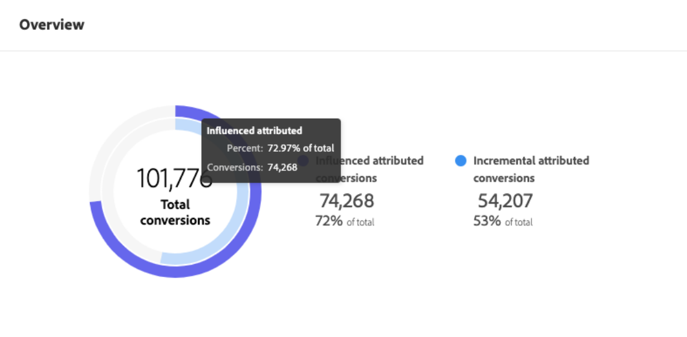
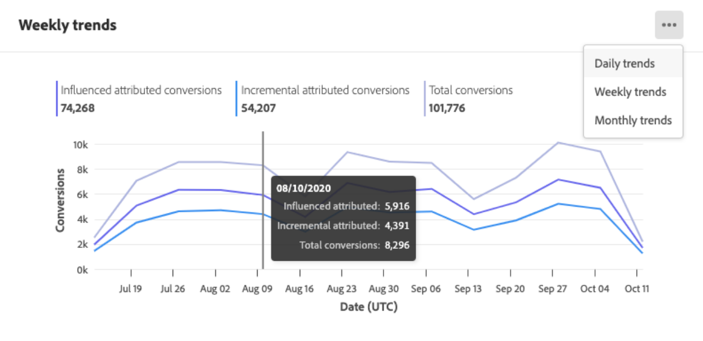

# Découverte des insights dans Attribution AI

Les instances de service Attribution AI fournissent des insights qui peuvent être utilisés pour prendre et mesurer des décisions marketing liées aux performances marketing et au retour sur investissement. La sélection d’une instance de service fournit des visualisations et des filtres pour vous aider à comprendre l’impact de chaque interaction client au cours de chacune des phases du parcours client.

Ce document sert de guide pour interagir avec les insights des instances de service dans l’interface utilisateur Adobe Intelligent Services.

## Prise en main

Pour utiliser les insights relatifs à Attribution AI, vous devez avoir à disposition une instance de service dont l’état d’exécution est réussi. Pour créer une nouvelle instance de service, consultez le [guide de l’interface utilisateur d’Attribution AI](./user-guide.md). Si vous avez récemment créé une instance de service et qu’elle est toujours en cours de formation et de notation, comptez 24 heures pour qu’elle se termine.

## Aperçu des insights des instances de service

In the [!DNL Adobe Experience Platform] UI, click **[!UICONTROL Services]** in the left navigation. Le navigateur **[!UICONTROL Services]** apparaît et affiche les services intelligents Adobe disponibles. Dans le conteneur d’Attribution AI, cliquez sur **[!UICONTROL Ouvrir]**.

La page de service d’Attribution AI s’affiche. Cette page répertorie les instances de service d’Attribution AI et affiche les informations les concernant, notamment le nom de l’instance, les événements de conversion, la fréquence à laquelle l’instance est exécutée et l’état de la dernière mise à jour. Cliquez sur le nom d’une instance de service pour commencer.

>[!NOTE]
>
>Vous ne pouvez sélectionner que les instances de service ayant réussi les exécutions de notation.

Ensuite, la page d’insights pour cette instance de service apparaît sur laquelle vous trouverez des visualisations et différents filtres pouvant interagir avec vos données. Les visualisations et les filtres sont expliqués de manière plus détaillée dans ce guide.

### Détails des instances de service

Pour afficher plus de détails sur une instance de service, cliquez sur **[!UICONTROL Afficher plus]** en haut à droite.

Une liste détaillée s’affiche. Pour plus d’informations sur l’une des propriétés répertoriées, veuillez consulter le [guide d’utilisation d’Attribution AI](./user-guide.md).

### Modification d’une instance

Pour modifier une instance, cliquez sur **[!UICONTROL Modifier]** dans la navigation en haut à droite.

La boîte de dialogue Modifier s’affiche et vous permet de modifier la description et la fréquence de notation de l’instance. Pour confirmer vos modifications et fermer la boîte de dialogue, cliquez sur **[!UICONTROL Modifier]** dans le coin en bas à droite.

### Actions supplémentaires {#more-actions}

Le bouton **[!UICONTROL Actions supplémentaires]** se trouve dans la navigation en haut à droite en regard de *Modifier*. Cliquer sur **[!UICONTROL Actions supplémentaires]** ouvre un menu déroulant qui vous permet de sélection l’une des opérations suivantes :

- **Supprimer** : supprime l’instance.
- **Télécharger des données récapitulatives** : télécharge un fichier CSV contenant les données récapitulatives.
- **Accéder aux scores** : cliquer sur **Accéder aux scores** vous redirige vers le [tutoriel Accéder aux scores d’Attribution AI](./download-scores.md).
- **Afficher l’historique d’exécution** : une fenêtre contextuelle contenant une liste des exécutions de notation associée à l’instance de service apparaît.

## Filtrage de vos données

Les insights d’Attribution AI vous permettent de filtrer vos données et de mettre à jour automatiquement les visuels de l’interface utilisateur en fonction des filtres sélectionnés.

>[!NOTE]
>
>By default, every filter is set to &quot;All&quot; except the &quot;[!UICONTROL Attribution Model]&quot; filter which is set to &quot;Incremental and Influenced attributed conversions&quot;.

### Événement de conversion

Lorsque vous créez une nouvelle instance dans Attribution AI, le champ « Événements de conversion » fait partie des champs obligatoires. Les événements de conversion sont des objectifs professionnels qui identifient l’impact des activités marketing comme les commandes e-commerce, les achats en magasin et les visites sur le site web.

À partir de l’instance, le menu déroulant **[!UICONTROL Événements de conversion]** vous permet de sélectionner l’un des événements définis pour votre instance afin de filtrer vos données. Sélectionner des événements spécifiques modifie les visualisations de l’interface utilisateur pour ne gérer que les conversions appartenant à ces événements.

### Modèle d’attribution

Clicking **[!UICONTROL Attribution Model]** opens a dropdown with all of the different attribution models available. Vous pouvez sélectionner plusieurs modèles pour en comparer les résultats. Pour plus d’informations sur les différents modèles d’attribution et la manière dont ils fonctionnent, rendez-vous sur l’aperçu [Attribution AI](./overview.md) sur lequel vous trouverez un tableau contenant des informations sur chaque modèle.

### Produit

Le filtre **[!UICONTROL Produit]** vous permet de faire une sélection parmi des produits ingérés à la création de votre instance. Cliquez sur le menu déroulant et utilisez la fonctionnalité Rechercher pour sélectionner rapidement tous les produits que vous souhaitez comparer.

### Géographie

Le filtre **[!UICONTROL Géographie]** génère des codes pays basés sur des modèles régionaux. En fonction de vos données, ce filtre peut être présent ou ne pas l’être.

>[!NOTE]
>
>Les codes pays se composent de deux caractères. Vous trouverez ci-contre une liste complète de ces codes [ISO 3166-1 alpha-2](https://datahub.io/core/country-list).

### Région

>[!NOTE]
>
>Ce filtre n’est présent que si vous avez réalisé l’étape facultative de [modélisation régionale](./user-guide.md#region-based-modeling-optional) dans le guide de l’interface utilisateur Attribution AI lors de la création de votre instance de service.

Ce filtre vous permet de sélectionner les régions que vous avez configurées au cours du processus de création d’instances.

### Canal

Cliquer sur le filtre **[!UICONTROL Canal]** révèle un menu déroulant contenant l’ensemble de vos canaux marketing disponibles. Vous pouvez sélectionner plusieurs canaux pour les comparer.

### Période

Cliquez sur l’icône Calendrier pour ouvrir la fenêtre contextuelle Période. Les dates de début et de fin de l’événement de conversion déterminent la quantité de données générées dans l’interface utilisateur. Vous pouvez choisir de limiter ou d’élargir la période pour vous concentrer sur une quantité de données générée ou l’élargir.

## Aperçu de vos données

La fiche **[!UICONTROL Aperçu]** affiche vos conversions totales par modèle d’attribution. Le nombre total change en fonction de la manière dont votre recherche est spécifique à l’aide des filtres soulignés précédemment dans ce document. Sélectionner plus de modèles ajoute des cercles supplémentaires à l’Aperçu, dont chacun se voit définir une couleur correspondant à la légende.

## Tendances hebdomadaires

La fiche **[!UICONTROL Tendances hebdomadaires]** décompose vos conversions totales selon la période que vous avez définie au cours du processus de filtrage.

Cliquer sur les points de suspension en haut à droite de la fiche *Tendances hebdomadaires* affiche un menu déroulant vous permettant de sélectionner des tendances par jour, par semaine ou par mois.

Survoler la ligne des données avec votre souris d’un modèle d’attribution spécifique crée une fenêtre contextuelle qui affiche le nombre total de conversions pour cette date.

## Répartition par canal

La fiche **[!UICONTROL Répartition par canal]** est utilisée pour déterminer le nombre total de conversions associé à chaque canal. Vous pouvez utiliser cette fiche pour vous aider à prendre des décisions sur l’efficacité de chaque canal et le retour sur investissement.

Cliquer sur les points de suspension en haut à droite de la fiche **[!UICONTROL Répartition par canal]** ouvre un menu déroulant vous permettant de générer des données en fonction des points de contact.

## Campagnes principales

La fiche **[!UICONTROL Campagnes principales]** affiche un aperçu de vos campagnes et des performances de vos campagnes dans chaque canal. Cette fiche peut vous aider à informer votre équipe de l’efficacité d’une campagne spécifique pour un canal donné et fournir des insights sur celles sur lesquelles vous pourriez investir davantage.

## Étapes suivantes

Lorsque vous avez terminé de filtrer les données et que vous pouvez afficher les informations appropriées, vous avez la possibilité d’accéder aux scores. Pour obtenir un guide détaillé sur la manière dont vous pouvez accéder à vos scores, consultez le tutoriel [Accéder aux scores dans Attribution AI](./download-scores.md). De plus, vous pouvez également télécharger les données récapitulatives comme indiqué dans [Actions supplémentaires](#more-actions). Sélectionner « Télécharger les données récapitulatives » télécharge les données récapitulatives agrégées par dates.

## Ressources supplémentaires

La vidéo suivante est conçue pour vous aider à comprendre comment utiliser la page d’informations Attribution AI pour comprendre le retour sur investissement des canaux et campagnes marketing.

>[!VIDEO](https://video.tv.adobe.com/v/32669?learn=on&quality=12)