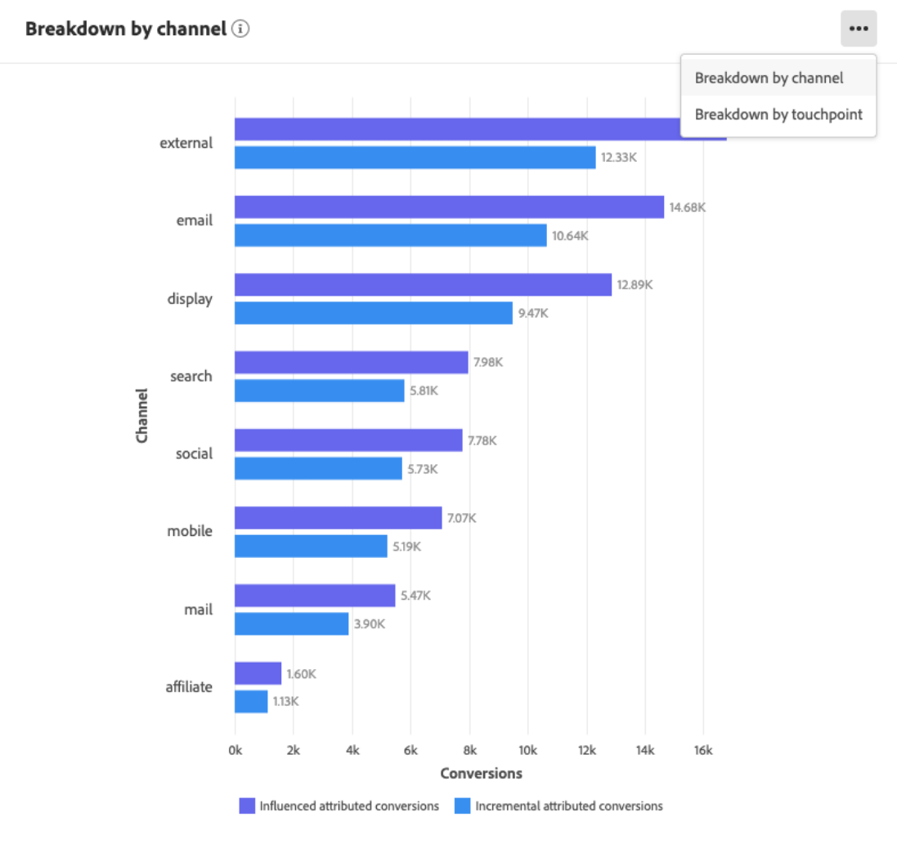

# Découverte des informations dans l&#39;API d&#39;attribution

Les instances de service d’IA d’attribution fournissent des informations qui peuvent être utilisées pour faciliter la prise et la mesure des décisions marketing liées aux performances marketing et au retour sur investissement. La sélection d’une instance de service fournit des visualisations et des filtres pour vous aider à comprendre l’impact de chaque interaction client dans chaque phase du parcours client.

Ce document sert de guide pour l’interaction avec les informations d’instance de service dans l’interface utilisateur d’Adobe Intelligent Services.

## Prise en main

Pour utiliser des informations sur l’API d’attribution, vous devez disposer d’une instance de service dont l’état d’exécution est correct. Pour créer une instance de service, consultez le guide [de l’interface utilisateur de l’API](./user-guide.md)d’attribution. Si vous avez récemment créé une instance de service et qu’elle continue à s’entraîner et à marquer des points, veuillez lui accorder 24 heures pour qu’elle se termine.

## Présentation des instances de service

In the Adobe Experience Platform UI, click **Services** in the left navigation. Le navigateur *Services* s’affiche et affiche les services Adobe Intelligent Services disponibles. In the container for Attribution AI, click **Open**.

La page du service AI d’attribution s’affiche. Cette page liste les instances de service d’attribution AI et affiche des informations à leur sujet, notamment le nom de l’instance, les événements de conversion, la fréquence d’exécution de l’instance et l’état de la dernière mise à jour. Cliquez sur le nom d’une instance de service pour commencer.

>[!NOTE] Seules les instances de service ayant terminé des exécutions de notation réussies peuvent être sélectionnées.

Ensuite, la page d’informations de cette instance de service s’affiche, dans laquelle des visualisations et un certain nombre de filtres vous sont fournis pour interagir avec vos données. Les visualisations et les filtres sont expliqués plus en détail dans ce guide.

### Détails de l’instance de service

Pour vue des détails supplémentaires pour une instance de service, cliquez sur **Afficher plus** en haut à droite.

Une liste détaillée s’affiche. Pour plus d&#39;informations sur l&#39;une des propriétés répertoriées, consultez le guide [d&#39;utilisation de l&#39;IA](./user-guide.md)Attribution.

### Modification d’une instance

Pour modifier une instance, cliquez sur *Modifier* dans le volet de navigation supérieur droit.

La boîte de dialogue Modifier s’affiche, vous permettant de modifier la description et la fréquence de notation de l’instance. Pour confirmer vos modifications et fermer la boîte de dialogue, cliquez sur *Modifier* dans le coin inférieur droit.

### Autres actions

Le bouton Actions ** Plus se trouve dans le volet de navigation supérieur droit en regard de *Modifier*. Cliquez sur **Autres actions** pour ouvrir une liste déroulante qui vous permet de sélectionner l’une des opérations suivantes :

- **Supprimer**: Supprime l’instance.
- **Télécharger des données** récapitulatives : Télécharge un fichier CSV contenant les données de résumé.
- **Scores** d&#39;accès : Le fait de cliquer sur les scores ** Access vous redirige vers les scores d’ [accès pour le didacticiel](./download-scores.md)Attribution AI.
- **Historique** de l&#39;exécution des Vues : Une fenêtre contextuelle contenant une liste de toutes les exécutions de notation associées à l’instance de service s’affiche.

## Filtrage de vos données

Les statistiques d’IA d’attribution vous permettent de filtrer vos données et de mettre automatiquement à jour les visuels de l’interface utilisateur en fonction de vos filtres sélectionnés.

>[!NOTE] Par défaut, chaque filtre est défini sur &quot;Tous&quot;, à l’exception du filtre du modèle *d’* attribution qui est défini sur &quot;Conversions attribuées incrémentielles et influencées&quot;.

### événement de conversion

Lorsque vous créez une instance dans l’API d’attribution, l’un des champs obligatoires est &quot;événements de conversion&quot;. Les événements de conversion sont des objectifs commerciaux qui identifient l’impact des activités marketing, telles que les commandes de commerce électronique, les achats en magasin et les visites sur le site Web.

Dans l’instance, la liste déroulante événements *de* conversion vous permet de sélectionner l’un des événements définis pour votre instance afin de filtrer vos données. La sélection de événements spécifiques modifie les visualisations de l’interface utilisateur afin de ne renseigner que les conversions appartenant à ces événements.

### Modèle d’attribution

Cliquez sur le modèle ** d’attribution pour ouvrir une liste déroulante contenant tous les différents modèles d’attribution disponibles. Vous pouvez sélectionner plusieurs modèles pour comparer les résultats. Pour plus d’informations sur les différents modèles d’attribution et leur fonctionnement, consultez la présentation de l’IA  Attribution qui contient un tableau contenant des informations sur chaque modèle.

### Produit

Le filtre *Produit* vous permet de sélectionner un produit qui a été initialement assimilé à la création de votre instance. Cliquez sur la liste déroulante et utilisez la fonction de recherche pour sélectionner rapidement tous les produits à comparer.

### Géographie

Le filtre *Géographie* renseigne les codes de pays en fonction de modèles régionaux. Selon vos données, ce filtre peut être présent ou non.

>[!NOTE] Les codes de pays comportent deux caractères. Une liste complète est disponible ici [ISO 3166-1 alpha-2](https://datahub.io/core/country-list).

### Région

>[!NOTE] Ce filtre n’est présent que si vous avez effectué la modélisation  par région à l’étape facultative dans le guide de l’interface utilisateur de l’API d’attribution lors de la création de votre instance de service.

Ce filtre vous permet de sélectionner les régions que vous avez configurées dans le processus de création d’instances.

### Canal

Cliquez sur le filtre de *Canal* pour afficher une liste déroulante contenant tous les canaux marketing disponibles. Vous pouvez sélectionner plusieurs canaux pour les comparer.

### Date range (Plage de dates)

Cliquez sur l’icône de calendrier pour ouvrir la fenêtre contextuelle de la période. Les dates de événement de conversion de début et de fin déterminent la quantité de données renseignées dans l’interface utilisateur. Vous pouvez choisir de limiter ou d’élargir la plage de dates afin de cibler ou d’augmenter la quantité de données renseignées.

## Présentation de vos données

La carte *Aperçu* affiche le total des conversions par modèle d’attribution. Le nombre total de modifications varie en fonction de la spécificité de votre recherche à l’aide des filtres décrits précédemment dans ce document. La sélection d’autres modèles ajoute des cercles supplémentaires à l’Aperçu, chacun avec sa propre couleur correspondant à la légende.

## Tendances hebdomadaires

La carte des tendances ** hebdomadaires ventile votre conversion totale en fonction de la plage de dates que vous avez définie au cours du processus de filtrage.

Cliquez sur les points de suspension dans le coin supérieur droit de la carte des tendances ** hebdomadaires pour afficher une liste déroulante qui vous permet de sélectionner des tendances quotidiennes, hebdomadaires ou mensuelles.

Le survol de la ligne de données d’un modèle d’attribution spécifique crée une fenêtre contextuelle qui affiche le nombre total de conversions pour cette date.

## Ventilation par canal

La carte *Ventilation par canal* est utilisée pour déterminer le nombre total de conversions par rapport à chaque canal. Cette carte peut être utilisée pour aider à prendre des décisions sur l&#39;efficacité de chaque canal et le rendement de l&#39;investissement.

Cliquez sur les points de suspension dans l’angle supérieur droit de la carte *Ventilation par canal* pour ouvrir une liste déroulante qui vous permet de renseigner les données en fonction des points de contact.

## Principales campagnes

La carte *Principales campagnes* présente un aperçu de vos campagnes et de leur comportement dans chaque canal. Cette carte peut vous aider à informer votre équipe de l&#39;efficacité d&#39;une campagne spécifique pour un canal donné et vous donner des indications sur les endroits où investir davantage.

## Étapes suivantes

Une fois que vous avez terminé de filtrer les données et que vous êtes en mesure d&#39;afficher les informations appropriées, vous avez la possibilité d&#39;accéder aux scores. Pour obtenir un guide détaillé sur la façon d&#39;accéder à vos scores, consultez le didacticiel [d&#39;accès à l&#39;IA](./download-scores.md) Attribution. De plus, vous pouvez également télécharger vos données de résumé, comme indiqué dans [d’autres actions](#more-actions). La sélection de l’option &quot;Télécharger les données récapitulatives&quot; télécharge les données récapitulatives agrégées par dates.

## Ressources supplémentaires

La vidéo suivante est conçue pour vous aider à comprendre comment utiliser la page d’informations sur l’IA de l’attribution pour comprendre le retour sur investissement des canaux et campagnes marketing.

>[!VIDEO](https://video.tv.adobe.com/v/32669?learn=on&quality=12)