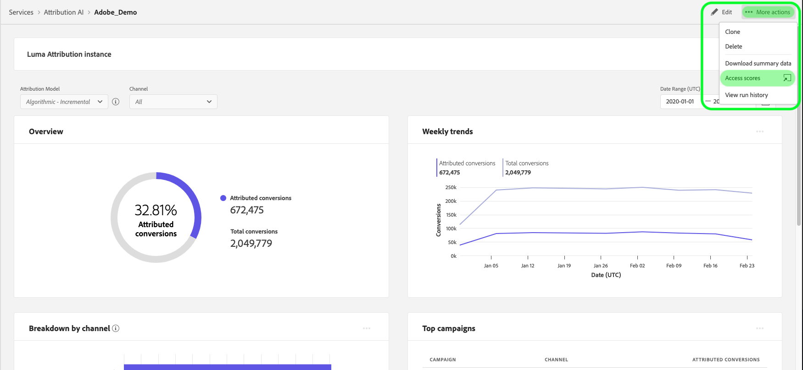
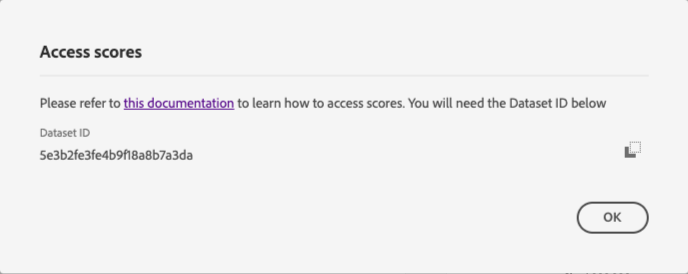
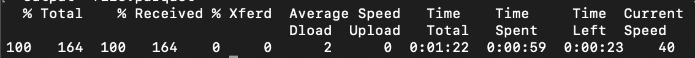
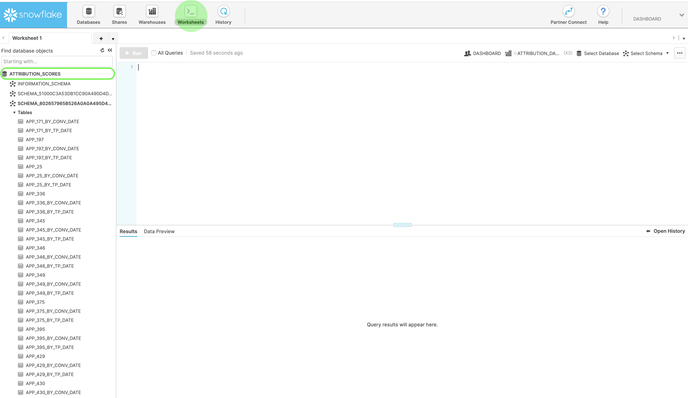
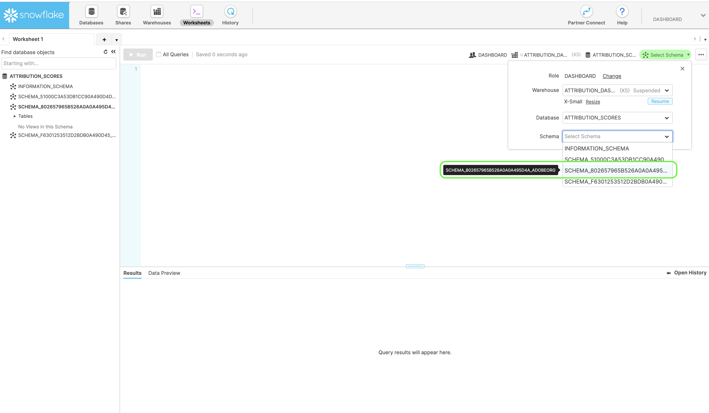
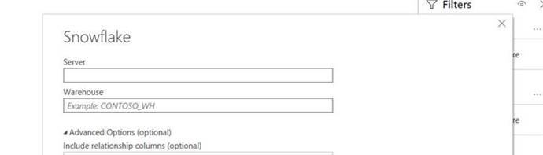

# Télécharger des scores dans l’IA dédiée à l’attribution

Ce document sert de guide de téléchargement des notes pour l’IA dédiée à l’attribution.

## Prise en main

Attribution AI vous permet de télécharger des scores au format de fichier Parquet. Ce tutoriel nécessite que vous ayez lu et terminé la section Téléchargement des scores de l’IA dédiée à l’attribution dans le guide [prise en main](./getting-started.md).

En outre, pour accéder aux scores pour l’IA dédiée à l’attribution, vous devez disposer d’une instance de service avec un statut d’exécution réussi disponible. Pour créer une instance de service, consultez le guide d’utilisation d’[Attribution AI](./user-guide.md). Si vous avez récemment créé une instance de service et qu’elle est toujours en cours de formation et de notation, comptez 24 heures pour qu’elle se termine.

## Recherche de votre identifiant de jeu de données {#dataset-id}

Dans votre instance de service pour les insights IA dédiée à l’attribution, cliquez sur le menu déroulant *Plus d’actions* dans le volet de navigation supérieur droit, puis sélectionnez **[!UICONTROL Access scores]**.



Une boîte de dialogue s’affiche. Elle contient un lien vers la documentation des scores de téléchargement et l’identifiant du jeu de données de votre instance actuelle. Copiez l’identifiant du jeu de données dans votre presse-papiers et passez à l’étape suivante.



## Récupération de votre identifiant de lot {#retrieve-your-batch-id}

En utilisant l’identifiant du jeu de données de l’étape précédente, vous devez effectuer un appel à l’API Catalog pour récupérer un identifiant de lot. Des paramètres de requête supplémentaires sont utilisés pour cet appel API afin de renvoyer le dernier lot réussi au lieu d’une liste de lots appartenant à votre organisation. Pour renvoyer des lots supplémentaires, augmentez le nombre du paramètre de requête `limit` à la quantité souhaitée que vous souhaitez renvoyer. Pour plus d’informations sur les types de paramètres de requête disponibles, consultez le guide sur le [filtrage des données Catalogue à l’aide des paramètres de requête](../../catalog/api/filter-data.md).

**Format d’API**

```http
GET /batches?&dataSet={DATASET_ID}&createdClient=acp_foundation_push&status=success&orderBy=desc:created&limit=1
```

| Paramètre | Description |
| --------- | ----------- |
| `{DATASET_ID}` | Identifiant du jeu de données disponible dans la boîte de dialogue « Accéder aux scores ». |

**Requête**

```shell
curl -X GET 'https://platform.adobe.io/data/foundation/catalog/batches?&dataSet=5e8f81ce7a4ecb18a8d25b22&createdClient=acp_foundation_push&status=success&orderBy=desc:created&limit=1' \
  -H 'Authorization: Bearer {ACCESS_TOKEN}' \
  -H 'x-api-key: {API_KEY}' \
  -H 'x-gw-ims-org-id: {ORG_ID}' \
  -H 'x-sandbox-name: {SANDBOX_NAME}'
```

**Réponse**

Une réponse réussie renvoie un payload contenant un objet d’ID de lot. Dans cet exemple, la valeur Clé de l’objet renvoyé est l’ID de lot `01E5QSWCAASFQ054FNBKYV6TIQ`. Copiez l’identifiant de lot à utiliser dans l’appel API suivant.

>[!NOTE]
>
> L’objet `tags` de la réponse suivante a été reformaté pour plus de lisibilité.

```json
{
    "01E5QSWCAASFQ054FNBKYV6TIQ": {
        "status": "success",
        "tags": {
            "Tags": [ ... ],
        },
        "relatedObjects": [
            {
                "type": "dataSet",
                "id": "5e8f81cf7a4ecb28a8d85b22"
            }
        ],
        "id": "01E5QSWCAASFQ054FNBKYV6TIQ",
        "externalId": "01E5QSWCAASFQ054FNBKYV6TIQ",
        "replay": {
            "predecessors": [
                "01E5N7EDQQP4JHJ93M7C3WM5SP"
            ],
            "reason": "Replacing for 2020-04-09",
            "predecessorListingType": "IMMEDIATE"
        },
        "inputFormat": {
            "format": "parquet"
        },
        "imsOrg": "412657965Y566A4A0A495D4A@AdobeOrg",
        "started": 1586715571808,
        "metrics": {
            "partitionCount": 1,
            "outputByteSize": 2380339,
            "inputFileCount": -1,
            "inputByteSize": 2381007,
            "outputRecordCount": 24340,
            "outputFileCount": 1,
            "inputRecordCount": 24340
        },
        "completed": 1586715582735,
        "created": 1586715571217,
        "createdClient": "acp_foundation_push",
        "createdUser": "sensei_exp_attributionai@AdobeID",
        "updatedUser": "acp_foundation_dataTracker@AdobeID",
        "updated": 1586715583582,
        "version": "1.0.5"
    }
}
```

## Récupération de l’appel API suivant avec l’identifiant de lot {#retrieve-the-next-api-call-with-your-batch-id}

Une fois que vous disposez de l’identifiant de lot, vous pouvez adresser une nouvelle requête GET à `/batches`. La requête renvoie un lien utilisé pour la requête d’API suivante.

**Format d’API**

```http
GET batches/{BATCH_ID}/files
```

| Paramètre | Description |
| --------- | ----------- |
| `{BATCH_ID}` | L’identifiant de lot récupéré à l’étape précédente, [récupération de votre identifiant de lot](#retrieve-your-batch-id). |

**Requête**

En utilisant votre propre identifiant de lot, effectuez la requête suivante.

```shell
curl -X GET 'https://platform.adobe.io/data/foundation/export/batches/01E5QSWCAASFQ054FNBKYV6TIQ/files' \
  -H 'Authorization: Bearer {ACCESS_TOKEN}' \
  -H 'x-api-key: {API_KEY}' \
  -H 'x-gw-ims-org-id: {ORG_ID}' \
  -H 'x-sandbox-name: {SANDBOX_NAME}'
```

**Réponse**

Une réponse réussie renvoie un payload contenant un objet `_links`. L’objet `_links` contient une valeur `href` ayant un nouvel appel API comme valeur. Copiez cette valeur pour passer à l’étape suivante.

```json
{
    "data": [
        {
            "dataSetFileId": "01E5QSWCAASFQ054FNBKYV6TIQ-1",
            "dataSetViewId": "5e8f81cf7a4ecb28a8d85b22",
            "version": "1.0.0",
            "created": "1586715582571",
            "updated": "1586715582571",
            "isValid": false,
            "_links": {
                "self": {
                    "href": "https://platform.adobe.io:443/data/foundation/export/files/01E5QSWCXXYFQ054FNBKYV2BAQ-1"
                }
            }
        }
    ],
    "_page": {
        "limit": 100,
        "count": 1
    }
}
```

## Récupération de vos fichiers {#retrieving-your-files}

À l’aide de la valeur `href` obtenue à l’étape précédente comme appel API, effectuez une nouvelle requête GET pour récupérer votre répertoire de fichiers.

**Format d’API**

```http
GET files/{DATASETFILE_ID}
```

| Paramètre | Description |
| --------- | ----------- |
| `{DATASETFILE_ID}` | L’identifiant dataSetFile est renvoyé dans la valeur `href` de l’[étape précédente](#retrieve-the-next-api-call-with-your-batch-id). Il est aussi accessible dans le tableau `data`, sous le type d’objet `dataSetFileId`. |

**Requête**

```shell
curl -X GET 'https://platform.adobe.io/data/foundation/export/files/01E5QSWCAASFQ054FNBKYV6TIQ-1' \
  -H 'Authorization: Bearer {ACCESS_TOKEN}' \
  -H 'x-api-key: {API_KEY}' \
  -H 'x-gw-ims-org-id: {ORG_ID}' \
  -H 'x-sandbox-name: {SANDBOX_NAME}'
```

**Réponse**

La réponse contient un tableau de données qui peut comporter une entrée unique ou une liste de fichiers liés à ce répertoire. L’exemple ci-dessous contient une liste de fichiers et a été condensé pour en faciliter la lecture. Dans ce scénario, vous devez suivre l’URL de chaque fichier pour y accéder.

```json
{
    "data": [
        {
            "name": "part-00000-tid-5614147572541837832-908bd66a-d856-47fe-b7da-c8e7d22a4097-1370467-1.c000.snappy.parquet",
            "length": "2380211",
            "_links": {
                "self": {
                    "href": "https://platform.adobe.io:443/data/foundation/export/files/01E5QSWCXXYFQ054FNBKYV2BAQ-1?path=part-00000-trd-5714147572541837832-938bd66a-d556-41fe-b7da-c8e7d22a4097-1320467-1.c000.snappy.parquet"
                }
            }
        }
    ],
    "_page": {
        "limit": 100,
        "count": 1
    }
}
```

| Paramètre | Description |
| --------- | ----------- |
| `_links.self.href` | L’URL de la requête GET utilisée pour télécharger un fichier dans votre répertoire. |


Copiez la valeur `href` de chaque objet de fichier du tableau `data`, puis passez à l’étape suivante.

## Télécharger vos données de fichier

Pour télécharger vos données de fichier, envoyez une requête GET vers la valeur `"href"` que vous avez copiée à l’étape précédente [récupération de vos fichiers](#retrieving-your-files).

>[!NOTE]
>
>Si vous effectuez cette requête directement dans la ligne de commande, vous pouvez être invité à ajouter une sortie après vos en-têtes de requête. L’exemple de requête suivant utilise `--output {FILENAME.FILETYPE}`.

**Format d’API**

```http
GET files/{DATASETFILE_ID}?path={FILE_NAME}
```

| Paramètre | Description |
| --------- | ----------- |
| `{DATASETFILE_ID}` | L’identifiant dataSetFile est renvoyé dans la valeur `href` d’une [étape précédente](#retrieve-the-next-api-call-with-your-batch-id). |
| `{FILE_NAME}` | Nom du fichier. |

**Requête**

```shell
curl -X GET 'https://platform.adobe.io:443/data/foundation/export/files/01E5QSWCXXYFQ054FNBKYV2BAQ-1?path=part-00000-trd-5714147572541837832-938bd66a-d556-41fe-b7da-c8e7d22a4097-1320467-1.c000.snappy.parquet' \
  -H 'Authorization: Bearer {ACCESS_TOKEN}' \
  -H 'x-api-key: {API_KEY}' \
  -H 'x-gw-ims-org-id: {ORG_ID}' \
  -H 'x-sandbox-name: {SANDBOX_NAME}' \
  -O 'file.parquet'
```

>[!TIP]
>
>Assurez-vous que vous vous trouvez dans le répertoire ou le dossier dans lequel vous souhaitez enregistrer votre fichier avant d’effectuer la requête GET.

**Réponse**

La réponse télécharge le fichier que vous avez demandé dans votre répertoire actuel. Dans cet exemple, le nom du fichier est « file.parquet ».



Les partitions téléchargées seront au format Parquet et auront besoin soit d&#39;une [!DNL Spark]-coquille, soit d&#39;un lecteur Parquet pour voir les partitions. Pour l’affichage des scores bruts, vous pouvez utiliser [les outils Apache Parquet](https://parquet.apache.org/docs/). Les outils de parquet peuvent analyser les données avec [!DNL Spark].

## Étapes suivantes

Ce document décrit les étapes requises pour télécharger les scores de l’IA dédiée à l’attribution. Pour plus d’informations sur les sorties de score, consultez la documentation [Entrée et sortie de l’IA dédiée à l’attribution](./input-output.md).

## Accès aux scores à l’aide de Snowflake

>[!IMPORTANT]
>
>Veuillez contacter attributionai-support@adobe.com pour plus d’informations sur l’accès aux scores à l’aide de Snowflake.

Vous pouvez accéder aux scores IA dédiée à l’attribution agrégés via Snowflake. Pour l’instant, vous devez envoyer un e-mail à l’assistance d’Adobe à l’adresse attributionai-support@adobe.com afin de configurer et de recevoir les informations d’identification de votre compte de lecteur pour Snowflake.

Une fois votre demande traitée par l’assistance d’Adobe, vous recevez l’URL du compte de lecteur pour Snowflake et les informations d’identification correspondantes :

- URL de Snowflake
- Nom d’utilisateur
- Mot de passe

>[!NOTE]
>
>Le compte de lecteur permet d’interroger les données à l’aide de clients SQL, de feuilles de calcul et de solutions de BI qui prennent en charge le connecteur JDBC.

Une fois que vous disposez de vos informations d’identification et de votre URL, vous pouvez interroger les tables de modèles, agrégées par date de point de contact ou date de conversion.

### Recherche de schéma dans Snowflake

À l’aide des informations d’identification fournies, connectez-vous à Snowflake. Cliquez sur l’onglet **Feuilles de calcul** dans le volet de navigation principal supérieur gauche, puis accédez au répertoire de votre base de données dans le volet de gauche.



Cliquez ensuite sur **Sélectionner un schéma** dans le coin supérieur droit de l’écran. Dans la fenêtre contextuelle qui s’affiche, vérifiez que la base de données appropriée est sélectionnée. Cliquez ensuite sur la liste déroulante *Schéma* et sélectionnez l’un des schémas répertoriés. Vous pouvez interroger directement depuis les tableaux de scores répertoriés sous le schéma sélectionné.



## Connexion de PowerBI à Snowflake (facultatif)

Vos informations d’identification Snowflake peuvent être utilisées pour configurer une connexion entre les bases de données Snowflake et PowerBI Desktop.

Tout d’abord, saisissez l’URL de Snowflake sous la zone *Serveur*. Ensuite, saisissez « XSMALL » sous *Entrepôt*. Saisissez maintenant votre nom d’utilisateur et votre mot de passe.



Une fois la connexion établie, sélectionnez votre base de données Snowflake, puis sélectionnez le schéma approprié. Vous pouvez désormais charger tous les tableaux.
