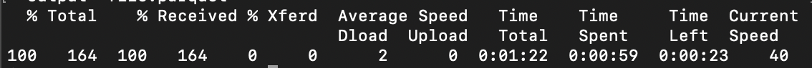

# Téléchargement de scores dans Attribution AI

Ce document sert de guide pour le téléchargement de scores pour Attribution AI.

## Prise en main

Attribution AI vous permet de télécharger des partitions au format parquet. Ce didacticiel nécessite que vous ayez lu et terminé la section des scores AI d’attribution en téléchargement dans le guide de [prise en main](./getting-started.md) .

De plus, pour accéder aux scores de l’API d’attribution, vous devez disposer d’une instance de service avec un état d’exécution réussi. Pour créer une instance de service, consultez le guide [d’utilisation de l’API](./user-guide.md)d’attribution. Si vous avez récemment créé une instance de service et qu’elle continue à s’entraîner et à marquer des points, veuillez lui accorder 24 heures pour qu’elle se termine.

## Find your dataset ID {#dataset-id}

Dans votre instance de service pour obtenir des informations sur l’API d’attribution, cliquez sur la liste déroulante *Autres actions* dans le volet de navigation supérieur droit, puis sélectionnez **[!UICONTROL Access scores]**.


Une nouvelle boîte de dialogue s’affiche, contenant un lien vers la documentation des scores de téléchargement et l’ID du jeu de données de votre instance actuelle. Copiez l’ID du jeu de données dans le Presse-papiers et passez à l’étape suivante.


## Récupérer votre identifiant de lot {#retrieve-your-batch-id}

En utilisant l’ID de votre jeu de données de l’étape précédente, vous devez appeler l’API Catalog pour récupérer un identifiant de lot. D&#39;autres paramètres de requête sont utilisés pour cet appel d&#39;API afin de renvoyer le dernier lot réussi au lieu d&#39;une liste de lots appartenant à votre organisation. Pour renvoyer d&#39;autres lots, augmentez le nombre du paramètre de `limit` requête à la quantité souhaitée à renvoyer. Pour plus d’informations sur les types de paramètres de requête disponibles, consultez le guide sur le [filtrage des données du catalogue à l’aide de paramètres](../../catalog/api/filter-data.md)de requête.

**Format d’API**

```http
GET /batches?&dataSet={DATASET_ID}&createdClient=acp_foundation_push&status=success&orderBy=desc:created&limit=1
```

| Paramètre | Description |
| --------- | ----------- |
| `{DATASET_ID}` | ID du jeu de données disponible dans la boîte de dialogue &quot;Accéder aux scores&quot;. |

**Requête**

```shell
curl -X GET 'https://platform.adobe.io/data/foundation/catalog/batches?&dataSet=5e8f81ce7a4ecb18a8d25b22&createdClient=acp_foundation_push&status=success&orderBy=desc:created&limit=1' \
  -H 'Authorization: Bearer {ACCESS_TOKEN}' \
  -H 'x-api-key: {API_KEY}' \
  -H 'x-gw-ims-org-id: {IMS_ORG}' \
  -H 'x-sandbox-name: {SANDBOX_NAME}'
```

**Réponse**

Une réponse réussie renvoie une charge utile contenant un objet d’identifiant de lot. Dans cet exemple, la valeur Key de l’objet renvoyé est the batch ID `01E5QSWCAASFQ054FNBKYV6TIQ`. Copiez l’ID de lot à utiliser dans l’appel d’API suivant.

>[!NOTE]
> L’ `tags` objet a été reformé pour être lisible dans la réponse suivante.

```json
{
    "01E5QSWCAASFQ054FNBKYV6TIQ": {
        "status": "success",
        "tags": {
            "Tags": [ ... ],
        },
        "relatedObjects": [
            {
                "type": "dataSet",
                "id": "5e8f81cf7a4ecb28a8d85b22"
            }
        ],
        "id": "01E5QSWCAASFQ054FNBKYV6TIQ",
        "externalId": "01E5QSWCAASFQ054FNBKYV6TIQ",
        "replay": {
            "predecessors": [
                "01E5N7EDQQP4JHJ93M7C3WM5SP"
            ],
            "reason": "Replacing for 2020-04-09",
            "predecessorListingType": "IMMEDIATE"
        },
        "inputFormat": {
            "format": "parquet"
        },
        "imsOrg": "412657965Y566A4A0A495D4A@AdobeOrg",
        "started": 1586715571808,
        "metrics": {
            "partitionCount": 1,
            "outputByteSize": 2380339,
            "inputFileCount": -1,
            "inputByteSize": 2381007,
            "outputRecordCount": 24340,
            "outputFileCount": 1,
            "inputRecordCount": 24340
        },
        "completed": 1586715582735,
        "created": 1586715571217,
        "createdClient": "acp_foundation_push",
        "createdUser": "sensei_exp_attributionai@AdobeID",
        "updatedUser": "acp_foundation_dataTracker@AdobeID",
        "updated": 1586715583582,
        "version": "1.0.5"
    }
}
```

## Récupérez le prochain appel d’API avec votre identifiant de lot. {#retrieve-the-next-api-call-with-your-batch-id}

Une fois que vous disposez de votre identifiant de lot, vous pouvez faire une nouvelle demande GET à `/batches`. La requête renvoie un lien utilisé comme requête d’API suivante.

**Format d’API**

```http
GET batches/{BATCH_ID}/files
```

| Paramètre | Description |
| --------- | ----------- |
| `{BATCH_ID}` | ID de lot récupéré à l’étape précédente [récupère votre ID](#retrieve-your-batch-id)de lot. |

**Requête**

En utilisant votre propre ID de lot, effectuez la requête suivante.

```shell
curl -X GET 'https://platform.adobe.io/data/foundation/export/batches/01E5QSWCAASFQ054FNBKYV6TIQ/files' \
  -H 'Authorization: Bearer {ACCESS_TOKEN}' \
  -H 'x-api-key: {API_KEY}' \
  -H 'x-gw-ims-org-id: {IMS_ORG}' \
  -H 'x-sandbox-name: {SANDBOX_NAME}'
```

**Réponse**

Une réponse réussie renvoie une charge utile contenant un `_links` objet. L’ `_links` objet contient un appel `href` d’API dont la valeur est un nouvel appel d’API. Copiez cette valeur pour passer à l’étape suivante.

```json
{
    "data": [
        {
            "dataSetFileId": "01E5QSWCAASFQ054FNBKYV6TIQ-1",
            "dataSetViewId": "5e8f81cf7a4ecb28a8d85b22",
            "version": "1.0.0",
            "created": "1586715582571",
            "updated": "1586715582571",
            "isValid": false,
            "_links": {
                "self": {
                    "href": "https://platform.adobe.io:443/data/foundation/export/files/01E5QSWCXXYFQ054FNBKYV2BAQ-1"
                }
            }
        }
    ],
    "_page": {
        "limit": 100,
        "count": 1
    }
}
```

## Récupérer vos fichiers {#retrieving-your-files}

En utilisant la `href` valeur obtenue à l’étape précédente comme appel d’API, effectuez une nouvelle demande GET pour récupérer votre répertoire de fichiers.

**Format d’API**

```http
GET files/{DATASETFILE_ID}
```

| Paramètre | Description |
| --------- | ----------- |
| `{DATASETFILE_ID}` | L&#39;ID dataSetFile est renvoyé dans la `href` valeur de l&#39;étape [](#retrieve-the-next-api-call-with-your-batch-id)précédente. Il est également accessible dans le `data` tableau sous le type d&#39;objet `dataSetFileId`. |

**Requête**

```shell
curl -X GET 'https://platform.adobe.io/data/foundation/export/files/01E5QSWCAASFQ054FNBKYV6TIQ-1' \
  -H 'Authorization: Bearer {ACCESS_TOKEN}' \
  -H 'x-api-key: {API_KEY}' \
  -H 'x-gw-ims-org-id: {IMS_ORG}' \
  -H 'x-sandbox-name: {SANDBOX_NAME}'
```

**Réponse**

La réponse contient un tableau de données qui peut comporter une entrée unique ou une liste de fichiers appartenant à ce répertoire. L&#39;exemple ci-dessous contient une liste de fichiers et a été condensé pour en faciliter la lecture. Dans ce scénario, vous devez suivre l’URL de chaque fichier pour accéder au fichier.

```json
{
    "data": [
        {
            "name": "part-00000-tid-5614147572541837832-908bd66a-d856-47fe-b7da-c8e7d22a4097-1370467-1.c000.snappy.parquet",
            "length": "2380211",
            "_links": {
                "self": {
                    "href": "https://platform.adobe.io:443/data/foundation/export/files/01E5QSWCXXYFQ054FNBKYV2BAQ-1?path=part-00000-trd-5714147572541837832-938bd66a-d556-41fe-b7da-c8e7d22a4097-1320467-1.c000.snappy.parquet"
                }
            }
        }
    ],
    "_page": {
        "limit": 100,
        "count": 1
    }
}
```

| Paramètre | Description |
| --------- | ----------- |
| `_links.self.href` | URL de demande GET utilisée pour télécharger un fichier dans votre répertoire. |


Copiez la `href` valeur de tout objet de fichier dans le `data` tableau, puis passez à l&#39;étape suivante.

## Télécharger vos données de fichier

Pour télécharger vos données de fichier, faites une requête GET à la `"href"` valeur que vous avez copiée à l’étape précédente [récupérant vos fichiers](#retrieving-your-files).

>[!NOTE] Si vous effectuez cette requête directement en ligne de commande, vous pouvez être invité à ajouter une sortie après les en-têtes de la requête. L&#39;exemple de demande suivant utilise `--output {FILENAME.FILETYPE}`.

**Format d’API**

```http
GET files/{DATASETFILE_ID}?path={FILE_NAME}
```

| Paramètre | Description |
| --------- | ----------- |
| `{DATASETFILE_ID}` | L&#39;ID dataSetFile est renvoyé dans la `href` valeur d&#39;une étape [](#retrieve-the-next-api-call-with-your-batch-id)précédente. |
| `{FILE_NAME}` | Nom du fichier. |

**Requête**

```shell
curl -X GET 'https://platform.adobe.io:443/data/foundation/export/files/01E5QSWCXXYFQ054FNBKYV2BAQ-1?path=part-00000-trd-5714147572541837832-938bd66a-d556-41fe-b7da-c8e7d22a4097-1320467-1.c000.snappy.parquet' \
  -H 'Authorization: Bearer {ACCESS_TOKEN}' \
  -H 'x-api-key: {API_KEY}' \
  -H 'x-gw-ims-org-id: {IMS_ORG}' \
  -H 'x-sandbox-name: {SANDBOX_NAME}' \
  -O 'file.parquet'
```

>[!TIP] Assurez-vous que vous vous trouvez dans le répertoire ou le dossier dans lequel vous souhaitez enregistrer votre fichier avant d’effectuer la demande GET.

**Réponse**

La réponse télécharge le fichier que vous avez demandé dans votre répertoire actuel. Dans cet exemple, le nom de fichier est &quot;file.parquet&quot;.



## Étapes suivantes

Ce document décrit les étapes requises pour télécharger les scores d’IA d’attribution. Vous pouvez maintenant continuer à parcourir les autres services [et guides](../home.md) intelligents qui sont proposés.

## Accès aux scores à l’aide du Snowflake

>[!IMPORTANT] Veuillez contacter attributionai-support@adobe.com pour plus de détails sur l&#39;accès aux scores en utilisant le Snowflake.

Vous pouvez accéder aux scores d’IA d’attribution agrégés par l’intermédiaire du Snowflake. Actuellement, vous devez envoyer un courrier électronique au service d’assistance d’Adobe à l’adresse attributionai-support@adobe.com pour configurer et recevoir les informations d’identification de votre compte de lecteur pour Snowflake.

Une fois votre demande traitée par l’assistance d’Adobe, vous recevez une URL pour le compte de lecteur au Snowflake et les informations d’identification correspondantes ci-dessous :

- URL du Snowflake
- Nom d’utilisateur
- Mot de passe

>[!NOTE] Le compte reader permet d&#39;interroger les données à l&#39;aide de clients SQL, de feuilles de calcul et de solutions BI qui prennent en charge le connecteur JDBC.

Une fois que vous disposez de vos informations d’identification et de votre URL, vous pouvez requête les tables de modèles, regroupées par date de point de contact ou date de conversion.

### Recherche de votre schéma dans le Snowflake

A l’aide des informations d’identification fournies, connectez-vous au Snowflake. Cliquez sur l’onglet **Feuilles** de calcul dans le volet de navigation principal supérieur gauche, puis accédez au répertoire de votre base de données dans le panneau de gauche.


Cliquez ensuite sur **Sélectionner un Schéma** dans le coin supérieur droit de l’écran. Dans la fenêtre contextuelle qui s’affiche, vérifiez que la base de données appropriée est sélectionnée. Cliquez ensuite sur la liste déroulante *Schéma* et sélectionnez l’un de vos schémas répertoriés. Vous pouvez directement requête à partir des tables de score répertoriées sous le schéma sélectionné.


## Connexion de PowerBI au Snowflake (facultatif)

Vos informations d&#39;identification de Snowflake peuvent être utilisées pour configurer une connexion entre PowerBI Desktop et les bases de données de Snowflake.

Tout d’abord, sous la zone *Serveur* , saisissez l’URL du Snowflake. Ensuite, sous *Warehouse*, tapez &quot;XSMALL&quot;. Entrez ensuite votre nom d’utilisateur et votre mot de passe.


Une fois la connexion établie, sélectionnez votre base de données de Snowflake, puis sélectionnez le schéma approprié. Vous pouvez désormais charger toutes les tables.
