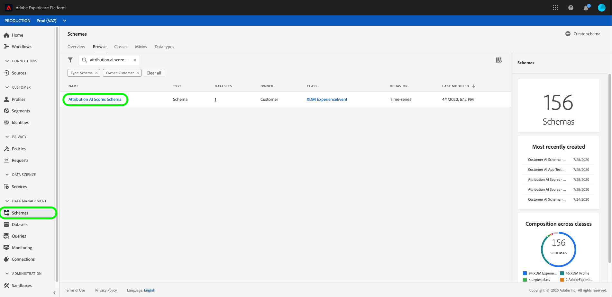

# Entrée et sortie dans [!DNL Attribution AI]

Le document suivant décrit les différentes entrées et sorties utilisées dans [!DNL Attribution AI].

## [!DNL Attribution AI] données d’entrée

Attribution AI analyse les jeux de données suivants pour calculer les scores algorithmiques :

- Jeux de données Adobe Analytics utilisant la variable [Connecteur source Analytics](../../sources/tutorials/ui/create/adobe-applications/analytics.md)
- Jeu de données d’événement d’expérience (EE)
- Jeu de données d’événements d’expérience client (CEE)

Vous pouvez ajouter plusieurs jeux de données provenant de sources différentes si chacun des jeux de données partage le même type d’identité (espace de noms), tel qu’un ECID. Pour en savoir plus sur l’ajout de plusieurs jeux de données, consultez le [Guide d’utilisation d’Attribution AI](./user-guide.md#identity).

>[!IMPORTANT]
>
>Le connecteur source Adobe Analytics peut prendre jusqu’à quatre semaines pour renvoyer les données. Si vous avez récemment configuré un connecteur, vous devez vérifier que le jeu de données possède la longueur minimale de données requise pour Attribution AI. Veuillez consulter la section [données historiques](#data-requirements) pour vérifier que vous disposez de suffisamment de données pour calculer des scores algorithmiques exacts.

Pour plus d’informations sur la configuration de la variable [!DNL Consumer Experience Event] (CEE), reportez-vous à la section [Préparation des données des services intelligents](../data-preparation.md) guide. Pour plus d’informations sur le mappage des données Adobe Analytics, consultez la section [Mappages des champs Analytics](../../sources/connectors/adobe-applications/analytics.md) documentation.

Toutes les colonnes du [!DNL Consumer Experience Event] (CEE) sont obligatoires pour Attribution AI.

>[!NOTE]
>
> Les 9 colonnes suivantes sont obligatoires, les colonnes supplémentaires sont facultatives mais recommandées/nécessaires si vous souhaitez utiliser les mêmes données pour d’autres solutions d’Adobe telles que [!DNL Customer AI] et [!DNL Journey AI].

| Colonnes obligatoires | Nécessaire pour |
| --- | --- |
| Champ d’identité Principal | Point de contact/Conversion |
| Horodatage | Point de contact/Conversion |
| Canal._type | Point de contact |
| Channel.mediaAction | Point de contact |
| Channel.mediaType | Point de contact |
| Marketing.trackingCode | Point de contact |
| Marketing.campaignname | Point de contact |
| Marketing.campaigngroup | Point de contact |
| Commerce | Conversion |

En règle générale, l’attribution est exécutée sur des colonnes de conversion telles que la commande, les achats et les passages en caisse sous &quot;commerce&quot;. Les colonnes &quot;canal&quot; et &quot;marketing&quot; servent à définir des points de contact pour Attribution AI (par exemple, `channel._type = 'https://ns.adobe.com/xdm/channel-types/email'`). Pour des résultats et des informations optimaux, il est vivement recommandé d’inclure autant de colonnes de conversion et de points de contact que possible. De plus, vous n’êtes pas limité aux colonnes ci-dessus. Vous pouvez inclure toute autre colonne recommandée ou personnalisée comme définition de conversion ou de point de contact.

>[!TIP]
>
>Si vous utilisez des données Adobe Analytics dans votre schéma CEE, les informations de point de contact pour Analytics sont généralement stockées dans `channel.typeAtSource` (par exemple, `channel.typeAtSource = 'email'`).

Les colonnes ci-dessous ne sont pas obligatoires, mais il est recommandé de les inclure dans votre schéma CEE si vous disposez des informations disponibles.

**Colonnes recommandées supplémentaires :**
- web.webReferer
- web.webInteraction
- web.webPageDetails
- xdm:productListItems

## Données historiques {#data-requirements}

>[!IMPORTANT]
>
> La quantité minimale de données nécessaire au fonctionnement d’Attribution AI est la suivante :
> - Vous devez fournir au moins 3 mois (90 jours) de données pour exécuter un bon modèle.
> - Vous avez besoin d’au moins 1 000 conversions.

Attribution AI nécessite des données historiques comme entrée pour la formation des modèles. La durée des données requises est principalement déterminée par deux facteurs clés : période de formation et intervalle de recherche en amont. Les entrées avec des fenêtres de formation plus courtes sont plus sensibles aux tendances récentes, tandis que des fenêtres de formation plus longues permettent de produire des modèles plus stables et précis. Il est important de modéliser l’objectif avec des données historiques qui représentent le mieux vos objectifs commerciaux.

Le [configuration de la fenêtre de formation](./user-guide.md#training-window) filtre les événements de conversion définis pour être inclus pour la formation de modèle en fonction de l’heure d’occurrence. Actuellement, la période de formation minimale est de 1 trimestre (90 jours). Le [intervalle de recherche en amont](./user-guide.md#lookback-window) fournit une période indiquant le nombre de jours avant l’inclusion des points de contact d’événement de conversion liés à cet événement de conversion. Ces deux concepts déterminent ensemble la quantité de données d’entrée (mesurées en jours) requise pour une application.

Par défaut, Attribution AI définit le créneau de formation comme les deux derniers trimestres (6 mois) et le créneau de recherche arrière comme étant de 56 jours. En d’autres termes, le modèle prend en compte tous les événements de conversion définis qui se sont produits au cours des 2 derniers trimestres et recherche tous les points de contact qui se sont produits dans les 56 jours précédant le ou les événements de conversion associés.

**Formule**:

Longueur minimale des données requises = période de formation + période de recherche arrière

>[!TIP]
>
> La longueur minimale de données requise pour une application avec des configurations par défaut est la suivante : 2 trimestres (180 jours) + 56 jours = 236 jours.

Exemple :

- Vous souhaitez attribuer des événements de conversion qui se sont produits au cours des 90 derniers jours (3 mois) et effectuer le suivi de tous les points de contact qui se sont produits dans les 4 semaines précédant l’événement de conversion. La durée des données d’entrée doit s’étendre sur les 90 derniers jours + 28 jours (4 semaines). La période de formation est de 90 jours et la période de recherche arrière est de 28 jours au total de 118 jours.

## Données de sortie Attribution AI

Attribution AI génère les résultats suivants :

- [Scores granulaires bruts](#raw-granular-scores)
- [Scores agrégés](#aggregated-attribution-scores)

**Exemple de schéma de sortie :**

### Scores granulaires bruts {#raw-granular-scores}

Attribution AI génère des scores d’attribution au niveau le plus granulaire possible afin que vous puissiez les découper en fonction de n’importe quelle colonne de score. Pour afficher ces scores dans l’interface utilisateur, lisez la section sur [affichage des chemins de score brut](#raw-score-path). Pour télécharger les scores à l’aide de l’API, rendez-vous sur la page [téléchargement de scores dans Attribution AI](./download-scores.md) document.

>[!NOTE]
>
> Vous ne pouvez voir une colonne de création de rapports de votre choix à partir du jeu de données d’entrée dans le jeu de données de sortie de score que si l’une des conditions suivantes est vraie :
> - La colonne de création de rapports est incluse dans la page de configuration dans le cadre de la configuration du point de contact ou de la définition de conversion.
> - La colonne de création de rapports est incluse dans les colonnes de jeux de données de score supplémentaires.

Le tableau suivant décrit les champs de schéma dans l’exemple de sortie de scores bruts :

| Nom de colonne (DataType) | Nullable | Description |
| --- | --- | --- |
| horodatage (DateTime) | False | Heure à laquelle un événement ou une observation de conversion s’est produit.   **Exemple :** 2020-06-09T00:01:51,000Z |
| identityMap (Map) | True | identityMap de l’utilisateur au format CEE XDM. |
| eventType (chaîne) | True | Type d’événement Principal pour cet enregistrement de série temporelle.   **Exemple :** &quot;Commande&quot;, &quot;Achat&quot;, &quot;Visite&quot; |
| eventMergeId (chaîne) | True | ID pour mettre en relation ou fusionner plusieurs [!DNL Experience Events] ensemble qui sont essentiellement le même événement ou qui doivent être fusionnés. Il est destiné à être renseigné par le producteur de données avant l’ingestion.   **Exemple :** 575525617716-0-edc2ed37-1aab-4750-a820-1c2b3844b8c4 |
| _id (String) | False | Identifiant unique de l’événement de série temporelle.   **Exemple :** 4461-edc2ed37-1aab-4750-a820-1c2b3844b8c4 |
| _tenantId (objet) | False | Conteneur d’objets de niveau supérieur correspondant à votre ID de tentant.   **Exemple :** _atsdsnrmsv2 |
| your_schema_name (Object) | False | Notation de la ligne avec l’événement de conversion de tous les événements de point de contact qui lui sont associés et de leurs métadonnées.   **Exemple :** Scores Attribution AI - Nom du modèle__2020 |
| segmentation (chaîne) | True | Segment de conversion tel que la géosegmentation sur lequel le modèle est construit. En cas d’absence de segments, le segment est identique à conversionName.   **Exemple :** ORDER_US |
| conversionName (String) | True | Nom de la conversion qui a été configurée lors de la configuration.   **Exemple :** Commande, piste, visite |
| conversion (objet) | False | Colonnes de métadonnées de conversion. |
| dataSource (String) | True | Identification globale unique d’une source de données.   **Exemple :** Adobe Analytics |
| eventSource (String) | True | Source de l’événement réel.   **Exemple :** Adobe.com |
| eventType (chaîne) | True | Type d’événement Principal pour cet enregistrement de série temporelle.   **Exemple :** Commande |
| geo (String) | True | Emplacement géographique où la conversion a été diffusée. `placeContext.geo.countryCode`.   **Exemple :** US |
| priceTotal (Double) | True | Recettes obtenues par le biais de la conversion   **Exemple :** 99,9 |
| product (String) | True | Identifiant XDM du produit lui-même.   **Exemple :** RX 1080 ti |
| productType (String) | True | Nom d’affichage du produit tel qu’il est présenté à l’utilisateur pour cette consultation de produit.   **Exemple :** Gpus |
| quantity (Integer) | True | Quantité achetée lors de la conversion.   **Exemple :** 1 1 080 ti |
| receivedTimestamp (DateTime) | True | Date et heure de réception de la conversion.   **Exemple :** 2020-06-09T00:01:51,000Z |
| skuId (chaîne) | True | Unité de gestion des stocks (SKU), l’identifiant unique d’un produit défini par le fournisseur.   **Exemple :** MJ-03-XS-Black |
| horodatage (DateTime) | True | Horodatage de la conversion.   **Exemple :** 2020-06-09T00:01:51,000Z |
| passThrough (Object) | True | Jeu de données Score supplémentaire colonnes spécifiées par l’utilisateur lors de la configuration du modèle. |
| commerce_order_purchaseCity (chaîne) | True | Colonne de jeu de données Score supplémentaire.   **Exemple :** city : San Jose |
| customerProfile (Object) | False | Détails d’identité de l’utilisateur utilisé pour créer le modèle. |
| identity (Object) | False | Contient les détails de l’utilisateur utilisé pour créer le modèle, tels que `id` et `namespace`. |
| id (String) | True | Identifiant de l’utilisateur, tel que l’identifiant de cookie ou AAID ou MCID, etc.   **Exemple :** 17348762725408656344688320891369597404 |
| namespace (chaîne) | True | Espace de noms d’identité utilisé pour créer les chemins d’accès et, par conséquent, le modèle.   **Exemple :** aaid |
| touchpointsDetail (tableau d’objets) | True | La liste des détails du point de contact qui mènent à la conversion ordonnée par | occurrence de point de contact ou horodatage. |
| touchpointName (chaîne) | True | Nom du point de contact qui a été configuré lors de la configuration.   **Exemple :** PAID_SEARCH_CLICK |
| scores (objet) | True | Contribution des points de contact à cette conversion en tant que score. Pour plus d’informations sur les scores générés dans cet objet, voir la section [scores d’attribution agrégés](#aggregated-attribution-scores) . |
| touchPoint (objet) | True | Métadonnées de point de contact. Pour plus d’informations sur les scores générés dans cet objet, voir la section [scores agrégés](#aggregated-scores) . |

### Affichage des chemins d’accès aux scores bruts (interface utilisateur) {#raw-score-path}

Vous pouvez afficher le chemin d’accès à vos scores bruts dans l’interface utilisateur. Commencez par sélectionner **[!UICONTROL Schémas]** Dans l’interface utilisateur de Platform, recherchez et sélectionnez votre schéma de scores d’attribution AI dans la **[!UICONTROL Parcourir]** .

Sélectionnez ensuite un champ dans le **[!UICONTROL Structure]** de l’interface utilisateur, la fonction **[!UICONTROL Propriétés du champ]** s’ouvre. Within **[!UICONTROL Propriétés du champ]** est le champ de chemin qui correspond à vos scores bruts.

### Scores d’attribution agrégés {#aggregated-attribution-scores}

Les scores agrégés peuvent être téléchargés au format CSV depuis l’interface utilisateur de Platform si la période est inférieure à 30 jours.

Attribution AI prend en charge deux catégories de scores d’attribution : les scores algorithmiques et les scores basés sur des règles.

Attribution AI produit deux types différents de scores algorithmiques : les scores incrémentiels et les scores influencés. Un score influencé représente la fraction de la conversion dont chaque point de contact marketing est à l’origine. Un score incrémentiel représente le degré d’impact marginal directement causé par le point de contact marketing. La principale différence entre le score incrémentiel et le score influencé est que le score incrémentiel prend en compte l’effet de base. Il ne présume pas qu’une conversion est provoquée uniquement par les points de contact marketing précédents.

Voici un aperçu rapide d’un exemple de sortie de schéma Attribution AI à partir de l’interface utilisateur de Adobe Experience Platform :

Consultez le tableau ci-dessous pour plus de détails sur chacun de ces scores d’attribution :

| Scores d’attribution | Description |
| ----- | ----------- |
| Influencé (algorithmique) | Le score influencé représente la fraction de la conversion dont chaque point de contact marketing est à l’origine. |
| Incrémentiel (algorithmique) | Le score incrémentiel représente le degré d’impact marginal directement causé par un point de contact marketing. |
| Première touche | Score d’attribution basé sur des règles qui attribue tous les crédits au point de contact initial d’un chemin de conversion. |
| Dernière touche | Score d’attribution basé sur des règles qui attribue tous les crédits au point de contact le plus proche de la conversion. |
| Linéaire | Score d’attribution basé sur des règles qui répartit de manière égale les crédits entre chaque point de contact d’un chemin de conversion. |
| En forme de U | Score d’attribution basé sur des règles qui attribue 40 % des crédits au premier point de contact et 40 % des crédits au dernier point de contact. Les autres points de contact se partagent de manière égale les 20 % restants. |
| Décroissance temporelle | Score d’attribution basé sur des règles qui attribue plus de crédits aux points de contact les plus proches de la conversion par rapport aux points de contact plus éloignés dans le temps de la conversion. |

**Référence du score brut (scores d’attribution)**

Le tableau ci-dessous associe les scores d’attribution aux scores bruts. Si vous souhaitez télécharger vos scores bruts, rendez-vous sur la page [téléchargement de scores dans Attribution AI](./download-scores.md) documentation.

| Scores d’attribution | Colonne de référence de score brut |
| --- | --- |
| Influencé (algorithmique) | _tenantID.your_schema_name.element.touchpoint.algorithmiqueInfluencé |
| Incrémentiel (algorithmique) | _tenantID.your_schema_name.touchpointsDetail.element.touchpoint.algorithmiqueInfluencé |
| Première touche | _tenantID.your_schema_name.touchpointsDetail.element.touchpoint.firstTouch |
| Dernière touche | _tenantID.your_schema_name.touchpointsDetail.element.touchpoint.lastTouch |
| Linéaire | _tenantID.your_schema_name.touchpointsDetail.element.touchpoint.linear |
| En forme de U | _tenantID.your_schema_name.touchpointsDetail.element.touchpoint.uShape |
| Décroissance temporelle | _tenantID.your_schema_name.touchpointsDetail.element.touchpoint.decayUnits |

### Scores agrégés {#aggregated-scores}

Les scores agrégés peuvent être téléchargés au format CSV depuis l’interface utilisateur de Platform si la période est inférieure à 30 jours. Consultez le tableau ci-dessous pour plus de détails sur chacune de ces colonnes agrégées.

| Nom de la colonne | Contrainte | Nullable | Description |
| --- | --- | --- | --- |
| customerevents_date (DateTime) | Format défini par l’utilisateur et fixe | False | Date de l’événement client au format AAAA-MM-JJ.   **Exemple**: 2016-05-02 |
| mediatouchpoints_date (DateTime) | Format défini par l’utilisateur et fixe | True | Date du point de contact du média au format AAAA-MM-JJ   **Exemple**: 2017-04-21 |
| segment (chaîne) | Calculé | False | Segment de conversion tel que la géosegmentation sur lequel le modèle est construit. En cas d’absence de segments, le segment est identique à conversion_scope.   **Exemple**: ORDER_AMER |
| conversion_scope (chaîne) | Utilisateur défini | False | Nom de la conversion tel que configuré par l’utilisateur.   **Exemple**: ORDER |
| touchpoint_scope (chaîne) | Utilisateur défini | True | Nom du point de contact tel que configuré par l’utilisateur   **Exemple**: PAID_SEARCH_CLICK |
| product (String) | Utilisateur défini | True | Identifiant XDM du produit.   **Exemple**: CC |
| product_type (String) | Utilisateur défini | True | Nom d’affichage du produit tel qu’il est présenté à l’utilisateur pour cette consultation de produit.   **Exemple**: gpus, ordinateurs portables |
| geo (String) | Utilisateur défini | True | Emplacement géographique où la conversion a été diffusée (placeContext.geo.countryCode)   **Exemple**: US |
| event_type (chaîne) | Utilisateur défini | True | Type d’événement Principal pour cet enregistrement de série temporelle   **Exemple**: Conversion payante |
| media_type (chaîne) | ENUM | False | Indique si le type de média est payé, détenu ou gagné.   **Exemple**: PAYÉ, DÉTENU |
| channel (String) | ENUM | False | Le `channel._type` qui sert à fournir une classification approximative des canaux avec des propriétés similaires dans [!DNL Consumer Experience Event] XDM.   **Exemple**: RECHERCHE |
| action (String) | ENUM | False | Le `mediaAction` sert à fournir un type d’action experience event media.   **Exemple**: CLIQUEZ |
| campaign_group (chaîne) | Utilisateur défini | True | Nom du groupe de campagnes dans lequel plusieurs campagnes sont regroupées, par exemple &#39;50%_DISCOUNT&#39;.   **Exemple**: COMMERCIAL |
| campaign_name (String) | Utilisateur défini | True | Nom de la campagne utilisée pour identifier la campagne marketing telle que &#39;50%_DISCOUNT_USA&#39; ou &#39;50%_DISCOUNT_ASIA&#39;.   **Exemple**: Salaire Thanksgiving |

**Référence du score brut (agrégé)**

Le tableau ci-dessous associe les scores agrégés aux scores bruts. Si vous souhaitez télécharger vos scores bruts, rendez-vous sur la page [téléchargement de scores dans Attribution AI](./download-scores.md) documentation. Pour afficher les chemins d’accès aux scores bruts dans l’interface utilisateur, consultez la section sur [affichage des chemins de score brut](#raw-score-path) dans ce document.

| Nom de la colonne | Colonne de référence Score brut |
| --- | --- |
| customerevents_date | timestamp |
| mediatouchpoints_date | _tenantID.your_schema_name.touchpointsDetail.element.touchpoint.timestamp |
| segment | _tenantID.your_schema_name.segmentation |
| conversion_scope | _tenantID.your_schema_name.conversion.conversionName |
| touchpoint_scope | _tenantID.your_schema_name.touchpointsDetail.element.touchpointName |
| product | _tenantID.your_schema_name.conversion.product |
| product_type | _tenantID.your_nom_schéma.conversion.product_type |
| geo | _tenantID.your_schema_name.conversion.geo |
| event_type | eventType |
| media_type | _tenantID.your_schema_name.touchpointsDetail.element.touchpoint.mediaType |
| channel | _tenantID.your_schema_name.touchpointsDetail.element.touchpoint.mediaChannel |
| action | _tenantID.your_schema_name.touchpointsDetail.element.touchpoint.mediaAction |
| campaign_group | _tenantID.your_schema_name.touchpointsDetail.element.touchpoint.campaignGroup |
| campaign_name | _tenantID.your_schema_name.touchpointsDetail.element.touchpoint.campaignName |

## Étapes suivantes {#next-steps}

Une fois vos données préparées et vos informations d’identification et schémas en place, commencez par suivre la [Guide d’utilisation d’Attribution AI](./user-guide.md). Ce guide vous guide tout au long de la création d’une instance pour Attribution AI.
