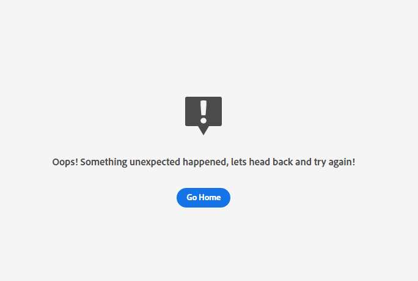

# Dépannage des erreurs liées à l’IA dédiée à l’attribution

Ce document répond aux questions les plus fréquemment posées sur l’IA dédiée à l’attribution.

## Impossible d’accéder à l’IA dédiée à l’attribution dans Chrome en navigation privée

Les erreurs de chargement en mode navigation privée de Google Chrome sont présentes en raison des mises à jour des paramètres de sécurité du mode navigation privée de Google Chrome. Le problème est en cours de traitement avec Chrome pour faire d’experience.adobe.com un domaine de confiance.

{width=500}

### Correctif recommandé

Pour contourner ce problème, vous devez ajouter experience.adobe.com en tant que site pouvant toujours utiliser des cookies. Commencez par accéder à **chrome://settings/cookies**. Faites ensuite défiler l’écran jusqu’à la section **Comportements personnalisés**, puis sélectionnez le bouton **Ajouter** en regard de « Sites autorisés à utiliser des cookies ». Dans la fenêtre contextuelle qui s’affiche, effectuez un copier-coller de `[*.]experience.adobe.com` puis cochez la case **Inclure les cookies tiers de ce site**. Une fois l’opération terminée, sélectionnez **Ajouter** et chargez à nouveau l’IA dédiée à l’attribution en navigation privée.

