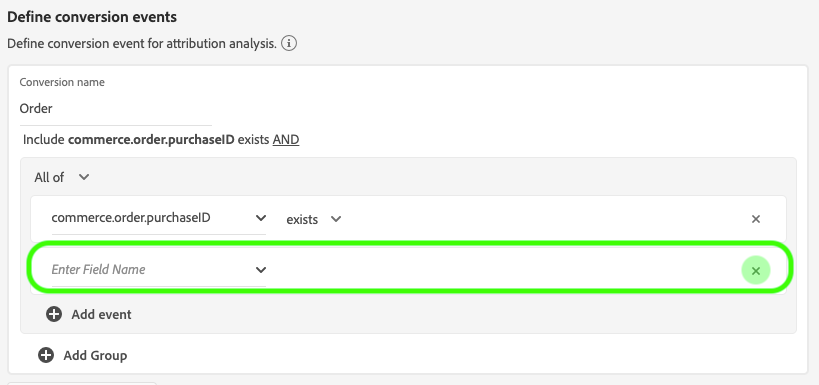

# Guide de l’utilisateur de l’API d’attribution

Attribution AI, dans le cadre d&#39;Intelligent Services, est un service d&#39;attribution algorithmique à plusieurs canaux qui calcule l&#39;influence et l&#39;impact incrémentiel des interactions client par rapport à des résultats spécifiés. Grâce à l’API d’attribution, les spécialistes du marketing peuvent mesurer et optimiser les dépenses marketing et publicitaires en comprenant l’impact de chaque interaction client individuelle sur chaque phase du parcours des clients.

Ce document sert de guide pour l’interaction avec l’API d’attribution dans l’interface utilisateur des services intelligents.

## Création d’une instance

In the Adobe Experience Platform UI, click **Services** in the left navigation. Le navigateur *Services* s’affiche et affiche les services intelligents Adobe disponibles. In the container for Attribution AI, click **Open**.

La page du service AI d’attribution s’affiche. Cette page liste les instances de service d’attribution AI et affiche des informations à leur sujet, notamment le nom de l’instance, les événements de conversion, la fréquence d’exécution de l’instance et l’état de la dernière mise à jour. Cliquez sur **Créer une instance** pour commencer.

Ensuite, la page de configuration de l’API d’attribution s’affiche, dans laquelle vous pouvez fournir des informations de base et spécifier un jeu de données pour l’instance.

### Nommer l’instance

Sous Informations ** de base, indiquez un nom et une description facultative pour votre instance de service.

### Sélectionner un jeu de données

Après avoir rempli les informations de base, cliquez sur la liste déroulante **Sélectionner un jeu de données** pour sélectionner votre jeu de données. Le jeu de données est utilisé pour former le modèle et marquer les données suivantes qu&#39;il produit. Lors de la sélection d’un jeu de données dans le sélecteur de liste déroulante, seuls ceux qui sont compatibles avec l’API d’attribution et conformes au schéma du modèle de données d’expérience (XDM) sont répertoriés. Une fois un jeu de données sélectionné, cliquez sur **Suivant** dans le coin supérieur droit pour accéder à la page de définition des événements.

## Définition de événements

Il existe trois types différents de données d’entrée utilisées pour définir des événements :

- **événements de conversion :** Objectifs commerciaux qui identifient l’impact des activités marketing, telles que les commandes de commerce électronique, les achats en magasin et les visites sur le site Web.
- **Fenêtre de recherche :** Fournit une période indiquant le nombre de jours avant l’inclusion des points de contact du événement de conversion.
- **Points de contact :** événements marketing destinataires, individuels et ou de niveau cookie utilisés pour évaluer l’impact numérique ou basé sur les recettes des conversions.

### Définir des événements de conversion

Pour définir un événement de conversion, vous devez attribuer un nom au événement et sélectionner le type d&#39;événement en cliquant sur le menu déroulant **Entrer le nom** de champ.

Une fois qu’un événement est sélectionné, une nouvelle liste déroulante s’affiche à droite. La deuxième liste déroulante sert à donner un contexte plus détaillé à votre événement par le biais d’opérations. Pour ce événement de conversion, l’opération par défaut *existe* .

>[!NOTE] Une chaîne sous votre nom *de* conversion est mise à jour au fur et à mesure que vous définissez votre événement.

Les boutons événement ** Ajouter et Groupe ** Ajouter sont utilisés pour définir davantage votre conversion. Selon la conversion que vous définissez, vous devrez peut-être utiliser les boutons événement ** Ajouter et Groupe ** Ajouter pour fournir un contexte plus détaillé.

Cliquez sur **Ajouter événement** pour créer d’autres champs qui peuvent être remplis à l’aide de la même méthode que celle décrite ci-dessus. Cela permet d’ajouter une instruction *AND* à la définition de chaîne sous le nom *de* conversion. Cliquez sur le **x** pour supprimer un événement qui a été ajouté.

Cliquez sur Groupe **** Ajouterpour créer d’autres champs distincts de l’original. Avec l’ajout de groupes, un bouton bleu *et* apparaît. Cliquer sur **Et** permet de modifier le paramètre pour qu’il contienne &quot;Ou&quot;. &quot;Ou&quot; est utilisé pour définir plusieurs chemins de conversion réussis. &quot;Et&quot; étend le chemin de conversion pour inclure d’autres conditions.

Si vous avez besoin de plusieurs conversions, cliquez sur **Ajouter conversion** pour créer une nouvelle carte de conversion. Vous pouvez répéter le processus ci-dessus pour définir plusieurs conversions.

### Définir la fenêtre de recherche

Une fois la définition de votre conversion terminée, vous devez confirmer votre fenêtre de recherche en amont. A l’aide des touches fléchées ou en cliquant sur la valeur par défaut (56), indiquez le nombre de jours avant le événement de conversion à partir duquel vous souhaitez inclure les points de contact. Les points de contact sont définis à l’étape suivante.

### Définir des points de contact

La définition des points de contact suit un processus similaire à celui de la [définition des conversions](#define-conversion-events). Au départ, vous devez nommer votre point de contact et sélectionner une valeur de point de contact dans le menu déroulant *Entrer le nom* de champ. Une fois sélectionnée, la liste déroulante des opérateurs s’affiche avec la valeur par défaut &quot;existe&quot;. Cliquez sur la liste déroulante pour afficher une liste d’opérateurs.

Pour ce point de contact, sélectionnez **égal**.

Une fois qu’un opérateur pour un point de contact est sélectionné, *la saisie de la valeur* de champ est rendue disponible. Les valeurs de la liste déroulante *Saisir la valeur* de champ sont renseignées en fonction de l’opérateur et de la valeur du point de contact que vous avez sélectionnés précédemment. Si une valeur n’est pas renseignée dans la liste déroulante, vous pouvez la saisir manuellement. Cliquez sur la liste déroulante et sélectionnez **CLIQUEZ**.

>[!NOTE] Les opérateurs &quot;existe&quot; et &quot;n’existe pas&quot; ne sont pas associés à des valeurs de champ.

Les boutons *Ajouter événement* et Groupe ** Ajouter sont utilisés pour définir plus précisément votre point de contact. En raison de la nature complexe qui entoure les points de contact, il n&#39;est pas rare d&#39;avoir plusieurs événements et groupes pour un seul point de contact.

Lorsque vous cliquez dessus, **Ajouter événement** permet l’ajout de champs supplémentaires. Cliquez sur le **x** pour supprimer un événement qui a été ajouté.

Cliquez sur le groupe **** Ajouterpour créer d’autres champs distincts de l’original. Avec l’ajout de groupes, un bouton bleu *et* apparaît. Cliquez sur **Et** pour modifier le paramètre, le nouveau paramètre &quot;Ou&quot; est utilisé pour définir plusieurs chemins d’accès réussis. Ce point de contact particulier n&#39;a qu&#39;un seul chemin réussi, par conséquent &quot;Ou&quot; n&#39;est pas nécessaire.

>[!NOTE] Utilisez la chaîne située sous le nom ** du point de contact pour obtenir un aperçu rapide de votre point de contact. Notez que la chaîne correspond au nom du point de contact.

Vous pouvez ajouter d’autres points de contact en cliquant sur **Ajouter point de contact** et en répétant le processus ci-dessus.

Une fois que vous avez terminé de définir tous les points de contact nécessaires, faites défiler la page vers le haut et cliquez sur **Suivant** dans le coin supérieur droit pour passer à l’étape finale.

## Formation avancée et configuration des notes

La dernière page de l’API d’attribution est la page *Avancée* utilisée pour configurer la formation et la notation.

### Planification de la formation

En utilisant le *calendrier*, vous pouvez sélectionner un jour et une heure de la semaine pour lesquels vous souhaitez que le score ait lieu.

Cliquez sur la liste déroulante sous Fréquence *de* score pour sélectionner une note quotidienne, hebdomadaire et mensuelle. Ensuite, sélectionnez les jours de la semaine où vous souhaitez que le score ait lieu. Vous pouvez sélectionner plusieurs jours. Cliquez une seconde fois sur un jour pour le désélectionner.

Pour modifier l’heure de la journée à laquelle vous souhaitez que le score se produise, cliquez sur l’icône de l’horloge. Dans la nouvelle incrustation qui s’affiche, entrez l’heure de la journée à laquelle vous souhaitez que le score ait lieu. Cliquez en dehors de l’incrustation pour la fermer.

>[!NOTE] Chaque processus de notation peut prendre jusqu’à 24 heures.

### Modélisation basée sur la région (facultatif)

Les comportements de vos clients peuvent différer considérablement selon le pays et la région géographique. Pour les entreprises internationales, l’utilisation de modèles basés sur les pays ou les régions peut accroître la précision de l’attribution. Chaque région ajoutée crée un nouveau modèle avec les données de cette région.

Pour définir une nouvelle région, début en cliquant sur **Ajouter région**. Dans le conteneur qui s’affiche, nommez la région. Une seule valeur (&quot;placeContext.geo.countryCode&quot;) est renseignée à partir de la liste déroulante *Entrer le nom* de champ. Sélectionnez cette valeur.

Sélectionnez ensuite un opérateur.

Enfin, tapez le code du pays dans la liste déroulante *Saisir la valeur* de champ.

>[!NOTE] Les codes de pays comportent deux caractères. Une liste complète est disponible ici [ISO 3166-1 alpha-2](https://datahub.io/core/country-list).

### Fenêtre Formation

Pour vous assurer d&#39;obtenir le modèle le plus précis possible, il est important de former votre modèle à des données historiques qui représentent votre activité. Par défaut, le modèle est formé à l&#39;aide de 2 trimestres (6 mois) de données. Sélectionnez la liste déroulante pour modifier la valeur par défaut. Vous pouvez choisir de vous entraîner avec un à quatre quarts de données (3 à 12 mois).

>[!NOTE] Une fenêtre de formation plus courte est plus sensible aux tendances récentes, tandis qu&#39;une fenêtre de formation plus longue crée un modèle plus robuste et est moins sensible aux tendances récentes.

Une fois que vous avez sélectionné votre fenêtre de formation, cliquez sur **Terminer** dans le coin supérieur droit. Patientez un peu avant que les données ne soient traitées. Une fois l’instance terminée, une boîte de dialogue contextuelle s’affiche, confirmant que la configuration de l’instance est terminée. Cliquez sur **OK** pour être redirigé vers la page des instances *de* service où vous pouvez voir votre instance de service.

## Étapes suivantes

En suivant ce didacticiel, vous avez réussi à créer une instance de service dans l’API d’attribution. Une fois l’instance terminée (jusqu’à 24 heures), vous êtes prêt à [découvrir les informations](./discover-insights.md)sur l’API d’attribution. De plus, si vous souhaitez télécharger les résultats de votre score, consultez la [documentation des scores](./download-scores.md) bruts téléchargée.

## Ressources supplémentaires

La vidéo suivante décrit un processus de bout en bout pour la création d’une instance dans Attribution AI.

>[!VIDEO](https://video.tv.adobe.com/v/32668?learn=on&quality=12)