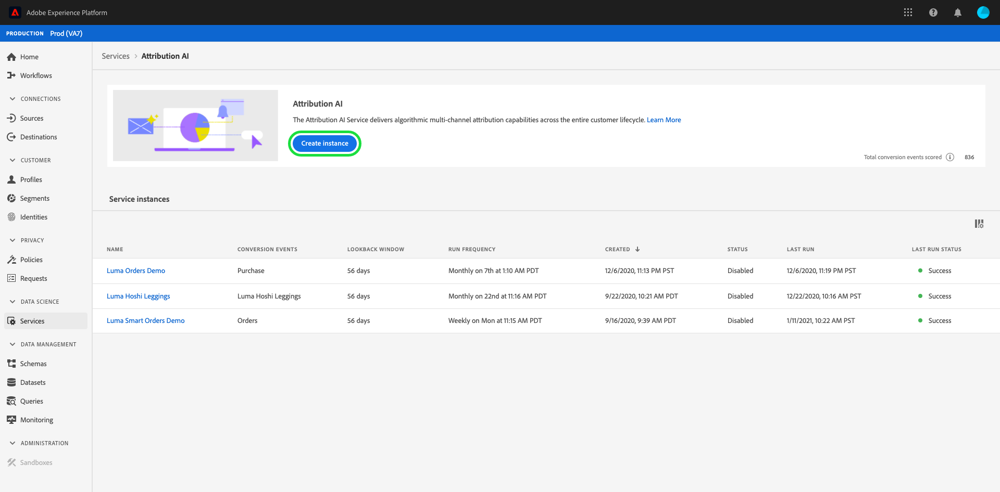
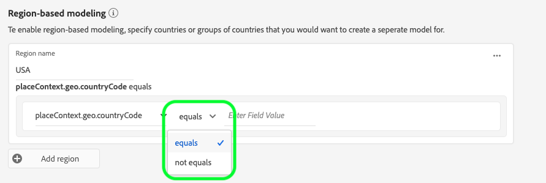

# Guide de l’interface utilisateur Attribution AI

Dans le cadre d’Intelligent Services, Attribution AI est un service d’attribution algorithmique à plusieurs canaux qui calcule l’influence et l’impact incrémentiel des interactions des clients par rapport à des résultats spécifiés. Grâce à Attribution AI, les professionnels du marketing peuvent mesurer et optimiser les dépenses publicitaires et marketing en comprenant l’impact de chaque interaction client sur chaque phase du parcours des clients.

Ce document sert de guide pour interagir avec Attribution AI dans l’interface utilisateur d’Intelligent Services.

## Création d’une instance

Dans l&#39;interface utilisateur [!DNL Adobe Experience Platform], cliquez sur **[!UICONTROL Services]** dans le volet de navigation de gauche. Le navigateur **[!UICONTROL Services]** apparaît et affiche les services intelligents Adobe disponibles. Dans le conteneur d’Attribution AI, cliquez sur **[!UICONTROL Ouvrir]**.

La page de service d’Attribution AI s’affiche. Cette page répertorie les instances de service d’Attribution AI et affiche les informations les concernant, notamment le nom de l’instance, les événements de conversion, la fréquence à laquelle l’instance est exécutée et l’état de la dernière mise à jour.

Vous pouvez trouver la mesure **[!UICONTROL événements de conversion totaux marqués]** située dans le coin inférieur droit du conteneur **[!UICONTROL Créer une instance]**. Cette mesure suit le nombre total de événements de conversion marqués par Attribution AI pour l’année civile en cours, y compris tous les environnements de sandbox et toutes les instances de service supprimées.

Les instances de service peuvent être modifiées, clonées et supprimées à l’aide des commandes situées sur le côté droit de l’interface utilisateur. Pour afficher ces contrôles, sélectionnez une instance de vos instances **[!UICONTROL Service existantes]**. Les contrôles contiennent les informations suivantes :

- **[!UICONTROL Modifier]** : Le fait de sélectionner  **** Modifier vous permet de modifier une instance de service existante. Vous pouvez modifier le nom, la description, l’état et la fréquence d’évaluation de l’instance.
- **[!UICONTROL Cloner]** : La sélection de  **** Clonecopies copie l’instance de service sélectionnée. Vous pouvez ensuite modifier le processus pour effectuer des ajustements mineurs et le renommer en tant que nouvelle instance.
- **[!UICONTROL Supprimer]** : Vous pouvez supprimer une instance de service, y compris les exécutions historiques.
- **[!UICONTROL Source]** de données : Lien vers le jeu de données utilisé par cette instance.
- **[!UICONTROL Détails]** de la dernière exécution : Ceci s’affiche uniquement en cas d’échec d’une exécution. Les informations sur les raisons pour lesquelles l&#39;exécution a échoué, telles que les codes d&#39;erreur, sont affichées ici.

- **[!UICONTROL Événements]** de conversion : Aperçu rapide des événements de conversion configurés pour cette instance.
- **[!UICONTROL Fenêtre]** de recherche : Période que vous avez définie indiquant le nombre de jours avant l’inclusion des points de contact du événement de conversion.
- **[!UICONTROL Points de contact]** : Liste de tous les points de contact que vous avez définis lors de la création de cette instance.

Sélectionnez **[!UICONTROL Créer une instance]** pour commencer.

Ensuite, la page de configuration d’Attribution AI s’affiche, dans laquelle vous pouvez fournir des informations de base et spécifier un jeu de données pour l’instance.

### Attribution d’un nom à l’instance

Sous **[!UICONTROL Informations de base]**, donnez un nom et une description facultative de votre instance de service.

### Sélection d’un jeu de données

Après avoir renseigné les informations de base, cliquez sur le menu déroulant intitulé **Sélectionner le jeu de données** pour sélectionner votre jeu de données. Le jeu de données est utilisé pour former le modèle et noter les données ultérieures qui en résultent. Lors de la sélection d’un jeu de données à partir du sélecteur du menu déroulant, seuls les jeux compatibles avec Attribution AI et conformes au schéma de modèle de données d’expérience (XDM) sont répertoriés. Une fois qu’un jeu de données est sélectionné, cliquez sur **Suivant** dans le coin supérieur droit pour accéder à la page de définition des événements.

>[!TIP]
>
>Les jeux de données Adobe Analytics sont pris en charge par le biais d’Analytics Source Connector.

## Définition des événements

Il existe trois types différents de données d’entrée utilisées pour définir les événements :

- **Événements de conversion :** objectifs professionnels qui identifient l’impact des activités marketing, comme les commandes e-commerce, les achats en magasin et les visites sur le site web.
- **Intervalle de recherche en amont :** fournit une période indiquant le nombre de jours avant l’inclusion des points de contact de l’événement de conversion.
- **Points de contact :** événements marketing au niveau des bénéficiaires, des individus ou des cookies utilisés pour évaluer l’impact numérique ou basé sur les recettes des conversions.

### Définition des événements de conversion {#define-conversion-events}

Pour définir un événement de conversion, vous devez donner un nom à l’événement et sélectionner le type d’événement en cliquant sur le menu déroulant **Saisir le nom du champ**.

Une fois qu’un événement est sélectionné, un nouveau menu déroulant s’affiche à sa droite. Le second menu déroulant est utilisé pour fournir davantage de contexte à votre événement grâce à l’utilisation des opérations. Pour cet événement de conversion, l’opération par défaut *exists* est utilisée.

>[!NOTE]
>
>Une chaîne sous votre *nom de conversion* est mise à jour au fur et à mesure que vous définissez votre événement.

Les boutons **[!UICONTROL Ajouter un événement]** et **[!UICONTROL Ajouter un groupe]** permettent de définir plus précisément votre conversion. En fonction de la conversion que vous définissez, vous devrez peut-être utiliser les boutons **[!UICONTROL Ajouter un événement]** et **[!UICONTROL Ajouter un groupe]** pour fournir davantage de contexte.

Cliquer sur **[!UICONTROL Ajouter un événement]** crée des champs supplémentaires qui peuvent être remplis en utilisant la même méthode que celle décrite ci-dessus. Cela permet d’ajouter une instruction ET à la définition de la chaîne sous le nom de la conversion. Cliquez sur le **x** pour supprimer un événement qui a été ajouté.

Cliquer sur **[!UICONTROL Ajouter un groupe]** donne la possibilité de créer des champs supplémentaires distincts de l’original. Avec l’ajout de groupes, un bouton bleu *Et* apparaît. Cliquer sur **Et** permet de modifier le paramètre pour qu’il contienne « Ou ». « Ou » est utilisé pour définir plusieurs chemins de conversion performants. « Et » prolonge le chemin de conversion pour inclure des conditions supplémentaires.

Si vous avez besoin de plusieurs conversions, cliquez sur **Ajouter une conversion** pour créer une nouvelle carte de conversion. Vous pouvez répéter la procédure ci-dessus pour définir plusieurs conversions.

### Définition de l’intervalle de recherche en amont  {#lookback-window}

Une fois la conversion définie, vous devez confirmer votre intervalle de recherche en amont. En utilisant les touches fléchées ou en cliquant sur la valeur par défaut (56), indiquez le nombre de jours avant votre événement de conversion à partir duquel vous souhaitez inclure des points de contact. Les points de contact sont définis à l’étape suivante.

### Définition des points de contact

La définition des points de contact suit un workflow similaire à celui de la [définition des conversions](#define-conversion-events). Dans un premier temps, vous devez nommer votre point de contact et sélectionner une valeur de point de contact dans le menu déroulant *Saisir le nom du champ*. Une fois sélectionné, le menu déroulant de l’opérateur s’affiche avec la valeur par défaut « exists ». Cliquez sur le menu déroulant pour afficher une liste d’opérateurs.

Pour ce point de contact, sélectionnez **equals**.

Une fois qu’un opérateur pour un point de contact est sélectionné, *Saisir la valeur du champ* est mis à disposition. Les valeurs du menu déroulant pour *Saisir la valeur du champ* reposent sur l’opérateur et la valeur du point de contact que vous avez sélectionnés précédemment. Si une valeur n’apparaît pas dans le menu déroulant, vous pouvez la saisir manuellement. Cliquez sur le menu déroulant et sélectionnez **CLICK**.

>[!NOTE]
>
>Les opérateurs « exists » et « not exists » ne sont pas associés à des valeurs de champ.

Les boutons *Ajouter un événement* et *Ajouter un groupe* permettent de définir plus précisément votre point de contact. En raison de la nature complexe des points de contact, il n’est pas rare d’avoir plusieurs événements et groupes pour un seul point de contact.

En cliquant sur **Ajouter un événement**, il est possible d’ajouter des champs supplémentaires. Cliquez sur le **x** pour supprimer un événement qui a été ajouté.

Cliquer sur **Ajouter un groupe** vous donne la possibilité de créer des champs supplémentaires distincts de l’original. Avec l’ajout de groupes, un bouton bleu *Et* apparaît. Cliquez sur **Et** pour modifier le paramètre. Le nouveau paramètre « Ou » est utilisé pour définir plusieurs chemins performants. Ce point de contact particulier n’a qu’un seul chemin performant. Par conséquent, « Ou » n’est pas nécessaire.

>[!NOTE]
>
>Utilisez la chaîne sous le *nom du point de contact* pour avoir un aperçu rapide de votre point de contact. Notez que la chaîne correspond au nom du point de contact.

Vous pouvez ajouter d’autres points de contact en cliquant sur **Ajouter un point de contact** et en répétant la procédure ci-dessus.

Une fois que vous avez défini tous les points de contact nécessaires, faites défiler la page vers le haut et cliquez sur **Suivant** dans le coin supérieur droit pour passer à l’étape finale.

## Configuration de la formation et de la notation avancées

La dernière page d’Attribution AI est la page **[!UICONTROL Avancé]** utilisée pour configurer la formation et la notation.

### Planification de la formation

À l’aide du *planning*, vous pouvez sélectionner le jour et l’heure de la semaine où vous souhaitez que la notation soit effectuée.

Cliquez sur le menu déroulant sous *Fréquence de notation* pour choisir entre une notation quotidienne, hebdomadaire et mensuelle. Ensuite, sélectionnez les jours de la semaine où vous souhaitez que la notation soit effectuée. Vous pouvez sélectionner plusieurs jours. Cliquez une seconde fois sur un jour pour le désélectionner.

Pour modifier l’heure de la journée où vous souhaitez que la notation soit effectuée, cliquez sur l’icône de l’horloge. Dans la nouvelle fenêtre qui s’affiche, saisissez l’heure de la journée à laquelle vous souhaitez que la notation soit effectuée. Cliquez en dehors de la fenêtre pour la fermer.

>[!NOTE]
>
>Chaque processus de notation peut prendre jusqu’à 24 heures.

### Autres colonnes de jeux de données de score (facultatif)

Par défaut, un jeu de données de score est créé pour chaque instance de service dans un schéma standard. Vous pouvez choisir d’ajouter d’autres colonnes en fonction de vos configurations de Événement de conversion et de points de contact à la sortie du jeu de données de score. Début en sélectionnant des colonnes dans votre jeu de données d&#39;entrée, vous pouvez ensuite les faire glisser pour modifier l&#39;ordre en maintenant le bouton gauche de la souris enfoncé sur l&#39;icône du hamburger.

### Modélisation basée sur la région (facultative) {#region-based-modeling-optional}

Le comportement de vos clients peut varier considérablement selon le pays et la région géographique. Pour les entreprises mondiales, l’utilisation de modèles basés sur les pays ou les régions peut accroître la précision de l’attribution. Chaque région ajoutée crée un nouveau modèle avec les données de cette région.

Pour définir une nouvelle région, commencez par cliquer sur **[!UICONTROL Ajouter une région]**. Dans le conteneur qui s’affiche, attribuez un nom à la région. Une seule valeur (« placeContext.geo.countryCode ») s’affiche dans le menu déroulant **[!UICONTROL Saisir le nom du champ]**. Sélectionnez cette valeur.

Sélectionnez ensuite un opérateur.

Pour finir, saisissez le code pays dans le menu déroulant **[!UICONTROL Saisir la valeur du champ]**.

>[!NOTE]
>
>Les codes pays se composent de deux caractères. Vous trouverez ci-contre une liste complète de ces codes [ISO 3166-1 alpha-2](https://datahub.io/core/country-list).

### Période de formation  {#training-window}

Pour vous assurer d’obtenir le modèle le plus précis possible, il est important de former votre modèle avec des données historiques qui représentent votre entreprise. Par défaut, le modèle est formé à l’aide de 2 trimestres (6 mois) de données sur les événements de conversion. Sélectionnez le menu déroulant pour modifier la valeur par défaut. Vous pouvez opter pour une formation basée sur un à quatre trimestres de données (3 à 12 mois).

>[!NOTE]
>
>Une période de formation plus courte est plus réceptive aux tendances récentes, tandis qu’une période de formation plus longue crée un modèle plus robuste et est moins sensible aux tendances récentes.

Une fois que vous avez sélectionné votre période de formation, cliquez sur **[!UICONTROL Terminer]** dans le coin supérieur droit. Prévoyez un certain temps pour le traitement des données. Une fois cette opération terminée, une boîte de dialogue s’affiche, confirmant que la configuration de l’instance est terminée. Cliquez sur **[!UICONTROL OK]** pour être redirigé vers la page **[!UICONTROL Instances de service]** sur laquelle vous pouvez voir votre instance de service.

## Étapes suivantes

En suivant ce tutoriel, vous avez réussi à créer une instance de service dans Attribution AI. Une fois que la notation avec l’instance est terminée (compter jusqu’à 24 heures), vous êtes prêt à [découvrir les insights d’Attribution AI](./discover-insights.md). De plus, si vous souhaitez télécharger vos résultats de score, consultez la [documentation de téléchargement des scores](./download-scores.md).

## Ressources supplémentaires

La vidéo suivante décrit un processus de bout en bout pour la création d’une instance dans Attribution AI.

>[!VIDEO](https://video.tv.adobe.com/v/32668?learn=on&quality=12)
