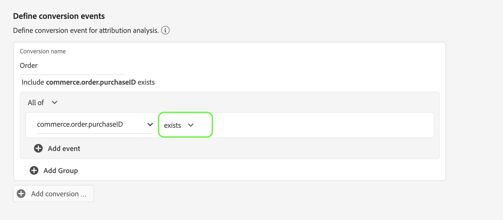

# Guide de l’interface utilisateur Attribution AI

Dans le cadre d’Intelligent Services, Attribution AI est un service d’attribution algorithmique à plusieurs canaux qui calcule l’influence et l’impact incrémentiel des interactions des clients par rapport à des résultats spécifiés. Grâce à Attribution AI, les marketeurs peuvent mesurer et optimiser les dépenses publicitaires et marketing en comprenant l’impact de chaque interaction client sur chaque phase du parcours des clients.

Ce document sert de guide pour interagir avec Attribution AI dans l’interface utilisateur d’Intelligent Services.

## Créer modèle

Dans l’interface utilisateur de [!DNL Adobe Experience Platform], sélectionnez **[!UICONTROL Services]** dans le volet de navigation de gauche. Le navigateur **[!UICONTROL Services]** apparaît et affiche les services intelligents Adobe disponibles. Dans le conteneur pour Attribution AI, sélectionnez **[!UICONTROL Ouvrir]**.

La page de service d’Attribution AI s’affiche. Cette page répertorie les modèles de service d’Attribution AI et affiche des informations les concernant, notamment le nom du modèle, les événements de conversion, la fréquence d’exécution du modèle et l’état de la dernière mise à jour.

Vous trouverez la mesure **[!UICONTROL Nombre total d’événements de conversion notés]** située dans le coin inférieur droit du conteneur **[!UICONTROL Créer un modèle]** . Cette mesure effectue le suivi du nombre total d’événements de conversion marqués par Attribution AI pour l’année civile en cours, y compris tous les environnements de test et les modèles de service supprimés.

Les modèles de service peuvent être modifiés, clonés et supprimés à l’aide des commandes situées dans la partie droite de l’interface utilisateur. Pour afficher ces commandes, sélectionnez un modèle parmi vos **[!UICONTROL modèles de service]** existants. Les contrôles contiennent les informations suivantes :

- **[!UICONTROL Modifier]** : la sélection de **[!UICONTROL Modifier]** vous permet de modifier un modèle de service existant. Vous pouvez modifier le nom, la description, l’état, la fréquence de notation du modèle et d’autres colonnes de jeux de données de score.
- **[!UICONTROL Clone]** : la sélection de **[!UICONTROL Clone]** copie le modèle de service sélectionné. Vous pouvez ensuite modifier le workflow pour effectuer des ajustements mineurs et le renommer en nouveau modèle.
- **[!UICONTROL Supprimer]** : vous pouvez supprimer un modèle de service, y compris les exécutions historiques. Le jeu de données de sortie correspondant sera supprimé de Platform. Toutefois, les scores synchronisés dans Real-time Customer Profile ne sont pas supprimés.
- **[!UICONTROL Source de données]** : lien vers le jeu de données utilisé. Si plusieurs jeux de données sont utilisés par Attribution AI, &quot;Multiple&quot; suivi du nombre de jeux de données s’affiche. Lorsque vous sélectionnez l’hyperlien, la fenêtre contextuelle d’aperçu des jeux de données s’affiche.
- **[!UICONTROL Détails de la dernière exécution]** : s’affiche uniquement en cas d’échec d’une exécution. Vous trouverez ici des informations sur les raisons pour lesquelles l’exécution a échoué, telles que les codes d’erreur.

- **[!UICONTROL Événements de conversion]** : aperçu rapide des événements de conversion configurés pour ce modèle.
- **[!UICONTROL Intervalle de recherche en amont]** : période que vous avez définie indiquant le nombre de jours avant l’inclusion des points de contact de l’événement de conversion.
- **[!UICONTROL Points de contact]** : liste de tous les points de contact que vous avez définis lors de la création de ce modèle.

Sélectionnez **[!UICONTROL Créer un modèle]** pour commencer.

Ensuite, la page de configuration d’Attribution AI s’affiche, où vous pouvez fournir un nom et une description facultative de votre modèle de service.

## Sélectionner les données {#select-data}

<!-- https://www.adobe.com/go/aai-select-data -->

Par conception, Attribution AI peut utiliser les données Adobe Analytics, Evénement d’expérience et Événement d’expérience client pour calculer les scores d’attribution. Lors de la sélection d’un jeu de données, seuls les jeux compatibles avec Attribution AI sont répertoriés. Pour sélectionner un jeu de données, sélectionnez le symbole (**+**) en regard de son nom ou cochez la case pour ajouter plusieurs jeux de données à la fois. Vous pouvez également utiliser l’option de recherche pour trouver rapidement les jeux de données qui vous intéressent.

Après avoir sélectionné les jeux de données que vous souhaitez utiliser, cliquez sur le bouton **[!UICONTROL Ajouter]** pour ajouter les jeux de données au volet d’aperçu du jeu de données.

La sélection de l’icône d’information  en regard d’un jeu de données ouvre la fenêtre contextuelle d’aperçu du jeu de données.

L’aperçu du jeu de données contient des données telles que l’heure de la dernière mise à jour, le schéma source et un aperçu des dix premières colonnes.

Sélectionnez **[!UICONTROL Enregistrer]** pour enregistrer vos brouillons au fur et à mesure que vous vous déplacez dans le workflow. Vous pouvez également enregistrer les configurations de modèle de brouillon et passer à l’étape suivante du workflow. Utilisez **[!UICONTROL Enregistrer et continuer]** pour créer et enregistrer des brouillons lors des configurations de modèle. Cette fonctionnalité vous permet de créer et d’enregistrer des brouillons de la configuration du modèle. Elle est particulièrement utile lorsque vous devez définir de nombreux champs dans le workflow de configuration.

### Complétude du jeu de données {#dataset-completeness}

<!-- https://www.adobe.com/go/aai-dataset-completeness -->

Dans l’aperçu du jeu de données, il y a une valeur en pourcentage d’exhaustivité du jeu de données. Cette valeur fournit un instantané du nombre de colonnes vides/nulles de votre jeu de données. Si un jeu de données contient de nombreuses valeurs manquantes et que ces valeurs sont capturées ailleurs, il est vivement recommandé d’inclure le jeu de données contenant les valeurs manquantes.

>[!NOTE]
>
>L’exhaustivité des jeux de données est calculée à l’aide de la période de formation maximale pour Attribution AI (un an). Cela signifie que les données de plus d’un an ne sont pas prises en compte lors de l’affichage de la valeur d’exhaustivité de votre jeu de données.

### Sélection d’une identité {#identity}

Vous pouvez désormais joindre plusieurs jeux de données les uns aux autres en fonction de la carte d’identité (champ). Vous devez sélectionner un type d’identité (également appelé &quot;espace de noms d’identité&quot;) et une valeur d’identité dans cet espace de noms. Si vous avez affecté plusieurs champs en tant qu’identité dans votre schéma sous le même espace de noms, toutes les valeurs d’identité attribuées apparaissent dans la liste déroulante d’identité précédée de l’espace de noms tel que `EMAIL (personalEmail.address)` ou `EMAIL (workEmail.address)`.

>[!IMPORTANT]
>
>Le même type d’identité (espace de noms) doit être utilisé pour chaque jeu de données sélectionné. Une coche verte s’affiche en regard du type d’identité dans la colonne d’identité pour indiquer que les jeux de données sont compatibles. Par exemple, lorsque vous utilisez l’espace de noms Phone et `mobilePhone.number` comme identifiant, tous les identifiants des jeux de données restants doivent contenir et utiliser l’espace de noms Phone.

Pour sélectionner une identité, sélectionnez la valeur soulignée située dans la colonne d’identité. La fenêtre contextuelle Sélectionner une identité s’affiche.

Dans le cas où plusieurs identités sont disponibles dans un espace de noms, veillez à sélectionner le champ d’identité approprié à votre cas d’utilisation. Par exemple, deux identités de courrier électronique sont disponibles dans l’espace de noms de courrier électronique, un courrier électronique professionnel et un courrier électronique personnel. Selon le cas d’utilisation, un email personnel est plus susceptible d’être renseigné et plus utile dans les prédictions individuelles. Cela signifie que vous devez sélectionner `EMAIL (personalEmail.address)` comme identité.

>[!NOTE]
>
> S’il n’existe aucun type d’identité valide (espace de noms) pour un jeu de données, vous devez définir une identité principale et l’affecter à un espace de noms d’identité à l’aide de l’ [éditeur de schéma](../../xdm/schema/composition.md#identity). Pour en savoir plus sur les espaces de noms et les identités, consultez la documentation [Espaces de noms Identity Service](../../identity-service/features/namespaces.md) .

## Mappage du canal média et des champs de campagne {#aai-mapping}

<!-- https://www.adobe.com/go/aai-mapping -->

Une fois que vous avez terminé de sélectionner et d’ajouter des jeux de données, l’étape de configuration **Map** s’affiche. Attribution AI exige que vous mappez le champ Canal multimédia pour chaque jeu de données sélectionné à l’étape précédente. En effet, sans le mappage du canal Media entre les jeux de données, les informations dérivées d’Attribution AI peuvent ne pas s’afficher correctement, ce qui rend la page d’informations difficile à interpréter. Bien que seul le canal Média soit requis, il est vivement recommandé de mapper certains des champs facultatifs tels que l’action Média, le nom de la campagne, le groupe Campagne et la balise Campagne. Cela permet à Attribution AI de fournir des informations plus claires et des résultats optimaux.

## Définition des événements {#define-events}

<!-- https://www.adobe.com/go/aai-define-events -->

Il existe trois types différents de données d’entrée utilisées pour définir les événements :

- **Événements de conversion :** objectifs professionnels qui identifient l’impact des activités marketing, comme les commandes e-commerce, les achats en magasin et les visites sur le site web.
- **Intervalle de recherche en amont :** fournit une période indiquant le nombre de jours avant l’inclusion des points de contact de l’événement de conversion.
- **Points de contact :** événements marketing au niveau des bénéficiaires, des individus ou des cookies utilisés pour évaluer l’impact numérique ou basé sur les recettes des conversions.

### Définition des événements de conversion {#define-conversion-events}

Pour définir un événement de conversion, vous devez donner un nom à l’événement et sélectionner le type d’événement en sélectionnant le jeu de données et le champ dans le menu déroulant **Sélectionner un jeu de données et un champ** .

Une fois qu’un événement est sélectionné, un nouveau menu déroulant s’affiche à sa droite. Le second menu déroulant est utilisé pour fournir davantage de contexte à votre événement grâce à l’utilisation des opérations. Pour cet événement de conversion, l’opération par défaut *exists* est utilisée.

>[!NOTE]
>
>Une chaîne sous votre *nom de conversion* est mise à jour lorsque vous définissez votre événement.

Vous pouvez ensuite sélectionner un jeu de données combiné généré en combinant tous les jeux de données d’entrée à l’étape précédente. Vous pouvez également sélectionner une colonne en fonction de jeux de données individuels dans le menu déroulant **Sélectionner un jeu de données et un champ** .

Les boutons **[!UICONTROL Ajouter un événement]** et **[!UICONTROL Ajouter un groupe]** permettent de définir plus précisément votre conversion. En fonction de la conversion que vous définissez, vous devrez peut-être utiliser les boutons **[!UICONTROL Ajouter un événement]** et **[!UICONTROL Ajouter un groupe]** pour fournir davantage de contexte.

Sélectionner **[!UICONTROL Ajouter un événement]** crée des champs supplémentaires qui peuvent être remplis en utilisant la même méthode que celle décrite ci-dessus. Cela permet d’ajouter une instruction ET à la définition de chaîne sous le nom de conversion. Sélectionnez le **x** pour supprimer un événement qui a été ajouté.

Sélectionner **[!UICONTROL Ajouter un groupe]** donne la possibilité de créer des champs supplémentaires distincts de l’original. Avec l’ajout de groupes, un bouton bleu *Et* apparaît. Sélectionner **And** permet de modifier le paramètre pour qu’il contienne &quot;Or&quot;. « Ou » est utilisé pour définir plusieurs chemins de conversion performants. « Et » prolonge le chemin de conversion pour inclure des conditions supplémentaires.

Si vous avez besoin de plusieurs conversions, sélectionnez **Ajouter une conversion** pour créer une carte de conversion. Vous pouvez répéter la procédure ci-dessus pour définir plusieurs conversions.

### Définition de l’intervalle de recherche en amont {#lookback-window}

Une fois la conversion définie, vous devez confirmer votre intervalle de recherche en amont. À l’aide des touches fléchées ou en sélectionnant la valeur par défaut (56), indiquez le nombre de jours avant votre événement de conversion à partir duquel vous souhaitez inclure des points de contact. Les points de contact sont définis à l’étape suivante.

### Définition des points de contact

La définition des points de contact suit un workflow similaire à celui de la [définition des conversions](#define-conversion-events). Dans un premier temps, vous devez nommer votre point de contact et sélectionner une valeur de point de contact dans le menu déroulant *Saisir le nom du champ*. Une fois sélectionné, le menu déroulant de l’opérateur s’affiche avec la valeur par défaut « exists ». Sélectionnez la liste déroulante pour afficher une liste d’opérateurs.

Pour ce point de contact, sélectionnez **equals**.

Une fois qu’un opérateur pour un point de contact est sélectionné, *Saisir la valeur du champ* est mis à disposition. Les valeurs du menu déroulant pour *Saisir la valeur du champ* reposent sur l’opérateur et la valeur du point de contact que vous avez sélectionnés précédemment. Si une valeur n’apparaît pas dans le menu déroulant, vous pouvez la saisir manuellement. Sélectionnez la liste déroulante et sélectionnez **CLICK**.

>[!NOTE]
>
>Les opérateurs &quot;exists&quot; et &quot;not exists&quot; ne sont pas associés à des valeurs de champ.

Les boutons **Ajouter un événement** et **Ajouter un groupe** permettent de définir plus précisément votre point de contact. En raison de la nature complexe des points de contact, il n’est pas rare d’avoir plusieurs événements et groupes pour un seul point de contact.

Lorsque cette option est sélectionnée, **Ajouter un événement** permet d’ajouter des champs supplémentaires. sélectionnez le **x** pour supprimer un événement qui a été ajouté.

En sélectionnant **Ajouter un groupe**, vous avez la possibilité de créer des champs supplémentaires distincts de l’original. Avec l’ajout de groupes, un bouton bleu *Et* apparaît. Sélectionnez **And** pour modifier le paramètre. Le nouveau paramètre &quot;Or&quot; est utilisé pour définir plusieurs chemins performants. Ce point de contact particulier n’a qu’un seul chemin performant. Par conséquent, « Ou » n’est pas nécessaire.

>[!NOTE]
>
>Utilisez la chaîne sous *Touchpoint name* pour un aperçu rapide de votre point de contact. Notez que la chaîne correspond au nom du point de contact.

Vous pouvez ajouter d’autres points de contact en sélectionnant **Ajouter un point de contact** et en répétant le processus ci-dessus.

Une fois que vous avez défini tous les points de contact nécessaires, faites défiler la page vers le haut et sélectionnez **Suivant** dans le coin supérieur droit pour passer à l’étape finale.

## Configuration de la formation et de la notation avancées

La dernière page d’Attribution AI est la page **[!UICONTROL Avancé]** utilisée pour configurer la formation et la notation.

### Planification de la formation

À l’aide du *planning*, vous pouvez sélectionner le jour et l’heure de la semaine où vous souhaitez que la notation soit effectuée.

Sélectionnez la liste déroulante sous *Fréquence de notation* pour choisir entre une notation quotidienne, hebdomadaire et mensuelle. Ensuite, sélectionnez les jours de la semaine où vous souhaitez que la notation soit effectuée. Vous pouvez sélectionner plusieurs jours. Si vous sélectionnez à nouveau le même jour, il est désélectionné.

Pour modifier l’heure de la journée où vous souhaitez que la notation soit effectuée, cliquez sur l’icône de l’horloge. Dans la nouvelle fenêtre qui s’affiche, saisissez l’heure de la journée à laquelle vous souhaitez que la notation soit effectuée. Sélectionnez en dehors de la superposition pour la fermer.

>[!NOTE]
>
>Chaque processus de notation peut prendre jusqu’à 24 heures.

### Colonnes de jeu de données de score supplémentaires (facultatif)

Par défaut, un jeu de données de score est créé pour chaque modèle de service dans un schéma standard. Vous pouvez choisir d’ajouter des colonnes supplémentaires en fonction de vos configurations Événement de conversion et Point de contact à la sortie du jeu de données de notation. Commencez par sélectionner des colonnes dans votre jeu de données d’entrée, puis faites-les glisser et déposez-les pour modifier l’ordre en maintenant le bouton gauche de la souris enfoncé sur l’icône de hamburger.

### Modélisation basée sur la région (facultative) {#region-based-modeling-optional}

Le comportement de vos clients peut varier considérablement selon le pays et la région géographique. Pour les entreprises mondiales, l’utilisation de modèles basés sur les pays ou les régions peut accroître la précision de l’attribution. Chaque région ajoutée crée un nouveau modèle avec les données de cette région.

Pour définir une nouvelle région, commencez par sélectionner **[!UICONTROL Ajouter une région]**. Dans le conteneur qui s’affiche, attribuez un nom à la région. Une seule valeur (« placeContext.geo.countryCode ») s’affiche dans le menu déroulant **[!UICONTROL Saisir le nom du champ]**. Sélectionnez cette valeur.

Sélectionnez ensuite un opérateur.

Pour finir, saisissez le code pays dans le menu déroulant **[!UICONTROL Saisir la valeur du champ]**.

>[!NOTE]
>
>Les codes pays comportent deux caractères. Vous trouverez ci-contre une liste complète de ces codes [ISO 3166-1 alpha-2](https://datahub.io/core/country-list).

### Période de formation {#training-window}

Pour vous assurer d’obtenir le modèle le plus précis possible, il est important de former votre modèle avec des données historiques qui représentent votre entreprise. Par défaut, le modèle est formé à l’aide de 2 trimestres (6 mois) de données d’événements de conversion. Sélectionnez le menu déroulant pour modifier la valeur par défaut. Vous pouvez opter pour une formation basée sur un à quatre trimestres de données (3 à 12 mois).

>[!NOTE]
>
>Une période de formation plus courte est plus sensible aux tendances récentes, tandis qu’une période de formation plus longue crée un modèle plus robuste et est moins sensible aux tendances récentes.

Une fois que vous avez sélectionné votre fenêtre de formation, sélectionnez **[!UICONTROL Terminer]** dans le coin supérieur droit. Prévoyez un certain temps pour le traitement des données. Une fois cette opération terminée, une boîte de dialogue s’affiche, confirmant que la configuration de l’instance est terminée. Sélectionnez **[!UICONTROL Ok]** pour être redirigé vers la page **[!UICONTROL Instances de service]** où vous pouvez voir votre instance de service.

## Étapes suivantes

En suivant ce tutoriel, vous avez réussi à créer une instance de service dans Attribution AI. Une fois que la notation de l’instance est terminée (compter jusqu’à 24 heures), vous êtes prêt à [découvrir les insights Attribution AI](./discover-insights.md). De plus, si vous souhaitez télécharger les résultats de la notation, consultez la documentation [ sur le téléchargement des scores](./download-scores.md) .

## Ressources supplémentaires

La vidéo suivante présente un processus de bout en bout pour créer une instance dans Attribution AI.

>[!VIDEO](https://video.tv.adobe.com/v/32668?learn=on&quality=12)
