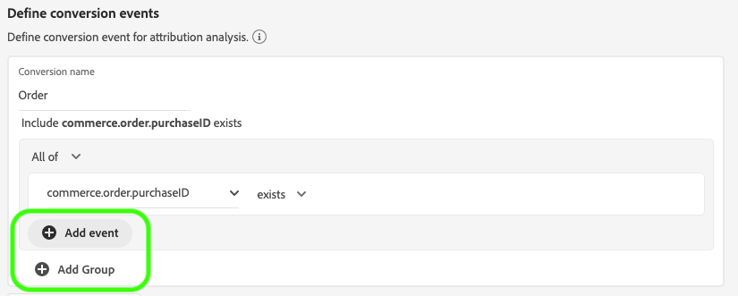

# Guide de l’utilisateur de l’API d’attribution

Attribution AI, dans le cadre d’Intelligent Services, est un service d’attribution algorithmique à plusieurs qui calcule l’influence et l’impact incrémentiel des interactions client par rapport à des résultats spécifiés. Grâce à l’API d’attribution, les marketeurs peuvent mesurer et optimiser les dépenses publicitaires et marketing en comprenant l’impact de chaque interaction client sur chaque phase du parcours des clients.

Ce sert de guide pour l’interaction avec l’API d’attribution dans l’interface utilisateur des services intelligents.

## Création d’une instance

In the Adobe Experience Platform UI, click **Services** in the left navigation. Le navigateur *Services* s’affiche et affiche les services intelligents Adobe disponibles. In the container for Attribution AI, click **Open**.

La page du service AI d’attribution s’affiche. Cette page  les instances de service d’attribution AI et affiche des informations les concernant, notamment le nom de l’instance, le de conversion, la fréquence d’exécution de l’instance et l’état de la dernière mise à jour. Cliquez sur **Créer une instance** pour commencer.

Ensuite, la page de configuration de l’API d’attribution s’affiche, dans laquelle vous pouvez fournir des informations de base et spécifier un jeu de données pour l’instance.

### Nommer l’instance

Sous Informations ** de base, indiquez un nom et une description facultative pour votre instance de service.

### Sélectionner un jeu de données

Après avoir renseigné les informations de base, cliquez sur la liste déroulante **Sélectionner un jeu de données** pour sélectionner votre jeu de données. Le jeu de données est utilisé pour former le modèle et marquer les données suivantes qu’il produit. Lors de la sélection d’un jeu de données dans le sélecteur déroulant, seules les données compatibles avec l’attribut AI et conformes au du modèle de données d’expérience (XDM) sont répertoriées. Une fois un jeu de données sélectionné, cliquez sur **Suivant** dans le coin supérieur droit pour accéder à la page de définition des  de.

## Définition des  de

Il existe trois types différents de données d’entrée utilisées pour définir des  de :

- **de conversion :** Objectifs commerciaux qui identifient l’impact des  marketing , tels que les commandes de commerce électronique, les achats en magasin et les visites sur le site Web.
- **Fenêtre de recherche :** Fournit une période indiquant le nombre de jours avant l’inclusion des points de contact  du de conversion.
- **Points de contact :** marketing, individuel et ou au niveau des cookies utilisé pour évaluer l’impact numérique ou basé sur les recettes des conversions.

### Définir des  de conversion

Pour définir un  de conversion, vous devez donner un nom au  et sélectionner l’ en cliquant sur le menu déroulant **Entrer le nom** de champ.

Une fois un  sélectionné, une nouvelle liste déroulante s’affiche à droite. La deuxième liste déroulante est utilisée pour fournir un contexte plus détaillé à votre grâce à l’utilisation des opérations. Pour ce de conversion, l’opération par défaut *existe* .

>[!NOTE] Une chaîne sous le nom *de* conversion est mise à jour au fur et à mesure que vous définissez votre  de.

Les boutons de Ajouter de *et de groupe* ** sont utilisés pour définir plus précisément votre conversion. En fonction de la conversion que vous définissez, vous devrez peut-être utiliser les boutons de Ajouter de *et de groupe* ** pour fournir un contexte plus détaillé.

Cliquer sur **Ajouter** crée des champs supplémentaires qui peuvent être remplis à l’aide de la même méthode que celle décrite ci-dessus. Cela permet d’ajouter une instruction *AND* à la définition de chaîne sous le nom *de* conversion. Cliquez sur le **x** pour supprimer un  qui a été ajouté.

Cliquer sur Groupe **Ajouter** permet de créer des champs supplémentaires distincts de l’original. Avec l’ajout de groupes, un bouton bleu *et* apparaît. Cliquer sur **Et** permet de modifier le paramètre pour qu’il contienne &quot;Ou&quot;. &quot;Ou&quot; est utilisé pour définir plusieurs chemins de conversion performants. &quot;Et&quot; étend le chemin de conversion pour inclure d’autres conditions.

Si vous avez besoin de plusieurs conversions, cliquez sur **Ajouter conversion** pour créer une nouvelle carte de conversion. Vous pouvez répéter le processus ci-dessus pour définir plusieurs conversions.

### Définir la fenêtre de recherche

Une fois la conversion définie, vous devez confirmer votre fenêtre de recherche. A l’aide des touches fléchées ou en cliquant sur la valeur par défaut (56), indiquez le nombre de jours avant la date de votre de conversion  vous souhaitez inclure des points de contact. Les points de contact sont définis à l’étape suivante.

### Définir des points de contact

La définition des points de contact suit un processus similaire à celui de la [définition des conversions](#define-conversion-events). Au départ, vous devez nommer votre point de contact et sélectionner une valeur de point de contact dans le menu déroulant *Saisir le nom* du champ. Une fois sélectionnée, la liste déroulante de l’opérateur s’affiche avec la valeur par défaut &quot;existe&quot;. Cliquez sur la liste déroulante pour afficher un  d’opérateurs.

Pour l’utilisation de ce point de contact, sélectionnez **est égal**.

Une fois qu’un opérateur pour un point de contact est sélectionné, *la valeur* de champ est rendue disponible. Les valeurs de la liste déroulante *Saisir la valeur* du champ sont renseignées en fonction de l’opérateur et de la valeur du point de contact que vous avez sélectionnés précédemment. Si une valeur n’est pas renseignée dans la liste déroulante, vous pouvez la saisir manuellement. Cliquez sur la liste déroulante et sélectionnez **CLIQUEZ**.

>[!NOTE] Les opérateurs &quot;existe&quot; et &quot;n’existe pas&quot; ne sont associés à aucune valeur de champ.

Les boutons de Ajouter de *et de groupe* ** sont utilisés pour définir plus précisément votre point de contact. En raison de la nature complexe qui entoure les points de contact, il n’est pas rare d’avoir plusieurs  et groupes pour un seul point de contact.

Lorsque vous cliquez dessus, **Ajouter** permet d’ajouter des champs supplémentaires. Cliquez sur le **x** pour supprimer un  qui a été ajouté.

Cliquer sur **Ajouter groupe** vous donne la possibilité de créer des champs supplémentaires distincts de l’original. Avec l’ajout de groupes, un bouton bleu *et* apparaît. Cliquez sur **Et** pour modifier le paramètre, le nouveau paramètre &quot;Ou&quot; est utilisé pour définir plusieurs chemins performants. Ce point de contact particulier n’a qu’un seul chemin réussi, par conséquent &quot;Ou&quot; n’est pas nécessaire.

>[!NOTE] Utilisez la chaîne située sous le nom *du* point de contact pour obtenir un aperçu rapide de votre point de contact. Notez que la chaîne correspond au nom du point de contact.

Vous pouvez ajouter d’autres points de contact en cliquant sur **Ajouter point de contact** et en répétant le processus ci-dessus.

Une fois que vous avez terminé de définir tous les points de contact nécessaires, faites défiler la page vers le haut et cliquez sur **Suivant** dans le coin supérieur droit pour passer à l’étape finale.

## Formation avancée et configuration des scores

La dernière page de l’attribut AI est la page *Avancé* utilisée pour configurer la formation et la notation.

### Planifier la formation

En utilisant le *calendrier*, vous pouvez sélectionner un jour et une heure de la semaine pour lesquels vous souhaitez que le score ait lieu.

Cliquez sur la liste déroulante sous Fréquence *de* score pour sélectionner une note quotidienne, hebdomadaire et mensuelle. Ensuite, sélectionnez les jours de la semaine où vous souhaitez que le score ait lieu. Vous pouvez sélectionner plusieurs jours. Cliquez une seconde fois sur un jour pour le désélectionner.

Pour modifier l’heure de la journée où vous souhaitez que le score ait lieu, cliquez sur l’icône de l’horloge. Dans la nouvelle incrustation qui s’affiche, entrez l’heure de la journée à laquelle vous souhaitez que le score ait lieu. Cliquez en dehors du recouvrement pour le fermer.

>[!NOTE] Chaque processus de notation peut prendre jusqu’à 24 heures.

### Modélisation basée sur la région (facultatif)

Les comportements de vos clients peuvent différer considérablement selon le pays et la région géographique. Pour les entreprises mondiales, l&#39;utilisation de modèles basés sur les pays ou les régions peut accroître la précision de l&#39;attribution. Chaque région ajoutée crée un nouveau modèle avec les données de cette région.

Pour définir une nouvelle région,  en cliquant sur **Ajouter région**. Dans le  qui s’affiche, attribuez un nom à la région. Une seule valeur (&quot;placeContext.geo.countryCode&quot;) est renseignée dans la liste déroulante *Entrer le nom* de champ. Sélectionnez cette valeur.

Sélectionnez ensuite un opérateur.

Enfin, saisissez le code du pays dans la liste déroulante *Saisir la valeur* du champ.

>[!NOTE] Les codes pays comportent deux caractères. Vous trouverez ici une  complète sur [ISO 3166-1 alpha-2](https://datahub.io/core/country-list).

### Fenêtre Formation

Pour vous assurer d&#39;obtenir le modèle le plus précis possible, il est important de former votre modèle aux données historiques qui représentent votre entreprise. Par défaut, le modèle est formé à l’aide de 2 trimestres (6 mois) de données. Sélectionnez la liste déroulante pour modifier la valeur par défaut. Vous pouvez choisir de vous entraîner avec un à quatre quarts de données (3 à 12 mois).

>[!NOTE] Une fenêtre de formation plus courte est plus sensible aux tendances récentes, tandis qu’une fenêtre de formation plus longue crée un modèle plus robuste et est moins sensible aux tendances récentes.

Une fois la fenêtre de formation sélectionnée, cliquez sur **Terminer** dans le coin supérieur droit. Patientez un certain temps pour que les données soient traitées. Une fois l’instance terminée, une boîte de dialogue contextuelle s’affiche, confirmant que la configuration de l’instance est terminée. Cliquez sur **OK** pour être redirigé vers la page des instances *de* service où vous pouvez voir votre instance de service.

## Étapes suivantes

En suivant ce didacticiel, vous avez créé une instance de service dans Attribution AI. Une fois que l’instance a terminé son score (jusqu’à 24 heures), vous êtes prêt à [découvrir les informations](./discover-insights.md)sur l’API d’attribution. De plus, si vous souhaitez télécharger vos résultats de score, consultez la documentation [téléchargeant les scores](./download-scores.md) bruts.