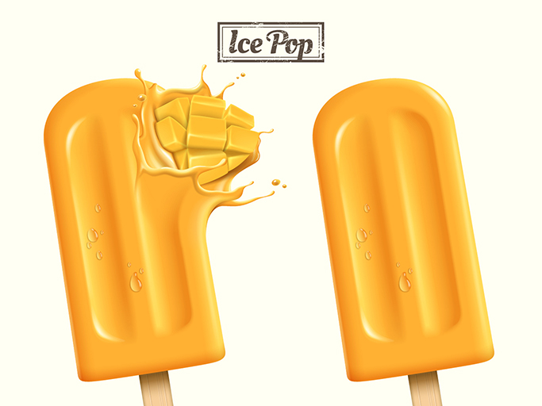

# Balisage des couleurs

Le service de balisage des couleurs, lorsqu’il reçoit une image, peut calculer un histogramme de couleurs de pixels et les trier en fonction des couleurs dominantes dans des compartiments. Les couleurs des pixels de l’image sont regroupées en 40 couleurs prédominantes représentatives du spectre de couleurs. Un histogramme de valeurs de couleurs est alors calculé parmi ces 40 couleurs. Le service possède deux variantes :

**Balisage des couleurs (image complète)**

Cette méthode extrait un histogramme des couleurs sur l’ensemble de l’image.

**Balisage des couleurs (avec masque)**

Cette méthode utilise un extracteur de premier plan basé sur le deep learning pour identifier les objets au premier plan. Une fois les objets de premier plan extraits, un histogramme est calculé sur les couleurs dominantes pour les régions de premier plan et d’arrière-plan, ainsi que pour l’image entière.

**Extraction de tons**

Outre les variantes mentionnées ci-dessus, vous pouvez configurer le service pour récupérer un histogramme de tons pour :

- L’image globale (lors de l’utilisation d’une variante d’image complète)
- L’image globale et les régions de premier plan et d’arrière-plan (lors de l’utilisation de la variante avec le masquage)

L&#39;image suivante a été utilisée dans l&#39;exemple illustré dans ce document :



**Format d’API**

```http
POST /services/v2/predict
```

**Requête - variante d’image complète**

L’exemple de requête suivant utilise la méthode full-image pour le balisage des couleurs et extrait les couleurs d’une image en fonction des paramètres d’entrée fournis dans la payload. Pour plus d’informations sur les paramètres d’entrée affichés, consultez le tableau ci-dessous l’exemple de payload.

```SHELL
curl -w'\n' -i -X POST https://sensei.adobe.io/services/v2/predict \
-H 'Prefer: respond-async, wait=59' \
-H "x-api-key: $API_KEY" \
-H "content-type: multipart/form-data" \
-H "authorization: Bearer $API_TOKEN" \
-F 'contentAnalyzerRequests={
  "sensei:name": "Feature:autocrop:Service-af865523d46547e2b17fdf9b38e32a72",
  "sensei:invocation_mode": "synchronous",
  "sensei:invocation_batch": false,
  "sensei:engines": [
    {
      "sensei:execution_info": {
        "sensei:engine": "Feature:autocrop:Service-af865523d46547e2b17fdf9b38e32a72"
      },
      "sensei:inputs": {
        "documents": [{
            "sensei:multipart_field_name": "infile_1",
            "dc:format": "image/jpg"
          }]
      },
      "sensei:params": {
        "top_n": 5,
        "min_coverage": 0.005      
      },
      "sensei:outputs":{
        "result" : {
          "sensei:multipart_field_name" : "result",
          "dc:format": "application/json"
        }
      }
    }
  ]
}' \
-F 'infile_1=@1431RDMJANELLERAWJACKE_2.jpg'
```

**Réponse - variante d’image complète**

Une réponse réussie renvoie les détails des couleurs extraites. Chaque couleur est représentée par une touche `feature_value`, qui contient les informations suivantes :

- Un nom de couleur
- Pourcentage de cette couleur par rapport à l’image
- Valeur RGB de la couleur

`"White":{"coverage":0.5834,"rgb":{"red":254,"green":254,"blue":243}}` signifie que la couleur trouvée est le blanc, qui se trouve dans 58,34 % de l’image, et a une valeur RGB moyenne de 254, 254, 243.

```json
{
    "statuses": [{
        "sensei:engine": "Feature:autocrop:Service-af865523d46547e2b17fdf9b38e32a72",
        "invocations": [{
            "sensei:outputs": {
                "result": {
                    "sensei:multipart_field_name": "result",
                    "dc:format": "application/json"
                }
            },
            "message": null,
            "status": "200"
        }]
    }],
    "request_id": "bfpzaJxKDxtgxpjUj5QDrN1jasjUw2RM"
}  
 
[{
    "overall": {
        "colors": {
            "White": {
                "coverage": 0.5834,
                "rgb": {
                    "red": 254,
                    "green": 254,
                    "blue": 243
                }
            },
            "Orange": {
                "coverage": 0.254,
                "rgb": {
                    "red": 249,
                    "green": 165,
                    "blue": 45
                }
            },
            "Gold": {
                "coverage": 0.0817,
                "rgb": {
                    "red": 253,
                    "green": 188,
                    "blue": 58
                }
            },
            "Mustard": {
                "coverage": 0.0727,
                "rgb": {
                    "red": 253,
                    "green": 207,
                    "blue": 84
                }
            },
            "Cream": {
                "coverage": 0.0082,
                "rgb": {
                    "red": 253,
                    "green": 236,
                    "blue": 174
                }
            }
        }
    }
}]
```

Notez que la couleur du résultat est ici extraite dans la région d’image « globale ».

**Requête - variante d’image masquée**

L’exemple de requête suivant utilise la méthode de masquage pour le balisage des couleurs. Cette fonction est activée en définissant le paramètre `enable_mask` sur `true` dans la requête.

```SHELL
curl -w'\n' -i -X POST https://sensei.adobe.io/services/v2/predict \
-H 'Prefer: respond-async, wait=59' \
-H "x-api-key: $API_KEY" \
-H "content-type: multipart/form-data" \
-H "authorization: Bearer $API_TOKEN" \
-F 'contentAnalyzerRequests={
  "sensei:name": "Feature:autocrop:Service-af865523d46547e2b17fdf9b38e32a72",
  "sensei:invocation_mode": "synchronous",
  "sensei:invocation_batch": false,
  "sensei:engines": [
    {
      "sensei:execution_info": {
        "sensei:engine": "Feature:autocrop:Service-af865523d46547e2b17fdf9b38e32a72"
      },
      "sensei:inputs": {
        "documents": [{
            "sensei:multipart_field_name": "infile_1",
            "dc:format": "image/jpg"
          }]
      },
      "sensei:params": {
        "top_n": 5,
        "min_coverage": 0.005,
        "enable_mask": true,
        "retrieve_tone": true     
      },
      "sensei:outputs":{
        "result" : {
          "sensei:multipart_field_name" : "result",
          "dc:format": "application/json"
        }
      }
    }
  ]
}' \
-F 'infile_1=@1431RDMJANELLERAWJACKE_2.jpg'
```

>[!NOTE]
>
>En outre, le paramètre `retrieve_tone` est également défini sur `true` dans la requête ci-dessus. Cela nous permet de récupérer un histogramme de distribution des tons sur les tons chauds, neutres et froids dans les régions globales, de premier plan et d’arrière-plan de l’image.

**Réponse - variante d’image masquée**

```json
{
    "statuses": [{
        "sensei:engine": "Feature:autocrop:Service-af865523d46547e2b17fdf9b38e32a72",
        "invocations": [{
            "sensei:outputs": {
                "result": {
                    "sensei:multipart_field_name": "result",
                    "dc:format": "application/json"
                }
            },
            "message": null,
            "status": "200"
        }]
    }],
    "request_id": "gpeCyJsrJvOWd94WwZOyPBPrKi2BQyla"
}  
 
 
[{
    "overall": {
        "colors": {
            "White": {
                "coverage": 0.5834,
                "rgb": {
                    "red": 254,
                    "green": 254,
                    "blue": 243
                }
            },
            "Orange": {
                "coverage": 0.254,
                "rgb": {
                    "red": 249,
                    "green": 165,
                    "blue": 45
                }
            },
            "Gold": {
                "coverage": 0.0817,
                "rgb": {
                    "red": 253,
                    "green": 188,
                    "blue": 58
                }
            },
            "Mustard": {
                "coverage": 0.0727,
                "rgb": {
                    "red": 253,
                    "green": 207,
                    "blue": 84
                }
            },
            "Cream": {
                "coverage": 0.0082,
                "rgb": {
                    "red": 253,
                    "green": 236,
                    "blue": 174
                }
            }
        },
        "tones": {
            "warm": 0.4084,
            "neutral": 0.5916,
            "cool": 0
        }
    },
    "foreground": {
        "colors": {
            "Orange": {
                "coverage": 0.6022,
                "rgb": {
                    "red": 249,
                    "green": 165,
                    "blue": 45
                }
            },
            "Gold": {
                "coverage": 0.1935,
                "rgb": {
                    "red": 253,
                    "green": 188,
                    "blue": 58
                }
            },
            "Mustard": {
                "coverage": 0.1722,
                "rgb": {
                    "red": 253,
                    "green": 207,
                    "blue": 84
                }
            },
            "Cream": {
                "coverage": 0.0173,
                "rgb": {
                    "red": 253,
                    "green": 235,
                    "blue": 170
                }
            },
            "Yellow": {
                "coverage": 0.0148,
                "rgb": {
                    "red": 254,
                    "green": 229,
                    "blue": 117
                }
            }
        },
        "tones": {
            "warm": 0.9827,
            "neutral": 0.0173,
            "cool": 0
        }
    },
    "background": {
        "colors": {
            "White": {
                "coverage": 0.9923,
                "rgb": {
                    "red": 254,
                    "green": 254,
                    "blue": 243
                }
            },
            "Dark_Brown": {
                "coverage": 0.0077,
                "rgb": {
                    "red": 83,
                    "green": 68,
                    "blue": 57
                }
            }
        },
        "tones": {
            "warm": 0,
            "neutral": 1.0,
            "cool": 0
        }
    }
}]
```

Outre les couleurs de l’image globale, vous pouvez désormais voir les couleurs des régions de premier plan et d’arrière-plan. Comme la récupération de tonalité est activée pour chacune des régions ci-dessus, vous pouvez également récupérer l’histogramme d’une tonalité.

**Paramètres d’entrée**

| Nom | Type de données | Obligatoire | Par défaut | Valeurs | Description |
| --- | --- | --- | --- | --- | --- |
| `documents` | tableau (Document-Object) | Oui | - | Voir ci-dessous | Liste d’éléments JSON avec chaque élément de la liste représentant un document. |
| `top_n` | nombre | Non | 0 | Nombre entier non négatif | Nombre de résultats à retourner. 0, pour renvoyer tous les résultats. Utilisé conjointement avec le seuil, le nombre de résultats renvoyés est inférieur à l’une des limites. |
| `min_coverage` | nombre | Non | 0,05 | Nombre réel | Seuil de couverture au-delà duquel les résultats doivent être renvoyés. Exclure le paramètre pour renvoyer tous les résultats. |
| `resize_image` | nombre | Non | True | Vrai/Faux | Permet de redimensionner l’image d’entrée ou non. Par défaut, les images sont redimensionnées à 320*320 pixels avant l’extraction des couleurs. À des fins de débogage, nous pouvons également autoriser le code à s’exécuter sur une image complète en définissant cette valeur sur `False`. |
| `enable_mask` | nombre | Non | False | Vrai/Faux | Active/Désactive l’extraction des couleurs |
| `retrieve_tone` | nombre | Non | False | Vrai/Faux | Active/Désactive l’extraction de tonalité |

**Objet document**

| Nom | Type de données | Obligatoire | Par défaut | Valeurs | Description |
| -----| --------- | -------- | ------- | ------ | ----------- |
| `repo:path` | chaîne | - | - | - | URL prédéfinie du document. |
| `sensei:repoType` | chaîne | - | - | HTTPS | Type de référentiel dans lequel l’image est stockée. |
| `sensei:multipart_field_name` | chaîne | - | - | - | Utilisez cette option lors de la transmission du fichier image en tant qu’argument multipartie au lieu d’utiliser des URL prédéfinies. |
| `dc:format` | chaîne | Oui | - | « image/jpg »,<br>« image/jpeg »,<br>« image/png »,<br>« image/tiff » | Le codage de l’image est vérifié par rapport aux types de codage d’entrée autorisés avant d’être traité. |