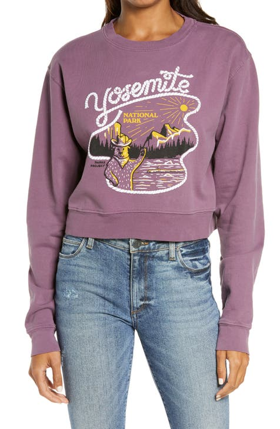

# Détection de texte et reconnaissance optique de caractères

Le service de reconnaissance optique de caractères (OCR) de présence de texte, lorsqu’il reçoit une image, peut indiquer si du texte est présent dans l’image. Si du texte est présent, la reconnaissance optique des caractères peut renvoyer le texte.

L’image suivante a été utilisée dans l’exemple de requête illustré dans ce document :



**Format d’API**

```http
POST /services/v2/predict
```

**Requête**

La requête suivante vérifie si du texte est présent en fonction de l’image d’entrée fournie dans la payload. Pour plus d’informations sur les paramètres d’entrée affichés, consultez le tableau ci-dessous l’exemple de payload.

Exécution avec une image intégrée :

```SHELL
curl -w'\n' -i -X POST https://sensei.adobe.io/services/v2/predict \
-H 'Prefer: respond-async, wait=59' \
-H "x-api-key: $API_KEY" \
-H "content-type: multipart/form-data" \
-H "authorization: Bearer $API_TOKEN" \
-F file=@sample_image.png \
-F 'contentAnalyzerRequests={
  "sensei:name": "Feature:cintel-object-detection:Service-b9ace8b348b6433e9e7d82371aa16690",
  "sensei:invocation_mode": "asynchronous",
  "sensei:invocation_batch": false,
  "sensei:engines": [
    {
      "sensei:execution_info": {
        "sensei:engine": "Feature:cintel-object-detection:Service-b9ace8b348b6433e9e7d82371aa16690"
      },
      "sensei:inputs": {
        "documents": [
        {
          "sensei:multipart_field_name": "file",
          "dc:format": "image/jpg"
        }
        ]
      },
      "sensei:params": {
        "correct_with_dictionary": true,
        "min_probability": 0.2,
        "min_relevance": 0.01,
        "filter_with_dictionary": true
      },
      "sensei:outputs":{
        "result" : {
          "sensei:multipart_field_name" : "result",
          "dc:format": "application/json"
        }
      }
    }
  ]
}'
```

**Réponse**

Une réponse réussie renvoie le texte détecté dans la liste de `tags` pour chaque image transmise dans la requête. S’il n’y a pas de texte dans une certaine image, `is_text_present` est 0 et `tags` est une liste vide.

[result0, result1, ...] : liste des réponses pour chaque document d’entrée. Chaque résultat est un dictionnaire avec des clés :

1. request_element_id : index correspondant au fichier d’entrée pour cette réponse, 0 pour la première image de la liste des documents de la requête, 1 pour la suivante, etc.
2. balises : liste des dictionnaires, chaque dictionnaire possède deux clés : texte, qui est un mot reconnu dans l’image, et pertinence, qui est calculée comme la fraction de la zone du cadre de sélection du texte extrait par rapport à l’image complète. 0,01 se traduirait par un texte occupant au moins 1 % de l’image.
3. is_text_present : 0 ou 1 selon la présence de texte dans l’image. Si la valeur de la variable tags est 0, la liste est vide.

```json
{
  "contentAnalyzerResponse": {
    "statuses": [
      {
        "sensei:engine": "Feature:cintel-object-detection:Service-b9ace8b348b6433e9e7d82371aa16690",
        "invocations": [
          {
            "sensei:outputs": {
              "result": {
                "sensei:multipart_field_name": "result",
                "dc:format": "application/json"
              }
            },
            "message": null,
            "status": "200"
          }
        ]
      }
    ],
    "request_id": "dttklFR7DPtMtEmjlRSx5BYP5WGg3tTx"
  },
  "result": [
    {
      "is_text_present": 1,
      "tags": [
        {
          "text": "yosemite",
          "relevance": 0.06
        }
      ],
      "request_element_id": 0
    }
  ]
}
```

**Requête**

La requête suivante vérifie si du texte est présent en fonction de l’image d’entrée fournie dans la payload. Pour plus d’informations sur les paramètres d’entrée affichés, consultez le tableau ci-dessous l’exemple de payload.

Exécution avec l’URL :

```SHELL
curl -w'\n' -i -X POST https://sensei.adobe.io/services/v2/predict \
-H 'Prefer: respond-async, wait=59' \
-H "x-api-key: $API_KEY" \
-H "content-type: multipart/form-data" \
-H "authorization: Bearer $API_TOKEN" \
-F 'contentAnalyzerRequests={
  "sensei:name": "Feature:cintel-object-detection:Service-b9ace8b348b6433e9e7d82371aa16690",
  "sensei:invocation_mode": "asynchronous",
  "sensei:invocation_batch": false,
  "sensei:engines": [
    {
      "sensei:execution_info": {
        "sensei:engine": "Feature:cintel-object-detection:Service-b9ace8b348b6433e9e7d82371aa16690"
      },
      "sensei:inputs": {
        "documents": [
        {
          "repo:path": <IMG_URL_PATH>,
          "sensei:repoType": "HTTP",
          "dc:format": "image/jpg"
        }
        ]
      },
      "sensei:params": {
        "correct_with_dictionary": true
      },
      "sensei:outputs":{
        "result" : {
          "sensei:multipart_field_name" : "result",
          "dc:format": "application/json"
        }
      }
    }
  ]
}'
```

```json
{
  "contentAnalyzerResponse": {
    "statuses": [
      {
        "sensei:engine": "Feature:cintel-object-detection:Service-b9ace8b348b6433e9e7d82371aa16690",
        "invocations": [
          {
            "sensei:outputs": {
              "result": {
                "sensei:multipart_field_name": "result",
                "dc:format": "application/json"
              }
            },
            "message": null,
            "status": "200"
          }
        ]
      }
    ],
    "request_id": "ZbdhcK0JqS4Wg1wGdlEHGR3JOm530YNn"
  },
  "result": [
    {
      "is_text_present": 0,
      "tags": [],
      "request_element_id": 0
    }
  ]
}
```

| Propriété | Description | Obligatoire |
| --- | --- | --- |
| `documents` | Liste d’éléments JSON avec chaque élément de la liste représentant une image. Tous les paramètres transmis dans le cadre de cette liste remplacent le paramètre global spécifié en dehors de la liste pour l’élément de liste correspondant. | Oui |
| `sensei:multipart_field_name` | field_name pour lire le chemin d’accès au fichier d’entrée. | Oui |
| `repo:path` | URL prédéfinie pour la ressource image. | Oui |
| `sensei:repoType` | « HTTP » (pour presigned-url). | Non |
| `dc:format` | Format codé de l’image d’entrée. Seuls les formats d’image tels que jpeg, jpg, png et tiff sont autorisés pour le codage d’image. Le dc:format est mis en correspondance avec les formats autorisés. | Non |
| `correct_with_dictionary` | S&#39;il faut corriger les mots avec un dictionnaire d&#39;anglais ? Si cette option n’est pas activée, des mots non anglais peuvent être reconnus. La valeur par défaut est True : activé.) Notez que lorsque le dictionnaire est activé, il n’est pas nécessaire d’obtenir toujours un mot en anglais. Nous essayons de le corriger, mais si ce n&#39;est pas possible dans une certaine distance de modification, nous retournons le mot original. | Non |
| `filter_with_dictionary` | Si les mots doivent être filtrés pour contenir uniquement les mots du dictionnaire anglais ? Si cette option est activée, les mots renvoyés appartiendront toujours au grand anglais , qui comprend 470 000 mots. | Non |
| `min_probability` | Quelle est la probabilité minimale pour les mots reconnus ? Seuls les mots extraits de l’image avec une probabilité supérieure à min_probabilité sont renvoyés par le service. La valeur par défaut est définie sur 0,2. | Non |
| `min_relevance` | Quelle est la pertinence minimale pour les mots reconnus ? Seuls les mots extraits de l’image et ayant une pertinence supérieure à min_relevance sont renvoyés par le service. La valeur par défaut est définie sur 0,01. La pertinence est calculée comme la fraction de la zone du cadre englobant du texte extrait par rapport à l’image complète. 0,01 se traduirait par un texte occupant au moins 1 % de l’image. | Non |

| Nom | Type de données | Obligatoire | Par défaut | Valeurs | Description |
| -----| --------- | -------- | ------- | ------ | ----------- |
| `repo:path` | chaîne | - | - | - | URL prédéfinie de l’image à partir de laquelle le texte doit être extrait. |
| `sensei:repoType` | chaîne | - | - | HTTPS | Type de référentiel dans lequel l’image est stockée. |
| `sensei:multipart_field_name` | chaîne | - | - | - | Utilisez cette option lors de la transmission de l’image en tant qu’argument multipartie au lieu d’utiliser des URL présignées. |
| `dc:format` | chaîne | Oui | - | « image/jpg », <br>« image/jpeg », <br>« image/png », <br>« image/tiff » | Le codage de l’image est vérifié par rapport aux types de codage d’entrée autorisés avant d’être traité. |