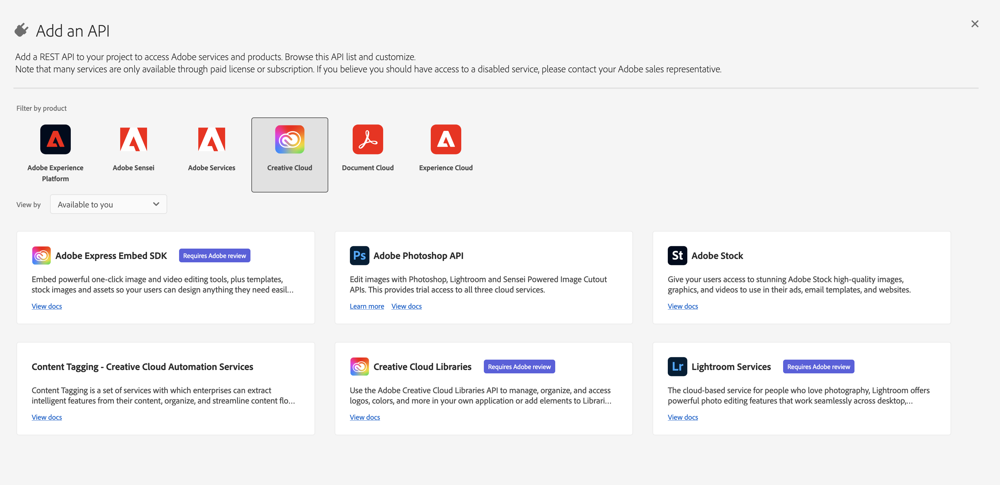
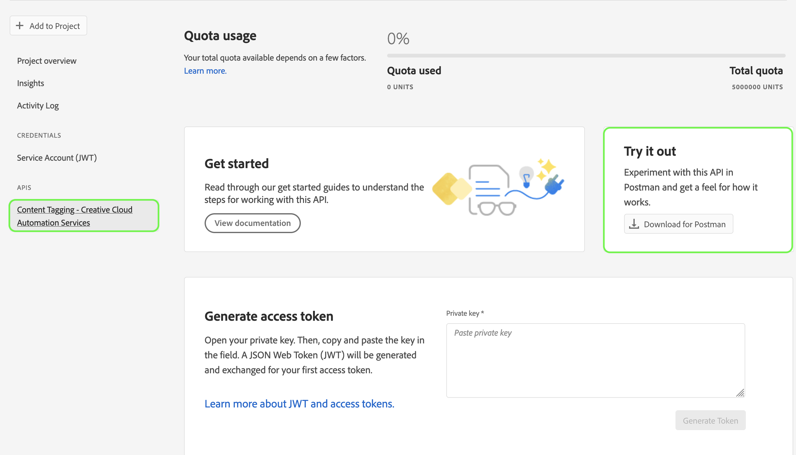
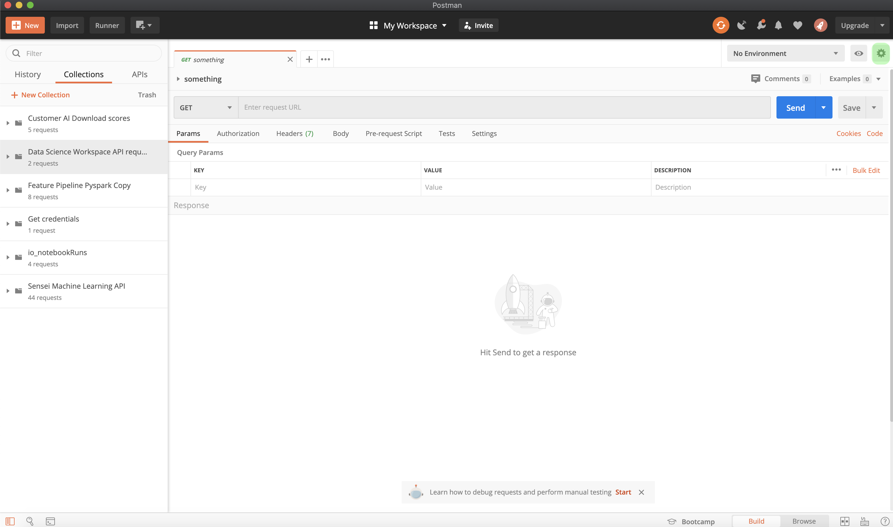
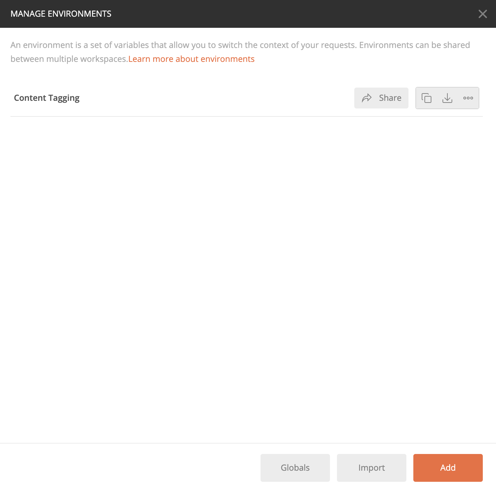
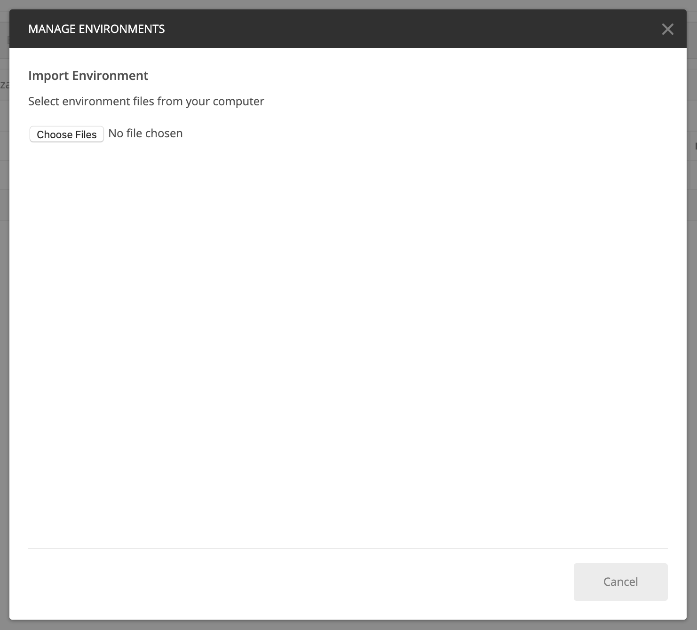
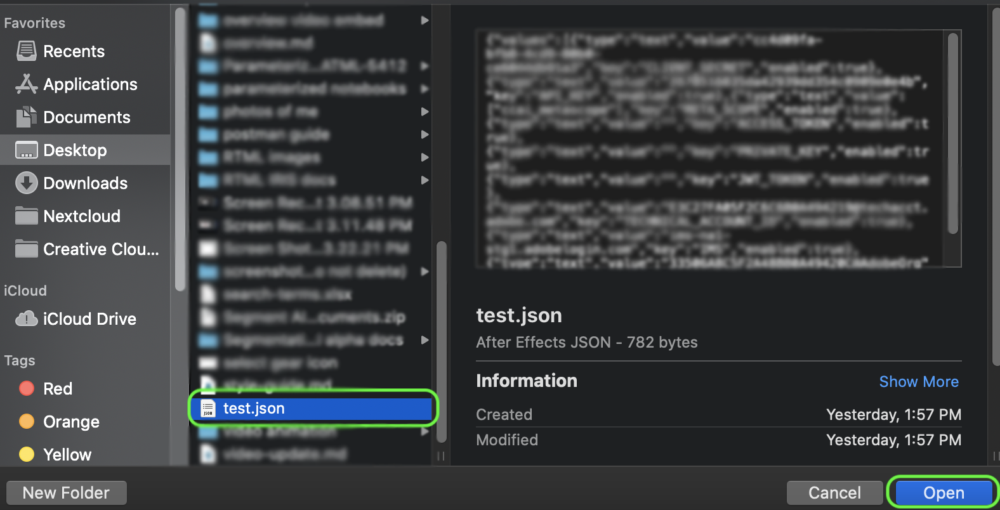
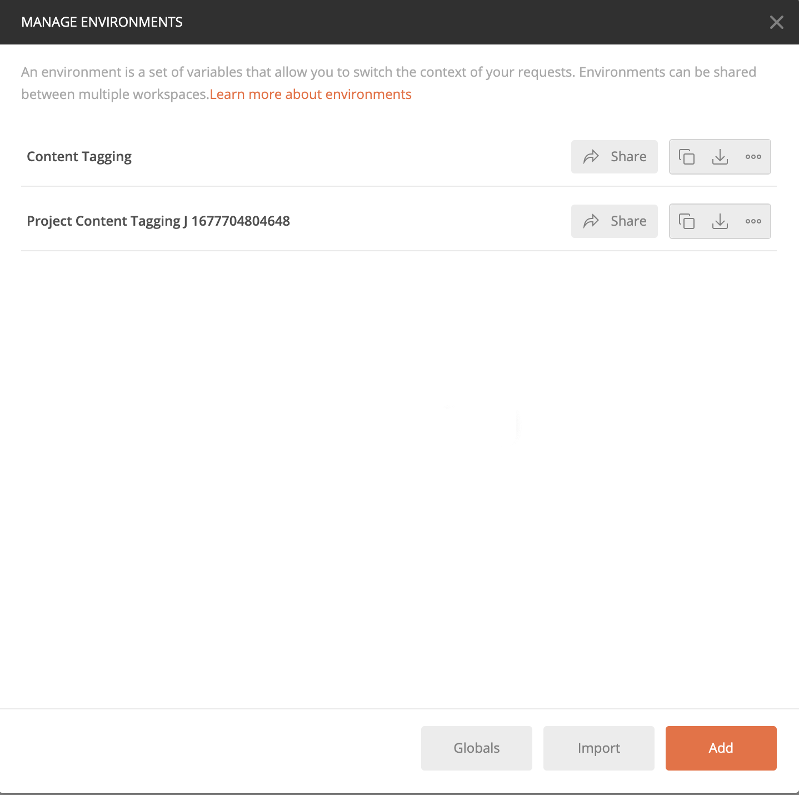
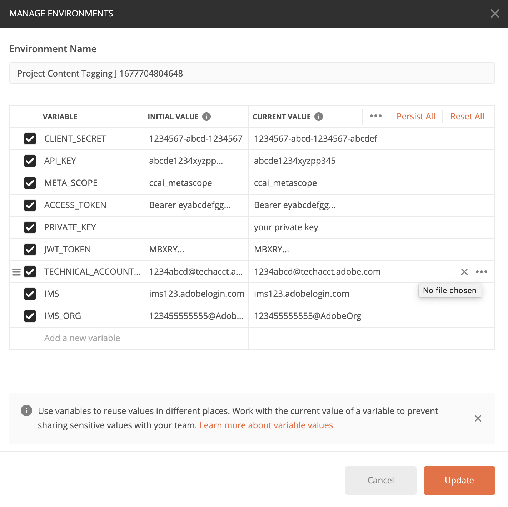
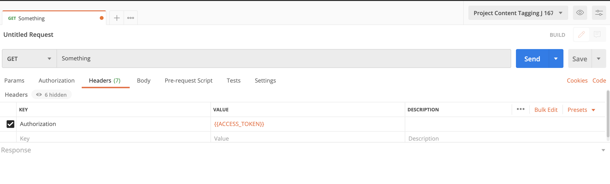

# Prise en main du balisage de contenu

[!DNL Content tagging] utilise les API Adobe I/O. Pour lancer des appels aux API Adobe I/O et à l’intégration de la console I/O, vous devez d’abord suivre le tutoriel [authentification](https://experienceleague.adobe.com/docs/experience-platform/landing/platform-apis/api-authentication.html?lang=fr).

Cependant, lorsque vous accédez à l’étape **Ajouter une API**, l’API se trouve sous Creative Cloud au lieu de Adobe Experience Platform, comme illustré dans la capture d’écran suivante :

Le tutoriel sur l’authentification indique les valeurs de chacun des en-têtes requis dans tous les appels API d’Adobe I/O, comme illustré ci-dessous :

- `Authorization: Bearer {ACCESS_TOKEN}`
- `x-api-key: {API_KEY}`
- `x-gw-ims-org-id: {ORG_ID}`

## Création d’un environnement Postman (facultatif)

Une fois que vous avez configuré votre projet et votre API dans Adobe Developer Console, vous avez la possibilité de télécharger un fichier d’environnement pour Postman. Sous **[!UICONTROL API]** dans le rail de gauche du projet, sélectionnez **[!UICONTROL Balisage de contenu]**. Un nouvel onglet s’ouvre, contenant une carte intitulée « [!DNL Try it out] ». Sélectionnez **Télécharger pour Postman** pour télécharger un fichier JSON utilisé pour configurer votre environnement Postman.

Une fois le fichier téléchargé, ouvrez Postman et sélectionnez l’icône **engrenage** en haut à droite pour ouvrir la boîte de dialogue **gérer les environnements**.

Sélectionnez ensuite **Importer** dans la boîte de dialogue **Gérer les environnements**.

Vous êtes redirigé et invité à sélectionner un fichier d’environnement sur votre ordinateur. Sélectionnez le fichier JSON que vous avez téléchargé précédemment, puis sélectionnez **Ouvrir** pour charger l’environnement.

Vous êtes redirigé vers l’onglet *Gérer les environnements* avec un nouveau nom d’environnement renseigné. Sélectionnez le nom de l’environnement pour afficher et modifier les variables disponibles dans Postman. Vous devez toujours renseigner manuellement les `JWT_TOKEN` et les `ACCESS_TOKEN`. Ces valeurs doivent avoir été obtenues en suivant le tutoriel [authentification](https://experienceleague.adobe.com/docs/experience-platform/landing/platform-apis/api-authentication.html?lang=fr).

Une fois l’opération terminée, vos variables doivent ressembler à la capture d’écran ci-dessous. Sélectionnez **Mettre à jour** pour terminer la configuration de votre environnement.

Vous pouvez désormais sélectionner votre environnement dans le menu déroulant du coin supérieur droit et renseigner automatiquement toutes les valeurs enregistrées. Il vous suffit de modifier à nouveau les valeurs à tout moment pour mettre à jour tous vos appels API.

Pour plus d’informations sur l’utilisation des API Adobe I/O à l’aide de Postman, consultez la publication de Medium sur [Utilisation de Postman pour l’authentification JWT sur Adobe I/O](https://medium.com/adobetech/using-postman-for-jwt-authentication-on-adobe-i-o-7573428ffe7f).

## Lecture d&#39;exemples d&#39;appels API

Ce guide fournit des exemples d’appels API pour démontrer comment formater vos requêtes. Il s’agit notamment de chemins d’accès, d’en-têtes requis et de payloads de requêtes correctement formatés. L’exemple JSON renvoyé dans les réponses de l’API est également fourni. Pour plus d’informations sur les conventions utilisées dans la documentation pour les exemples d’appels API, consultez la section sur la [lecture d’exemples d’appels API](../../landing/troubleshooting.md) dans le guide de dépannage d’Experience Platform.

## Étapes suivantes {#next-steps}

Une fois que vous disposez de toutes vos informations d’identification, vous êtes prêt à configurer un programme de travail personnalisé pour [!DNL Content tagging]. Les documents suivants aident à comprendre le framework d’extensibilité et la configuration de l’environnement.

Pour en savoir plus sur le framework d’extensibilité, commencez par lire le document [introduction à l’extensibilité](https://experienceleague.adobe.com/docs/asset-compute/using/extend/understand-extensibility.html?lang=fr). Ce document décrit les conditions préalables et les exigences d’approvisionnement.

Pour en savoir plus sur la configuration d’un environnement pour [!DNL Content tagging], commencez par lire le guide de [configuration d’un environnement de développement](https://experienceleague.adobe.com/docs/asset-compute/using/extend/setup-environment.html?lang=fr). Ce document fournit des instructions de configuration qui vous permettent de développer pour le service Asset Compute.
