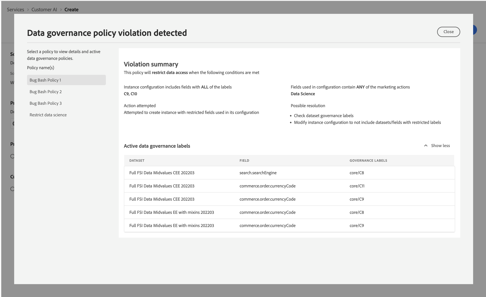

# Politiques de gouvernance dans l’IA dédiée aux clients

Une fois que vous avez terminé le workflow pour créer un modèle et envoyer la configuration du modèle, l’[application des politiques](/help/data-governance/enforcement/auto-enforcement.md) vérifie s’il existe des violations. Si une violation de politique se produit, une fenêtre contextuelle s’affiche indiquant qu’une ou plusieurs politiques ont été violées. Cela permet de vous assurer que vos opérations de données et vos actions marketing dans Experience Platform sont conformes aux politiques d’utilisation des données.

.

La fenêtre contextuelle fournit des informations spécifiques sur la violation. Vous pouvez résoudre ces violations par le biais des paramètres de la politique et d’autres mesures qui ne sont pas directement liées au workflow de configuration. Par exemple, vous pouvez modifier les libellés afin que certains champs soient autorisés à être utilisés à des fins de science des données. Vous pouvez également modifier la configuration du modèle elle-même afin qu’elle n’utilise rien qui porte un libellé. Consultez la documentation pour en savoir plus sur la configuration des [politiques](/help/data-governance/policies/overview.md).
