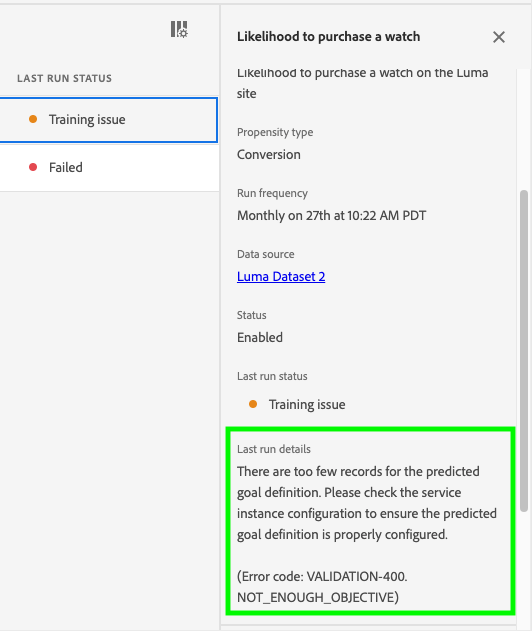

# Dépannage des erreurs de l’IA dédiée aux clients

L’IA dédiée aux clients affiche des erreurs lorsque l’entraînement, la notation et la configuration des modèles échouent. Dans la section **[!UICONTROL Instances de service]**, une colonne pour le **[!UICONTROL STATUT DE LA DERNIÈRE EXÉCUTION]** affiche l’un des messages suivants : **[!UICONTROL Succès]**, **[!UICONTROL Problème de formation]**, et **[!UICONTROL Échec]**.

Dans le cas où **[!UICONTROL Échec]** ou **[!UICONTROL Problème d’entraînement]** s’affiche, vous pouvez sélectionner le statut d’exécution pour ouvrir un panneau latéral. Le panneau latéral contient le **[!UICONTROL statut de votre dernière exécution]** et les **[!UICONTROL détails de la dernière exécution]**. Les **[!UICONTROL détails de la dernière exécution]** contiennent des informations sur les raisons de l’échec de l’exécution. Dans le cas où l’IA dédiée aux clients ne peut pas fournir de détails sur votre erreur, contactez l’assistance avec le code d’erreur fourni.

 

## Impossible d’accéder à l’IA dédiée aux clients dans Chrome en navigation privée

Les erreurs de chargement en mode navigation privée de Google Chrome sont présentes en raison des mises à jour des paramètres de sécurité du mode navigation privée de Google Chrome. Le problème est en cours de traitement avec Chrome pour faire d’experience.adobe.com un domaine de confiance.

 

### Correctif recommandé

Pour contourner ce problème, vous devez ajouter experience.adobe.com en tant que site pouvant toujours utiliser des cookies. Commencez par accéder à **chrome://settings/cookies**. Faites ensuite défiler l’écran jusqu’à la section **Comportements personnalisés**, puis sélectionnez le bouton **Ajouter** en regard de « Sites autorisés à utiliser des cookies ». Dans la fenêtre contextuelle qui s’affiche, effectuez un copier-coller de `[*.]experience.adobe.com` puis cochez la case **Inclure les cookies tiers de ce site**. Une fois l’opération terminée, sélectionnez **Ajouter** et chargez à nouveau l’IA dédiée aux clients en navigation privée.

## La qualité du modèle est médiocre.

Si vous recevez l’erreur « [!UICONTROL La qualité du modèle est médiocre. Nous vous recommandons de créer une application avec la configuration modifiée.] ». Suivez les étapes recommandées ci-dessous pour résoudre les problèmes.

 

### Correctif recommandé

« La qualité du modèle est médiocre » signifie que la précision du modèle n’est pas comprise dans une plage acceptable. L’IA dédiée aux clients n’a pas pu créer de modèle fiable et l’AUC (aire sous la courbe ROC) est inférieure à 0,65 après l’entraînement. Pour corriger l’erreur, il est recommandé de modifier l’un des paramètres de configuration et de relancer l’entraînement.

Commencez par vérifier l’exactitude de vos données. Il est important que vos données contiennent les champs nécessaires à votre résultat prédictif.

- Vérifiez si votre jeu de données comporte les dates les plus récentes. L’IA dédiée aux clients suppose toujours que les données sont à jour lorsque le modèle est déclenché.
- Recherchez les données manquantes dans la fenêtre de prédiction et d’éligibilité que vous avez définie. Vos données doivent être complètes sans oubli. Assurez-vous également que votre jeu de données respecte les [exigences en matière de données historiques de l’IA dédiée aux clients](./data-requirements.md#data-requirements).
- Recherchez les données manquantes dans les propriétés de champ de schéma dans le commerce, l’application, le web et la recherche.

Si vos données ne semblent pas poser problème, essayez de modifier la condition de la population d’éligibilité pour restreindre le modèle à certains profils (par exemple, `_experience.analytics.customDimensions.eVars.eVar142` existe dans les 56 derniers jours). Cela limite la population et la taille des données utilisées dans la fenêtre d’entraînement.

Si limiter la population d’éligibilité n’a pas fonctionné ou si cela n’est pas possible, modifiez votre fenêtre de prédiction.

- Essayez de passer votre fenêtre de prédiction à 7 jours et vérifiez si l’erreur se produit toujours. Si l’erreur ne se produit plus, cela indique que vous ne disposez peut-être pas de suffisamment de données pour la fenêtre de prédiction que vous avez définie.

### Erreurs

| Code d’erreur | Titre | Modèle de message | Exemple de message |
| ---------- | ----- | ---------------- | --------------- |
| 400 | PAS ASSEZ OBJECTIF | Il y a trop peu d’utilisateurs ({{actual_num_samples}} in total) meeting the prediction goal definition from {{outcome_window_start}} to {{outcome_window_end}}. We require at least {{min_num_samples}} avec des événements admissibles pour créer un modèle.   Solutions proposées :   1. Vérifiez la disponibilité des données  2. Réduisez la période d&#39;objectif de prédiction  3. Modifiez la définition d’objectif de prédiction pour inclure plus d’utilisateurs (Code d’erreur : VALIDATION-400 NOT_ASOUGH_OBJECTIVE) | Trop peu d’utilisateurs (200 au total) répondent à la définition d’objectif de prévision de 2020-04-01 à 2021-04-01. Nous avons besoin d’au moins 500 utilisateurs avec des événements admissibles pour créer un modèle.   Solutions proposées :  1. Vérifiez la disponibilité des données  2. Réduisez la période d&#39;objectif de prédiction  3. Modifiez la définition d’objectif de prédiction pour inclure plus d’utilisateurs. (Code d’erreur : VALIDATION-400 NOT_ENOUGH_OBJECTIVE) |
| 401 | PAS ASSEZ DE POPULATION | Il y a trop peu d’utilisateurs éligibles ({{actual_num_samples}} in total) from {{eligibility_window_start}} to {{eligibility_window_end}}. We require at least {{min_num_samples}} utilisateurs éligibles pour créer un modèle.   Solutions proposées :  1. Vérifiez la disponibilité des données  2. Si une définition de population éligible est fournie, réduisez le délai du filtre d&#39;éligibilité 3. Si aucune définition de population éligible n&#39;est fournie, essayez d&#39;en ajouter une (Code d&#39;erreur : VALIDATION-401 NOT_ENOUGH_POPULATION) | Il y a trop peu d’utilisateurs éligibles (200 au total) de 2020-04-01 à 2021-04-01. Nous avons besoin d’au moins 500 utilisateurs éligibles pour créer un modèle.  Solutions proposées :  1. Vérifiez la disponibilité des données  2. Si une définition de population éligible est fournie, réduisez le délai du filtre d&#39;éligibilité. 3. Si aucune définition de population éligible n&#39;est fournie, essayez d&#39;en ajouter une. (Code d’erreur : VALIDATION-401 NOT_ENOUGH_POPULATION) |
| 402 | MAUVAIS MODÈLE | Nous ne pouvons pas produire de modèle de qualité avec le jeu de données et la configuration d’entrée actuels.   Voici quelques suggestions :  1. Modifiez votre configuration pour ajouter une définition de population éligible.  2. Utilisez des sources de données supplémentaires pour améliorer la qualité des modèles  3. Ajoutez des événements personnalisés pour inclure plus de données dans le modèle (Code d’erreur : VALIDATION-402 BAD_MODEL). | Nous ne pouvons pas produire de modèle de qualité avec le jeu de données et la configuration d’entrée actuels.   Voici quelques suggestions :  1. Pensez à modifier votre configuration pour ajouter une définition de population éligible.  2. Pensez à utiliser des sources de données supplémentaires pour améliorer la qualité du modèle. (Code d’erreur : VALIDATION-402 BAD_MODEL) |
| 403 | SCORES INÉLIGIBLES | La distribution du score s’écarte trop des prévisions.   Voici quelques suggestions :  1. Assurez-vous que le modèle est formé avec des données récentes. Si ce n’est pas le cas, envisagez de réentraîner votre modèle.  2. Assurez-vous qu’il n’y a aucun problème de données (tel qu’un délai de données/données manquant) dans les tâches de notation. (Code d’erreur : VALIDATION-403 INELIGIBLE_SCORES) | La distribution du score s’écarte trop des prévisions.   Voici quelques suggestions :  1. Assurez-vous que le modèle est formé avec des données récentes. Si ce n’est pas le cas, envisagez de réentraîner votre modèle.  2. Assurez-vous qu’il n’y a aucun problème de données (tel qu’un délai de données/données manquant) dans les tâches de notation. (Code d’erreur : VALIDATION-403 INELIGIBLE_SCORES) |
| 405 | AUCUNE DONNÉE DE NOTATION | Aucune donnée de profil ou de comportement des utilisateurs n’est disponible pour la notation à partir de {{eligibility_window_start}} to {{eligibility_window_end}}. Vérifiez les données pour vous assurer qu’elles sont mises à jour régulièrement. (Code d’erreur : VALIDATION-405 NO_SCORING_DATA) | Il n’existe aucun comportement utilisateur ni aucune donnée de profil disponible pour la notation de 2020-04-01 à 2021-04-01. Vérifiez les données pour vous assurer qu&#39;elles sont mises à jour régulièrement. (Code d’erreur : VALIDATION-405 NO_SCORING_DATA) |
| 407 | DONNÉES D’ÉVÉNEMENT HISTORIQUES SUFFISANTES | Il n’y a pas assez de données pour créer un modèle. De 2020-04-01 à 2021-04-01, il n’y a que 90 jours de données.   Nous avons besoin de 120 jours de données récentes. Pour plus d’informations, consultez la documentation sur les exigences en matière de données.   Solutions proposées :  1. Vérifiez la disponibilité des données  2. Réduisez la période d&#39;objectif de prédiction  3. Si une définition de population éligible est fournie, réduisez le délai du filtre d&#39;éligibilité  4. Si aucune définition de population éligible n&#39;est fournie, essayez d&#39;en ajouter une (Code d&#39;erreur : VALIDATION-407 NOT_ASOUGH_HISTORICAL_EVENT_DATA) | Il n’y a pas assez de données pour créer un modèle. De 2020-04-01 à 2021-04-01, il n&#39;y a que 90 jours de données.  Nous avons besoin de 120 jours de données récentes. Pour plus d’informations, consultez la documentation sur les exigences en matière de données.  Solutions proposées :  1. Vérifiez la disponibilité des données. 2. Réduire la période d’objectif de prédiction. 3. Si une définition de population éligible est fournie, réduisez le délai du filtre d&#39;éligibilité. 4. Si aucune définition de population éligible n&#39;est fournie, essayez d&#39;en ajouter une. (Code d’erreur : VALIDATION-407 NOT_ENOUGH_HISTORICAL_EVENT_DATA) |
| 408 | AUCUNE DONNÉE RÉCENTE POUR ÉLIGIBLE | Il n’existe aucune donnée sur le comportement des utilisateurs pour les utilisateurs éligibles dans {{data_days}} days prior to {{etl_window_end}}. Vérifiez le jeu de données pour vous assurer qu’il est mis à jour régulièrement. (Code d’erreur : VALIDATION-408 NO_RECENT_DATA_FOR_ELIGIBLE_POPULATION) | Il n’existe aucune donnée sur le comportement des utilisateurs pour les utilisateurs éligibles dans les 60 jours précédant la 2021-04-01. Vérifiez le jeu de données pour vous assurer qu’il est mis à jour régulièrement. (Code d’erreur : VALIDATION-408 NO_RECENT_DATA_FOR_ELIGIBLE_POPULATION) |
| 409 | AUCUN OBJECTIF | Aucun utilisateur ne répond à la définition d’objectif de prédiction d’utilisateurs {{outcome_window_start}} to {{outcome_window_end}}. We require at least {{min_num_samples}} avec des événements admissibles pour créer un modèle.   Solutions proposées :  1. Vérifiez la disponibilité des données  2. Modifier la définition d’objectif de prédiction (Code d’erreur : VALIDATION-409 NO_OBJECTIVE) | Aucun utilisateur ne répond à la définition d’objectif de prédiction de 2020-04-01 à 2021-04-01. Nous avons besoin d’au moins 500 utilisateurs avec des événements admissibles pour créer un modèle.   Solutions proposées :  1. Vérifiez la disponibilité des données. 2. Modifiez la définition d’objectif de prédiction. (Code d’erreur : VALIDATION-409 NO_OBJECTIVE) |
| 410 | AUCUNE POPULATION | Il n’existe aucun utilisateur éligible de {{eligibility_window_start}} to {{eligibility_window_end}}. We require at least {{min_num_samples}} utilisateurs éligibles pour créer un modèle.   Solutions proposées :  1. Vérifiez la disponibilité des données  2. Si une définition de population éligible est fournie, modifiez la condition ou augmentez le délai du filtre d&#39;éligibilité (Code d&#39;erreur : VALIDATION-410 NO_POPULATION) | Il n’existe aucun utilisateur éligible de 2020-04-01 à 2021-04-01. Nous avons besoin d’au moins 500 utilisateurs éligibles pour créer un modèle.   Solutions proposées :  1. Vérifiez la disponibilité des données.   2. Si une définition de population éligible est fournie, modifiez la condition ou augmentez le délai du filtre d&#39;éligibilité. (Code d’erreur : VALIDATION-410 NO_POPULATION) |
| 411 | AUCUNE DONNÉE D’ENTRÉE APRÈS ETL | Il n’existe aucun comportement utilisateur ni aucune donnée de profil disponible pour que le modèle utilise entre {{etl_start_date}} and {{etl_end_date}}. Assurez-vous que le jeu de données contient suffisamment de données. (Code d’erreur : VALIDATION-411 NO_INPUT_DATA_AFTER_ETL) | Il n’existe aucun comportement utilisateur ni aucune donnée de profil disponible pour le modèle à utiliser entre 2020-04-01 et 2021-04-01. Assurez-vous que le jeu de données contient suffisamment de données. (Code d’erreur : VALIDATION-411 NO_INPUT_DATA_AFTER_ETL) |
| 412 | AUCUN ÉVÉNEMENT APRÈS ETL | Aucune donnée de comportement de l’utilisateur n’est disponible pour que le modèle utilise entre {{etl_start_date}} and {{etl_end_date}}. Assurez-vous que le jeu de données contient suffisamment de données. | Il n’existe aucune donnée sur le comportement des utilisateurs disponible pour le modèle entre 2020-04-01 et 2021-04-01. Assurez-vous que le jeu de données contient suffisamment de données. (Code d’erreur : VALIDATION-412 NO_EVENT_DATA_AFTER_ETL) |
| 413 | VALEUR UNIQUE DANS OBJECTIF | CustomerAI exige que le jeu de données contienne des événements admissibles et non admissibles pour la définition de l’objectif de prédiction. Le jeu de données d’entrée contient uniquement des événements admissibles compris entre {{etl_window_start}} and {{etl_window_end}}.   Solutions proposées :  1. Modifiez la définition d&#39;objectif de prédiction  2. Vérifier l’exhaustivité des données ou utiliser un autre qui inclut des exemples d’événements non admissibles pour l’objectif de prédiction (Code d’erreur : VALIDATION-413 SINGLE_VALUE_IN_OBJECTIVE) | CustomerAI exige que le jeu de données contienne des événements admissibles et non admissibles pour la définition de l’objectif de prédiction. Le jeu de données d’entrée contient uniquement des événements admissibles entre 2020-04-01 et 2021-04-01.  Solutions proposées :  1. Modifiez la définition d’objectif de prédiction. 2. Vérifiez l’exhaustivité des données ou utilisez un autre événement qui inclut des exemples d’événements non admissibles pour l’objectif de prédiction. (Code d’erreur : VALIDATION-413 SINGLE_VALUE_IN_OBJECTIVE) |
| 414 | PAS DE FACTEURS INFLUENTS | Le modèle du facteur influent a généré une production inattendue. Nous vous recommandons de créer une application avec une configuration modifiée. (Code d’erreur : VALIDATION-414 NO_INFLUENTIAL_FACTORS) | Le modèle du facteur influent a généré une production inattendue. Nous vous recommandons de créer une application avec une configuration modifiée. (Code d’erreur : VALIDATION-414 NO_INFLUENTIAL_FACTORS) |