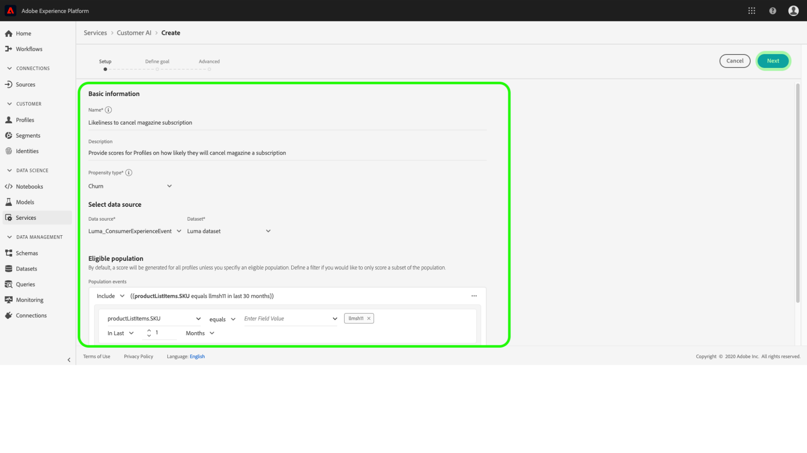

# Configuration d’une instance d’API client

L’IA du client, dans le cadre d’Intelligent Services, vous permet de générer des scores de propension personnalisés sans avoir à vous soucier de l’apprentissage automatique.

Les services intelligents offrent une API client sous la forme d’un service Adobe Sensei simple d’utilisation qui peut être configuré pour différents cas d’utilisation. Les sections suivantes décrivent les étapes de configuration d’une instance de Customer AI.

## Configuration de votre instance {#set-up-your-instance}

Dans l’interface utilisateur de Platform, cliquez sur **[!UICONTROL Services]** dans le volet de navigation de gauche. Le navigateur **[!UICONTROL Services]** apparaît et affiche tous les services disponibles. Dans le conteneur de Customer AI, cliquez sur **[!UICONTROL Ouvrir]**.

L’écran *Customer AI* affiche toutes les instances de Customer AI existantes. Cliquez sur **[!UICONTROL Créer une instance]**.

Le workflow de création d’instance s’affiche à partir de l’étape *Configuration*.

Vous trouverez ci-dessous des informations importantes sur les valeurs que vous devez fournir à l’instance :

* Le nom de l’instance est utilisé à tous les endroits où le score d’intelligence artificielle du client est affiché. Par conséquent, les noms doivent décrire ce que les scores de prédiction représentent, par exemple, &quot;Probabilité d&#39;annuler l&#39;abonnement du magazine&quot;.

* Le type de propension détermine l’intention de score et de polarité des mesures. Vous pouvez choisir **[!UICONTROL Attrition]** ou **[!UICONTROL Conversion]**. Pour plus d&#39;informations sur la façon dont le type de propension affecte votre instance, consultez la note sous le résumé [de la](./discover-insights.md#scoring-summary) notation dans le document d&#39;informations de découverte.

* La source de données est l’emplacement des données. Le jeu de données est le jeu de données d’entrée utilisé pour prédire les scores. Par conception, Customer AI utilise des données d’événement d’expérience client pour calculer les scores de propension. Lors de la sélection d’un jeu de données dans le sélecteur de liste déroulante, seuls ceux qui sont compatibles avec l’IA du client sont répertoriés.

* Par défaut, les scores de propension sont générés pour tous les profils, sauf si une population éligible est spécifiée. Vous pouvez spécifier une population éligible en définissant des conditions pour inclure ou exclure des profils en fonction des événements.

Indiquez les valeurs requises, puis cliquez sur **[!UICONTROL Suivant]**.

### Définition d’un objectif {#define-a-goal}

L’étape *Définir un objectif* s’affiche et fournit un environnement interactif permettant de définir un objectif visuellement. Un objectif est composé d’un ou de plusieurs événements, où l’occurrence de chaque événement est basée sur la condition qu’il contient. L’objectif d’une instance de Customer AI est de déterminer la probabilité d’atteindre l’objectif au cours d’une période donnée.

Cliquez sur **[!UICONTROL Saisir le nom du champ]** et sélectionnez un champ dans la liste déroulante. Cliquez sur la seconde entrée et sélectionnez une clause pour la condition de l’événement, puis indiquez la valeur cible pour terminer l’événement. D’autres événements peuvent être configurés en cliquant sur **[!UICONTROL Ajouter un événement]**. Enfin, atteignez l’objectif en appliquant une période de prédiction en nombre de jours, puis cliquez sur **[!UICONTROL Suivant]**.

### Configuration d’un planning *(facultatif)* {#configure-a-schedule}

L’étape *avancée* s’affiche. Lors de cette étape facultative, vous pouvez configurer un planning pour automatiser les opérations de prédiction, définir les exclusions de prédiction pour filtrer certains événements ou cliquer sur **[!UICONTROL Terminer]** si aucune opération n’est requise.

Configurez un planning de notation en configurant la *Fréquence de notation*. Les opérations de prédiction automatisées peuvent être planifiées pour une exécution hebdomadaire ou mensuelle.

Sous la configuration du planning, vous pouvez définir des exclusions de prédiction afin d’empêcher que des événements répondant à certaines conditions soient évalués lors de la génération de scores. Cette fonctionnalité peut être utilisée pour filtrer les entrées de données non pertinentes.

Pour exclure certains événements, cliquez sur **[!UICONTROL Ajouter une exclusion]** et définissez l’événement de la même manière que l’objectif. Pour supprimer une exclusion, cliquez sur les points de suspension (**[!UICONTROL ...]**) en haut à droite du conteneur d’événements, puis cliquez sur **[!UICONTROL Supprimer le conteneur]**.

Excluez les événements selon les besoins, puis cliquez sur **[!UICONTROL Terminer]** pour créer l’instance.

Si l’instance est créée avec succès, une exécution de prédiction est immédiatement déclenchée et les exécutions suivantes s’exécutent conformément à la planification que vous avez définie.

>[!NOTE] Selon la taille des données d’entrée, l’exécution de la prédiction peut prendre jusqu’à 24 heures.

En suivant cette section, vous avez configuré une instance de Customer AI et exécuté une opération de prédiction. Une fois la course terminée, les statistiques notées renseignent automatiquement les profils avec des scores prédits. Veuillez patienter jusqu&#39;à 24 heures avant de passer à la section suivante de ce tutoriel.

## Étapes suivantes {#next-steps}

En suivant ce didacticiel, vous avez correctement configuré une instance de l’IA du client et généré des scores de propension. Vous pouvez désormais choisir d’utiliser le créateur de segments pour [créer des segments de clients avec des scores](./create-segment.md) prédits ou [découvrir des statistiques avec l’IA](./discover-insights.md)du client.

## Ressources supplémentaires

La vidéo suivante est conçue pour vous aider à comprendre le processus de configuration de l’API client. En outre, les meilleures pratiques et les exemples d’utilisation sont fournis.

>[!VIDEO](https://video.tv.adobe.com/v/32665?learn=on&quality=12)

