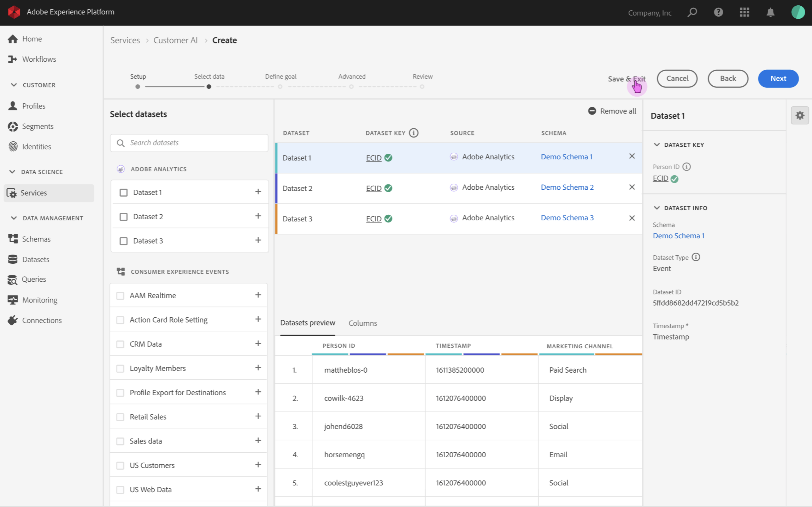
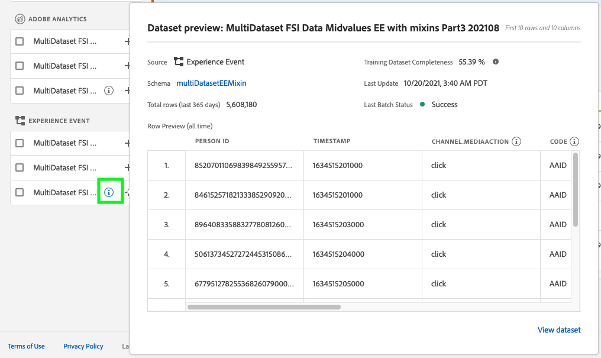
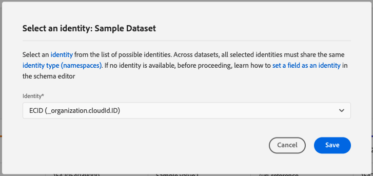
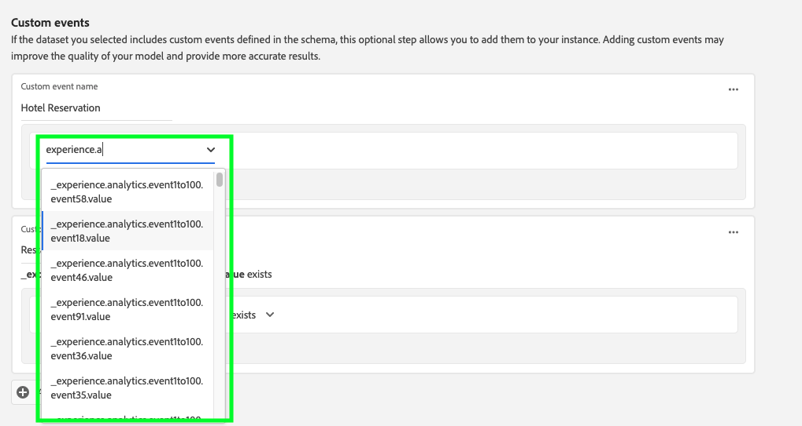

# Configuration d’une instance Customer AI

Dans le cadre des services AI/ML, Customer AI vous permet de générer des scores de propension personnalisés sans avoir à vous soucier de l’apprentissage automatique.

Les services AI/ML fournissent Customer AI en tant que service Adobe Sensei simple d’utilisation pouvant être configuré pour différents cas d’utilisation. Les sections suivantes décrivent les étapes de configuration d’une instance de Customer AI.

## Création d’une instance {#set-up-your-instance}

Dans l’interface utilisateur de Platform, sélectionnez **[!UICONTROL Services]** dans le volet de navigation de gauche. Le navigateur **[!UICONTROL Services]** apparaît et affiche tous les services disponibles. Dans le conteneur de Customer AI, sélectionnez **[!UICONTROL Ouvrir]**.

L’interface utilisateur de **Customer AI** apparaît et affiche toutes vos instances de service.

- Vous trouverez la mesure **[!UICONTROL Total profils notés]** située dans le coin inférieur droit du conteneur **[!UICONTROL Créer une instance]** . Cette mesure effectue le suivi du nombre total de profils notés par Customer AI pour l’année civile en cours, y compris tous les environnements de test et toutes les instances de service supprimées.

Les instances de service peuvent être modifiées, clonées et supprimées à l’aide des commandes situées dans la partie droite de l’interface utilisateur. Pour afficher ces commandes, sélectionnez une instance parmi vos **[!UICONTROL instances de service]** existantes. Les contrôles contiennent les éléments suivants :

- **[!UICONTROL Modifier]** : la sélection de **[!UICONTROL Modifier]** vous permet de modifier une instance de service existante. Vous pouvez modifier le nom, la description et la fréquence de notation de l’instance.
- **[!UICONTROL Clone]** : la sélection de **[!UICONTROL Clone]** copie la configuration de l’instance de service actuellement sélectionnée. Vous pouvez ensuite modifier le workflow pour effectuer des ajustements mineurs et le renommer en nouvelle instance.
- **[!UICONTROL Supprimer]** : vous pouvez supprimer une instance de service, y compris toutes les exécutions historiques. Le jeu de données de sortie correspondant sera supprimé de Platform. Toutefois, les scores synchronisés dans Real-time Customer Profile ne sont pas supprimés.
- **[!UICONTROL Source de données]** : lien vers le jeu de données utilisé par cette instance. Si plusieurs jeux de données sont utilisés, la sélection du texte de lien hypertexte ouvre la fenêtre contextuelle d’aperçu du jeu de données.
- **[!UICONTROL Détails de la dernière exécution]** : s’affiche uniquement en cas d’échec d’une exécution. Vous trouverez ici des informations sur les raisons de l’échec de l’exécution, telles que les codes d’erreur.
- **[!UICONTROL Définition de score]** : aperçu rapide de l’objectif que vous avez configuré pour cette instance.

Pour créer une instance, sélectionnez **[!UICONTROL Créer une instance]**.

## Configurer

Le workflow de création d’instance s’affiche, en commençant à l’étape **[!UICONTROL Configurer]** .

Vous trouverez ci-dessous des informations importantes sur les valeurs que vous pouvez renseigner dans l’instance :

- **[!UICONTROL Nom] :** Le nom de l’instance est utilisé à tous les endroits où les scores Customer AI sont affichés. Par conséquent, les noms doivent décrire ce que représentent les scores de prédiction. Par exemple, &quot;Probabilité d’annuler l’abonnement au magazine&quot;.

- **[!UICONTROL Description] :** Description indiquant ce que vous essayez de prédire.

- **[!UICONTROL Type de propension] :** Le type de propension détermine l’intention du score et de la polarité de la mesure. Vous pouvez choisir **[!UICONTROL Attrition]** ou **[!UICONTROL Conversion]**. Pour plus d’informations sur l’impact du type de propension sur votre instance, consultez la note située sous [résumé de notation](./discover-insights.md#scoring-summary) dans le document d’informations sur les découvertes.

Indiquez les valeurs requises, puis sélectionnez **[!UICONTROL Suivant]** pour continuer.

## Sélectionner les données {#select-data}

Par conception, Customer AI utilise Adobe Analytics, Adobe Audience Manager, les événements d’expérience en général et les données d’événement d’expérience client pour calculer les scores de propension. Lors de la sélection d’un jeu de données, seuls les jeux compatibles avec Customer AI sont répertoriés. Pour sélectionner un jeu de données, sélectionnez le symbole (**+**) en regard de son nom ou cochez la case pour ajouter plusieurs jeux de données à la fois. Utilisez l’option de recherche pour trouver rapidement les jeux de données qui vous intéressent.

Après avoir sélectionné les jeux de données que vous souhaitez utiliser, cliquez sur le bouton **[!UICONTROL Ajouter]** pour ajouter les jeux de données au volet d’aperçu du jeu de données.

La sélection de l’icône d’information  en regard du jeu de données ouvre la fenêtre contextuelle d’aperçu du jeu de données.

L’aperçu du jeu de données contient des données telles que l’heure de la dernière mise à jour, le schéma source et un aperçu des dix premières colonnes.

Sélectionnez **[!UICONTROL Enregistrer]** pour enregistrer vos brouillons au fur et à mesure que vous vous déplacez dans le workflow. Vous pouvez également enregistrer les configurations de modèle de brouillon et passer à l’étape suivante du workflow. Utilisez **[!UICONTROL Enregistrer et continuer]** pour créer et enregistrer des brouillons lors des configurations de modèle. Cette fonctionnalité vous permet de créer et d’enregistrer des brouillons de la configuration du modèle. Elle est particulièrement utile lorsque vous devez définir de nombreux champs dans le workflow de configuration.

### Complétude du jeu de données {#dataset-completeness}

Il existe une valeur de pourcentage d’exhaustivité du jeu de données dans l’aperçu du jeu de données. Cette valeur fournit un instantané du nombre de colonnes vides/nulles de votre jeu de données. Si un jeu de données contient de nombreuses valeurs manquantes et que ces valeurs sont capturées ailleurs, il est vivement recommandé d’inclure le jeu de données contenant les valeurs manquantes. Dans cet exemple, l’ID de personne est vide. Cependant, il est capturé dans un jeu de données distinct qui peut être inclus.

>[!NOTE]
>
>L’exhaustivité des jeux de données est calculée à l’aide de la période de formation maximale pour Customer AI (un an). Cela signifie que les données de plus d’un an ne sont pas prises en compte lors de l’affichage de la valeur d’exhaustivité de votre jeu de données.

### Sélection d’une identité {#identity}

Vous pouvez désormais joindre plusieurs jeux de données les uns aux autres en fonction de la carte d’identité (champ). Vous devez sélectionner un type d’identité (également appelé &quot;espace de noms d’identité&quot;) et une valeur d’identité dans cet espace de noms. Si vous avez affecté plusieurs champs en tant qu’identité dans votre schéma sous le même espace de noms, toutes les valeurs d’identité attribuées apparaissent dans la liste déroulante d’identité précédée de l’espace de noms tel que `EMAIL (personalEmail.address)` ou `EMAIL (workEmail.address)`.

[sélectionner le même espace de noms](../images/user-guide/cai-identity-map.png)

>[!IMPORTANT]
>
>Le même type d’identité (espace de noms) doit être utilisé pour chaque jeu de données sélectionné. Une coche verte s’affiche en regard du type d’identité dans la colonne d’identité pour indiquer que les jeux de données sont compatibles. Par exemple, lorsque vous utilisez l’espace de noms Phone et `mobilePhone.number` comme identifiant, tous les identifiants des jeux de données restants doivent contenir et utiliser l’espace de noms Phone.

Pour sélectionner une identité, sélectionnez la valeur soulignée située dans la colonne d’identité. La fenêtre contextuelle Sélectionner une identité s’affiche.

<!--  -->
[sélectionner le même espace de noms](../images/user-guide/cai-identity-namespace.png)

Dans le cas où plusieurs identités sont disponibles dans un espace de noms, veillez à sélectionner le champ d’identité approprié à votre cas d’utilisation. Par exemple, deux identités de courrier électronique sont disponibles dans l’espace de noms de courrier électronique, un courrier électronique professionnel et un courrier électronique personnel. Selon le cas d’utilisation, un email personnel est plus susceptible d’être renseigné et plus utile dans les prédictions individuelles. Cela signifie que `EMAIL (personalEmail.address)` sera sélectionné comme identité.

>[!NOTE]
>
> S’il n’existe aucun type d’identité valide (espace de noms) pour un jeu de données, vous devez définir une identité principale et l’affecter à un espace de noms d’identité à l’aide de l’ [éditeur de schéma](../../../xdm/schema/composition.md#identity). Pour en savoir plus sur les espaces de noms et les identités, consultez la documentation [Espaces de noms Identity Service](../../../identity-service/features/namespaces.md) .

## Définition d’un objectif {#define-a-goal}

<!-- https://www.adobe.com/go/cai-define-a-goal -->

L’étape **[!UICONTROL Définir l’objectif]** s’affiche et fournit un environnement interactif qui vous permet de définir visuellement un objectif de prédiction. Un objectif est composé d’un ou de plusieurs événements, où l’occurrence de chaque événement est basée sur la condition qu’il contient. L’objectif d’une instance de Customer AI est de déterminer la probabilité d’atteindre l’objectif au cours d’une période donnée.

Pour créer un objectif, sélectionnez **[!UICONTROL Saisir le nom du champ]** et choisissez un champ dans la liste déroulante. Sélectionnez la seconde entrée, une clause pour la condition de l’événement, puis éventuellement la valeur cible pour terminer l’événement. D&#39;autres événements peuvent être configurés en sélectionnant **[!UICONTROL Ajouter un événement]**. Enfin, atteignez l’objectif en appliquant une période de prédiction en nombre de jours, puis sélectionnez **[!UICONTROL Suivant]**.

<!--  -->

### Se produit et ne se produit pas

Lors de la définition de votre objectif, vous avez la possibilité de sélectionner **[!UICONTROL Se produira]** ou **[!UICONTROL Ne se produira pas]**. La sélection de **[!UICONTROL Se produit]** signifie que les conditions d’événement que vous définissez doivent être remplies pour que les données d’événement d’un client soient incluses dans l’interface utilisateur d’insights.

Par exemple, si vous souhaitez configurer une application pour prédire si un client effectuera un achat, vous pouvez sélectionner **[!UICONTROL Se produira]**, suivi de **[!UICONTROL Tous les]**, puis saisir **commerce.achats.id** (ou un champ similaire) et **[!UICONTROL existe]** comme opérateur.

<!--  -->

Cependant, il peut arriver que vous souhaitiez prédire si un événement ne se produira pas dans un certain délai. Pour configurer un objectif avec cette option, sélectionnez **[!UICONTROL Ne se produira pas]** dans la liste déroulante de niveau supérieur.

Par exemple, si vous souhaitez prédire quels clients sont les moins engagés et ne consultez pas la page de connexion de votre compte au cours du mois suivant. Sélectionnez **[!UICONTROL Ne se produira pas]** suivi de **[!UICONTROL Tous les]**, puis saisissez **web.webInteraction.URL** (ou un champ similaire) et **[!UICONTROL est égal à]** comme opérateur avec **account-login** comme valeur.

### Tout et n’importe lequel de

Dans certains cas, vous pouvez vouloir prédire si une combinaison d’événements se produira. Dans d’autres cas, vous pouvez vouloir prédire l’occurrence de tout événement d’un ensemble prédéfini. Pour prédire si un client aura une combinaison d’événements, sélectionnez l’option **[!UICONTROL Tous les]** dans la liste déroulante de second niveau de la page **[!UICONTROL Définir l’objectif]** .

Vous pouvez, par exemple, prédire si un client achète un produit particulier. Cet objectif de prédiction est défini par deux conditions : une `commerce.order.purchaseID` **exists** et une valeur spécifique `productListItems.SKU` ****.

Pour prédire si un client aura un événement d’un ensemble donné, vous pouvez utiliser l’option **[!UICONTROL Any of]** .

Vous pouvez, par exemple, prédire si un client visite une certaine URL ou une page web portant un nom particulier. Cet objectif de prédiction est défini par deux conditions : `web.webPageDetails.URL` **commence par** une valeur particulière et `web.webPageDetails.name` **commence par** une valeur particulière.

### Population éligible *(facultatif)*

Par défaut, les scores de propension sont générés pour tous les profils, sauf si une population éligible est spécifiée. Vous pouvez spécifier une population éligible en définissant des conditions pour inclure ou exclure des profils en fonction des événements.

### Événements personnalisés (*facultatif*) {#custom-events}

Si vous disposez d’informations supplémentaires en plus des [champs d’événement standard](../data-requirements.md#standard-events) utilisés par Customer AI pour générer des scores de propension, une option d’événement personnalisé est fournie. L’utilisation de cette option vous permet d’ajouter d’autres événements que vous jugez influents, ce qui peut améliorer la qualité de votre modèle et contribuer à fournir des résultats plus précis. Si le jeu de données que vous avez sélectionné inclut des événements personnalisés définis dans votre schéma, vous pouvez les ajouter à votre instance.

>[!NOTE]
>
> Pour une explication détaillée de l’impact des événements personnalisés sur les résultats du score de Customer AI, consultez la section [Exemple d’événement personnalisé](#custom-event) .

Pour ajouter un événement personnalisé, sélectionnez **[!UICONTROL Ajouter un événement personnalisé]**. Ensuite, saisissez un nom d’événement personnalisé, puis mappez-le au champ d’événement de votre schéma. Les noms d’événement personnalisés s’affichent à la place de la valeur des champs lorsque vous examinez les facteurs d’influence et d’autres informations. Cela signifie que le nom de l’événement personnalisé sera utilisé à la place de l’identifiant/de la valeur de l’événement. Pour plus d&#39;informations sur l&#39;affichage des événements personnalisés, consultez la [section d&#39;exemple d&#39;événement personnalisé](#custom-event). Ces événements personnalisés supplémentaires sont utilisés par Customer AI pour améliorer la qualité de votre modèle et fournir des résultats plus précis.

Sélectionnez ensuite l&#39;opérateur que vous souhaitez utiliser dans la liste déroulante des opérateurs disponibles. Seuls les opérateurs compatibles avec l&#39;événement sont répertoriés.

Enfin, saisissez la ou les valeurs du champ si l&#39;opérateur sélectionné en requiert une. Dans cet exemple, il suffit de vérifier s’il existe une réservation d’hôtel ou de restaurant. Cependant, si nous voulions être plus précis, nous pourrions utiliser l’opérateur égal et saisir une valeur exacte dans l’invite de valeur.

Une fois l’opération terminée, sélectionnez **[!UICONTROL Suivant]** en haut à droite pour continuer.

### Attributs de profil personnalisés (*facultatif*)

Vous pouvez définir des champs de jeu de données Profile importants (avec horodatages) dans vos données en plus des [champs d’événement standard](../data-requirements.md#standard-events) utilisés par Customer AI pour générer des scores de propension. L’utilisation de cette option vous permet d’ajouter des attributs de profil supplémentaires que vous estimez influents, ce qui peut améliorer la qualité de votre modèle et fournir des résultats plus précis. En outre, l’ajout d’attributs de profil personnalisés permet à Customer AI de mieux montrer comment des profils particuliers se sont retrouvés dans un compartiment de propension.

>[!NOTE]
>
>L’ajout d’un attribut de profil personnalisé suit le même processus que l’ajout d’un événement personnalisé. Comme pour les événements personnalisés, les attributs de profil personnalisés affectent la notation de votre modèle de la même manière. Pour une explication détaillée, consultez la section [Exemple d&#39;événement personnalisé](#custom-event) .

#### Sélection d’attributs de profil à partir de l’exportation de l’instantané de profil

Vous pouvez également choisir d’inclure les attributs de profil de l’exportation instantanée quotidienne de Profile. Ces attributs sont synchronisés avec l’exportation de l’instantané de profil et affichent la valeur la plus récente disponible. Elles s’affichent automatiquement et ne nécessitent pas de sélection de jeu de données à l’étape de configuration.

>[!WARNING]
>
> Ne sélectionnez pas un attribut de profil qui a été mis à jour en raison de l’objectif de prédiction ou qui est fortement corrélé avec l’objectif de prédiction. Cela entraîne une fuite de données et un ajustement excessif du modèle. Par exemple, `total_purchases_in_the_last_3_months` est un attribut qui prédit la conversion d’achat.

### Ajout d’un exemple d’événement personnalisé {#custom-event}

Dans l’exemple suivant, un événement personnalisé et un attribut de profil sont ajoutés à une instance Customer AI. L’objectif de l’instance Customer AI est de prévoir la probabilité qu’un client achète un autre produit Luma dans les 60 prochains jours. Normalement, les données de produit sont liées à un SKU de produit. Dans ce cas, le SKU est `prd1013`. Une fois le modèle Customer AI formé/noté, ce SKU peut être lié à un événement et affiché comme facteur d’influence pour un compartiment de propension.

Customer AI applique automatiquement la génération de fonctionnalités telles que &quot;Jours depuis&quot; ou &quot;Nombre de&quot; par rapport aux événements personnalisés tels que **Watch purchase**. Si cet événement a été considéré comme un facteur d’influence sur la propension élevée, moyenne ou faible des clients, Customer AI l’affiche comme `Days since prd1013 purchase` ou `Count of prd1013 purchase`. En créant cet événement en tant qu’événement personnalisé, vous pouvez donner à l’événement un nouveau nom rendant les résultats beaucoup plus faciles à lire. Par exemple : `Days since Watch purchase`. En outre, Customer AI utilise cet événement dans sa formation et sa notation même si l’événement n’est pas un événement standard. Cela signifie que vous pouvez ajouter plusieurs événements qui, selon vous, peuvent avoir de l’influence et personnaliser davantage votre modèle en incluant des données telles que les réservations, les journaux des visiteurs et d’autres événements. L’ajout de ces points de données accroît davantage la précision et la précision de votre modèle Customer AI.

## Définition des options

L’étape Définir les options vous permet de configurer un planning pour automatiser les opérations de prédiction, de définir des exclusions de prédiction pour filtrer certains événements et de désactiver **[!UICONTROL Profil]** sur Activé/Désactivé.

### Configuration d’un planning *(facultatif)* {#configure-a-schedule}

Pour configurer un planning de notation, commencez par configurer la **[!UICONTROL Fréquence de notation]**. Les opérations de prédiction automatisées peuvent être planifiées pour une exécution hebdomadaire ou mensuelle.

### Exclusions de prédiction *(facultatif)*

Si votre jeu de données contenait des colonnes ajoutées en tant que données de test, vous pouvez ajouter cette colonne ou cet événement à une liste d’exclusion en sélectionnant **[!UICONTROL Ajouter une exclusion]**, puis en entrant le champ que vous souhaitez exclure. Cela empêche l’évaluation des événements qui répondent à certaines conditions lors de la génération de scores. Cette fonction peut être utilisée pour filtrer les entrées de données ou les promotions non pertinentes.

Pour exclure un événement, sélectionnez **[!UICONTROL Ajouter l’exclusion]** et définissez l’événement. Pour supprimer une exclusion, sélectionnez les points de suspension (**[!UICONTROL ...]**) en haut à droite du conteneur d’événements, puis sélectionnez **[!UICONTROL Supprimer le conteneur]**.

### Bascule des profils

Le bouton activer/désactiver de Profile permet à Customer AI d’exporter les résultats de notation dans Real-time Customer Profile. La désactivation de ce bouton empêche l’ajout des résultats de notation des modèles à Profile. Les résultats de notation de Customer AI sont toujours disponibles, mais cette fonctionnalité est désactivée.

Lorsque vous utilisez Customer AI pour la première fois, vous pouvez désactiver cette fonction jusqu’à ce que vous soyez satisfait des résultats de sortie du modèle. Cela vous empêche de charger plusieurs jeux de données de notation sur vos profils client tout en affinant votre modèle. Une fois que vous avez fini d’étalonner votre modèle, vous pouvez cloner le modèle à l’aide de l’ [option de clone](#set-up-your-instance) de la page **Instances de service** . Vous pouvez ainsi créer une copie de votre modèle et activer/désactiver le profil.

Une fois que votre planning de notation est défini, que les exclusions de prédiction sont incluses et que le basculement de profil est défini à l’endroit souhaité, sélectionnez **[!UICONTROL Terminer]** en haut à droite pour créer votre instance Customer AI.

Si l’instance est créée avec succès, une opération de prédiction se déclenche immédiatement et les suivantes s’exécutent selon le planning défini.

>[!NOTE]
>
>Selon la taille des données d’entrée, les opérations de prédiction peuvent prendre jusqu’à 24 heures.

En suivant cette section, vous avez configuré une instance de Customer AI et exécuté une opération de prédiction. Une fois l’exécution terminée, les insights notés renseignent automatiquement les profils avec les scores prévus si le bouton bascule du profil est activé. Veuillez patienter jusqu’à 24 heures avant de passer à la section suivante de ce tutoriel.

## Étapes suivantes {#next-steps}

En suivant ce tutoriel, vous avez correctement configuré une instance de Customer AI et généré des scores de propension. Vous pouvez maintenant choisir d’utiliser le créateur de segments pour [ créer des segments client avec des scores prévus ](./create-segment.md) ou [ découvrir des insights avec Customer AI](./discover-insights.md).

## Ressources supplémentaires

La vidéo suivante est conçue pour vous aider à comprendre le processus de configuration de Customer AI. De plus, des bonnes pratiques et des exemples de cas d’utilisation sont fournis.

>[!IMPORTANT]
>
> La vidéo suivante est obsolète. Pour obtenir les informations les plus récentes, reportez-vous à la documentation .

>[!VIDEO](https://video.tv.adobe.com/v/32665?learn=on&quality=12)

<!-- comment -->
