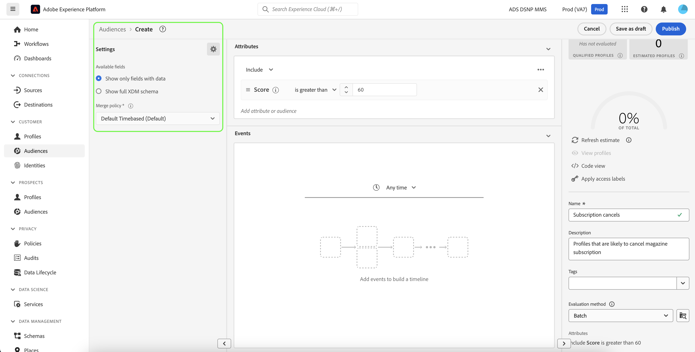

# Création de segments client avec des scores prévus

Lorsqu’une opération de prédiction se termine, les scores de propension prévus sont automatiquement utilisés par les Profils. L’enrichissement des profils avec les scores Customer AI permet de créer des segments client pour trouver des audiences en fonction de leurs scores de propension. Cette section décrit les étapes à suivre pour créer des segments à l’aide du créateur de segments. Pour un tutoriel plus complet sur la création de segments, consultez le [guide d’utilisation du créateur de segments](../../../segmentation/ui/segment-builder.md).

>[!IMPORTANT]
>
>Pour utiliser cette méthode, le profil client en temps réel doit être activé pour le jeu de données.

Dans l’interface utilisateur d’Experience Platform, cliquez sur **[!UICONTROL Segments]** dans le volet de navigation de gauche, puis cliquez sur **[!UICONTROL Créer un segment]**.

Le **créateur de segments** s’affiche. Dans la colonne **[!UICONTROL Champs]** à gauche, sous l’onglet **[!UICONTROL Attributs]**, cliquez sur le dossier nommé **[!UICONTROL XDM Individual Profile]**, puis sur le dossier avec l’espace de noms de votre organisation. Le dossier nommé **[!UICONTROL Customer AI]** contient les résultats des opérations de prédiction et est nommé d’après l’instance à laquelle sont associés les scores. Cliquez sur un dossier d’instance pour accéder à ses résultats pour l’instance souhaitée.

Faites glisser l’attribut **[!UICONTROL Score]** sur la *zone de travail du créateur de règles* au centre du créateur de segments pour définir une règle.

Sous la colonne de droite *Propriétés du segment*, indiquez un nom pour le segment.

Au-dessus de la colonne de gauche *Champs*, cliquez sur l’icône **engrenage** et sélectionnez une *Politique de fusion* dans la liste déroulante. Cliquez sur **[!UICONTROL Enregistrer]** pour créer le segment.

## Étapes suivantes

Ce tutoriel vous a permis de trouver des audiences en fonction de leurs scores de propension à l’aide du créateur de segments. Vous pouvez désormais cibler vos audiences en les activant sur les destinations. Pour plus d’informations, consultez [Présentation des destinations](../../../destinations/home.md).
