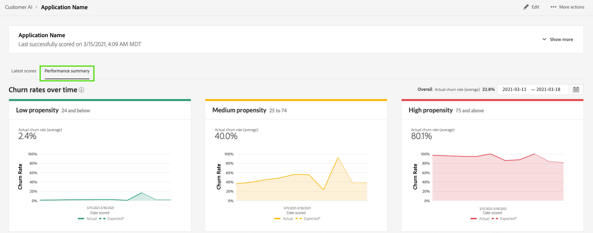

# Découvrir des informations avec l’IA dédiée aux clients

Customer AI fait partie d’Intelligent Services et permet aux spécialistes du marketing de tirer parti d’Adobe Sensei pour anticiper les prochaines actions de vos clients. Customer AI est utilisé pour générer des scores de propension personnalisés tels que les taux d’attrition et de conversion de profils individuels à grande échelle. Cette opération s’effectue sans qu’il soit nécessaire de transformer les besoins professionnels en un problème de machine learning, en choisissant un algorithme, une formation ou un déploiement.

Ce document sert de guide pour interagir avec les informations d’instance de service dans l’interface utilisateur d’Intelligent Services Customer AI.

## Prise en main

Pour utiliser les informations relatives à Customer AI, vous devez avoir à disposition une instance de service dont l’état d’exécution est réussi. Pour créer une instance de service, consultez [Configuration d’une instance IA dédiée aux clients](./configure.md). Si vous avez récemment créé une instance de service et qu’elle est toujours en cours de formation et de notation, comptez 24 heures pour qu’elle se termine.

## Présentation de l’instance de service

Dans l’interface utilisateur de [!DNL Adobe Experience Platform], sélectionnez **[!UICONTROL Services]** dans le volet de navigation de gauche. Le navigateur *Services* apparaît et affiche les services intelligents disponibles. Dans le conteneur de l’IA dédiée aux clients, sélectionnez **[!UICONTROL Ouvrir]**.

La page de service de Customer AI s’affiche. Cette page répertorie les instances de service de Customer AI et affiche les informations les concernant, notamment le nom de l’instance, le type de propension, la fréquence à laquelle l’instance est exécutée et l’état de la dernière mise à jour.

>[!NOTE]
>
>Seules les instances de service qui ont terminé les exécutions de notation avec succès ont des informations.

Sélectionnez un nom d’instance de service pour commencer.

Ensuite, la page d’informations de cette instance de service s’affiche avec l’option permettant de sélectionner **[!UICONTROL Derniers scores]** ou **[!UICONTROL Résumé des performances]**. L’onglet par défaut **[!UICONTROL Derniers scores]** fournit des visualisations de vos données. Les visualisations et ce que vous pouvez faire avec ces données sont expliqués plus en détail dans ce guide.

L’onglet **[!UICONTROL Résumé des performances]** affiche les taux de résiliation ou de conversion réels pour chaque intervalle de propension. Pour en savoir plus, consultez la section sur les [mesures de résumé des performances](#performance-metrics).

## Détails des instances de service

Vous pouvez afficher les détails d’une instance de service de deux manières : depuis le tableau de bord ou au sein de l’instance de service.

### Tableau de bord de l’instance de service

Pour afficher un aperçu des détails de l’instance de service dans le tableau de bord, sélectionnez un conteneur d’instance de service, en évitant le lien hypertexte associé au nom. Un rail de droite s’ouvre, fournissant des détails supplémentaires. Les contrôles contiennent les éléments suivants :

- **[!UICONTROL Modifier]** : la sélection de **[!UICONTROL Modifier]** permet de modifier une instance de service existante. Vous pouvez modifier le nom, la description et la fréquence de notation de l’instance.
- **[!UICONTROL Clone]** : la sélection de **[!UICONTROL Clone]** copie la configuration de l’instance de service actuellement sélectionnée. Vous pouvez ensuite modifier le workflow pour apporter des ajustements mineurs et le renommer en tant que nouvelle instance.
- **[!UICONTROL Supprimer]** : vous pouvez supprimer une instance de service, y compris les exécutions historiques.
- **[!UICONTROL Source de données]** : lien vers le jeu de données utilisé par cette instance.
- **[!UICONTROL Fréquence d’exécution]** : fréquence et heure d’une exécution de notation.
- **[!UICONTROL Définition d’un score]** : aperçu rapide de l’objectif que vous avez configuré pour cette instance.

>[!NOTE]
>
>Dans le cas où l’exécution d’une notation échoue, un message d’erreur s’affiche. Le message d’erreur est répertorié sous les **détails de la dernière exécution** dans le rail droit, qui est visible uniquement en cas d’exécutions ayant échoué.

### Menu déroulant Afficher plus d’informations

La deuxième façon d’afficher des détails supplémentaires sur une instance de service se trouve sur la page des informations. Sélectionnez **[!UICONTROL Afficher plus]** dans le coin supérieur droit pour remplir une liste déroulante. Des détails sont répertoriés, tels que la définition de score, la date de création, le type de propension et les jeux de données utilisés. Pour plus d’informations sur l’une des propriétés répertoriées, consultez [Configuration d’une instance IA dédiée aux clients](./configure.md).

### Fenêtre contextuelle d’aperçu du jeu de données de l’IA dédiée aux clients

Si plusieurs jeux de données sont utilisés par l’IA dédiée aux clientes et clients, un lien hypertexte intitulé **[!UICONTROL Multiple]** suivi du nombre de jeux de données entre crochets `()` est fourni.

La sélection du lien de plusieurs jeux de données ouvre la fenêtre contextuelle d’aperçu du jeu de données de l’IA dédiée aux clients . Chaque couleur de l’aperçu représente un jeu de données, comme indiqué par la touche de couleur située à gauche des colonnes du jeu de données. Dans cet exemple, vous pouvez constater que seul le **jeu de données 1** contient la colonne `PROP1`.

### Modification d’une instance

Pour modifier une instance, sélectionnez **[!UICONTROL Modifier]** dans le volet de navigation supérieur droit.

La boîte de dialogue de modification s’affiche, vous permettant de modifier le nom, la description, le statut et la fréquence de notation de l’instance. Pour confirmer vos modifications et fermer la boîte de dialogue, sélectionnez **[!UICONTROL Enregistrer]** dans le coin inférieur droit.

### Actions supplémentaires

Le bouton **[!UICONTROL Actions supplémentaires]** se trouve dans la navigation en haut à droite en regard de **[!UICONTROL Modifier]**. La sélection de **[!UICONTROL Autres actions]** ouvre une liste déroulante qui vous permet de sélectionner l’une des opérations suivantes :

- **[!UICONTROL Clone]** : la sélection de **[!UICONTROL Clone]** copie la configuration de l’instance de service. Vous pouvez ensuite modifier le workflow pour apporter des ajustements mineurs et le renommer en tant que nouvelle instance.
- **[!UICONTROL Supprimer]** : supprime l’instance.
- **[!UICONTROL Scores d’accès]** : la sélection de l’option **[!UICONTROL Scores d’accès]** ouvre une boîte de dialogue fournissant un lien vers le tutoriel [Téléchargement des scores pour l’IA dédiée aux clients](./download-scores.md), la boîte de dialogue fournit également l’identifiant du jeu de données requis pour effectuer des appels API.
- **[!UICONTROL Afficher l’historique d’exécution]** : fait apparaître une boîte de dialogue contenant une liste des exécutions de notation associées à l’instance de service.

## Résumé des scores {#scoring-summary}

Le résumé de notation affiche le nombre total de profils notés et les classe dans des compartiments contenant une propension élevée, moyenne et faible. Les compartiments de propension sont déterminés en fonction de la plage de scores : la propension faible est inférieure à 24, la propension moyenne est comprise entre 25 et 74, et la propension élevée est supérieure à 74. Chaque compartiment a une couleur en fonction de la légende.

>[!NOTE]
>
>S’il s’agit d’un score de propension à la conversion, les scores les plus élevés s’affichent en vert et les scores les plus bas en rouge. Si vous prédisez la propension à l’attrition, les scores élevés sont en rouge et les scores faibles en vert. Le compartiment moyen reste jaune quel que soit le type de propension sélectionné.

Vous pouvez pointer sur n’importe quelle couleur de l’anneau pour afficher des informations supplémentaires, telles que le pourcentage et le nombre total de profils appartenant à un intervalle.

## Distribution des scores

La carte **[!UICONTROL Distribution des scores]** vous donne un résumé visuel de la population en fonction du score. Les couleurs affichées dans la carte [!UICONTROL Répartition des scores] représentent le type de score de propension généré. Placer le pointeur de la souris sur l’une des distributions de notation fournit le nombre exact appartenant à cette distribution.

## Facteurs d’influence

Une carte est générée pour chaque compartiment de score, présentant les 10 principaux facteurs d’influence pour ce compartiment. Les facteurs d’influence vous donnent des détails supplémentaires sur la raison pour laquelle vos clients appartiennent à différents compartiments de score.

### Analyses détaillées des facteurs d’influence

Survoler l’un des principaux facteurs d’influence permet de ventiler davantage les données. Un aperçu vous est fourni expliquant pourquoi certains profils appartiennent à un compartiment de propension. Selon le facteur, vous pouvez recevoir des valeurs numériques, catégorielles ou booléennes. L’exemple ci-dessous affiche des valeurs catégorielles par région.

De plus, les analyses en profondeur vous permettent de comparer un facteur de distribution s’il se produit dans plusieurs regroupements de propension et de créer des segments plus spécifiques avec ces valeurs. L’exemple suivant illustre le premier cas d’utilisation :

Vous pouvez constater que les profils à faible propension à la conversion sont moins susceptibles d’avoir récemment consulté les pages web adobe.com. Le facteur « Jours depuis la dernière webVisit » n’a qu’une couverture de 8 %, contre 26 % dans les profils à propension moyenne. À l’aide de ces nombres, vous pouvez comparer la distribution dans chaque intervalle pour le facteur. Ces informations peuvent être utilisées pour inférer que la récence de la visite web n’a pas autant d’influence dans le compartiment à faible propension, qu’elle en a dans le compartiment à propension moyenne.

### Création d’un segment

Cliquer sur le bouton **[!UICONTROL Créer un segment]** dans l’un des compartiments pour les propensions faible, moyenne et élevée vous redirige vers le créateur de segments.

>[!NOTE]
>
>Le bouton **[!UICONTROL Créer un segment]** n’est disponible que si le profil client en temps réel est activé pour le jeu de données. Pour plus d’informations sur l’activation du profil client en temps réel, consultez la [présentation du profil client en temps réel](../../../rtcdp/overview.md).

Le créateur de segments permet de définir un segment. Lors de la sélection de **[!UICONTROL Créer un segment]** dans la page Insights, l’IA dédiée aux clients ajoute automatiquement les informations des intervalles sélectionnés au segment. Pour terminer la création de votre segment, il vous suffit de renseigner les conteneurs **Nom** et **Description** situés dans le rail droit de l’interface utilisateur du créateur de segments. Après avoir donné un nom et une description au segment, sélectionnez **[!UICONTROL Enregistrer]** dans le coin supérieur droit.

>[!NOTE]
>
>Puisque les scores de propension sont écrits sur le profil individuel, ils sont disponibles dans le créateur de segments comme tout autre attribut de profil. Lorsque vous accédez au créateur de segments pour créer des segments, vous pouvez voir tous les scores de propension sous le Customer AI de votre espace de noms.

Pour afficher votre nouveau segment dans l’interface utilisateur d’Experience Platform, sélectionnez **[!UICONTROL Segments]** dans le volet de navigation de gauche. La page **[!UICONTROL Parcourir]** apparaît et affiche tous les segments disponibles.

## Performances historiques {#historical-performance}

L’onglet **[!UICONTROL Résumé des performances]** affiche les taux d’attrition ou de conversion réels, séparés en chacun des intervalles de propension notés par l’IA dédiée aux clientes et clients.

Au départ, seuls les taux attendus (lignes pointillées) s’affichent. Les taux attendus s’affichent lorsqu’aucune exécution de notation ne s’est produite et que les données ne sont pas encore disponibles. Cependant, une fois qu&#39;une fenêtre de résultat est passée, le taux attendu est remplacé par un taux réel (trait plein).

Placer le pointeur de la souris sur les lignes affiche la date et le taux réel/attendu pour ce jour dans cet intervalle.

Vous pouvez filtrer la période pour les taux prévus et réels affichés. Sélectionnez l’**icône de calendrier** , puis sélectionnez une nouvelle période. Les résultats de chacun des intervalles sont mis à jour pour s’afficher dans la nouvelle période.

### Taux d’exécution de notation individuels

La moitié inférieure de l’onglet **[!UICONTROL Résumé des performances]** affiche les résultats de chaque exécution de notation individuelle. Sélectionnez la date de la liste déroulante dans le coin supérieur droit pour afficher les résultats d’une autre exécution de notation.

Selon si vous prédisez l’attrition ou la conversion, le graphique [!UICONTROL Répartition des scores] affiche la répartition des profils attriés/convertis et non attriés/non convertis dans chaque incrément.

## Évaluation de modèles {#model-evaluation}

Outre le suivi des résultats prévus et réels au fil du temps sur l’onglet Performances historiques , les marketeurs disposent d’une transparence encore plus grande sur la qualité du modèle avec l’onglet Évaluation des modèles . Vous pouvez utiliser les graphiques d’effet élévateur et de gains pour déterminer les différences entre un modèle prédictif et un ciblage aléatoire. De plus, vous pouvez déterminer le nombre de résultats positifs qui seraient capturés à chaque limite de score. Cela s’avère utile pour la segmentation et l’alignement du retour sur investissement avec les actions marketing.

### Graphique de courbe d’élévation

Graphique de courbe d’élévation 

Le graphique de courbe d’élévation mesure l’amélioration apportée par l’utilisation d’un modèle prédictif plutôt que d’un ciblage aléatoire.

Les indicateurs de modèle de haute qualité sont les suivants :

- Valeurs élevées de la portance dans les premiers déciles. Cela signifie que le modèle identifie efficacement les utilisateurs ayant la plus forte propension à effectuer l’action en question.
- Valeurs descendantes de la courbe d’élévation. Cela signifie que les clients avec des scores plus élevés sont plus susceptibles de réaliser l’action en question que les personnes avec des scores plus faibles.

### Graphique de gains

Le graphique des gains cumulés mesure le pourcentage de résultats positifs capturés en ciblant des scores supérieurs à un certain seuil. Après avoir trié les clients par score de propension de haut en bas, la population est divisée en déciles, soit 10 groupes de taille égale. Un modèle parfait permettrait de capturer tous les résultats positifs dans les déciles de score les plus élevés. Une méthode de ciblage aléatoire de base capture les résultats positifs proportionnellement à la taille du groupe. Cibler 30 % des utilisateurs permet de capturer 30 % des résultats.

Les indicateurs de modèle de haute qualité sont les suivants :

- Les gains cumulés approchent rapidement les 100 %.
- La courbe des gains cumulés du modèle est plus proche du coin supérieur gauche du graphique.
- Le graphique des gains cumulés peut être utilisé pour déterminer les limites de score pour la segmentation et le ciblage. Par exemple, si le modèle capture 70 % des résultats positifs dans les 2 premiers déciles de score, le ciblage des utilisateurs avec une note de centile supérieure à 80 devrait permettre de capturer environ 70 % des résultats positifs.

### AUC (aire sous la courbe)

L’AUC reflète la force de la relation entre le classement par score et l’occurrence de l’objectif prévu. Une **AUC** de 0,5 signifie que le modèle ne vaut pas mieux qu’une supposition aléatoire. Une **AUC** de 1 signifie que le modèle peut parfaitement prédire qui réalisera l’action appropriée.

## Étapes suivantes

Ce document décrit les informations fournies par une instance de service Customer AI. Vous pouvez maintenant passer au tutoriel sur le [téléchargement de scores dans Customer AI](./download-scores.md) ou consulter les autres guides proposés sur [Adobe Intelligent Services](../../home.md).

## Ressources supplémentaires

La vidéo suivante montre comment utiliser l’IA dédiée aux clients pour afficher la sortie des modèles et des facteurs d’influence.

>[!VIDEO](https://video.tv.adobe.com/v/32666?learn=on&quality=12)
