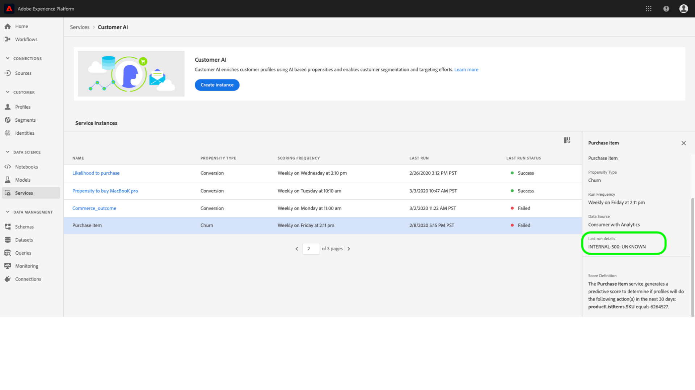
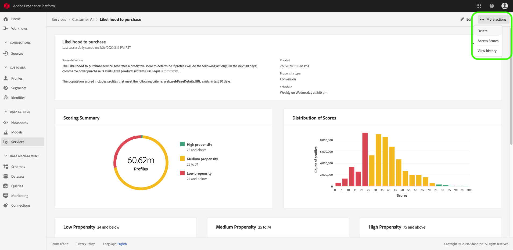

# Découverte des informations avec l’API client

Dans le cadre d’Intelligent Services, l’API du client permet aux spécialistes du marketing d’exploiter Adobe Sensei pour anticiper l’action future de vos clients. Customer AI est utilisée pour générer des scores de propension personnalisés tels que les taux d’attrition et de conversion de profils individuels à grande échelle. Cette opération s’effectue sans qu’il soit nécessaire de transformer les besoins professionnels en un problème d’apprentissage automatique, en choisissant un algorithme, une formation ou un déploiement.

Ce document sert de guide pour l’interaction avec les informations d’instance de service dans l’interface utilisateur d’intelligence artificielle du client Intelligent Services.

## Prise en main

Pour utiliser les statistiques de l’IA du client, vous devez disposer d’une instance de service avec un état d’exécution réussi. Pour créer une instance de service, consultez [Configuration d’une instance](./configure.md)d’API client. Si vous avez récemment créé une instance de service et qu’elle continue à s’entraîner et à marquer des points, veuillez lui accorder 24 heures pour qu’elle se termine.

## Présentation de l’instance de service

In the Adobe Experience Platform UI, click **[!UICONTROL Services]** in the left navigation. Le navigateur *Services* s’affiche et affiche les services intelligents disponibles. In the container for Customer AI, click **[!UICONTROL Open]**.

La page Service d’IA du client s’affiche. Cette page liste les instances de service de l’API client et affiche des informations à leur sujet, notamment le nom de l’instance, le type de propension, la fréquence d’exécution de l’instance et l’état de la dernière mise à jour.

>[!NOTE] Seules les instances de service ayant terminé des exécutions de notation réussies ont des informations.

Cliquez sur le nom d’une instance de service pour commencer.

Ensuite, la page d’informations de cette instance de service s’affiche, dans laquelle vous pouvez visualiser vos données. Les visualisations et ce que vous pouvez faire avec les données sont expliqués plus en détail dans ce guide.

### Détails de l’instance de service

Il existe deux façons de vue des détails de l’instance de service : la première provient du tableau de bord et la seconde de l’instance de service.

Pour vue des détails depuis le tableau de bord, cliquez sur un conteneur d’instance de service en évitant l’hyperlien qui est associé au nom. Cela ouvre un rail droit qui fournit des détails supplémentaires tels que la description, la fréquence de notation, l’objectif de prévision et la population admissible. De plus, vous pouvez modifier et supprimer l’instance en cliquant sur **[!UICONTROL Edit]** ou **[!UICONTROL Delete]**.

>[!NOTE] Dans le événement d’échec d’une exécution de score, un message d’erreur est fourni. Le message d’erreur est répertorié sous les détails *de la* dernière exécution dans le rail de droite, qui n’est visible que pour les échecs d’exécution.

La deuxième façon de vue des détails supplémentaires d’une instance de service se trouve dans la page d’informations. Vous pouvez cliquer dans **[!UICONTROL Show more]** l’angle supérieur droit pour remplir une liste déroulante. Les détails sont répertoriés, tels que la définition de score, la date de création et le type de propension. Pour plus d’informations sur l’une des propriétés répertoriées, consultez [Configuration d’une instance](./configure.md)d’API client.

### Modification d’une instance

Pour modifier une instance, cliquez sur **[!UICONTROL Edit]** dans le volet de navigation supérieur droit.

La boîte de dialogue Modifier s’affiche, vous permettant de modifier la *description* et la fréquence *de* score de l’instance. Pour confirmer vos modifications et fermer la boîte de dialogue, cliquez sur **[!UICONTROL Edit]** dans le coin inférieur droit.

### Autres actions

Le **[!UICONTROL More actions]** bouton se trouve dans le volet de navigation supérieur droit en regard de **[!UICONTROL Edit]**. Cliquez sur **[!UICONTROL More actions]** pour ouvrir une liste déroulante qui vous permet de sélectionner l’une des opérations suivantes :

- **[!UICONTROL Delete]**: Supprime l’instance.
- **[!UICONTROL Access scores]**: En cliquant sur les scores ** d’accès, vous ouvrez une boîte de dialogue contenant un lien vers les scores de [téléchargement pour le didacticiel d’IA](./download-scores.md) client. La boîte de dialogue fournit également l’ID de jeu de données requis pour effectuer des appels d’API.
- **[!UICONTROL View run history]**: Une boîte de dialogue contenant la liste de toutes les exécutions de notation associées à l’instance de service s’affiche.

## Résumé du score {#scoring-summary}

Le résumé du score affiche le nombre total de profils marqués et les classe en intervalles contenant une propension élevée, moyenne et faible. Les intervalles de propension sont déterminés en fonction de la plage de notes, faible est inférieur à 24, moyen est de 25 à 74 et élevé est supérieur à 74. Chaque compartiment a une couleur correspondant à la légende.

>[!NOTE] S’il s’agit d’un score de propension de conversion, les scores élevés sont affichés en vert et les scores faibles en rouge. Si vous prédites que la propension à l&#39;agitation est inversée, les scores élevés sont en rouge et les scores faibles en vert. Le compartiment moyen reste jaune quel que soit le type de propension choisi.

## Répartition des scores

La carte *Distribution des scores* vous donne un récapitulatif visuel de la population en fonction de la note. Les couleurs affichées dans la carte *Distribution des scores* représentent le type de score de propension généré.

## Facteurs influents

Pour chaque intervalle de score, une carte est générée qui présente les 10 principaux facteurs influents pour ce intervalle. Les facteurs influents vous donnent des détails supplémentaires sur la raison pour laquelle vos clients appartiennent à divers groupes de notes.

### Création d’un segment

Le fait de cliquer sur le **[!UICONTROL Create Segment]** bouton dans l’un des compartiments pour une propension faible, moyenne et élevée vous redirige vers le créateur de segments.

>[!NOTE]
>Le **[!UICONTROL Create Segment]** bouton n’est disponible que si le Profil client en temps réel est activé pour le jeu de données. Pour plus d’informations sur la façon d’activer le Profil client en temps réel, consultez la présentation [du Profil client en temps](../../../rtcdp/overview.md)réel.

Le créateur de segments permet de définir un segment. Lors d’une sélection **[!UICONTROL Create Segment]** dans la page Statistiques, l’API du client ajoute automatiquement les informations d’intervalles sélectionnés au segment. Pour terminer la création de votre segment, renseignez simplement les conteneurs *Nom* et *Description* situés dans le rail droit de l’interface utilisateur du créateur de segments. Après avoir donné un nom et une description au segment, cliquez sur **[!UICONTROL Save]** dans l’angle supérieur droit.

>!![NOTE] Les scores de propension étant écrits sur un profil individuel, ils sont disponibles dans le créateur de segments comme tout autre attribut de profil. Lorsque vous accédez au créateur de segments pour créer de nouveaux segments, vous pouvez afficher tous les divers scores de propension sous l’IA du client espace de nommage.

Pour vue de votre nouveau segment dans l’interface utilisateur de la plate-forme, cliquez **[!UICONTROL Segments]** dans le volet de navigation de gauche. La page de *navigation* s’affiche et affiche tous les segments disponibles.

## Étapes suivantes

Ce document décrit les informations fournies par une instance de service d’IA client. Vous pouvez maintenant poursuivre la lecture du didacticiel sur le [téléchargement des scores dans l’API](./download-scores.md) client ou parcourir les autres guides [Adobe Intelligent Services](../../home.md) qui sont proposés.

## Ressources supplémentaires

La vidéo suivante explique comment utiliser l’IA du client pour visualiser la sortie des modèles et des facteurs influents.

>[!VIDEO](https://video.tv.adobe.com/v/32666?learn=on&quality=12)