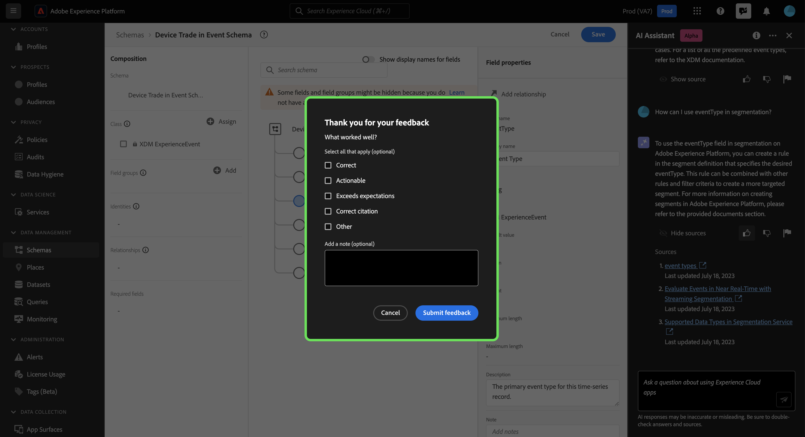

# Assistant IA pour Adobe Experience Platform

>[!NOTE]
>
>L’assistant d’IA pour Adobe Experience Platform se trouve actuellement dans Alpha. Les fonctionnalités et la documentation sont susceptibles d’être modifiées.

L’assistant d’IA pour Adobe Experience Platform est une fonctionnalité de l’interface utilisateur que vous pouvez utiliser pour parcourir et comprendre les concepts d’Experience Platform et de Real-time Customer Data Platform, ainsi que les informations d’utilisation relatives à vos objets.

Vous pouvez interroger l’assistant d’IA pour obtenir des informations telles que :

* Conseils sur l’exécution des tâches relatives aux données et aux audiences.
* Statuts et mesures des objets de données existants dans votre entreprise.
* Utilisez des exemples de cas et des nuances pour mieux comprendre vos objets de données, notamment les attributs, les jeux de données, les destinations, les schémas, les segments et les sources.

Ce document fournit des informations sur la manière dont vous pouvez accéder à l’assistant d’IA et l’utiliser pour poser des questions et recevoir des réponses sur les concepts Experience Platform et Real-Time CDP.

>[!BEGINSHADEBOX]

**Comment fonctionne l’assistant d’IA ?**

L’assistant d’IA répond aux questions que vous avez envoyées en interrogeant une base de données, puis en traduisant les données de la base de données en une réponse lisible.

Cette représentation interne des données sous-jacentes est également connue sous le nom de graphique de la connaissance : un réseau complet de concepts, de données et de métadonnées pour une réponse donnée.

Le graphique des connaissances se compose de sous-graphiques qui sont référencés chaque fois que des requêtes sont envoyées :

* Données d’utilisation du client.
* Données d’utilisation du client sur plusieurs métamarques.
* Documentation Experience League.

Il existe deux types de questions à prendre en compte avant d’interroger l’assistant d’IA :

* **Questions sur le concept**: les questions de concept portent sur les concepts d’Adobe liés aux données ou aux audiences. Voici quelques exemples de questions conceptuelles :
   * Quelle est la différence entre la segmentation par lots et par flux ?
   * Existe-t-il des modèles de données de l’industrie et comment les utiliser ?
   * À quoi Real-Time CDP est-il le mieux utilisé ?
* **Questions d’utilisation**: les questions d’utilisation portent sur les objets de données de votre entreprise. Voici quelques exemples de questions d’utilisation :
   * Combien de jeux de données ai-je ?
   * Combien d’attributs de schéma n’ont jamais été utilisés ?
   * Quels segments ont été activés ?

>[!ENDSHADEBOX]

## Accès à l’assistant AI pour les Experience Platform dans l’interface utilisateur

Vous pouvez accéder à l’assistant d’IA à partir de la navigation de l’en-tête dans l’interface utilisateur de l’Experience Platform.

Sélectionnez la variable **[!UICONTROL Icône Assistant IA]** dans l’en-tête pour lancer le panneau de l’assistant d’IA.

À partir de là, vous pouvez saisir votre question dans la zone de texte et interroger l’assistant d’IA à la recherche de concepts relatifs aux données ou aux audiences. Vous pouvez également poser des questions sur vos objets de données afin de mieux comprendre comment les utiliser dans vos cas d’utilisation respectifs.

### Exemple de cas pratique : utilisez l’assistant d’IA pour accélérer le processus de création de schéma

>[!NOTE]
>
>L’exemple de workflow suivant utilise le processus de création de schémas ExperienceEvent pour illustrer l’utilisation de l’assistant AI lors de l’utilisation de l’interface utilisateur Experience Platform.

Prenons un cas d’utilisation où vous créez une **Commerce des périphériques dans le schéma d’événement**. Au cours du processus de création de schéma ExperienceEvent, vous rencontrez le `eventType` champ . À ce stade, vous pouvez quitter votre workflow et consulter la documentation de la section [principes de base de la composition d’un schéma](../xdm/schema/composition.md)ou vous pouvez utiliser l’assistant d’IA pour obtenir des réponses immédiates à vos questions.

Pour commencer, saisissez votre question dans la zone de texte fournie. Dans l’exemple ci-dessous, l’assistant d’IA répond à la question : &quot;Quel est le champ eventType dans un schéma Experience Event ?&quot;

L’assistant d’IA interroge ensuite sa base de connaissances et calcule une réponse. Après quelques instants, l’assistant d’IA renvoie une réponse et des suggestions associées que vous pouvez utiliser comme invites de suivi.

Vous pouvez en savoir plus sur un sujet particulier en posant une question suivante. Dans l’exemple suivant, on demande à l’assistant d’IA comment eventType peut être utilisé dans la segmentation.

Vous pouvez également poser des questions sur l’utilisation des données à l’assistant d’IA. Pour toute question concernant l’utilisation des données, vous devez être dans un environnement de test actif afin que l’assistant d’IA puisse répondre à votre requête.

Avec chaque réponse, l’assistant d’IA vous permet de valider votre réponse en affichant sa source. Les liens vers la documentation sont fournis pour les questions de concept, tandis que les questions d’utilisation des données peuvent être vérifiées avec une requête SQL qui montre comment la réponse a été calculée.

>[!BEGINSHADEBOX]

**Vos commentaires sont demandés**

Au cours de cette étape Alpha, vous êtes invité à fournir des commentaires sur les réponses que vous recevez de l’assistant d’IA. Toutes les réponses et les commentaires envoyés sont examinés afin de continuer à améliorer l’expérience de l’assistant d’IA.

Pour fournir des commentaires, sélectionnez la ou les pouces vers le haut ou vers le bas après avoir reçu une réponse de l’assistant d’IA, puis saisissez vos commentaires dans la zone de texte fournie. Ensuite, sélectionnez **[!UICONTROL Envoyer les commentaires]** à soumettre.

>[!ENDSHADEBOX]

>[!BEGINTABS]

>[!TAB Afficher la source]

Sélectionner **[!UICONTROL Afficher la source]** pour obtenir une liste des liens vers la documentation à laquelle l’assistant d’IA fait référence pour calculer sa réponse.

>[!TAB Pouces vers le haut]

Sélectionnez l’icône de la barre d’outils pour vous faire part de vos commentaires sur les fonctionnalités de l’assistant d’IA.

>[!TAB Menu déroulant]

Sélectionnez l’icône de menu déroulant pour fournir des commentaires sur les améliorations qui pourraient être apportées en fonction de votre expérience avec l’assistant d’IA. Au cours de cette étape, vous pouvez également fournir des commentaires spécifiques sur votre expérience. Les commentaires fournis dans les commentaires sont examinés quotidiennement.

>[!TAB Indicateur]

Sélectionnez l’icône d’indicateur pour fournir d’autres rapports sur votre expérience à l’aide de l’assistant d’IA.

>[!ENDTABS]

### Idées de démarrage

Vous pouvez également utiliser les invites prédéfinies fournies par l’assistant d’IA pour commencer.

## Informations supplémentaires

Reportez-vous à cette section pour plus d’informations sur l’assistant d’IA pour les Experience Platform.

### Portée

L’assistant d’IA peut répondre à des requêtes en fonction de la documentation et de l’utilisation des données.

#### Documentation

Vous pouvez poser des questions à la documentation en fonction de Real-time Customer Data Platform et des audiences. Actuellement, l’index de documentation couvre Adobe Experience Platform (Real-Time CDP et Audiences). L’index est mis à jour régulièrement.

Le modèle de récupération de documentation est formé sur Experience Platform (Real-Time CDP et Audiences). Il n’est pas possible de répondre à des questions en dehors du cadre de Adobe Experience Platform, telles que des questions sur d’autres produits Adobe tels qu’Adobe Target et la suite de Creative Cloud.

#### Utilisation des données

Vous pouvez également poser des questions à l’assistant d’IA sur l’utilisation de vos données dans les domaines suivants :

* Attributs
* Jeux de données
* Destinations
* Schémas
* Segments
* Sources

Pour les requêtes de données d’utilisation, les réponses peuvent ne pas refléter l’état actuel de l’interface utilisateur. Les données sur lesquelles reposent ces questions sont mises à jour toutes les 12 à 24 heures. Vous devrez peut-être mettre en forme vos questions comme : &quot;Quand le segment a-t-il eu le titre ? {TITLE} created ?&quot; au lieu de &quot;Quand était le {TITLE} segment créé ?&quot;

Vous devrez vous connecter à un environnement de test pour obtenir des informations sur des données spécifiques liées à des objets tels que les schémas, les jeux de données, les attributs, les destinations et les segments.

+++Sélectionnez pour obtenir la liste des questions d’utilisation des données prises en charge

Vous trouverez ci-dessous une liste des questions d’utilisation des données actuellement prises en charge, regroupées par domaine.

>[!BEGINTABS]

>[!TAB Segments]

* Existe-t-il des segments en double ?
* Afficher tous les segments en continu.
* Est le segment nommé {SEGMENT_ID} évalué dans Batch OR Stream ?
* Quels segments sont des doublons ?
* Combien de segments y a-t-il au total ?
* Existe-t-il des segments portant le même nom mais ayant des ID différents ?
* Quelle est la distribution des méthodes d’évaluation (par lot, en périphérie, en flux continu) entre les segments ?
* Afficher une liste des segments qui ont été modifiés pour la dernière fois le mois dernier.
* Quels segments ont été modifiés la semaine dernière ?
* Certains segments n’ont-ils pas été modifiés au cours des six derniers mois ?
* Liste des segments créés l’année dernière.
* Afficher les segments qui ont été modifiés pour la dernière fois avant aujourd’hui.
* Existe-t-il des schémas ou des tendances dans les dates de création de segments au cours de l’année écoulée ?
* Pouvez-vous identifier les segments qui n’ont pas été modifiés depuis leur création ?
* Certains segments n’ont-ils pas été modifiés depuis leur création ?
* Quelle est la tendance de la création de segments au fil du temps ?
* Quelle est la distribution des dates de création de segment ?
* Quelle est la distribution des dates de modification de segment ?
* Quels segments comportent le plus de profils utilisateur ?
* Quels segments comportent le moins de profils utilisateur ?
* Liste de tous les segments par lot.
* Liste de tous les segments Edge.
* Quels segments sont activés ?
* Quels segments sont transférés vers Facebook ?
* Le segment est-il nommé &quot;Clients APAC&quot; par lot ou en flux continu ?
* Combien de profils comporte le segment Travail actif ?
* L’un de mes segments comporte-t-il 0 profil ?
* Quels jeux de données ont un impact sur le segment de fidélité bronze ?
* Quelles définitions de segment utilisent les champs XDM qui contiennent &quot;gender&quot; ?
* Quels champs XDM renseignés se produisent dans les segments en flux continu ?
* Combien de champs XDM y a-t-il dans toutes les définitions de segment ?
* Quels segments le jeu de données &quot;Utilisateurs professionnels&quot; a-t-il un impact ?
* Quels segments sont transférés vers l’API HTTP ?
* Parmi les segments activés, lesquels sont activés pour le plus grand nombre de types de destinations ?
* Quel est le nombre total de segments activés ?
* Combien de segments sont activés ?
* Combien de segments en double sont activés ?
* Combien de segments sont activés pour chaque destination ?
* Quels segments sont activés pour 0, 1 ou plusieurs destinations ? Afficher la distribution.
* Quels segments sont activés pour le plus grand nombre de destinations ?
* Quels segments en double sont activés ?
* Quels segments sont activés dans Adobe Target ?
* Sur tous les segments, combien de fois chaque stratégie de fusion est-elle utilisée ?

>[!TAB Schémas]

* Combien de schémas XDM sont définis ?
* Quels sont les schémas créés le plus récemment ?
* Combien de schémas pour chaque classe XDM ?
* Quel schéma le jeu de données &quot;Segment Ingestion&quot; utilise-t-il ?
* Quels schémas ne sont utilisés par aucun jeu de données ?

>[!TAB Destinations]

* Combien de destinations y a-t-il ?
* Quelles sont les destinations créées le plus récemment ?
* Quelles destinations sont associées à chaque segment ?

>[!TAB Sources]

* Combien de sources ont été créées ?
* Quelles sont les sources créées le plus récemment ?
* Combien de sources sont disponibles, réparties par catégorie ?
* Puis-je créer une connexion source à partir de S3 ?
* Quelles sources ont contribué au jeu de données Mutual365 ?

>[!TAB Jeux de données]

* Combien de jeux de données y a-t-il ?
* Quels sont les jeux de données créés le plus récemment ?
* Quels jeux de données sont activés pour le profil unifié ?
* Existe-t-il un paramètre TTL pour le jeu de données d’ingestion de segments ?
* Qu’est-ce que la durée de vie du jeu de données des utilisateurs professionnels ?
* Quels jeux de données utilisent le schéma Utilisateurs professionnels ?

>[!TAB Attributs]

* Quels sont les champs XDM les plus fréquemment renseignés dans tous les jeux de données ?
* Quels sont les champs et attributs XDM les plus couramment utilisés dans les schémas ?
* Quels champs et attributs XDM sont utilisés dans le schéma Utilisateurs professionnels ?
* Liste des attributs utilisés pour ce segment avec identifiant {SEGMENT_ID}.
* Combien de champs XDM sont utilisés dans 2 segments ou plus ?
* Quels sont les champs les plus couramment utilisés dans les segments ?
* Des champs sont-ils utilisés dans un seul segment ?
* Quels attributs sont utilisés pour le segment de fidélité Bronze ?
* Quels attributs ne sont utilisés dans aucun segment ?
* Quels sont les attributs les plus couramment utilisés dans les segments ?

>[!ENDTABS]

+++

### Expérience de conversation

Lorsque vous interrogez l’assistant d’IA, vous devez tenir compte de plusieurs nuances relatives à l’expérience conversationnelle.

>[!NOTE]
>
>Ces limites sont temporaires et sont améliorées tout au long de l’alpha.

>[!BEGINTABS]

>[!TAB Impossible de déduire le contexte de la discussion préalable]

Actuellement, l’assistant d’IA ne peut pas référencer les discussions précédentes comme contexte pour une question donnée. Consultez le tableau ci-dessous pour obtenir des exemples :

| Question ambiguë | Effacer la question | Remarque |
| --- | --- | --- |
| <ul><li>Première question : Qu’est-ce qu’un segment ?</li><li>Question de suivi : &quot;Y a-t-il différents types ?&quot;</li></ul> | <ul><li>Première question : Qu’est-ce qu’un segment ?</li><li>Question de suivi : &quot;Existe-t-il différents types de **segments**?&quot;</li></ul> | L’assistant d’IA ne peut pas déduire ce que &quot;eux&quot; signifie. |
| <ul><li>Première question : Qu’est-ce qu’un segment ?</li><li>Question de relance : &quot;Pouvez-vous développer plus ?&quot;</li></ul> | <ul><li>Première question : Qu’est-ce qu’un segment ?</li><li>Question de suivi : &quot;Expliquer en détail un segment&quot;</li></ul> | L’assistant d’IA ne peut pas référencer intelligemment la documentation en fonction de &quot;plus&quot;. |
| <ul><li>Première question : Qu’est-ce qu’un segment ?</li><li>Question de relance : &quot;Pouvez-vous me donner un exemple ?&quot;</li></ul> | <ul><li>Première question : Qu’est-ce qu’un segment ?</li><li>Question suivante : &quot;Pouvez-vous me donner un exemple de segment ?&quot;</li></ul> | L’assistant d’IA ne peut pas déduire ce que vous souhaitez d’un exemple. |
| <ul><li>Première question : &quot;Qu’est-ce qu’un segment par lot ?&quot;</li><li>Question de suivi : &quot;Comment se compare-t-il à un segment en continu ?&quot;</li></ul> | <ul><li>Première question : &quot;Qu’est-ce qu’un segment par lot ?&quot;</li><li>Question de suivi : &quot;Pouvez-vous comparer un segment en continu à un segment par lot ?&quot;</li></ul> | L’assistant d’IA ne peut pas déduire à quel &quot;il&quot; fait référence et ne peut donc pas comparer le segment de diffusion en continu. |
| <ul><li>Première question : &quot;Combien de segments ai-je ?&quot;</li><li>Question suivante : &quot;Combien d’entre eux utilisent Facebook comme destination ?&quot;</li></ul> | <ul><li>Première question : &quot;Combien de segments ai-je ?&quot;</li><li>Question de relance : &quot;Combien de segments que j’ai utilisent Facebook comme destination ?&quot;</li></ul> | L’assistant d’IA ne peut pas déduire à quoi &quot;eux&quot; fait référence. |

{style="table-layout:auto"}

>[!TAB Impossible de déduire le contexte d’une page]

Lorsque vous demandez à l’assistant d’IA un élément particulier de la page de l’interface utilisateur Experience Platform sur laquelle vous vous trouvez, vous devez définir clairement l’élément spécifique dans votre question.

| Question ambiguë | Effacer la question | Remarque |
| --- | --- | --- |
| &quot;Qu&#39;est-ce que ça fait ?&quot; | &quot;What {PAGE_NAME} le faire ? | L’assistant d’IA ne peut pas déduire à quoi &quot;ceci&quot; fait référence. Vous devez fournir l’élément de page spécifique sur lequel vous interrogez. |
| &quot;Pourquoi ne le sauverait-il pas ?&quot; | &quot;Pourquoi ne puis-je pas enregistrer un nouvel environnement de test appelé {NAME}?&quot; | L’assistant d’IA ne peut pas déduire à quel &quot;il&quot; fait référence et ne peut pas savoir que vous rencontrez des problèmes avec une entité. |

{style="table-layout:auto"}

En outre, l’assistant d’IA ne peut répondre qu’aux questions concernant les messages d’erreur, étant donné que l’erreur est documentée dans Experience League.

>[!TAB Ambiguïté]

Vous devez formuler clairement vos questions et les placer dans un produit, une application ou un domaine, car l’assistant d’IA ne peut actuellement pas les résoudre.

| Question ambiguë | Effacer la question | Remarque |
| --- | --- | --- |
| &quot;Comment créer un filtre ? | Comment créer un filtre dans le langage de requête de profil ? | Vous devez spécifier la fonction pour laquelle vous effectuez un filtrage, car diverses fonctionnalités Experience Platform prennent en charge le filtrage. |
| &quot;Comment puis-je commencer ? | Comment commencer à utiliser les destinations ? | Vous devez clarifier vos objectifs et votre cas d’utilisation, car des concepts trop généraux peuvent donner lieu à des réponses génériques ou inutilement spécifiques. |

{style="table-layout:auto"}

>[!ENDTABS]

### Petite discussion limitée

Vous pouvez discuter avec l’assistant d’IA, mais cette capacité est actuellement limitée.

### Questions relatives aux fonctionnalités

L’assistant d’IA peut donner une impression inexacte de ce qu’il peut faire. Il peut répondre incorrectement aux types de questions suivants :

| Exemple de question | Remarque |
| --- | --- |
| &quot;Pouvez-vous répondre à des questions sur {ENTITY}?&quot; | Tant que l’assistant d’IA est en mesure de trouver une seule page référençant une entité donnée dans son index, il répondra oui. |
| &quot;Vous savez **x** la langue ?&quot; | Actuellement, l’assistant d’IA ne prend en charge que l’anglais, mais peut répondre &quot;oui&quot; en raison du modèle sous-jacent qui peut le prendre en charge. |
| &quot;Pouvez-vous... ?&quot; | L’assistant d’IA peut répondre oui, même s’il ne le peut pas. |

### Astuces

#### Une mauvaise source d’informations peut répondre aux questions.

Il existe des cas où votre question sur vos données d’utilisation peut donner lieu à une réponse basée sur la documentation. En effet, l’assistant d’IA peut incorrectement acheminer votre question vers la mauvaise source d’informations. Vous pouvez empêcher cela en procédant comme suit :

* Reformulation de votre question pour utiliser plus de langage de type SQL
* Appel explicite de la source d’information à utiliser.

Lisez le tableau ci-dessous pour obtenir des exemples :

| Mauvaise question | Bonne question | Notes |
| --- | --- | --- |
| Quel est mon segment le plus important ? | Quel est mon segment le plus important ? Utiliser les données. | Indiquez explicitement à l’assistant d’IA que vous souhaitez que la réponse soit basée sur les données. |
| Quel est mon segment le plus important ? | Liste de mon segment le plus important. | Il existe des cas où une question &quot;quoi...&quot; peut être confondue avec une question basée sur la documentation. L’utilisation d’une commande telle que &quot;list&quot; est un indicateur plus fort que vous posez une question avec des données en contexte. |
| Combien de jeux de données ai-je ? | Comptez mes jeux de données. | Bien que les segments de question d’origine ne fonctionnent pas avec les jeux de données. |
