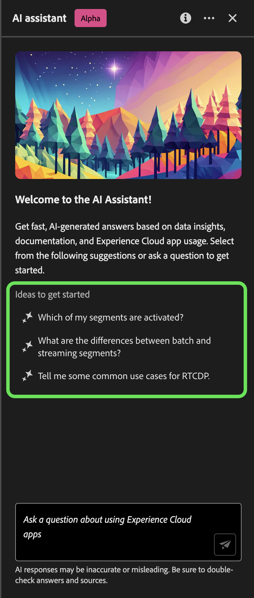
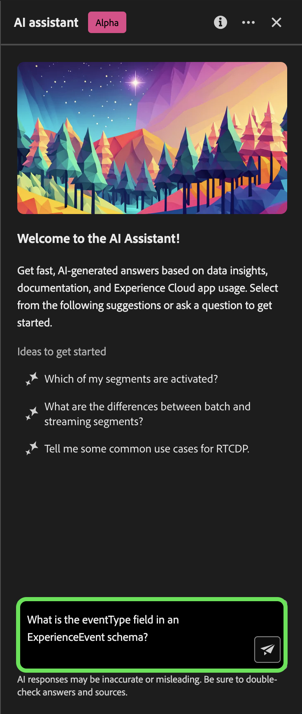
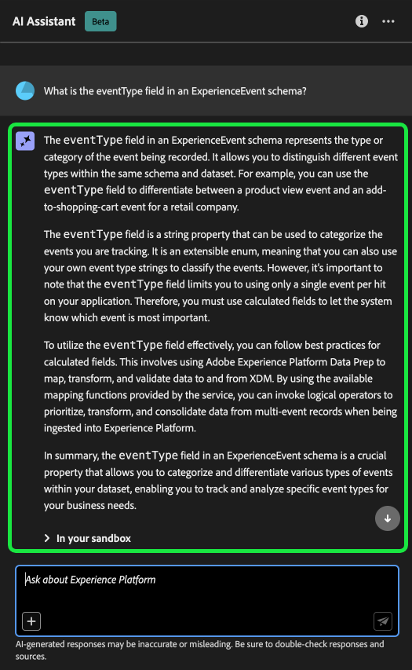

# Assistant IA pour Adobe Experience Platform

>[!NOTE]
>
>L’assistant AI pour Adobe Experience Platform est actuellement en version bêta. Les fonctionnalités et la documentation sont susceptibles d’être modifiées.

L’assistant d’IA est une fonctionnalité de l’interface utilisateur que vous pouvez utiliser pour parcourir et comprendre les concepts de Adobe Experience Platform et de Real-time Customer Data Platform ainsi que les informations d’utilisation relatives à vos objets.

Vous pouvez interroger l’assistant IA pour obtenir des informations telles que :

* Conseils sur l’exécution des tâches relatives aux données et aux audiences.
* Statuts et mesures des objets de données existants dans votre entreprise.
* Utilisez des exemples de cas et des nuances pour mieux comprendre vos objets de données, notamment les attributs, les audiences, les flux de données, les jeux de données, les destinations, les schémas et les sources.

Lisez le guide ci-dessous pour découvrir comment utiliser l’assistant d’IA pour vous aider à parcourir et à comprendre vos workflows Experience Platform et Real-Time CDP.

>[!BEGINSHADEBOX]

**Comment fonctionne l’assistant d’IA ?**

L’assistant d’IA répond aux questions que vous avez envoyées en interrogeant une base de données, puis en traduisant les données de la base de données en une réponse lisible.

Cette représentation interne des données sous-jacentes est également connue sous le nom de graphique de la connaissance : un réseau complet de concepts, de données et de métadonnées pour une réponse donnée.

Le graphique des connaissances se compose de sous-graphiques qui sont référencés chaque fois que des requêtes sont envoyées :

* Données d’utilisation du client.
* Données d’utilisation du client sur plusieurs métamarques.
* Documentation Experience League.

Il existe deux types de questions à prendre en compte avant d’interroger l’assistant d’IA :

* **Questions sur le concept**: les questions de concept portent sur les concepts d’Adobe liés aux données ou aux audiences. Voici quelques exemples de questions conceptuelles :
   * Quelle est la différence entre la segmentation par lots et par flux ?
   * Existe-t-il des modèles de données de l’industrie et comment les utiliser ?
   * À quoi Real-Time CDP est-il le mieux utilisé ?
* **Questions d’utilisation**: les questions d’utilisation portent sur les objets de données de votre entreprise. Voici quelques exemples de questions d’utilisation :
   * Combien de jeux de données ai-je ?
   * Combien d’attributs de schéma n’ont jamais été utilisés ?
   * Quelles audiences ont été activées ?

>[!ENDSHADEBOX]

## Objectifs que vous pouvez atteindre avec l’assistant d’IA {#objectives}

Vous pouvez utiliser l’assistant d’IA pour des objectifs tels que :

| Objectif | Description | Exemple |
| --- | --- | --- |
| Concepts d’apprentissage et workflows continus | <ul><li>En tant qu’utilisateur novice, vous pouvez utiliser l’assistant d’IA pour découvrir les concepts de Real-Time CDP et de Adobe Journey Optimizer et vous inscrire à des produits et fonctionnalités que vous ne connaissez pas.</li><li>En tant qu’utilisateur expérimenté, vous pouvez utiliser l’assistant d’IA pour résoudre un cas de périphérique qui bloque peut-être votre workflow. | <ul><li>Comment configurer un tableau de bord dans Parcours Analytics ?</li><li>Indiquez-moi quelques cas d’utilisation pour Real-Time CDP.</li></ul> |
| Dépannage | Utilisez l’assistant d’IA pour découvrir comment déboguer les erreurs de base que vous pouvez rencontrer dans votre workflow. | <ul><li>Que fait cette erreur ? {ERROR_MESSAGE} vous voulez dire ?</li><li>Pourquoi ne puis-je pas supprimer l’audience nommée &quot;Luma : Email Audience&quot; ?</li></ul> |
| hygiène des environnements de test | Utilisez l’assistant d’IA pour identifier les doublons ou les objets inutilisés afin de gérer efficacement votre environnement de test. | <ul><li>Pouvez-vous me montrer des audiences qui sont similaires ?</li><li>Existe-t-il des schémas qui n’ont pas de jeu de données associé ?</li></ul> |
| Analyse de valeur | Utilisez l’assistant d’IA pour identifier les objets de données les plus utilisés et évaluer les indicateurs de performances ou rechercher les objets de données les plus précieux. | <ul><li>Combien de profils se trouvent dans notre définition de segment &quot;Luma: Email Audience&quot; ?</li><li>Quand les audiences ont-elles été activées vers la destination Audiences Experience Cloud ?</li></ul> |
| Recherche | Utilisez l’assistant d’IA pour rechercher les objets Experience Platform pris en charge tels que les audiences, les jeux de données, les destinations, les schémas et les sources. | <ul><li>Répertorier les audiences contenant &quot;Luma&quot; dans le nom qui ont été créées au cours du dernier trimestre.</li><li>Quels attributs se trouvent dans le schéma XDM &quot;Luma: Custom Actions&quot; ?</li></ul> |
| Analyse de l’impact | Utilisez l’assistant d’IA pour identifier les objets de données qui ont été utilisés dans certains workflows afin que vous puissiez évaluer l’impact de toute modification. | <ul><li>Quelles audiences utilisent `homeAddress.city` dans le schéma &quot;Luma: PersonProfiles&quot; ?</li><li>Quels jeux de données sont les `consents.marketing.push.val` attribut de profil stocké dans ?</li></ul> |

## Accès à l’assistant d’IA dans l’interface utilisateur d’Experience Platform

Pour lancer l’assistant, sélectionnez la méthode **[!UICONTROL Icône Assistant IA]** dans l’en-tête supérieur de l’interface utilisateur de l’Experience Platform.

L’interface de l’assistant d’IA s’affiche, vous fournissant immédiatement des informations pour commencer. Vous pouvez utiliser les options fournies sous [!UICONTROL Idées de démarrage] pour répondre à des questions et à des commandes telles que :

* [!UICONTROL Laquelle de mes audiences est activée ?]
* [!UICONTROL Qu’est-ce qu’un schéma ?]
* [!UICONTROL Indiquez-moi quelques cas d’utilisation courants pour Real-Time CDP]

Pour interagir avec l’assistant d’IA, utilisez la zone de saisie pour saisir vos requêtes ou commandes. Vous pouvez également utiliser la variable (**`+`**) pour utiliser la fonction de saisie semi-automatique et l’icône en forme de signet afin d’accéder à vos requêtes et commandes marquées d’un signet.

## Exemple de cas pratique : utilisation de l’assistant AI pour accélérer le processus de création de schémas

>[!NOTE]
>
>Le workflow suivant est un exemple qui utilise le processus de création de schémas d’événements d’expérience pour illustrer l’utilisation de l’assistant d’IA lors de l’utilisation de l’interface utilisateur d’Experience Platform.

Prenons un cas d’utilisation où vous créez une **Commerce des périphériques dans le schéma d’événement**. Au cours du processus de création de schéma d’événement d’expérience, vous rencontrez le `eventType` champ . &quot;À ce stade, vous avez la possibilité de quitter votre workflow et de vous reporter à la section [principes de base de la composition d’un schéma](../xdm/schema/composition.md) ou vous pouvez utiliser l’assistant d’IA pour obtenir des réponses à vos questions et trouver des ressources supplémentaires au moyen des liens vers la documentation recommandés par l’assistant d’IA.&quot;

Pour commencer, saisissez votre question dans la zone de texte fournie à cet effet. Dans l’exemple ci-dessous, l’assistant d’IA répond à la question : &quot;**Quel est le champ eventType dans un schéma ExperienceEvent ?**&quot;

L’assistant d’IA interroge ensuite sa base de connaissances et calcule une réponse. Après quelques instants, l’assistant d’IA renvoie une réponse et des suggestions associées que vous pouvez utiliser comme invites de suivi.

Après avoir reçu une réponse de l’assistant d’IA, vous pouvez choisir parmi plusieurs options pour décider comment procéder.

### Enregistrer votre requête {#save-your-query}

+++Sélectionner pour afficher un exemple d’enregistrement d’une requête

Pour enregistrer votre requête, sélectionnez l’icône de signet en regard de votre question.

Pour accéder à vos requêtes enregistrées, sélectionnez l’icône de signet située sous la zone de saisie, puis sélectionnez la requête que vous souhaitez exécuter.

+++

### Affichage des données dans votre environnement de test {#view-data-in-your-sandbox}

+++Sélectionner pour afficher l’exemple

Selon votre requête, l’assistant d’IA fournit des informations supplémentaires sur les données de votre environnement de test. Pour voir comment la réponse à votre requête s’applique à votre environnement de test, sélectionnez **[!UICONTROL Dans votre environnement de test].**

Au cours de cette étape, l’assistant d’IA peut fournir des liens directs vers les pages de l’interface utilisateur de certains objets en question. Dans l’exemple ci-dessous, l’assistant d’IA fournit des liens directs vers le [!UICONTROL Schémas] et [!UICONTROL Segments] Pages de l’interface utilisateur.

+++

### Vérification de la réponse {#verify-the-response}

+++Sélectionner pour afficher un exemple d’affichage des sources

Pour afficher les citations et valider la réponse de l’assistant d’IA, sélectionnez **[!UICONTROL Afficher les sources]**. L’assistant d’IA fournit des liens vers la documentation qui corroborent sa réponse. Vous pouvez également utiliser les requêtes fournies par l’assistant d’IA sous [!UICONTROL Suggestions connexes] pour explorer plus en détail les sujets liés à votre requête d’origine.

+++

### Données d’utilisation et visualisation {#usage-data-and-visualization}

+++Sélectionnez cette option pour afficher un exemple de questions et de visualisation de données d’utilisation

Pour que l’assistant d’IA puisse répondre à une requête sur les données d’utilisation au sein de votre entreprise, vous devez être dans un environnement de test actif.

Dans l’exemple ci-dessous, l’assistant d’IA est fourni avec la requête suivante : **&quot;Afficher des définitions de segment avec plus de 1 000 profils et inclure l’état d’activation.&quot;** L’assistant d’IA répond ensuite avec un graphique qui visualise les données de votre segment et de votre profil.

Vous pouvez placer le pointeur de la souris sur une barre pour afficher des données spécifiques. Vous pouvez également cliquer sur l’icône Développer pour agrandir l’affichage du graphique.

Une vue développée de la visualisation s’affiche. Vous pouvez utiliser le modal développé pour inspecter davantage vos données et est particulièrement utile lorsque la visualisation revient avec un grand nombre de colonnes.

Lorsque vous y êtes invité avec une question sur les données d’utilisation, l’assistant d’IA vous explique comment il a calculé la réponse. Dans l’exemple ci-dessous, l’assistant d’IA décrit les étapes nécessaires pour afficher les définitions de segment avec plus de 1 000 profils et leurs états d’activation respectifs.

Vous pouvez également fournir des filtres et des modifications à vos requêtes, et vous pouvez demander à l’assistant d’IA de générer ses résultats en fonction des filtres que vous incluez. Par exemple, vous pouvez demander à l’assistant d’IA de vous afficher une tendance des définitions de segment de comptage dans l’ordre de leur date de création, de supprimer les définitions de segment avec zéro total de profils et d’utiliser des noms de mois plutôt que des entiers lors de l’affichage des données.

+++

### Utilisation de la saisie automatique {#use-auto-complete}

+++Sélectionner pour afficher un exemple de saisie automatique

Vous pouvez utiliser la fonction de saisie semi-automatique pour recevoir la liste des objets de données qui existent dans votre environnement de test. Les recommandations de saisie semi-automatique sont disponibles pour les domaines suivants : audiences, schémas, jeux de données, sources et destinations.

Vous pouvez utiliser la saisie automatique en incluant le symbole plus (**`+`**) dans votre requête. Vous pouvez également sélectionner le signe plus (**`+`**) située au bas de la zone de saisie de texte. Une fenêtre s’affiche avec une liste des objets de données recommandés de votre environnement de test.

Sélectionnez ensuite l&#39;objet de données à interroger pour terminer votre question, puis envoyez votre question.

+++

### Utiliser le multi-tour {#use-multi-turn}

+++Sélectionner pour afficher un exemple de multi-tour

Vous pouvez utiliser les fonctionnalités à plusieurs volets de l’assistant d’IA pour avoir une conversation plus naturelle au cours de votre expérience. Un assistant d’IA est en mesure de répondre aux questions de suivi, selon les besoins. ce contexte peut être déduit d’une interaction antérieure.

Dans l’exemple ci-dessous, l’assistant d’IA est invité à indiquer le nombre total de flux de données dans l’organisation actuelle.

Ensuite, l’assistant d’IA reçoit une autre demande de suivi. Cette fois, l’assistant d’IA répond en répertoriant les flux de données qui existent actuellement dans votre organisation.

+++

## Documentation {#documentation}

Actuellement, l’index de documentation couvre Adobe Experience Platform (Real-Time CDP et Audiences). L’index est mis à jour régulièrement.

Le modèle de récupération de documentation est formé sur Experience Platform (Real-Time CDP et Audiences). Il n’est pas possible de répondre à des questions en dehors du cadre de Adobe Experience Platform, telles que des questions sur d’autres produits Adobe tels qu’Adobe Target et la suite de Creative Cloud.

## Données d’utilisation {#usage-date}

Vous pouvez également poser des questions à l’assistant d’IA au sujet de vos données d’utilisation dans les domaines suivants :

* Attributs
* Audiences
* Flux de données
* Jeux de données
* Destinations _(Pour l’instant, il n’est pas possible de répondre aux questions concernant les comptes et à certaines questions concernant le flux de données.)_
* Schémas _(Pour l’instant, il n’est pas possible de répondre aux questions concernant les groupes de champs.)_
* Sources _(Pour l’instant, il n’est pas possible de répondre aux questions concernant les comptes.)_

Pour les requêtes de données d’utilisation, les réponses peuvent ne pas refléter l’état actuel de l’interface utilisateur. Les données sur lesquelles reposent ces questions sont mises à jour toutes les 24 heures. Par exemple, les modifications apportées par les utilisateurs dans Real-Time CDP pendant la journée sont synchronisées avec les entrepôts de données la nuit, puis elles deviennent disponibles pour les questions des utilisateurs le matin. De plus, vous devrez vous connecter à un environnement de test pour obtenir des informations sur des données spécifiques liées à des objets tels que des audiences, des schémas, des jeux de données, des attributs et des destinations.

### Exemples de questions sur les données d’utilisation {#example-usage-data-questions}

+++Cliquez pour afficher la liste des exemples de questions de données d’utilisation

Consultez le tableau ci-dessous pour obtenir des exemples de questions sur les données d’utilisation et de leurs cas d’utilisation respectifs :

| Type de question | Cas d’utilisation | Exemples |
| --- | --- | --- | 
| Parenté des données | Suivi de l’utilisation d’un ou de plusieurs objets sur d’autres objets Experience Platform | <ul><li>Quels jeux de données utilisent le schéma &quot;ACME&quot; ?</li><li>Combien de jeux de données ont été ingérés à l’aide du même schéma ?</li><li>Quels jeux de données ont été utilisés dans les audiences activées ?</li><li>Liste des schémas dont les attributs sont utilisés dans les audiences activées.</li><li>Montrez-moi les audiences qui sont activées sur les &quot;destinations ACME&quot; et qui ont plus de 1 000 profils.</li><li>Afficher les attributs utilisés dans les audiences activées qui ont été modifiées après janvier 2023.</li><li>Quels sont les jeux de données ingérés via la source &quot;ACME Amazon S3&quot; ?</li><li>Quels flux de données sont associés à &quot;Flux de données de fidélité ACME&quot; ?</li><li>Liste des schémas relatifs aux audiences activées et créés au cours de l’année écoulée.</li></ul> |
| Distribution et agrégations | Questions récapitulatives sur l’utilisation des objets Experience Platform | <ul><li>Quel est le pourcentage des audiences activées ?</li><li>Combien de champs sont utilisés dans la segmentation ?</li><li>Quelles audiences sont activées pour le plus grand nombre de destinations ?</li><li>Répertorier les audiences en double</li><li>Montrez-moi les audiences activées sur les &quot;destinations ACME&quot; et classez-les par taille de profil.</li><li>Quel est le pourcentage des audiences qui n’ont pas été activées mais comportent plus de 100 profils. Montrez-moi leurs noms.</li><li>Liste des 3 connecteurs source qui ingèrent des données dans mes jeux de données.</li><li>Listez-moi les 5 premiers attributs utilisés dans les audiences activées en fonction de leur occurrence.</li></ul> |
| Recherche d’objet | Récupérez ou accédez à un objet Experience Platform ou à ses propriétés. | <ul><li>Les jeux de données auxquels aucun schéma n’est associé</li><li>Répertorier les attributs utilisés pour &quot;Audience ACME&quot; ?</li><li>Indiquez-moi la liste des schémas dont le profil est activé mais qui n’ont pas été modifiés depuis leur création.</li><li>Quelles audiences ont été modifiées la semaine dernière ?</li><li>Listez-moi les audiences qui ont les mêmes définitions de segment avec leur date de création.</li><li>Les jeux de données activés par le profil et incluant le nombre d’audiences créées à partir de chaque jeu de données.</li><li>Quels comptes sources sont associés au jeu de données XYZ ?</li><li>Montrez-moi la définition de segment et la date de modification de &quot;l’audience ACME&quot;.</li></ul> |
| Comparaison des objets | Identifiez les audiences en double. | <ul><li>En fonction de leur définition de segment, répertorie les audiences qui sont des doublons.</li><li>Les audiences en double qui sont activées vers les &quot;destinations ACME&quot;.</li></ul> |

+++

## Expression de vos questions {#phrasing-your-questions}

Vous devez envoyer vos questions à l’assistant d’IA avec clarté et contexte afin d’obtenir une réponse aussi précise que possible. Reportez-vous à la liste suivante de conseils pour savoir comment poser une question claire avec contexte :

* Exposez votre tâche et/ou votre question de manière concise.
* Évitez d’utiliser un langage ambigu ou une syntaxe trop complexe pour faciliter la compréhension.
* Fournissez un contexte pertinent concernant votre tâche et/ou votre question, car le contexte peut aider l’assistant d’IA à générer des réponses plus pertinentes.

Lisez le tableau ci-dessous pour plus d’informations sur les bonnes pratiques à suivre lorsque vous posez des questions à l’assistant d’IA :

| Do | Exemple |
| --- | --- |
| <ul><li>Soyez précis sur l’objet ou les informations que vous souhaitez récupérer ou analyser.</li><li>Essayez de placer les noms des objets de données entre guillemets. Si vous ne connaissez qu’une partie du nom de l’objet, vous pouvez également l’indiquer dans la question.</li><li>Utilisation [saisie automatique d’objet](./ui-guide.md#use-auto-complete) pour aider l’assistant d’IA à mieux comprendre le contexte de votre requête.</li></ul> | <ul><li>Quels jeux de données utilisent le schéma &quot;Luma - Loyalty&quot; ?</li><li>Montrez-moi les segments activés dont le nom contient &quot;Luma&quot;. Classement par nombre de profils.</li></ul> |
| <ul><li>Éviter l’ambiguïté et utiliser un langage clair</li><li>Utilisez une terminologie précise pour une meilleure clarté dans votre requête.</li><li>Lorsque vous posez des questions concernant Adobe Experience Platform, essayez d’utiliser une terminologie spécifique à Experience Platform afin d’améliorer la pertinence des réponses.</li></ul> | <ul><li>Combien de profils ai-je dans &quot;Audience ACME&quot; ?</li><li>Montrez-moi les 5 premiers attributs XDM utilisés dans les audiences activées.</li></ul> |
| <ul><li>Précisez un contexte ou spécifiez un critère pour filtrer vos résultats.</li><li>Utilisez un critère de filtrage dans les questions pour limiter le volume de données dans la réponse.</li></ul> | <ul><li>Montrez-moi les audiences qui n’ont pas été activées et qui ont été créées il y a plus de 6 mois et n’ont jamais été modifiées.</li><li>Affichez-moi les audiences activées vers &quot;destination ACME&quot; et qui ont plus de 10 000 profils.</li></ul> |

{style="table-layout:auto"}

| Ne le faites pas | Exemple |
| --- | --- |
| Utilisez un langage vague ou ambigu. | <ul><li>Donnez-moi des informations sur les jeux de données.</li><li>Combien d’utilisateurs ai-je dans &quot;Audience ACME&quot; ?</li><li>Afficher les segments.</li><li>Attributs de liste.</li></ul> |
| Effectuez des requêtes incomplètes. | &quot;Luma - Jeu de données de fidélité&quot; |
| Prenons le savoir sans contexte. | <ul><li>Audiences des 6 derniers mois.</li><li>Construisez une requête pour moi.</li></ul> |
| Formuler des requêtes trop complexes. | Fournissez une analyse complète de la liaison des données entre tous les objets et leurs dépendances. |
| Omission des critères ou des paramètres. | Montrez-moi des jeux de données. |

{style="table-layout:auto"}

## Fournir des commentaires {#feedback}

>[!BEGINSHADEBOX]

**Vos commentaires sont demandés**

Au cours de cette étape de l’Alpha, vous êtes invité à fournir des commentaires sur les réponses que vous recevez de l’assistant d’IA. Toutes les réponses et les commentaires envoyés sont examinés afin de continuer à améliorer l’expérience de l’assistant d’IA.

Pour fournir des commentaires, sélectionnez la ou les pouces vers le haut ou vers le bas après avoir reçu une réponse de l’assistant d’IA, puis saisissez vos commentaires dans la zone de texte fournie. Ensuite, sélectionnez **[!UICONTROL Envoyer les commentaires]** à soumettre.

>[!ENDSHADEBOX]

+++Fournir des commentaires

>[!BEGINTABS]

>[!TAB Pouces vers le haut]

Sélectionnez l’icône de la barre d’outils pour vous faire part de vos commentaires sur les fonctionnalités de l’assistant d’IA.

>[!TAB Menu déroulant]

Sélectionnez l’icône de menu déroulant pour fournir des commentaires sur les améliorations qui pourraient être apportées en fonction de votre expérience avec l’assistant d’IA. Au cours de cette étape, vous pouvez également fournir des commentaires spécifiques sur votre expérience. Les commentaires fournis dans les commentaires sont examinés quotidiennement.

>[!TAB Indicateur]

Sélectionnez l’icône d’indicateur pour fournir d’autres rapports sur votre expérience à l’aide de l’assistant d’IA.

>[!ENDTABS]

+++

## Informations supplémentaires {#additional-information}

Reportez-vous à cette section pour plus d’informations sur l’assistant d’IA pour les Experience Platform.

### Avertissements et restrictions {#caveats-and-limitations}

La section suivante présente les mises en garde et les limites à prendre en compte lors de l’utilisation de l’assistant d’IA.

#### Petite discussion limitée

Vous pouvez discuter avec l’assistant d’IA, mais cette capacité est actuellement limitée.

#### Questions relatives aux fonctionnalités

L’assistant d’IA peut donner une impression inexacte de ce qu’il peut faire. Il peut répondre incorrectement aux types de questions suivants :

| Exemple de question | Remarque |
| --- | --- |
| &quot;Pouvez-vous répondre à des questions sur {ENTITY}?&quot; | Tant que l’assistant d’IA est en mesure de trouver une seule page référençant une entité donnée dans son index, il répondra oui. |
| &quot;Vous savez **x** la langue ?&quot; | Actuellement, l’assistant d’IA ne prend en charge que l’anglais, mais peut répondre &quot;oui&quot; en raison du modèle sous-jacent qui peut le prendre en charge. |
| &quot;Pouvez-vous... ?&quot; | L’assistant d’IA peut répondre oui, même s’il ne le peut pas. |

### Astuces {#tips}

La section suivante présente quelques conseils et solutions à prendre en compte lors de l’utilisation de l’assistant d’IA.

#### Une mauvaise source d’informations peut répondre aux questions.

Il existe des cas où votre question sur vos données d’utilisation peut donner lieu à une réponse basée sur la documentation. En effet, l’assistant d’IA peut incorrectement acheminer votre question vers la mauvaise source d’informations. Vous pouvez empêcher cela en procédant comme suit :

* Reformulation de votre question pour utiliser plus de langage de type SQL
* Appel explicite de la source d’information à utiliser.

Lisez le tableau ci-dessous pour obtenir des exemples :

| Mauvaise question | Bonne question | Notes |
| --- | --- | --- |
| Quel est mon public le plus important ? | Quel est mon public le plus important ? Utiliser les données. | Indiquez explicitement à l’assistant d’IA que vous souhaitez que la réponse soit basée sur les données. |
| Quel est mon public le plus important ? | Liste de mon plus grand public. | Il existe des cas où une question &quot;quoi...&quot; peut être confondue avec une question basée sur la documentation. L’utilisation d’une commande telle que &quot;list&quot; est un indicateur plus fort que vous posez une question avec des données en contexte. |
| Combien de jeux de données ai-je ? | Comptez mes jeux de données. | La question d’origine fonctionne pour les audiences, mais elle peut ne pas fonctionner avec les jeux de données. |
