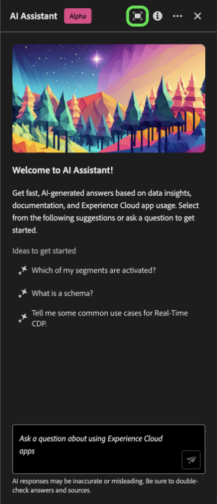

# Assistant pour Adobe Experience Platform

>[!NOTE]
>
>L’assistant pour Adobe Experience Platform est actuellement en Alpha. Les fonctionnalités et la documentation sont susceptibles d’être modifiées.

L’assistant pour Adobe Experience Platform est une fonction de l’interface utilisateur que vous pouvez utiliser pour parcourir et comprendre les concepts d’Experience Platform et de Real-time Customer Data Platform, ainsi que les informations d’utilisation relatives à vos objets.

Vous pouvez interroger l’assistant pour obtenir des informations telles que :

* Conseils sur l’exécution des tâches relatives aux données et aux audiences.
* Statuts et mesures des objets de données existants dans votre entreprise.
* Utilisez des exemples de cas et des nuances pour mieux comprendre vos objets de données, notamment les attributs, les jeux de données, les destinations, les schémas, les segments et les sources.

Ce document fournit des informations sur l’accès et l’utilisation de l’assistant pour poser des questions et obtenir des réponses sur les concepts Experience Platform et Real-Time CDP.

>[!BEGINSHADEBOX]

**Comment fonctionne l’assistant ?**

L’assistant répond aux questions que vous avez envoyées en interrogeant une base de données, puis en traduisant les données de la base de données en une réponse lisible.

Cette représentation interne des données sous-jacentes est également connue sous le nom de graphique de la connaissance : un réseau complet de concepts, de données et de métadonnées pour une réponse donnée.

Le graphique des connaissances se compose de sous-graphiques qui sont référencés chaque fois que des requêtes sont envoyées :

* Données d’utilisation du client.
* Données d’utilisation du client sur plusieurs métamarques.
* Documentation Experience League.

Il existe deux catégories de questions à prendre en compte avant d’interroger l’assistant :

* **Questions sur le concept**: les questions de concept portent sur les concepts d’Adobe liés aux données ou aux audiences. Voici quelques exemples de questions conceptuelles :
   * Quelle est la différence entre la segmentation par lots et par flux ?
   * Existe-t-il des modèles de données de l’industrie et comment les utiliser ?
   * À quoi Real-Time CDP est-il le mieux utilisé ?
* **Questions d’utilisation**: les questions d’utilisation portent sur les objets de données de votre entreprise. Voici quelques exemples de questions d’utilisation :
   * Combien de jeux de données ai-je ?
   * Combien d’attributs de schéma n’ont jamais été utilisés ?
   * Quels segments ont été activés ?

>[!ENDSHADEBOX]

## Assistant d’accès pour les Experience Platform dans l’interface utilisateur

Vous pouvez accéder à l’assistant à partir de la navigation de l’en-tête dans l’interface utilisateur de l’Experience Platform.

Sélectionnez la variable **[!UICONTROL Icône Assistant]** de l’en-tête au panneau Assistant de lancement.

<!-- +++Use immersive mode

To use [!DNL Immersive mode] select the focus icon in the header navigation of the Assistant.

A dedicated pop-up interface for Assistant appears at the center of your screen.

+++

From here, you can input your question in the text box and query Assistant for concepts regarding data or audiences. You can also ask questions about your data objects to better understand how you can use them for your respective use case.  -->

### Exemple de cas pratique : utilisation de l’assistant pour accélérer le processus de création de schéma {#example-use-case}

>[!NOTE]
>
>L’exemple de workflow suivant utilise le processus de création de schémas ExperienceEvent pour illustrer l’utilisation de l’assistant lors de l’utilisation de l’interface utilisateur Experience Platform.

Prenons un cas d’utilisation où vous créez une **Commerce des périphériques dans le schéma d’événement**. Au cours du processus de création de schéma ExperienceEvent, vous rencontrez le `eventType` champ . À ce stade, vous pouvez quitter votre workflow et consulter la documentation de la section [principes de base de la composition d’un schéma](../xdm/schema/composition.md)ou vous pouvez utiliser l’assistant pour obtenir des réponses immédiates à vos questions.

Pour commencer, saisissez votre question dans la zone de texte fournie à cet effet. Dans l’exemple ci-dessous, l’assistant répond à la question suivante : &quot;**Quel est le champ eventType dans un schéma ExperienceEvent ?**&quot;

L&#39;assistant interroge ensuite sa base de connaissances et calcule une réponse. Après quelques instants, l’assistant renvoie une réponse et des suggestions associées que vous pouvez utiliser comme invites de suivi.

Une réponse donnée fournit des liens hypertexte vers les entités référencées. Dans l’exemple ci-dessous, sélectionnez **[!UICONTROL Schémas]** pour afficher la liste des schémas référencés, ou **[!UICONTROL Segments]** pour afficher la liste des segments référencés.

L’assistant vous permet de valider votre réponse en affichant sa source. Les liens vers la documentation sont fournis pour les questions de concept, tandis que les questions d’utilisation des données peuvent être vérifiées avec une requête SQL qui montre comment la réponse a été calculée.

### Question de relance {#follow-up-question}

+++Sélectionner pour afficher un exemple de question de relance

Vous pouvez en savoir plus sur un sujet particulier en posant une question suivante. Dans l’exemple suivant, on demande à l’assistant comment eventType peut être utilisé dans la segmentation.

+++

### Question d’utilisation des données {#data-usage-question}

+++Sélectionner pour afficher un exemple de question d’utilisation des données

Vous pouvez également poser des questions à l’assistant concernant l’utilisation de vos données. Pour toute question concernant l’utilisation des données, vous devez être dans un environnement de test actif afin que l’assistant puisse répondre à votre requête.

Pour les réponses qui impliquent des informations sur l’utilisation des données, l’assistant fournit des liens vers les entités en question. En outre, l’assistant vous fournit une explication sur la façon dont il a calculé sa réponse.

+++

### Multi-tour {#multi-turn}

+++Sélectionner pour afficher un exemple de multi-tour

Vous pouvez utiliser les fonctionnalités à plusieurs volets de l’assistant pour avoir une conversation plus naturelle au cours de votre expérience. L’assistant peut répondre à des questions de suivi, étant donné que le contexte peut être déduit d’une interaction antérieure.

Dans l’exemple ci-dessous, l’assistant est invité à répertorier les segments existants dans l’organisation, comme suite à une requête antérieure sur le nombre total de segments.

Ensuite, l’assistant reçoit une autre demande de suivi. Cette fois-ci, l’assistant répond en répertoriant les segments existants classés selon leur taille respective.

+++

### Utilisation de la saisie automatique {#use-auto-complete}

+++Sélectionner pour afficher un exemple de saisie automatique

Vous pouvez utiliser la fonction de saisie semi-automatique pour recevoir la liste des objets de données qui existent dans votre environnement de test. Les recommandations de saisie semi-automatique sont disponibles pour les domaines suivants : segments, schémas, jeux de données, sources et destinations.

Pour utiliser la saisie automatique, saisissez un symbole plus (**`+`**) dans le cadre de votre question. Vous pouvez également sélectionner le symbole plus (**`+`**) dans la zone de saisie de texte. Ensuite, une fenêtre s’affiche avec une liste des objets de données recommandés présents dans votre environnement de test.

Sélectionnez ensuite l&#39;objet de données à interroger pour terminer votre question, puis envoyez votre question.

+++

## Portée {#scope}

L’assistant peut répondre à des questions concernant Real-Time CDP et les concepts d’Experience Platform, ainsi que sur l’utilisation des données propres à votre compte d’utilisateur. L’assistant peut également déduire le contexte en fonction de la page de l’interface utilisateur dans laquelle vous vous trouvez. Il peut identifier :

* Le compte utilisateur que vous utilisez.
* L’organisation à laquelle vous appartenez.
* Page que vous affichez à l’écran.
* La ressource (y compris le type et l’identifiant) que vous affichez à l’écran.
* Étant donné que vous êtes en cours de traitement d’un Experience Platform ou d’un workflow Real-Time CDP spécifique, l’assistant peut déduire vos intentions.

### Documentation {#documentation}

Actuellement, l’index de documentation couvre Adobe Experience Platform (Real-Time CDP et Audiences). L’index est mis à jour régulièrement.

Le modèle de récupération de documentation est formé sur Experience Platform (Real-Time CDP et Audiences). Il n’est pas possible de répondre à des questions en dehors du cadre de Adobe Experience Platform, telles que des questions sur d’autres produits Adobe tels qu’Adobe Target et la suite de Creative Cloud.

### Utilisation des données {#data-usage}

Vous pouvez également poser des questions à l’assistant sur l’utilisation de vos données dans les domaines suivants :

* Attributs
* Jeux de données
* Destinations _(Pour l’instant, il n’est pas possible de répondre aux questions concernant les comptes et à certaines questions concernant le flux de données.)_
* Schémas _(Pour l’instant, il n’est pas possible de répondre aux questions concernant les groupes de champs.)_
* Segments
* Sources _(Pour l’instant, il n’est pas possible de répondre aux questions concernant les comptes.)_

Pour les requêtes de données d’utilisation, les réponses peuvent ne pas refléter l’état actuel de l’interface utilisateur. Les données sur lesquelles reposent ces questions sont mises à jour toutes les 24 heures. Par exemple, les modifications apportées par les utilisateurs dans Real-Time CDP pendant la journée sont synchronisées avec les entrepôts de données la nuit, puis elles deviennent disponibles pour les questions des utilisateurs le matin. Vous devrez peut-être formater vos questions comme suit : &quot;Quand le segment a-t-il eu le titre ? {TITLE} created ?&quot; au lieu de &quot;Quand était le {TITLE} segment créé ?&quot;

Vous devrez vous connecter à un environnement de test pour obtenir des informations sur des données spécifiques liées à des objets tels que les schémas, les jeux de données, les attributs, les destinations et les segments.

### Exemples de questions d’utilisation des données {#example-data-usage-questions}

+++Cliquez pour afficher la liste des exemples de questions d’utilisation des données.

| Type de question | Description | Exemples |
| --- | --- | --- | 
| Parenté des données | Suivi de l’utilisation d’un ou de plusieurs objets sur d’autres objets Experience Platform | <ul><li>Quels jeux de données utilisent ? {SCHEMA_NAME} schéma ?</li><li>Combien de jeux de données ont été ingérés à l’aide du même schéma ?</li><li>Quels jeux de données ont été utilisés dans les segments activés ?</li><li>Liste des schémas dont les attributs sont utilisés dans les segments activés.</li><li>Afficher les segments activés pour {DESTINATION_ACCOUNT_NAME} et ont plus de 1000 profils.</li><li>Afficher les attributs utilisés dans les segments activés qui ont été modifiés après janvier 2023.</li><li>Quels sont les jeux de données ingérés via ? {SOURCE_NAME}?</li><li>Les flux de données associés à {DATAFLOW_NAME}</li><li>Liste des schémas associés aux segments activés et créés au cours de l’année écoulée.</li></ul> |
| Distribution et agrégations | Questions récapitulatives sur l’utilisation des objets Experience Platform | <ul><li>Quel est le pourcentage des segments activés ?</li><li>Combien de champs sont utilisés dans la segmentation ?</li><li>Quels segments sont activés pour le plus grand nombre de destinations ?</li><li>Liste des segments en double.</li><li>Afficher les segments activés pour {DESTINATION_ACCOUNT_NAME} et les classer par taille de profil.</li><li>Quel est le pourcentage des segments qui n’ont pas été activés mais qui comportent plus de 100 profils. Montrez-moi leurs noms.</li><li>Liste des 3 connecteurs source qui ingèrent des données dans mes jeux de données.</li><li>Listez-moi les 5 premiers attributs utilisés dans les segments activés en fonction de leur occurrence.</li></ul> |
| Recherche d’objet | Récupérez ou accédez à un objet Experience Platform ou à ses propriétés. | <ul><li>Les jeux de données auxquels aucun schéma n’est associé</li><li>Liste des attributs utilisés pour {SEGMENT_NAME}?</li><li>Indiquez-moi la liste des schémas dont le profil est activé mais qui n’ont pas été modifiés depuis leur création.</li><li>Quels segments ont été modifiés la semaine dernière ?</li><li>Listez-moi les segments qui ont les mêmes définitions de segment avec leur date de création.</li><li>Les jeux de données activés pour le profil et incluant le nombre de segments créés à partir de chaque jeu de données.</li><li>Quels comptes sources sont associés au jeu de données XYZ ?</li><li>M’afficher la date de définition et de modification du segment de {SEGMENT_NAME}.</li></ul> |

+++

## Vérification de la réponse {#verify-the-response}

Vous pouvez vérifier la réponse renvoyée par l’assistant de différentes manières.

### Citations pour la documentation {#citations}

À chaque réponse, l’assistant vous fournit des citations auxquelles vous pouvez vous référer à des fins de vérification ou d’informations supplémentaires.

Sélectionner **[!UICONTROL Afficher la source]** pour obtenir la liste des liens vers la documentation à laquelle l’assistant référence pour calculer sa réponse. Lorsque vous sélectionnez un lien vers la documentation référencée, vous accédez à la section correspondante de cette page, avec les informations spécifiques en surbrillance.

## Fournir des commentaires {#feedback}

>[!BEGINSHADEBOX]

**Vos commentaires sont demandés**

Au cours de cette étape de l’Alpha, vous êtes invité à fournir des commentaires sur les réponses que vous recevrez de l’assistant. Toutes les réponses et les commentaires envoyés sont examinés afin de continuer à améliorer l’expérience de l’assistant.

Pour fournir des commentaires, sélectionnez l’option Monter ou Descendre après avoir reçu une réponse de l’assistant, puis saisissez vos commentaires dans la zone de texte fournie. Ensuite, sélectionnez **[!UICONTROL Envoyer les commentaires]** à soumettre.

>[!ENDSHADEBOX]

+++Fournir des commentaires

>[!BEGINTABS]

>[!TAB Pouces vers le haut]

Sélectionnez l’icône de la barre d’outils pour indiquer vos commentaires sur ce qui s’est bien passé avec l’assistant.

>[!TAB Menu déroulant]

Sélectionnez l’icône de menu déroulant pour fournir des commentaires sur les améliorations qui pourraient être apportées en fonction de votre expérience avec l’assistant. Au cours de cette étape, vous pouvez également fournir des commentaires spécifiques sur votre expérience. Les commentaires fournis dans les commentaires sont examinés quotidiennement.

>[!TAB Indicateur]

Sélectionnez l’icône d’indicateur pour fournir d’autres rapports sur votre expérience à l’aide de l’assistant.

>[!ENDTABS]

+++

## Informations supplémentaires {#additional-information}

Pour plus d’informations sur l’assistant d’Experience Platform, reportez-vous à cette section .

### Avertissements et restrictions {#caveats-and-limitations}

La section suivante présente les mises en garde et les limites à prendre en compte lors de l’utilisation de l’assistant.
<!-- 
#### Conversational experience

You must consider several nuances regarding the conversational experience when querying the Assistant.

>[!NOTE]
>
>These limitations are temporary and are being improved upon throughout the course of the alpha.

>[!BEGINTABS]

>[!TAB Unable to infer context from prior discussion]

The Assistant currently cannot reference prior discussions as context for a given question. See the table below for examples:

| Ambiguous question | Clear question | Note |
| --- | --- | --- |
| <ul><li>First question: "What is a segment?"</li><li>Follow up question: "Are there different types of them?"</li></ul>| <ul><li>First question: "What is a segment?"</li><li>Follow up question: "Are there different types of **segments**?"</li></ul> | The Assistant cannot infer what "them" means. |
| <ul><li>First question: "What is a segment?"</li><li>Follow up question: "Can you elaborate more?"</li></ul> | <ul><li>First question: "What is a segment?"</li><li>Follow up question: "Explain what a segment is in depth"</li></ul> | The Assistant cannot intelligently reference documentation based on "more". |
| <ul><li>First question: "What is a segment?"</li><li>Follow up question: "Can you give me an example of one?"</li></ul> | <ul><li>First question: "What is a segment?"</li><li>Follow up question: "Can you give me an example of a segment?"</li></ul> | The Assistant cannot infer what you want an example of.|
| <ul><li>First question: "What is a batch segment?"</li><li>Follow up question: "How does it compare to a streaming segment?"</li></ul> | <ul><li>First question: "What is a batch segment?"</li><li>Follow up question: "Can you compare a streaming segment to a batch segment?"</li></ul> | The Assistant cannot infer what "it" is referring to and thus cannot compare the streaming segment. |
| <ul><li>First question: "How many segments do I have?"</li><li>Follow up question: "How many of them use Facebook as a destination?"</li></ul> | <ul><li>First question: "How many segments do I have?"</li><li>Follow up question: "How many of the segments that I have are using Facebook as a destination?"</li></ul> | The Assistant is cannot infer what "them" is referring to. |

{style="table-layout:auto"}

>[!TAB Unable to infer context from a page]

When asking the Assistant about a particular element of the Experience Platform UI page that you are on, you must clearly define the specific element within your question. 

| Ambiguous question | Clear question | Note |
| --- | --- | --- |
| "What does this do?" | "What does {PAGE_NAME} do? | The Assistant cannot infer what "this" is referring to. You must provide the specific page element that you are querying about. |
| "Why won't it save?" | "Why can't I save a new sandbox called {NAME}?" | The Assistant cannot infer what "it" is referring to and cannot know that you are having issues with an entity. |

{style="table-layout:auto"}

Furthermore, the Assistant can only answer questions regarding error messages, given that the error is documented in Experience League.

>[!TAB Ambiguity]

You must phrase your questions clearly and scope them within a product, application, or domain, as the Assistant currently cannot disambiguate questions.

| Ambiguous question | Clear question | Note |
| --- | --- | --- |
| "How do I create a filter? | How do I create a filter in Profile Query Language? | You must specify the feature that which you are filtering for because a variety of Experience Platform features support filtering. |
| "How do I get started? | How do I get started using destinations? | You must provide clarity on your goals and use case because overly broad concepts may result in generic or unnecessarily specific answers. |

{style="table-layout:auto"}

>[!ENDTABS] -->

#### Petite discussion limitée

Vous pouvez discuter avec l’assistant, mais cette capacité est actuellement limitée.

#### Questions relatives aux fonctionnalités

L&#39;assistant peut donner une impression inexacte de ce qu&#39;il peut faire. Il peut répondre incorrectement aux types de questions suivants :

| Exemple de question | Remarque |
| --- | --- |
| &quot;Pouvez-vous répondre à des questions sur {ENTITY}?&quot; | Tant que l’assistant peut trouver une seule page référençant une entité donnée dans son index, il répondra oui. |
| &quot;Vous savez **x** la langue ?&quot; | Actuellement, l’assistant ne prend en charge que l’anglais, mais peut répondre &quot;oui&quot; en raison du modèle sous-jacent qui peut le prendre en charge. |
| &quot;Pouvez-vous... ?&quot; | L&#39;assistant peut répondre oui, même s&#39;il ne le peut pas. |

### Astuces {#tips}

La section suivante présente quelques conseils et solutions à prendre en compte lors de l’utilisation de l’assistant.

#### Une mauvaise source d’informations peut répondre aux questions.

Il existe des cas où votre question sur vos données d’utilisation peut donner lieu à une réponse basée sur la documentation. En effet, l’assistant peut incorrectement acheminer votre question vers la mauvaise source d’informations. Vous pouvez empêcher cela en procédant comme suit :

* Reformulation de votre question pour utiliser plus de langage de type SQL
* Appel explicite de la source d’information à utiliser.

Lisez le tableau ci-dessous pour obtenir des exemples :

| Mauvaise question | Bonne question | Notes |
| --- | --- | --- |
| Quel est mon segment le plus important ? | Quel est mon segment le plus important ? Utiliser les données. | Indiquez explicitement à l’assistant que vous souhaitez que la réponse soit basée sur les données. |
| Quel est mon segment le plus important ? | Liste de mon segment le plus important. | Il existe des cas où une question &quot;quoi...&quot; peut être confondue avec une question basée sur la documentation. L’utilisation d’une commande telle que &quot;list&quot; est un indicateur plus fort que vous posez une question avec des données en contexte. |
| Combien de jeux de données ai-je ? | Comptez mes jeux de données. | La question d’origine fonctionne pour les segments, mais elle peut ne pas fonctionner avec les jeux de données. |
