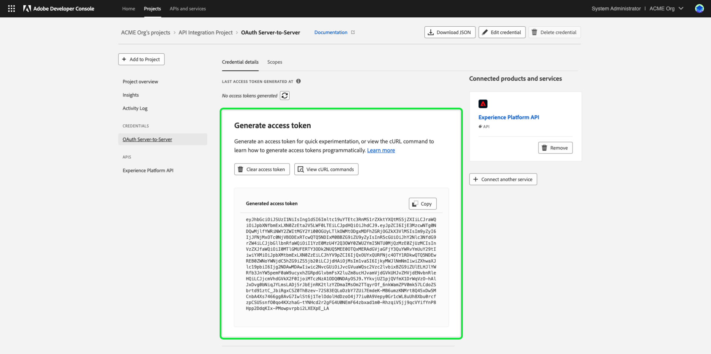
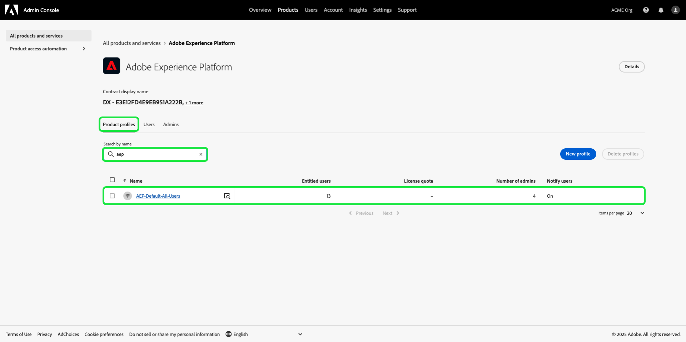

# S’authentifier et accéder aux API Experience Platform

Ce document fournit un tutoriel détaillé pour accéder à un compte de développeur Adobe Experience Platform afin d’effectuer des appels vers les API Experience Platform. À la fin de ce tutoriel, vous aurez généré ou collecté les informations d’identification suivantes, requises en tant qu’en-têtes dans tous les appels API d’Experience Platform :

* `{ACCESS_TOKEN}`
* `{API_KEY}`
* `{ORG_ID}`

>[!TIP]
>
>En plus des trois informations d’identification ci-dessus, de nombreuses API d’Experience Platform nécessitent également qu’un `{SANDBOX_NAME}` valide soit fourni comme en-tête. Consultez la [présentation des sandbox](../sandboxes/home.md) pour plus d’informations sur les sandbox et la documentation [point d’entrée de gestion des sandbox](/help/sandboxes/api/sandboxes.md#list) pour plus d’informations sur la liste des sandbox disponibles pour votre organisation.

Pour garantir la sécurité de vos applications et de vos utilisateurs, toutes les requêtes envoyées aux API Experience Platform doivent être authentifiées et autorisées selon des normes telles qu’OAuth.

Ce tutoriel explique comment rassembler les informations d’identification requises pour authentifier les appels API Experience Platform, comme indiqué dans le diagramme de flux ci-dessous. Vous pouvez rassembler la plupart des informations d’identification requises dans la configuration unique initiale. Toutefois, le jeton d’accès doit être actualisé toutes les 24 heures.


## Conditions préalables {#prerequisites}

Pour réussir les appels aux API Experience Platform, vous devez disposer des éléments suivants :

* Organisation ayant accès à Adobe Experience Platform.
* Un administrateur Admin Console capable de vous ajouter en tant que développeur et utilisateur pour un profil de produit.
* Un administrateur système Experience Platform qui peut vous accorder les contrôles d’accès basés sur les attributs nécessaires pour effectuer des opérations de lecture ou d’écriture sur différentes parties d’Experience Platform par le biais d’API.

Vous devez également disposer d’une Adobe ID pour suivre ce tutoriel. Si vous ne possédez pas d’Adobe ID, vous pouvez en créer un en suivant les étapes suivantes :

1. Accédez à [Adobe Developer Console](https://console.adobe.io).
2. Sélectionnez **[!UICONTROL Créer un compte]**.
3. Terminez le processus d’inscription.

## Obtenir l’accès développeur et utilisateur pour Experience Platform {#gain-developer-user-access}

Avant de créer des intégrations sur Adobe Developer Console, votre compte doit disposer des autorisations de développeur et d’utilisateur pour un profil de produit Experience Platform dans Adobe Admin Console.

### Obtenir l’accès développeur {#gain-developer-access}

Contactez un administrateur ou une administratrice Admin Console de votre organisation pour vous ajouter en tant que développeur ou développeuse à un profil de produit Experience Platform. Consultez la documentation d’Admin Console pour obtenir des instructions spécifiques sur la [gestion de l’accès des développeurs pour les profils de produit](https://helpx.adobe.com/fr/enterprise/admin-guide.html/enterprise/using/manage-developers.ug.html).

Une fois que vous êtes affecté en tant que développeur, vous pouvez commencer à créer des intégrations dans [Adobe Developer Console](https://www.adobe.com/go/devs_console_ui). Ces intégrations sont un pipeline reliant des applications et services externes aux API Adobe.

### Obtenir l’accès utilisateur {#gain-user-access}

Votre administrateur Admin Console doit également vous ajouter en tant qu’utilisateur au même profil de produit. Avec un accès utilisateur, vous pouvez voir dans l’interface utilisateur le résultat des opérations de l’API que vous effectuez.

Pour plus d’informations, consultez le guide sur la [gestion des groupes d’utilisateurs dans Admin Console](https://helpx.adobe.com/fr/enterprise/admin-guide.html/enterprise/using/user-groups.ug.html).

## Générer une clé API (identifiant client) et un identifiant d’organisation {#generate-credentials}

>[!NOTE]
>
>Si vous suivez ce document à partir du guide de l’API [Privacy Service](../privacy-service/api/getting-started.md), vous pouvez maintenant revenir à ce guide pour générer les informations d’identification d’accès propres à [!DNL Privacy Service].

Après avoir obtenu l’accès développeur et utilisateur à Experience Platform via Admin Console, l’étape suivante consiste à générer vos informations d’identification `{ORG_ID}` et `{API_KEY}` dans Adobe Developer Console. Ces informations d’identification ne doivent être générées qu’une seule fois et peuvent être réutilisées dans les appels API Experience Platform futurs.

>[!TIP]
>
>Au lieu d’accéder à Developer Console, vous pouvez obtenir toutes les informations d’authentification dont vous avez besoin pour travailler avec les API Experience Platform directement à partir des pages de documentation de référence des API. [En savoir plus](#get-credentials-functionality) à propos de la fonctionnalité.

### Ajouter Experience Platform à un projet {#add-platform-to-project}

Accédez à [Adobe Developer Console](https://www.adobe.com/go/devs_console_ui) et connectez-vous avec votre Adobe ID. Suivez ensuite les étapes décrites dans le tutoriel sur la [création dʼun projet vide](https://developer.adobe.com/developer-console/docs/guides/projects/projects-empty/) disponible dans la documentation dʼAdobe Developer Console.

Une fois que vous avez créé un projet, sélectionnez **[!UICONTROL Ajouter une API]** dans l’écran **[!UICONTROL Aperçu du projet]**.

>[!TIP]
>
>Si vous disposez des privilèges d’accès pour plusieurs organisations, utilisez le sélecteur d’organisation dans le coin supérieur droit de l’interface pour vous assurer que vous vous trouvez dans l’organisation dont vous avez besoin.

Écran Developer Console 

L’écran **[!UICONTROL Ajouter une API]** s’affiche. Sélectionnez l’icône de produit pour **[!UICONTROL Adobe Experience Platform]**, puis choisissez **[!UICONTROL API Experience Platform]** avant de sélectionner **[!UICONTROL Suivant]**.

.

>[!TIP]
>
>Sélectionnez l’option **[!UICONTROL Afficher les documents]** pour accéder à la documentation de référence de l’API Experience Platform dans une fenêtre de navigateur distincte[&#128279;](https://developer.adobe.com/experience-platform-apis/).

### Sélectionnez le type d’authentification [!UICONTROL OAuth de serveur à serveur] {#select-oauth-server-to-server}

Sélectionnez ensuite le type d’authentification **[!UICONTROL OAuth serveur à serveur]** pour générer des jetons d’accès et accéder à l’API Experience Platform. Attribuez un nom significatif à vos informations d’identification dans le champ de texte **[!UICONTROL Nom des informations d’identification]** avant de sélectionner **[!UICONTROL Suivant]**.

>[!IMPORTANT]
>
>La méthode **[!UICONTROL OAuth de serveur à serveur]** est la seule méthode de génération de jeton prise en charge à l’avenir. La méthode **[!UICONTROL Compte de service (JWT) précédemment prise en charge]** est obsolète et ne peut pas être sélectionnée pour les nouvelles intégrations. Bien que les intégrations existantes utilisant la méthode d’authentification JWT continueront à fonctionner jusqu’au 30 juin 2025, Adobe vous recommande vivement de migrer les intégrations existantes vers la nouvelle méthode [!UICONTROL OAuth de serveur à serveur] avant cette date. Pour plus d’informations, consultez la section [!BADGE Obsolète]{type=negative}[ Générer un jeton web JSON (JWT)](#jwt).


### Sélection des profils de produit pour votre intégration {#select-product-profiles}

Dans l’écran **[!UICONTROL Configurer l’API]**, sélectionnez **[!UICONTROL AEP-Default-All-Users]** ainsi que les profils de produit supplémentaires auxquels vous souhaitez accéder.

>[!IMPORTANT]
>
>Pour accéder à certaines fonctionnalités d’Experience Platform, vous avez également besoin d’un administrateur ou d’une administratrice système pour vous accorder les autorisations de contrôle d’accès basé sur les attributs nécessaires. Pour en savoir plus, consultez la section [Obtention des autorisations de contrôle d’accès basé sur les attributs nécessaires](#get-abac-permissions).


Sélectionnez **[!UICONTROL Enregistrer l’API configurée]** lorsque vous êtes prêt.

Une présentation des étapes décrites ci-dessus pour configurer une intégration avec l’API Experience Platform est également disponible dans le tutoriel vidéo ci-dessous :

>[!VIDEO](https://video.tv.adobe.com/v/28832/?learn=on)

### Collecter les informations d’identification {#gather-credentials}

Une fois l’API ajoutée au projet, la page **[!UICONTROL OAuth de serveur à serveur]** pour le projet affiche les informations d’identification suivantes, requises dans tous les appels aux API Experience Platform :


* `{API_KEY}` ([!UICONTROL ID client])
* `{ORG_ID}` ([!UICONTROL Identifiant de l’organisation])

<!--


<!--

In addition to the above credentials, you also need the generated **[!UICONTROL Client Secret]** for a future step. Select **[!UICONTROL Retrieve client secret]** to reveal the value, and then copy it for later use.


-->

## Générer un jeton d’accès {#generate-access-token}

L’étape suivante consiste à générer des informations d’identification `{ACCESS_TOKEN}` à utiliser dans les appels API d’Experience Platform. Contrairement aux valeurs de `{API_KEY}` et `{ORG_ID}`, un nouveau jeton doit être généré toutes les 24 heures pour continuer à utiliser les API d’Experience Platform. Sélectionnez **[!UICONTROL Générer un jeton d’accès]** qui génère votre jeton d’accès, comme illustré ci-dessous.



>[!TIP]
>
>Vous pouvez également utiliser un environnement et une collection Postman pour générer des jetons d’accès. Pour plus d’informations, consultez la section sur [l’utilisation de Postman pour authentifier et tester les appels API](#use-postman).

## Créer et récupérer les informations d’authentification directement dans la documentation de référence de l’API {#get-credentials-functionality}

À compter de la version de novembre 2024 d’Experience Platform, vous pouvez obtenir des informations d’identification pour utiliser les API Experience Platform directement à partir des pages de référence de l’API, sans avoir à accéder à [!UICONTROL Developer Console]. Consultez l’exemple ci-dessous à partir de la page [API Flow Service - Destinations](https://developer.adobe.com/experience-platform-apis/references/destinations/).


Pour obtenir les informations d’identification permettant d’appeler les API Experience Platform, accédez à n’importe quelle page de référence de l’API Experience Platform et sélectionnez **[!UICONTROL Se connecter]** en haut de la page. Connectez-vous avec votre **[!UICONTROL Compte personnel]** ou **[!UICONTROL Compte d’entreprise ou d’école]**.

Après vous être connecté, sélectionnez **[!UICONTROL Créer de nouvelles informations d’identification]** pour créer un ensemble d’informations d’identification afin d’accéder aux API Experience Platform.


Ensuite, utilisez le sélecteur de liste déroulante pour ouvrir la fenêtre des informations d’identification, générer un jeton d’accès et obtenir votre clé API et votre identifiant d’organisation. Copiez les informations d’identification dans les blocs [**[!UICONTROL Essayer]**](/help/release-notes/2024/may-2024.md#interactive-api-documentation) des pages de référence de l’API pour commencer à utiliser les API d’Experience Platform.


>[!TIP]
>
>Le bloc d’informations d’identification en haut de la page reste affiché lorsque vous naviguez entre différentes pages de point d’entrée dans la documentation de référence de l’API Experience Platform.

## [!BADGE Obsolète]{type=négatif} Générer un jeton Web JSON (JWT) {#jwt}

>[!WARNING]
>
>La méthode JWT de génération des jetons d’accès a été abandonnée. Toutes les nouvelles intégrations doivent être créées à l’aide de la [méthode d’authentification OAuth de serveur à serveur](#select-oauth-server-to-server). Adobe exige également que vous migriez vos intégrations existantes vers la méthode OAuth d’ici le 30 juin 2025 pour que vos intégrations continuent à fonctionner. Lisez la documentation importante suivante :
> 
>* [Guide de migration de JWT vers OAuth pour vos applications](https://developer.adobe.com/developer-console/docs/guides/authentication/ServerToServerAuthentication/migration/)
>* [Guide de mise en œuvre pour les nouvelles et les anciennes applications avec OAuth](https://developer.adobe.com/developer-console/docs/guides/authentication/ServerToServerAuthentication/implementation/)
>* [Avantages de la méthode d’identification de serveur à serveur OAuth](https://developer.adobe.com/developer-console/docs/guides/authentication/ServerToServerAuthentication/migration/#why-oauth-server-to-server-credentials)

+++ Afficher les informations obsolètes

L’étape suivante consiste à générer un jeton Web JSON (JWT) en fonction des informations d’identification de votre compte. Cette valeur est utilisée pour générer vos informations d’identification `{ACCESS_TOKEN}` à utiliser dans les appels API d’Experience Platform, qui doivent être régénérés toutes les 24 heures.

>[!IMPORTANT]
>
>Pour les besoins de ce tutoriel, les étapes ci-dessous décrivent comment générer un jeton JWT dans Developer Console. Toutefois, cette méthode de génération ne doit être utilisée qu’à des fins de test et d’évaluation.
>
>Pour une utilisation régulière, le jeton JWT doit être généré automatiquement. Pour plus d’informations sur la génération par programmation de JWT, consultez le [guide d’authentification du compte de service](https://www.adobe.io/developer-console/docs/guides/authentication/JWT/) sur Adobe Developer.

Sélectionnez **[!UICONTROL Compte de service (JWT)]** dans le volet de navigation de gauche, puis sélectionnez **[!UICONTROL Générer le JWT]**.


Dans la zone de texte fournie sous **[!UICONTROL Générer le JWT personnalisé]**, collez le contenu de la clé privée que vous avez précédemment générée lors de l’ajout de l’API Experience Platform à votre compte de service. Sélectionnez ensuite **[!UICONTROL Générer un jeton]**.


La page se met à jour pour afficher le jeton JWT généré, ainsi qu’un exemple de commande cURL qui vous permet de générer un jeton d’accès. Pour les besoins de ce tutoriel, sélectionnez **[!UICONTROL Copier]** en regard de **[!UICONTROL JWT généré]** pour copier le jeton dans le presse-papiers.


**Générer un jeton d’accès**

Une fois que vous avez généré un jeton JWT, vous pouvez l’utiliser dans un appel API pour générer votre `{ACCESS_TOKEN}`. Contrairement aux valeurs de `{API_KEY}` et `{ORG_ID}`, un nouveau jeton doit être généré toutes les 24 heures pour continuer à utiliser les API d’Experience Platform.

**Requête**

La requête suivante génère une nouvelle `{ACCESS_TOKEN}` en fonction des informations d’identification fournies dans la payload. Ce point d’entrée accepte uniquement les données de formulaire comme payload. Par conséquent, un en-tête `Content-Type` de `multipart/form-data` doit lui être attribué.

```shell
curl -X POST https://ims-na1.adobelogin.com/ims/exchange/jwt \
  -H 'Content-Type: multipart/form-data' \
  -F 'client_id={API_KEY}' \
  -F 'client_secret={SECRET}' \
  -F 'jwt_token={JWT}'
```

| Propriété | Description |
| --- | --- |
| `{API_KEY}` | `{API_KEY}` ([!UICONTROL ID client]) récupéré lors d’une [étape précédente](#api-ims-secret). |
| `{SECRET}` | Secret client récupéré lors d’une [étape précédente](#api-ims-secret). |
| `{JWT}` | Le JWT que vous avez généré lors d’une [étape précédente](#jwt). |

>[!NOTE]
>
>Vous pouvez utiliser la même clé API, le même secret client et le même jeton JWT pour générer un nouveau jeton d’accès pour chaque session. Vous pouvez ainsi automatiser la génération des jetons d’accès dans vos applications.

**Réponse**

```json
{
  "token_type": "bearer",
  "access_token": "{ACCESS_TOKEN}",
  "expires_in": 86399992
}
```

| Propriété | Description |
| --- | --- |
| `token_type` | Le type of jeton renvoyé. Pour les jetons d’accès, cette valeur est toujours `bearer`. |
| `access_token` | `{ACCESS_TOKEN}` générée. Cette valeur, précédée du mot `Bearer`, est requise en tant qu’en-tête `Authentication` pour tous les appels API Experience Platform. |
| `expires_in` | Nombre de millisecondes restantes avant l’expiration du jeton d’accès. Une fois que cette valeur atteint 0, un nouveau jeton d’accès doit être généré pour continuer à utiliser les API d’Experience Platform. |

+++

## Tester les informations d’identification d’accès {#test-credentials}

Une fois que vous avez rassemblé les trois informations d’identification requises (jeton d’accès, clé API et ID d’organisation), vous pouvez essayer d’effectuer l’appel API suivant. Cet appel répertorie toutes les classes [!DNL Experience Data Model] standard (XDM) disponibles pour votre organisation. Importez et exécutez l’appel dans [Postman](#use-postman).

>[!BEGINSHADEBOX]

**Requête**

```SHELL
curl -X GET https://platform.adobe.io/data/foundation/schemaregistry/global/classes \
  -H 'Accept: application/vnd.adobe.xed-id+json' \
  -H 'Authorization: Bearer {{ACCESS_TOKEN}}' \
  -H 'x-api-key: {{API_KEY}}' \
  -H 'x-gw-ims-org-id: {{ORG_ID}}'
```

**Réponse**

Si votre réponse est similaire à celle affichée ci-dessous, alors vos informations d’identification sont valides et fonctionnent. (Cette réponse a été tronquée pour l’espace.)

```JSON
{
  "results": [
    {
        "title": "XDM ExperienceEvent",
        "$id": "https://ns.adobe.com/xdm/context/experienceevent",
        "meta:altId": "_xdm.context.experienceevent",
        "version": "1"
    },
    {
        "title": "XDM Individual Profile",
        "$id": "https://ns.adobe.com/xdm/context/profile",
        "meta:altId": "_xdm.context.profile",
        "version": "1"
    }
  ]
}
```

>[!ENDSHADEBOX]

>[!IMPORTANT]
>
>Bien que l’appel ci-dessus soit suffisant pour tester vos informations d’identification d’accès, sachez que vous ne pourrez pas accéder à plusieurs ressources ou les modifier sans disposer des autorisations de contrôle d’accès basé sur les attributs appropriées. Pour en savoir plus, reportez-vous à la section **Obtention des autorisations de contrôle d’accès basé sur les attributs nécessaires** ci-dessous.

## Obtenez les autorisations de contrôle d’accès basé sur les attributs nécessaires {#get-abac-permissions}

Pour accéder à plusieurs ressources d’Experience Platform ou les modifier, vous devez disposer des autorisations de contrôle d’accès appropriées. Les administrateurs système peuvent vous accorder les [autorisations dont vous avez besoin](/help/access-control/ui/permissions.md). Pour plus d’informations, reportez-vous à la section sur la [gestion des informations d’identification d’API pour un rôle](/help/access-control/abac/ui/permissions.md#manage-api-credentials-for-role).

Vous trouverez également des informations détaillées sur la manière dont un administrateur système peut accorder les autorisations requises pour accéder aux ressources d’Experience Platform par le biais de l’API dans le tutoriel vidéo ci-dessous :

>[!VIDEO](https://video.tv.adobe.com/v/28832/?learn=on&t=159)

## Utilisation de Postman pour authentifier et tester les appels API {#use-postman}

[Postman](https://www.postman.com/) est un outil populaire qui permet aux développeurs d’explorer et de tester les API RESTful. Vous pouvez utiliser les collections et environnements Experience Platform Postman pour accélérer votre travail avec les API Experience Platform. En savoir plus sur [l’utilisation de Postman dans Experience Platform](/help/landing/postman.md) et la prise en main des collections et des environnements.

Vous trouverez également des informations détaillées sur l’utilisation de Postman avec les collections et environnements Experience Platform dans les tutoriels vidéo ci-dessous :

**Télécharger et importer un environnement Postman à utiliser avec les API Experience Platform**

>[!VIDEO](https://video.tv.adobe.com/v/28832/?learn=on&t=106)

**Utiliser une collection Postman pour générer des jetons d’accès**

Téléchargez la collection Identity Management Service Postman [&#128279;](https://github.com/adobe/experience-platform-postman-samples/tree/master/apis/ims) et regardez la vidéo ci-dessous pour savoir comment générer des jetons d’accès.

>[!VIDEO](https://video.tv.adobe.com/v/29698/?learn=on)

**Télécharger des collections Postman de l’API Experience Platform et interagir avec les API**

>[!VIDEO](https://video.tv.adobe.com/v/29704/?learn=on)

<!--
This [Medium post](https://medium.com/adobetech/using-postman-for-jwt-authentication-on-adobe-i-o-7573428ffe7f) describes how you can set up Postman to automatically perform JWT authentication and use it to consume Experience Platform APIs.
-->

## Administrateurs système : accordez au développeur et au contrôle d’accès à l’API des autorisations Experience Platform {#grant-developer-and-api-access-control}

Avant de pouvoir créer des intégrations sur Adobe Developer Console, votre compte doit disposer des autorisations de développeur et d’utilisateur pour un profil de produit Experience Platform.

>[!NOTE]
>
>Seuls les administrateurs système ont la possibilité d’afficher et de gérer les informations d’identification d’API dans les autorisations.

### Ajout de développeurs au profil de produit {#add-developers-to-product-profile}

Accédez à [Admin Console](https://adminconsole.adobe.com/) et connectez-vous avec votre Adobe ID.

Sélectionnez **[!UICONTROL Produits]** dans la barre de navigation, puis sélectionnez **[!UICONTROL Adobe Experience Platform]** dans la liste des produits.


Dans l’onglet **[!UICONTROL Profils de produit]**, sélectionnez **[!UICONTROL AEP-Default-All-Users]**. Vous pouvez également utiliser la barre de recherche pour rechercher le profil de produit en saisissant le nom.



Sélectionnez l’onglet **[!UICONTROL Développeurs]**, puis sélectionnez **[!UICONTROL Ajouter un développeur]**.


La boîte de dialogue **[!UICONTROL Ajouter des développeurs]** s’affiche. Saisissez l’adresse e-mail **[!UICONTROL e-mail ou le nom d’utilisateur]** du développeur. Un [!UICONTROL e-mail ou nom d’utilisateur] valide affiche les détails du développeur. Sélectionnez **[!UICONTROL Enregistrer]**.


Le développeur a été ajouté avec succès et apparaît dans l’onglet **[!UICONTROL Développeurs]**.


### Attribution d’informations d’identification d’API à un rôle

>[!NOTE]
>
>Seul un administrateur système peut affecter des API aux rôles dans l’interface utilisateur d’Experience Platform.

Pour utiliser et effectuer des opérations sur les API Experience Platform, un administrateur système doit ajouter les informations d’identification d’API en plus du jeu d’autorisations donné d’un rôle. Pour plus d’informations, reportez-vous à la section sur la [gestion des informations d’identification d’API pour un rôle](../access-control/abac/ui/permissions.md#manage-api-credentials-for-a-role).

Une présentation des étapes décrites ci-dessus pour ajouter des développeurs aux profils de produit et affecter des API aux rôles est également disponible dans le tutoriel vidéo ci-dessous :

>[!VIDEO](https://video.tv.adobe.com/v/3426407/?learn=on)

## Ressources supplémentaires {#additional-resources}

Consultez les ressources supplémentaires ci-dessous pour obtenir de l’aide sur la prise en main des API d’Experience Platform

* [Authentification et accès aux API Experience Platform](https://experienceleague.adobe.com/docs/platform-learn/tutorials/platform-api-authentication.html?lang=fr) page de tutoriels vidéo
* [Collection Postman du service Identity Management](https://github.com/adobe/experience-platform-postman-samples/tree/master/apis/ims) pour la génération de jetons d’accès
* [Collections Postman de l’API Experience Platform](https://github.com/adobe/experience-platform-postman-samples/tree/master/apis/experience-platform)

## Étapes suivantes {#next-steps}

En lisant ce document, vous avez rassemblé et testé avec succès vos informations d’identification d’accès pour les API Experience Platform. Vous pouvez désormais suivre les exemples d’appels API fournis dans toute la [documentation](../landing/documentation/overview.md).

En plus des valeurs d’authentification que vous avez collectées dans ce tutoriel, de nombreuses API d’Experience Platform nécessitent également qu’un `{SANDBOX_NAME}` valide soit fourni comme en-tête. Pour plus d’informations, consultez la [Présentation des sandbox](../sandboxes/home.md).
