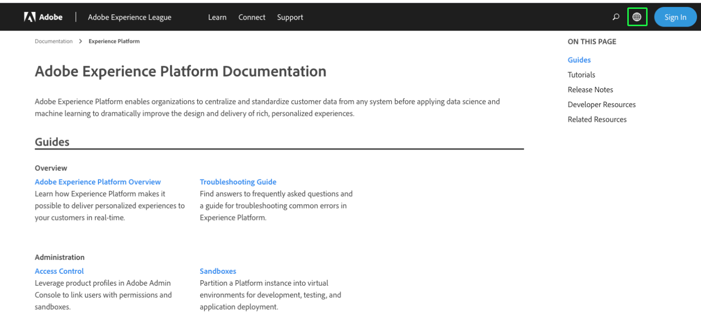
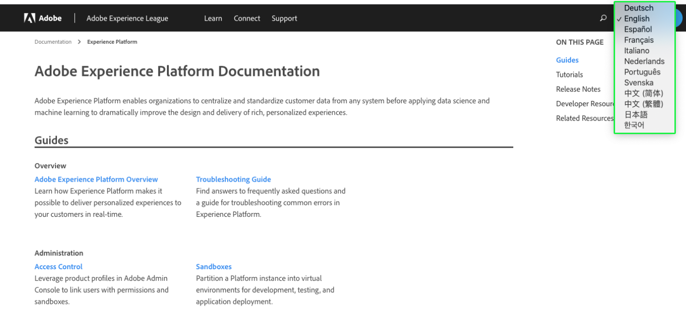

# Prise en charge du langage de documentation Experience Platform

La documentation de Adobe Experience Platform est disponible dans plusieurs langues.

Pour modifier la langue dans laquelle la documentation est présentée, sélectionnez l’icône de langue dans le volet de navigation supérieur.

Lorsque la liste déroulante Langue s’ouvre, choisissez la langue dans laquelle vous souhaitez afficher la documentation.

