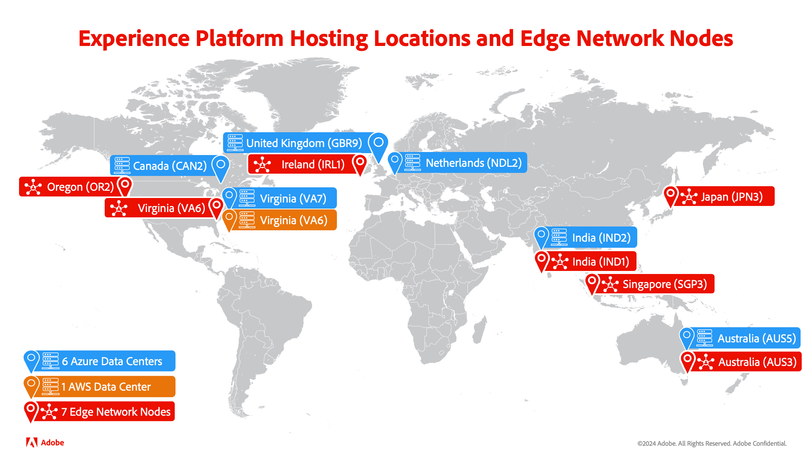

# Comparaison entre Edge Network et un hub

Adobe Experience Platform est l’un des meilleurs systèmes ouverts, flexibles et performants du marché permettant de créer et de gérer des solutions complètes qui optimisent l’expérience client. Vous pouvez utiliser Experience Platform pour centraliser et normaliser les données et le contenu des clients à partir de n’importe quel système et appliquer la science des données et le machine learning afin d’améliorer considérablement la conception et la diffusion d’expériences riches et personnalisées. Par conséquent, Experience Platform dispose de plusieurs méthodes pour traiter vos données, ce qui vous permet d’évaluer vos données de la meilleure manière possible.

## Types de serveurs

Sur Experience Platform, les données peuvent être traitées dans deux chemins différents : Adobe Experience Platform hub pour les workflows par lots et en flux continu et Edge Network pour les expériences en temps réel.

### hub Adobe Experience Platform

Le hub est un centre de données principal, situé au centre, qui contient toutes les données historiques et le contexte riche des profils qui ont été collectés dans Adobe Experience Platform. Vous pouvez ainsi envoyer et recevoir des données plus fiables et plus complètes vers vos services en aval. Par conséquent, le hub doit être utilisé dans les scénarios où la **exhaustivité** des données est plus importante.

Les services disponibles sur le hub sont les suivants :

- Segmentation par lots
- Segmentation par streaming
- Profils
- Destinations
- Graphique d’identité
- Distiller de données - Query Service
- Connecteurs source

### Experience Platform Edge Network

Edge Network est un serveur physiquement situé à proximité de différents emplacements géographiques. Ces centres de données traitent toutes les données collectées via les extensions SDK et les API Edge Network. Les seules données qui vivent sur Edge Network sont les appartenances aux audiences, les identités de profil et les attributs nécessaires à la personnalisation.

Edge Network vous permet d’envoyer et de recevoir des données plus rapidement à vos clients en raison de leur proximité avec l’utilisateur final. De plus, vous pouvez utiliser Edge Network pour traiter les demandes de transfert d’événement et de gestion des balises. Cependant, Edge Network traite uniquement les données **comportementales**. Par conséquent, Edge Network doit être utilisé dans les scénarios où la **vitesse** des données est plus importante.

Les services disponibles sur Edge Network sont les suivants :

- Segmentation Edge
- Profils Edge
- Destinations Edge
- Collecte de données
- Extensions de SDK

## Emplacements

La section suivante répertorie les emplacements de hub et d’Edge Network.

**Hub**

- VA7 (Virginie, États-Unis)
- NLD2 (Pays-Bas)
- AUS5 (Australie)
- CAN2 (Canada)
- GBR9 (Royaume-Uni)
- IND1 (Inde)

****

- OR2 (Oregon, États-Unis)
- VA6 (Virginie, États-Unis)
- IRL1 (Irlande)
- IND1 (Inde)
- SGP3 (Singapour)
- AUS3 (Australie)
- JPN3 (Japon)

Vous trouverez des informations plus détaillées sur les emplacements de serveur disponibles dans la [présentation multi-cloud](./multi-cloud.md#available-cloud-regions).

## Étapes suivantes

Vous êtes arrivé au bout de cette présentation. À présent, vous comprenez les différences entre le traitement des données sur le hub Adobe Experience Platform et Adobe Experience Platform Edge Network.

## Annexe

La section suivante répertorie des informations supplémentaires sur le traitement des données sur Adobe Experience Platform.

### Questions fréquentes

La section suivante répertorie les questions fréquentes sur hub et Edge Network :

#### Quels sont les scénarios les plus appropriés pour le hub ?

Le hub est mieux adapté aux scénarios où la **exhaustivité** des données est plus importante. Supposons, par exemple, que vous souhaitiez créer une campagne marketing pour cibler tous les clients qui ont abandonné leur panier. Dans ce cas d’utilisation, vous pouvez utiliser la segmentation par lots, créer une audience qui correspond aux utilisateurs de panier abandonnés et l’exporter vers une destination par lots.

#### Quels sont les scénarios les plus appropriés pour Edge Network ?

Edge Network est mieux adapté aux scénarios où la **vitesse** des données est plus importante. Supposons, par exemple, que vous deviez créer une vente flash limitée pour cibler un client qui navigue sur votre site avec un produit dans son panier. Dans ce cas d’utilisation, vous pouvez utiliser la segmentation Edge, ce qui vous permet de cibler et d’envoyer immédiatement une notification personnalisée aux utilisateurs avec un produit dans leur panier avec une « vente flash ».

#### Quelles données passent du hub à Edge Network ?

Seules les données nécessaires pour offrir des expériences en temps réel sur Edge sont chargées du hub vers Edge Network. Ces données sont automatiquement envoyées du hub à Edge Network afin de les conserver de manière cohérente. Elles ne sont conservées que pendant 14 jours au maximum. Toutefois, cela ne signifie **pas** que les données sont parfaitement synchronisées avec les données du hub. Par conséquent, il peut y avoir des différences dans les données disponibles entre hub et Edge Network.
