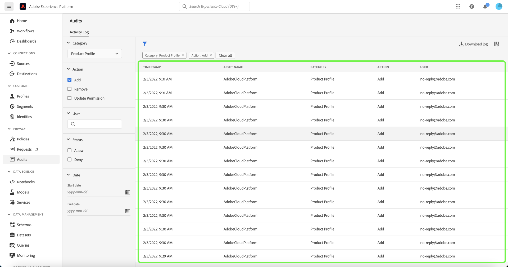

# Journaux d’audit {#audit-logs}

>[!CONTEXTUALHELP]
>id="platform_audits_privacyconsole_actions"
>title="Principales actions"
>abstract="Ce widget affiche les principaux types d&#39;actions exécutées dans Experience Platform au cours de la période sélectionnée. Pour afficher la liste complète des actions enregistrées dans Experience Platform, sélectionnez **Audits** dans le volet de navigation de gauche."

>[!CONTEXTUALHELP]
>id="platform_audits_privacyconsole_users"
>title="Utilisateurs principaux"
>abstract="Ce widget affiche les utilisateurs ayant exécuté le plus d&#39;actions dans Experience Platform au cours de la période sélectionnée. Pour afficher la liste complète des actions enregistrées dans Experience Platform, sélectionnez **Audits** dans le volet de navigation de gauche."

>[!CONTEXTUALHELP]
>id="platform_privacyConsole_audits_description"
>title="Surveiller les activités des utilisateurs et utilisatrices dans Experience Platform"
>abstract="<h2>Description</h2>
Vous pouvez surveiller l’activité des utilisateurs et utilisatrices pour divers services et fonctionnalités d’Experience Platform sous la forme de journaux d’audit. Ces journaux forment un journal d’audit qui enregistre <b>qui</b> a effectué <b>quelle</b> action et <b>quand</b>. Les journaux d’audit peuvent vous aider à résoudre les problèmes liés à Experience Platform et aider votre entreprise à se conformer efficacement aux politiques de gestion des données d’entreprise et aux exigences réglementaires.
"

Afin d’accroître la transparence et la visibilité des activités exécutées dans le système, Adobe Experience Platform vous permet d’auditer l’activité des utilisateurs et utilisatrices pour divers services et fonctionnalités sous la forme de « journaux d’audit ». Ces journaux constituent un journal d’audit qui peut vous aider à résoudre les problèmes liés à Experience Platform et à respecter efficacement les politiques de gestion des données d’entreprise et les exigences réglementaires.

Pour faire simple, un journal d’audit indique **qui** effectué **quelle** action et **quand**. Chaque action enregistrée dans un journal contient des métadonnées qui indiquent le type d’action, la date et l’heure, l’ID d’e-mail de l’utilisateur ou de l’utilisatrice qui a exécuté l’action et des attributs supplémentaires liés au type d’action.

>[!NOTE]
>
> Les métadonnées des actions **Ajouter un utilisateur** et **Supprimer un utilisateur** dans la ressource **Rôle** ne contiennent pas l’ID d’e-mail de l’utilisateur qui a exécuté l’action. À la place, les journaux affichent l’ID d’e-mail généré par le système (system@adobe.com).

Ce document couvre les journaux d’audit dans Experience Platform, y compris la manière de les afficher et de les gérer dans l’interface utilisateur ou l’API.

## Types d’événements capturés par les logs d’audit {#category}

Le tableau suivant décrit les actions sur lesquelles les ressources sont enregistrées par les journaux d’audit :

| Ressource | Actions |
| --- | --- |
| [Politique de contrôle d’accès (contrôle d’accès basé sur les attributs)](../../../access-control/home.md) | <ul><li>Créer</li><li>Mise à jour </li><li>Supprimer</li></ul> |
| [Compte (Adobe)](../../../sources/connectors/tutorials/ui/../../../tutorials/ui/update.md) | <ul><li>Créer</li><li>Mise à jour </li><li>Supprimer</li></ul> |
| [Instance IA dédiée à l’attribution](../../../intelligent-services/attribution-ai/overview.md) | <ul><li>Créer</li><li>Mise à jour </li><li>Supprimer</li><li>Activer</li><li>Désactiver</li></ul> |
| [Journaux d’audit](../../../landing/governance-privacy-security/audit-logs/overview.md) | <ul><li>Exporter</li></ul> |
| [Classe](../../../xdm/schema/composition.md#class) | <ul><li>Créer</li><li>Mise à jour </li><li>Supprimer</li></ul> |
| Attribut calculé | <ul><li>Créer</li><li>Mise à jour </li><li>Supprimer</li></ul> |
| [Instance IA dédiée aux clients](../../../intelligent-services/customer-ai/overview.md) | <ul><li>Créer</li><li>Mise à jour </li><li>Supprimer</li><li>Activer</li><li>Désactiver</li></ul> |
| [Jeu de données](../../../catalog/datasets/overview.md) | <ul><li>Créer</li><li>Mise à jour </li><li>Supprimer</li><li>Activez pour [profil client en temps réel](../../../profile/home.md)</li><li>Désactiver pour le profil</li><li>Ajouter des données</li><li>Supprimer le lot</li></ul> |
| [Flux de données](../../../datastreams/overview.md) | <ul><li>Créer</li><li>Mise à jour </li><li>Supprimer</li><li>Activer</li><li>Désactiver</li><li>[Modifier le mappage](../../../datastreams/data-prep.md)</li></ul> |
| [Types des données](../../../xdm/schema/composition.md#data-type) | <ul><li>Créer</li><li>Mise à jour </li><li>Supprimer</li></ul> |
| [Destination](../../../destinations/home.md) | <ul><li>Créer</li><li>Mise à jour </li><li>Supprimer</li><li>Activer</li><li>Désactiver</li><li>Activation du jeu de données</li><li>Suppression du jeu de données</li><li>Activer le profil</li><li>Supprimer le profil</li></ul> |
| [Groupe de champs](../../../xdm/schema/composition.md#field-group) | <ul><li>Créer</li><li>Mise à jour </li><li>Supprimer</li></ul> |
| [Graphique d’identités](../../../identity-service/features/identity-graph-viewer.md) | <ul><li>Affichage</li></ul> |
| [Espace de noms d’identité](../../../identity-service/features/namespaces.md) | <ul><li>Créer</li><li>Mise à jour </li></ul> |
| [Politique de fusion](../../../profile/merge-policies/overview.md) | <ul><li>Créer</li><li>Mise à jour </li><li>Supprimer</li></ul> |
| [Profil de produit](../../../access-control/home.md) | <ul><li>Créer</li><li>Mise à jour </li><li>Supprimer</li></ul> |
| [Requête](../../../query-service/ui/overview.md) | <ul><li>Exécuter</li></ul> |
| [Modèle de requête ](../../../query-service/ui/overview.md) | <ul><li>Créer</li><li>Mise à jour </li><li>Supprimer</li></ul> |
| [Rôle (contrôle d’accès basé sur les attributs)](../../../access-control/home.md) | <ul><li>Créer</li><li>Mise à jour </li><li>Supprimer</li><li>Ajouter un utilisateur</li><li>Supprimer l’utilisateur</li></ul> |
| [ Sandbox ](../../../sandboxes/home.md) | <ul><li>Créer</li><li>Mise à jour </li><li>Réinitialiser</li><li>Supprimer</li></ul> |
| [Requête planifiée](../../../query-service/ui/overview.md) | <ul><li>Créer</li><li>Mise à jour </li><li>Supprimer</li></ul> |
| [Schéma](../../../xdm/schema/composition.md) | <ul><li>Créer</li><li>Mise à jour </li><li>Supprimer</li><li>Activer pour le profil</li></ul> |
| [Segment](../../../segmentation/home.md) | <ul><li>Créer</li><li>Supprimer</li><li>Activation de segment</li><li>Suppression de segment</li></ul> |
| [Flux de données Source](../../../sources/connectors/tutorials/ui/../../../tutorials/ui/update.md) | <ul><li>Créer</li><li>Mise à jour </li><li>Supprimer</li><li>Activer</li><li>Désactiver</li><li>Activation du jeu de données</li><li>Suppression du jeu de données</li><li>Activation du profil</li><li>Suppression du profil</li></ul> |
| [Ordre de travail](../../../hygiene/home.md) | <ul><li>Créer</li></ul> |

## Accès aux journaux d’audit

Lorsque la fonctionnalité est activée pour votre organisation, les journaux d’audit sont automatiquement collectés au fur et à mesure de l’activité. Vous n’avez pas besoin d’activer manuellement la collecte des journaux.

Pour afficher et exporter les journaux d’audit, l’autorisation de contrôle d’accès **[!UICONTROL Afficher le journal d’activité de l’utilisateur]** doit être accordée (pour la catégorie [!UICONTROL Gouvernance des données]). Pour savoir comment gérer les autorisations individuelles pour les fonctionnalités Experience Platform, reportez-vous à la [documentation sur le contrôle d’accès](../../../access-control/home.md).

## Gérer les journaux d’audit dans l’interface utilisateur {#managing-audit-logs-in-the-ui}

>[!CONTEXTUALHELP]
>id="platform_privacyConsole_audits_instructions"
>title="Instructions"
>abstract="<ul><li>Sélectionnez <b>Audits</b> dans le volet de navigation de gauche. L’espace de travail Audits affiche une liste des journaux enregistrés, triés par défaut du plus récent au moins récent.</li>   <li> REMARQUE : les journaux d’audit sont conservés pendant 365 jours, après quoi ils seront supprimés du système. Par conséquent, vous ne pouvez revenir en arrière que pendant une période maximale de 365 jours. Si vous devez revenir sur des données datant de plus de 365 jours, vous devez exporter régulièrement les journaux afin de répondre aux exigences de votre politique interne. </li><li>Sélectionnez un événement dans la liste pour afficher ses détails dans le rail de droite. </li><li>Sélectionnez l’icône en forme d’entonnoir pour afficher une liste de contrôles de filtre permettant de limiter les résultats. Seuls les 1 000 derniers enregistrements sont affichés, quels que soient les différents filtres sélectionnés. </li><li>Pour exporter la liste actuelle des journaux d’audit, sélectionnez **Journal de téléchargement**.</li><li>Pour plus d’informations sur cette fonctionnalité, voir l’<a href="https://experienceleague.adobe.com/docs/experience-platform/landing/governance-privacy-security/audit-logs/overview.html?lang=fr">aperçu des journaux d’audit</a> sur Experience League.</li></ul>"

Vous pouvez afficher les journaux d’audit de différentes fonctionnalités d’Experience Platform dans l’espace de travail **[!UICONTROL Audits]** de l’interface utilisateur d’Experience Platform. L’espace de travail affiche une liste des journaux enregistrés, triés par défaut du plus récent au moins récent.

Les journaux d’audit sont conservés pendant 365 jours, après quoi ils seront supprimés du système. Si vous avez besoin de données de plus de 365 jours, vous devez exporter régulièrement les journaux pour répondre aux exigences de votre politique interne.

Votre méthode de demande des journaux d’audit modifie la période autorisée et le nombre d’enregistrements auxquels vous aurez accès. L’[ Exportation des journaux ](#export-audit-logs) vous permet de revenir 365 jours en arrière (par intervalles de 90 jours) à un maximum de 10 000 enregistrements, où comme l’[interface utilisateur du journal d’activité](#filter-audit-logs) dans Experience Platform affiche les 90 derniers jours à un maximum de 1 000 enregistrements.

Sélectionnez un événement dans la liste pour afficher ses détails dans le rail de droite.

### Filtrer les journaux d’audit

Sélectionnez l’icône en forme d’entonnoir () pour afficher une liste de contrôles de filtre afin de limiter les résultats.

>[!NOTE]
>
>L’interface utilisateur d’Experience Platform affiche uniquement les 90 derniers jours sur un maximum de 1 000 enregistrements, quels que soient les filtres appliqués. Si vous avez besoin de journaux au-delà de cette période (jusqu’à 365 jours au maximum), vous devez [exporter vos journaux d’audit](#export-audit-logs).

Les filtres suivants sont disponibles pour les événements d’audit dans l’interface utilisateur :

| Filtre | Description |
| --- | --- |
| [!UICONTROL Catégorie] | Utilisez le menu déroulant pour filtrer les résultats affichés par [ catégorie ](#category). |
| [!UICONTROL Action] | Filtrez par action. Les actions disponibles pour chaque service sont visibles dans le tableau des ressources ci-dessus. |
| [!UICONTROL Utilisateur] | Saisissez l’ID utilisateur complet (par exemple, `johndoe@acme.com`) à filtrer par utilisateur. |
| [!UICONTROL Statut] | Filtrez par si l’action a été autorisée (terminée) ou refusée en raison d’un manque d’autorisations [contrôle d’accès](../../../access-control/home.md). |
| [!UICONTROL Date] | Sélectionnez une date de début et/ou une date de fin pour définir une période en fonction de laquelle filtrer les résultats. Les données peuvent être exportées avec une période de recherche en amont de 90 jours (par exemple, 2021-12-15 à 2022-03-15). Cela peut varier en fonction du type d’événement. |

Pour supprimer un filtre, sélectionnez « X » sur l’icône de pilule du filtre en question, ou sélectionnez **[!UICONTROL Effacer tout]** pour supprimer tous les filtres.

Les données du journal d’audit renvoyées contiennent les informations suivantes sur toutes les requêtes qui répondent aux critères de filtre de votre choix.

| Nom de la colonne | Description |
|---|---|
| [!UICONTROL Horodatage] | Date et heure exactes de l’action effectuée au format `month/day/year hour:minute AM/PM`. |
| [!UICONTROL Nom de la ressource] | La valeur du champ [!UICONTROL &#x200B; Nom de ressource &#x200B;] dépend de la catégorie choisie comme filtre. |
| [!UICONTROL Catégorie] | Ce champ correspond à la catégorie sélectionnée dans la liste déroulante de filtre. |
| [!UICONTROL Action] | Les actions disponibles dépendent de la catégorie choisie comme filtre. |
| [!UICONTROL Utilisateur] | Ce champ fournit l’identifiant utilisateur qui a exécuté la requête. |

### Exportation des journaux d’audit {#export-audit-logs}

Pour exporter la liste actuelle des journaux d’audit, sélectionnez **[!UICONTROL Journal de téléchargement]**.

>[!NOTE]
>
>Les journaux peuvent être demandés par intervalles de 90 jours jusqu’à 365 jours dans le passé. Cependant, la quantité maximale de journaux pouvant être renvoyés au cours d’une seule exportation est de 10 000.

![Tableau de bord des audits avec l’option [!UICONTROL Journal des téléchargements] mise en surbrillance.](../../images/audit-logs/download.png)

Dans la boîte de dialogue qui s’affiche, sélectionnez le format de votre choix (**[!UICONTROL CSV]** ou **[!UICONTROL JSON]**), puis sélectionnez **[!UICONTROL Télécharger]**. Le navigateur télécharge le fichier généré et l’enregistre sur votre ordinateur.

![Boîte de dialogue de sélection du format de fichier avec [!UICONTROL Télécharger] en surbrillance.](../../images/audit-logs/select-download-format.png)

## Activer les alertes {#enable-alerts}

Vous pouvez activer les alertes d’audit pour recevoir des notifications pour les règles suivantes :

* Création d’une audience
* Mise à jour d’une audience
* Suppression d’une audience
* Création d’un jeu de données
* Mise à jour d’un jeu de données
* Suppression d’un jeu de données
* Création d’un schéma
* Mise à jour d’un schéma
* Suppression de schémas

Sélectionnez l’alerte souhaitée dans la liste et abonnez-vous à des notifications. Pour plus d’informations sur les alertes, consultez le guide sur [l’abonnement aux alertes dans l’interface utilisateur](../../../observability/alerts/ui.md).

## Gestion des journaux d’audit dans l’API

Toutes les actions que vous pouvez effectuer dans l’interface utilisateur peuvent également être effectuées à l’aide d’appels API. Voir le [document de référence des API](https://www.adobe.io/experience-platform-apis/references/audit-query/) pour plus d’informations.

## Gestion des journaux d’audit pour Adobe Admin Console

Pour savoir comment gérer les journaux d’audit des activités dans Adobe Admin Console, reportez-vous au [document](https://helpx.adobe.com/fr/enterprise/using/audit-logs.html) suivant.

## Étapes suivantes et ressources supplémentaires

Ce guide explique comment gérer les journaux d’audit dans Experience Platform. Pour plus d’informations sur la surveillance des activités d’Experience Platform, consultez la documentation sur [Observability Insights](../../../observability/home.md) et [la surveillance de l’ingestion des données](../../../ingestion/quality/monitor-data-ingestion.md).

Pour mieux comprendre les journaux d’audit dans Experience Platform, regardez la vidéo suivante :

>[!VIDEO](https://video.tv.adobe.com/v/344646?quality=12&learn=on&captions=fre_fr)
