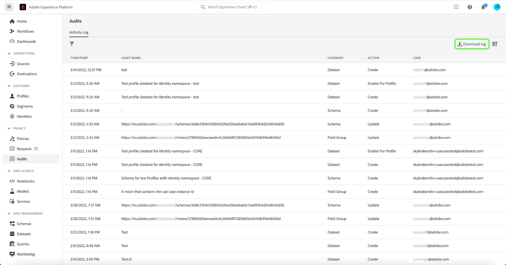

# Journaux d’audit {#audit-logs}

>[!CONTEXTUALHELP]
>id="platform_audits_privacyconsole_actions"
>title="Actions principales"
>abstract="Ce widget affiche les principaux types d&#39;actions exécutées dans Experience Platform au cours de la période sélectionnée. Pour afficher la liste complète des actions enregistrées dans Platform, sélectionnez **Audits** dans le volet de navigation de gauche."

>[!CONTEXTUALHELP]
>id="platform_audits_privacyconsole_users"
>title="Utilisateurs principaux"
>abstract="Ce widget affiche les utilisateurs ayant exécuté le plus d&#39;actions dans Experience Platform au cours de la période sélectionnée. Pour afficher la liste complète des actions enregistrées dans Platform, sélectionnez **Audits** dans le volet de navigation de gauche."

>[!CONTEXTUALHELP]
>id="platform_privacyConsole_audits_description"
>title="Surveillance des activités des utilisateurs dans Platform"
>abstract="<h2>Description</h2>
Vous pouvez surveiller l’activité des utilisateurs pour divers services et fonctionnalités de Platform sous la forme de journaux d’audit. Ces journaux forment un journal d’audit qui enregistre <b>who</b> performance <b>what</b> action et <b>when</b>. Les journaux d’audit peuvent vous aider à résoudre les problèmes liés à Platform et aider votre entreprise à se conformer efficacement aux politiques de gestion des données d’entreprise et aux exigences réglementaires.
"

Afin d’accroître la transparence et la visibilité des activités exécutées dans le système, Adobe Experience Platform vous permet de contrôler l’activité des utilisateurs pour divers services et fonctionnalités sous la forme de &quot;journaux d’audit&quot;. Ces journaux constituent un journal d’audit qui peut vous aider à résoudre les problèmes liés à Platform et à aider votre entreprise à se conformer efficacement aux politiques de gestion des données d’entreprise et aux exigences réglementaires.

Pour faire simple, un journal d’audit indique **qui** a effectué **quelle** action et **quand**. Chaque action enregistrée dans un journal contient des métadonnées qui indiquent le type d’action, la date et l’heure, l’ID d’e-mail de l’utilisateur ou de l’utilisatrice qui a exécuté l’action et des attributs supplémentaires liés au type d’action.

Ce document couvre les journaux d’audit dans Platform, y compris la manière de les afficher et de les gérer dans l’interface utilisateur ou l’API.

## Types d’événements capturés par les journaux d’audit {#category}

Le tableau ci-dessous présente les actions sur lesquelles les ressources sont enregistrées par les journaux d’audit:

| Ressource | Actions |
| --- | --- |
| [Stratégie de contrôle d’accès (contrôle d’accès basé sur les attributs)](../../../access-control/home.md) | <ul><li>Créer</li><li>Mise à jour </li><li>Supprimer</li></ul> |
| [Compte (Adobe)](../../../sources/connectors/tutorials/ui/../../../tutorials/ui/update.md) | <ul><li>Créer</li><li>Mise à jour </li><li>Supprimer</li></ul> |
| [Instance IA dédiée à l’attribution](../../../intelligent-services/attribution-ai/overview.md) | <ul><li>Créer</li><li>Mise à jour </li><li>Supprimer</li><li>Activer</li><li>Désactiver</li></ul> |
| [Journaux d’audit](../../../landing/governance-privacy-security/audit-logs/overview.md) | <ul><li>Exporter</li></ul> |
| [Classe](../../../xdm/schema/composition.md#class) | <ul><li>Créer</li><li>Mise à jour </li><li>Supprimer</li></ul> |
| Attribut calculé | <ul><li>Créer</li><li>Mise à jour </li><li>Supprimer</li></ul> |
| [Instance IA dédiée aux clients](../../../intelligent-services/customer-ai/overview.md) | <ul><li>Créer</li><li>Mise à jour </li><li>Supprimer</li><li>Activer</li><li>Désactiver</li></ul> |
| [Jeu de données](../../../catalog/datasets/overview.md) | <ul><li>Créer</li><li>Mise à jour </li><li>Supprimer</li><li>Activer pour [Profil client en temps réel](../../../profile/home.md)</li><li>Désactiver pour Profile</li><li>Ajouter des données</li><li>Supprimer le lot</li></ul> |
| [Flux de données](../../../edge/datastreams/overview.md) | <ul><li>Créer</li><li>Mise à jour </li><li>Supprimer</li><li>Activer</li><li>Désactiver</li><li>[Modifier le mappage](../../../edge/datastreams/data-prep.md)</li></ul> |
| [Types de données](../../../xdm/schema/composition.md#data-type) | <ul><li>Créer</li><li>Mise à jour </li><li>Supprimer</li></ul> |
| [Destination](../../../destinations/home.md) | <ul><li>Créer</li><li>Mise à jour </li><li>Supprimer</li><li>Activer</li><li>Désactiver</li><li>Activation du jeu de données</li><li>Suppression de jeux de données</li><li>Activation de profil</li><li>Suppression de profils</li></ul> |
| [Groupe de champs](../../../xdm/schema/composition.md#field-group) | <ul><li>Créer</li><li>Mise à jour </li><li>Supprimer</li></ul> |
| [Graphique d’identités](../../../identity-service/ui/identity-graph-viewer.md) | <ul><li>Affichage</li></ul> |
| [Espace de noms d’identité](../../../identity-service/ui/identity-graph-viewer.md) | <ul><li>Créer</li><li>Mise à jour </li></ul> |
| [Stratégie de fusion](../../../profile/merge-policies/overview.md) | <ul><li>Créer</li><li>Mise à jour </li><li>Supprimer</li></ul> |
| [Profil de produit](../../../access-control/home.md) | <ul><li>Créer</li><li>Mise à jour </li><li>Supprimer</li></ul> |
| [Requête](../../../query-service/ui/overview.md) | <ul><li>Exécuter</li></ul> |
| [Modèle de requête](../../../query-service/ui/overview.md) | <ul><li>Créer</li><li>Mise à jour </li><li>Supprimer</li></ul> |
| [Rôle (contrôle d’accès basé sur les attributs)](../../../access-control/home.md) | <ul><li>Créer</li><li>Mise à jour </li><li>Supprimer</li><li>Ajouter un utilisateur</li><li>Supprimer un utilisateur</li></ul> |
| [Sandbox](../../../sandboxes/home.md) | <ul><li>Créer</li><li>Mise à jour </li><li>Réinitialiser</li><li>Supprimer</li></ul> |
| [Requête planifiée](../../../query-service/ui/overview.md) | <ul><li>Créer</li><li>Mise à jour </li><li>Supprimer</li></ul> |
| [Schéma](../../../xdm/schema/composition.md) | <ul><li>Créer</li><li>Mise à jour </li><li>Supprimer</li><li>Activez pour le Profil</li></ul> |
| [Segment](../../../segmentation/home.md) | <ul><li>Créer</li><li>Supprimer</li><li>Activation de segment</li><li>Suppression de segment</li></ul> |
| [Flux de données source](../../../sources/connectors/tutorials/ui/../../../tutorials/ui/update.md) | <ul><li>Créer</li><li>Mise à jour </li><li>Supprimer</li><li>Activer</li><li>Désactiver</li><li>Activation du jeu de données</li><li>Suppression du jeu de données</li><li>Activité de profil</li><li>Suppression de profil</li></ul> |
| [Ordre de travail](../../../hygiene/home.md) | <ul><li>Créer</li></ul> |

## Accéder aux journaux d’audit

Lorsque la fonction est activée pour votre organisation, les journaux d’audit sont automatiquement collectés au fur et à mesure de l’activité. Vous n’avez pas besoin d’activer manuellement la collecte des journaux.

Pour afficher et exporter les journaux d’audit, vous devez disposer de la variable **[!UICONTROL Afficher le journal d’activité utilisateur]** l’autorisation de contrôle d’accès accordée (trouvée sous [!UICONTROL Gouvernance des données] catégorie). Pour savoir comment gérer les autorisations individuelles pour les fonctionnalités de Platform, reportez-vous à la section [documentation sur le contrôle d’accès](../../../access-control/home.md).

## Gestion des journaux d’audit dans l’interface utilisateur {#managing-audit-logs-in-the-ui}

>[!CONTEXTUALHELP]
>id="platform_privacyConsole_audits_instructions"
>title="Instructions"
>abstract="<ul><li>Sélectionner <b>Audits</b> dans le volet de navigation de gauche. L’espace de travail Audits affiche une liste des journaux enregistrés, triés par défaut de la plus récente à la moins récente.</li>   <li> REMARQUE : Les journaux d’audit sont conservés pendant 365 jours, après quoi ils seront supprimés du système. Par conséquent, vous ne pouvez revenir en arrière que pendant une période maximale de 365 jours. Si vous devez revenir sur des données datant de plus de 365 jours, vous devez exporter les journaux à un rythme régulier afin de répondre aux exigences de votre politique interne. </li><li>Sélectionnez un événement dans la liste pour afficher ses détails dans le rail de droite. </li><li>Sélectionnez l’icône d’entonnoir pour afficher une liste de contrôles de filtre afin de limiter les résultats. Seuls les 1000 derniers enregistrements sont affichés, quels que soient les filtres sélectionnés. </li><li>Pour exporter la liste actuelle des journaux d’audit, sélectionnez **Journal de téléchargement**.</li><li>Pour obtenir de l’aide sur cette fonctionnalité, voir <a href="https://experienceleague.adobe.com/docs/experience-platform/landing/governance-privacy-security/audit-logs/overview.html?lang=fr">aperçu des journaux d’audit</a> sur Experience League.</li></ul>"

Vous pouvez afficher les journaux d’audit pour différentes fonctionnalités d’Experience Platform dans le **[!UICONTROL Audits]** dans l’interface utilisateur de Platform. L’espace de travail affiche une liste des journaux enregistrés, triés par défaut de la plus récente à la moins récente.

Les journaux d’audit sont conservés pendant 365 jours, après quoi ils seront supprimés du système. Par conséquent, vous ne pouvez revenir en arrière que pendant une période maximale de 365 jours. Si vous avez besoin de données de plus de 365 jours, vous devez exporter les journaux à un rythme régulier afin de répondre aux exigences de votre stratégie interne.

Sélectionnez un événement dans la liste pour afficher ses détails dans le rail de droite.

### Filtrer des journaux d’audit

>[!NOTE]
Comme il s’agit d’une nouvelle fonctionnalité, les données affichées remontent uniquement à mars 2022. Selon la ressource sélectionnée, des données antérieures pourront être disponibles à partir de janvier 2022.

Sélectionnez l’icône en forme d’entonnoir () pour afficher une liste de contrôles de filtre afin de limiter les résultats. Seuls les 1000 derniers enregistrements sont affichés, quels que soient les différents filtres sélectionnés.

Les filtres suivants sont disponibles pour les événements d’audit dans l’interface utilisateur :

| Filtre | Description |
| --- | --- |
| [!UICONTROL Catégorie] | Utiliser le menu déroulant pour filtrer les résultats affichés par [category](#category). |
| [!UICONTROL Action] | Filtrer par action. Actuellement uniquement [!UICONTROL Créer] et [!UICONTROL Supprimer] Les actions peuvent être filtrées. |
| [!UICONTROL Utilisateur] | Saisissez l’identifiant utilisateur complet (par exemple, `johndoe@acme.com`) pour filtrer par utilisateur. |
| [!UICONTROL Statut] | Filtrez selon si l’action a été autorisée (terminée) ou refusée en raison de l’absence de [contrôle d&#39;accès](../../../access-control/home.md) autorisations. |
| [!UICONTROL Date] | Sélectionnez une date de début et/ou une date de fin pour définir une période en fonction de laquelle filtrer les résultats. Les données peuvent être exportées avec une période de recherche arrière de 90 jours (par exemple, 2021-12-15 à 2022-03-15). Cela peut varier en fonction du type d’événement. |

Pour supprimer un filtre, sélectionnez « X » sur l’icône de pilule du filtre en question, ou sélectionnez **[!UICONTROL Effacer tout]** pour supprimer tous les filtres.

### Exportation des journaux d’audit

Pour exporter la liste actuelle des journaux d’audit, sélectionnez **[!UICONTROL Journal de téléchargement]**.

Dans la boîte de dialogue qui s’affiche, sélectionnez le format de votre choix (soit **[!UICONTROL CSV]** ou **[!UICONTROL JSON]**), puis sélectionnez **[!UICONTROL Télécharger]**. Le navigateur télécharge le fichier généré et l’enregistre sur votre ordinateur.

## Gestion des journaux d’audit dans l’API

Toutes les actions que vous pouvez effectuer dans l’interface utilisateur peuvent également être effectuées à l’aide d’appels API. Pour plus d’informations, voir le [document de référence relatif aux API ](https://www.adobe.io/experience-platform-apis/references/audit-query/).

## Gestion des journaux d’audit pour Adobe Admin Console

Pour savoir comment gérer les journaux d’audit pour les activités dans Adobe Admin Console, reportez-vous aux sections suivantes : [document](https://helpx.adobe.com/enterprise/using/audit-logs.html).

## Étapes suivantes et ressources supplémentaires

Ce guide explique comment gérer les journaux d’audit dans Experience Platform. Pour plus d’informations sur la surveillance des activités de Platform, consultez la documentation sur [Observability Insights](../../../observability/home.md) et [surveillance de l’ingestion des données](../../../ingestion/quality/monitor-data-ingestion.md).

Pour mieux comprendre les journaux d’audit dans Experience Platform, regardez la vidéo suivante :

>[!VIDEO](https://video.tv.adobe.com/v/341450?quality=12&learn=on)
