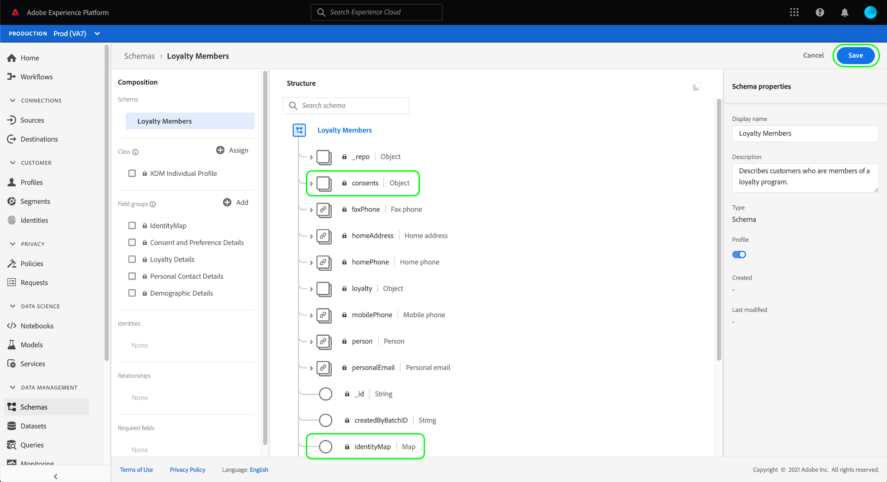

# Configurer un jeu de données pour capturer les données de consentement et de préférence

Pour que Adobe Experience Platform puisse traiter vos données de consentement/préférence client, ces données doivent être envoyées à un jeu de données dont le schéma contient des champs relatifs aux consentements et autres autorisations. Plus précisément, ce jeu de données doit être basé sur la classe [!DNL XDM Individual Profile] et être activé pour une utilisation dans [!DNL Real-time Customer Profile].

Ce document décrit la procédure à suivre pour configurer un jeu de données afin de traiter les données de consentement dans l’Experience Platform. Pour une vue d&#39;ensemble du processus de traitement des données de consentement/préférence dans la plate-forme, consultez la [présentation du traitement du consentement](./overview.md).

>[!IMPORTANT]
>
>Les exemples de ce guide utilisent un ensemble de champs normalisé pour représenter les valeurs de consentement du client, telles que définies par le type de données XDM [Contenus et préférences ](../../../../xdm/data-types/consents.md). La structure de ces champs vise à fournir un modèle de données efficace pour couvrir de nombreux cas d&#39;utilisation communs de la collecte de consentement.
>
>Cependant, vous pouvez également définir vos propres mixins pour représenter le consentement selon vos propres modèles de données. Consultez votre équipe juridique pour obtenir l&#39;approbation d&#39;un modèle de données de consentement qui répond à vos besoins commerciaux, en fonction des options suivantes :
>
>* Le mélange normalisé de consentement
>* Mélange de consentement personnalisé créé par votre organisation
>* Combinaison du mélange normalisé de consentement et des champs supplémentaires fournis par un mélange de consentement personnalisé


## Conditions préalables

Ce tutoriel nécessite une compréhension du fonctionnement des composants suivants d’Adobe Experience Platform :

* [Modèle de données d’expérience (XDM)](../../../../xdm/home.md)[!DNL Experience Platform] : cadre normalisé selon lequel Experience organise les données d’expérience client.
   * [Notions de base de la composition du schéma](../../../../xdm/schema/composition.md) : en savoir plus sur les blocs de création de base des schémas XDM.
* [Profil](../../../../profile/home.md) client en temps réel : Consolidation des données client provenant de sources disparates dans une vue complète et unifiée tout en offrant un compte d’activité horodaté de chaque interaction client.

>[!IMPORTANT]
>
>Ce didacticiel suppose que vous connaissez le schéma [!DNL Profile] de la plate-forme que vous souhaitez utiliser pour capturer les informations d’attributs du client. Quelle que soit la méthode utilisée pour collecter les données de consentement, ce schéma doit être [activé pour le Profil client en temps réel](../../../../xdm/ui/resources/schemas.md#profile). En outre, l&#39;identité Principale du schéma ne peut pas être un champ directement identifiable qui ne peut pas être utilisé dans la publicité basée sur des intérêts, comme une adresse électronique. Consultez votre conseiller juridique si vous ne savez pas quels champs sont restreints.

## Structure de mixin Conférences et Préférences {#structure}

Le [!UICONTROL mixin Confidentialité/Personnalisation/Préférences marketing (Contenants)] (ci-après appelé &quot;mixin Contenants &amp; Préférences&quot;) fournit des champs normalisés de consentement à un schéma. Actuellement, ce mixin n&#39;est compatible qu&#39;avec les schémas basés sur la classe [!DNL XDM Individual Profile].

Le mixin fournit un champ de type d’objet unique, `consents`, dont les sous-propriétés capturent un ensemble de champs de consentement normalisés. Le fichier JSON suivant est un exemple du type de données `consents` attendu lors de l’assimilation des données :

```json
{
  "consents": {
    "collect": {
      "val": "y",
    },
    "share": {
      "val": "y",
    },
    "personalize": {
      "content": {
        "val": "y"
      }
    },
    "marketing": {
      "preferred": "email",
      "any": {
        "val": "y"
      },
      "push": {
        "val": "n",
        "reason": "Too Frequent",
        "time": "2019-01-01T15:52:25+00:00"
      }
    },
    "idSpecific": {
      "email": {
        "jdoe@example.com": {
          "marketing": {
            "email": {
              "val": "n"
            }
          }
        }
      }
    }
  },
  "metadata": {
    "time": "2019-01-01T15:52:25+00:00"
  }
}
```

>[!NOTE]
>
>Pour plus d&#39;informations sur la structure et la signification des sous-propriétés dans `consents`, consultez l&#39;aperçu du [type de données Contenus et préférences](../../../../xdm/data-types/consents.md).

## Ajoutez le mixin Contenus et Préférences à votre schéma [!DNL Profile] {#add-mixin}

Dans l’interface utilisateur de la plate-forme, sélectionnez **[!UICONTROL Schémas]** dans le volet de navigation de gauche, puis sélectionnez l’onglet **[!UICONTROL Parcourir]** pour afficher une liste de schémas existants. À partir de là, sélectionnez le nom du schéma activé [!DNL Profile] auquel vous souhaitez ajouter des champs de consentement. Les captures d’écran de cette section utilisent le schéma &quot;Membres fidèles&quot; du [didacticiel de création de schéma](../../../../xdm/tutorials/create-schema-ui.md) comme exemple.


>[!TIP]
>
>Vous pouvez utiliser les fonctionnalités de recherche et de filtrage de l’espace de travail pour faciliter la recherche de votre schéma. Pour plus d&#39;informations, consultez le guide [exploration des ressources XDM](../../../../xdm/ui/explore.md).

Le [!DNL Schema Editor] apparaît, indiquant la structure du schéma dans la trame. Sur le côté gauche du canevas, sélectionnez **[!UICONTROL Ajouter]** sous la section **[!UICONTROL Mixins]**.


La boîte de dialogue **[!UICONTROL Ajouter le mixin]** s&#39;affiche. Sélectionnez **[!UICONTROL Préférences de confidentialité/personnalisation/marketing (Contenus)]** dans la liste. Vous pouvez également utiliser la barre de recherche pour affiner les résultats afin de localiser plus facilement le mixin. Une fois le mixin sélectionné, sélectionnez **[!UICONTROL Ajouter le mixin]**.


Le canevas réapparaît, indiquant que l&#39;objet `consents` a été ajouté à la structure du schéma. Si vous avez besoin de champs de consentement et de préférence supplémentaires qui ne sont pas capturés par le mixin standard, consultez la section de l&#39;annexe sur [l&#39;ajout de champs de consentement et de préférence personnalisés au schéma](#custom-consent). Sinon, sélectionnez **[!UICONTROL Enregistrer]** pour finaliser les modifications apportées au schéma.



Si le schéma que vous avez modifié est utilisé par le [!UICONTROL jeu de données de Profil] spécifié dans votre configuration de bord du SDK Web de plateforme, ce jeu de données inclut désormais les nouveaux champs de consentement. Vous pouvez maintenant revenir au [guide de traitement du consentement](./overview.md#merge-policies) pour continuer le processus de configuration de l&#39;Experience Platform pour traiter les données de consentement.

Si vous n&#39;avez pas créé de jeu de données pour ce schéma, suivez les étapes de la section suivante.

## Créez un jeu de données basé sur votre schéma de consentement {#dataset}

Une fois que vous avez créé un schéma avec des champs de consentement, vous devez créer un jeu de données qui, en fin de compte, assimilera les données de consentement de vos clients. Ce jeu de données doit être activé pour [!DNL Real-time Customer Profile].

Pour commencer, sélectionnez **[!UICONTROL Datasets]** dans le volet de navigation de gauche, puis **[!UICONTROL Créer un dataset]** dans le coin supérieur droit.


Sur la page suivante, sélectionnez **[!UICONTROL Créer un jeu de données à partir du schéma]**.


Le workflow **[!UICONTROL Créer un jeu de données à partir du schéma]** s&#39;affiche, en commençant à l&#39;étape **[!UICONTROL Sélectionner le schéma]**. Dans la liste fournie, recherchez l’un des schémas de consentement que vous avez créés précédemment. Vous pouvez également utiliser la barre de recherche pour restreindre les résultats et faciliter la localisation de votre schéma. Sélectionnez le bouton radio en regard du schéma souhaité, puis **[!UICONTROL Suivant]** pour continuer.


L’étape **[!UICONTROL Configurer le jeu de données]** apparaît. Fournissez un nom et une description uniques et facilement identifiables pour le jeu de données avant de sélectionner **[!UICONTROL Terminer]**.


La page de détails du jeu de données nouvellement créé s&#39;affiche. Si le jeu de données est basé sur votre schéma de série chronologique, le processus est terminé. Si le jeu de données est basé sur votre schéma d&#39;enregistrement, la dernière étape du processus consiste à activer le jeu de données pour l&#39;utiliser dans [!DNL Real-time Customer Profile].

Dans le rail de droite, sélectionnez la bascule **[!UICONTROL Profil]**.


Enfin, sélectionnez **[!UICONTROL Activer]** dans la fenêtre contextuelle de confirmation pour activer le schéma pour [!DNL Profile].


Le jeu de données est maintenant enregistré et activé pour une utilisation dans [!DNL Profile]. Si vous envisagez d&#39;utiliser le SDK Web de la plate-forme pour envoyer des données de consentement au Profil, vous devez sélectionner ce jeu de données comme [!UICONTROL jeu de données de Profil] lors de la configuration de votre configuration de bord [Edge](../../../../edge/fundamentals/edge-configuration.md).

## Étapes suivantes

En suivant ce didacticiel, vous avez ajouté des champs de consentement à un schéma [!DNL Profile] activé, dont l&#39;ensemble de données sera utilisé pour ingérer des données de consentement à l&#39;aide du SDK Web de plate-forme ou de l&#39;assimilation directe de XDM.

Vous pouvez maintenant revenir à l&#39;[aperçu du traitement du consentement](./overview.md#merge-policies) pour continuer à configurer l&#39;Experience Platform pour traiter les données de consentement.

## Annexe

La section suivante contient des informations supplémentaires sur la création d&#39;un jeu de données pour ingérer les données de consentement et de préférence des clients.

### Ajouter les champs de consentement et de préférence personnalisés au schéma {#custom-consent}

Si vous devez capturer des signaux de consentement supplémentaires en dehors de ceux représentés par le mixin standard [!DNL Consents & Preferences], vous pouvez utiliser des composants XDM personnalisés pour améliorer votre schéma de consentement en fonction de vos besoins particuliers. Cette section décrit les principes de base de la personnalisation de votre schéma de consentement d&#39;une manière compatible avec les commandes de changement de consentement effectuées par Adobe Experience Platform Mobile et les SDK Web.

>[!IMPORTANT]
>
>Vous devez utiliser le mixin [!DNL Consents & Preferences] comme base pour la structure de vos données de consentement et ajouter des champs supplémentaires si nécessaire, plutôt que d&#39;essayer de créer la structure entière à partir de rien.

Pour ajouter des champs personnalisés à la structure d’un mixin standard, vous devez d’abord créer un mixin personnalisé. Après avoir ajouté le mixin [!DNL Consents & Preferences] au schéma, sélectionnez l&#39;icône **plus (+)** dans la section **[!UICONTROL Mixins]**, puis sélectionnez **[!UICONTROL Créer un mixin]**. Indiquez un nom et une description facultative pour le mixin, puis sélectionnez **[!UICONTROL Ajouter le mixin]**.


Le [!DNL Schema Editor] réapparaît avec le nouveau mixin personnalisé sélectionné dans le rail de gauche. Dans la trame, des contrôles s’affichent qui vous permettent d’ajouter des champs personnalisés à la structure de schéma. Pour ajouter un nouveau champ de consentement ou de préférence, sélectionnez l&#39;icône **plus (+)** en regard de l&#39;objet `consents`.


Un nouveau champ apparaît dans l&#39;objet `consents`. Puisque vous ajoutez un champ personnalisé à un objet XDM standard, le nouveau champ est créé sous un objet qui porte un espace de noms à votre ID de client.


Dans le rail de droite sous **[!UICONTROL Propriétés de champ]**, indiquez un nom et une description pour le champ. Lors de la sélection du **[!UICONTROL Type]** du champ, vous devez utiliser le type de données standard approprié pour un champ de préférence ou de consentement personnalisé :

* [[!UICONTROL Champ de consentement générique]](../../../../xdm/data-types/consent-field.md)
* [[!UICONTROL Champ de préférence marketing générique]](../../../../xdm/data-types/marketing-field.md)
* [[!UICONTROL Champ de préférence marketing générique avec Abonnements]](../../../../xdm/data-types/marketing-field-subscriptions.md)
* [[!UICONTROL Champ de préférence Personnalisation générique]](../../../../xdm/data-types/personalization-field.md)

Lorsque vous avez terminé, sélectionnez **[!UICONTROL Appliquer]**.


Le champ consentement ou préférence est ajouté à la structure du schéma. Notez que le [!UICONTROL chemin] affiché dans le rail de droite contient l&#39;espace de nommage `_tenantId`. Cet espace de nommage doit être inclus chaque fois que vous référencez le chemin d’accès à ce champ dans vos opérations de données.


Suivez les étapes ci-dessus pour continuer à ajouter les champs de consentement et de préférence requis. Lorsque vous avez terminé, sélectionnez **[!UICONTROL Enregistrer]** pour confirmer vos modifications.

Si le schéma que vous avez modifié est utilisé par le [!UICONTROL jeu de données de Profil] spécifié dans votre configuration de bord du SDK Web de plateforme, ce jeu de données inclut désormais les nouveaux champs de consentement. Vous pouvez maintenant revenir au [guide de traitement du consentement](./overview.md#merge-policies) pour continuer le processus de configuration de l&#39;Experience Platform pour traiter les données de consentement.

Si vous n&#39;avez pas créé de jeu de données pour ce schéma, passez à la section [Création d&#39;un jeu de données](#dataset).