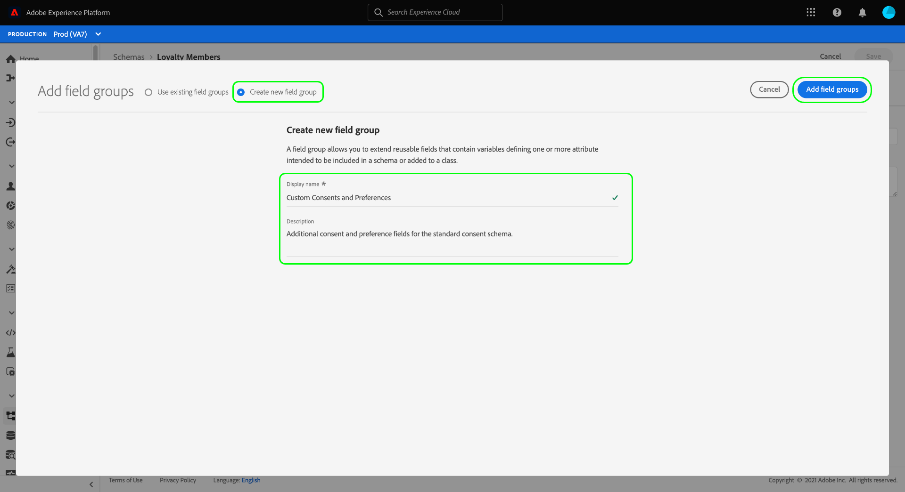

# Configuration d’un jeu de données pour capturer les données de consentement et de préférence

Pour que Adobe Experience Platform traite vos données de consentement/préférence client, ces données doivent être envoyées à un jeu de données dont le schéma contient des champs liés aux consentements et d’autres autorisations. Plus précisément, ce jeu de données doit être basé sur la classe [!DNL XDM Individual Profile] et activé pour une utilisation dans [!DNL Real-Time Customer Profile].

Ce document décrit les étapes de configuration d’un jeu de données pour traiter les données de consentement dans Experience Platform. Pour une présentation du workflow complet de traitement des données de consentement/préférence dans Platform, reportez-vous à la [présentation du traitement du consentement](./overview.md).

>[!IMPORTANT]
>
>Les exemples de ce guide utilisent un ensemble de champs normalisé pour représenter les valeurs de consentement du client, comme défini par le groupe de champs de schéma [[!UICONTROL Détails du consentement et des préférences] ](../../../../xdm/field-groups/profile/consents.md). La structure de ces champs est destinée à fournir un modèle de données efficace pour couvrir de nombreux cas d’utilisation de collecte de consentement courants.
>
>Cependant, vous pouvez également définir vos propres groupes de champs pour représenter le consentement en fonction de vos propres modèles de données. Consultez votre équipe juridique pour obtenir l’approbation d’un modèle de données de consentement adapté à vos besoins professionnels, en fonction des options suivantes :
>
>* Groupe de champs de consentement normalisé
>* Un groupe de champs de consentement personnalisé créé par votre organisation
>* Combinaison du groupe de champs de consentement normalisé et des champs supplémentaires fournis par un groupe de champs de consentement personnalisé

## Conditions préalables

Ce tutoriel nécessite une compréhension du fonctionnement des composants suivants d’Adobe Experience Platform :

* [Modèle de données d’expérience (XDM)](../../../../xdm/home.md) : cadre normalisé selon lequel [!DNL Experience Platform] organise les données d’expérience client.
   * [Notions de base de la composition du schéma](../../../../xdm/schema/composition.md) : en savoir plus sur les blocs de création de base des schémas XDM.
* [ Real-Time Customer Profile ](../../../../profile/home.md) : consolide les données client provenant de sources disparates dans une vue complète et unifiée tout en offrant un compte horodaté et exploitable de chaque interaction client.

>[!IMPORTANT]
>
>Ce tutoriel suppose que vous connaissez le schéma [!DNL Profile] de Platform que vous souhaitez utiliser pour capturer les informations d’attributs du client. Quelle que soit la méthode que vous utilisez pour collecter les données de consentement, ce schéma doit être [activé pour Real-time Customer Profile](../../../../xdm/ui/resources/schemas.md#profile). En outre, l’identité principale du schéma ne peut pas être un champ directement identifiable qui ne peut pas être utilisé dans des publicités basées sur des intérêts, telles qu’une adresse électronique. Consultez votre service juridique si vous ne savez pas quels champs sont restreints.

## [!UICONTROL Détails du consentement et des préférences] structure de groupe de champs {#structure}

Le groupe de champs [!UICONTROL Détails du consentement et de la préférence] fournit des champs de consentement normalisés à un schéma. Actuellement, ce groupe de champs n’est compatible qu’avec les schémas basés sur la classe [!DNL XDM Individual Profile].

Le groupe de champs fournit un seul champ de type objet, `consents`, dont les sous-propriétés capturent un ensemble de champs de consentement normalisés. Le fichier JSON suivant est un exemple du type de données attendu par `consents` lors de l’ingestion des données :

```json
{
  "consents": {
    "collect": {
      "val": "y",
    },
    "share": {
      "val": "y",
    },
    "personalize": {
      "content": {
        "val": "y"
      }
    },
    "marketing": {
      "preferred": "email",
      "any": {
        "val": "y"
      },
      "push": {
        "val": "n",
        "reason": "Too Frequent",
        "time": "2019-01-01T15:52:25+00:00"
      }
    },
    "idSpecific": {
      "email": {
        "jdoe@example.com": {
          "marketing": {
            "email": {
              "val": "n"
            }
          }
        }
      }
    }
  },
  "metadata": {
    "time": "2019-01-01T15:52:25+00:00"
  }
}
```

>[!NOTE]
>
>Pour plus d’informations sur la structure et la signification des sous-propriétés dans `consents`, consultez la présentation du groupe de champs [[!UICONTROL Détails du consentement et des préférences]](../../../../xdm/field-groups/profile/consents.md).

## Ajout des groupes de champs requis à votre schéma [!DNL Profile] {#add-field-group}

Pour collecter des données de consentement à l’aide de la norme Adobe, vous devez disposer d’un schéma activé par Profile qui contient les deux groupes de champs suivants :

* [[!UICONTROL  Détails du consentement et des préférences]](../../../../xdm/field-groups/profile/consents.md)
* [[!UICONTROL IdentityMap]](../../../../xdm/field-groups/profile/identitymap.md) (requis si vous utilisez le SDK Web ou mobile de Platform pour envoyer des signaux de consentement)

Dans l’interface utilisateur de Platform, sélectionnez **[!UICONTROL Schémas]** dans le volet de navigation de gauche, puis sélectionnez l’onglet **[!UICONTROL Parcourir]** pour afficher une liste des schémas existants. À partir de là, sélectionnez le nom du schéma [!DNL Profile] auquel vous souhaitez ajouter des champs de consentement. Les captures d’écran de cette section utilisent comme exemple le schéma &quot;Loyalty Members&quot; créé dans le [tutoriel de création de schéma](../../../../xdm/tutorials/create-schema-ui.md).


>[!TIP]
>
>Vous pouvez utiliser les fonctionnalités de recherche et de filtrage de l’espace de travail pour faciliter la recherche de votre schéma. Pour plus d’informations, consultez le guide sur l’ [exploration des ressources XDM](../../../../xdm/ui/explore.md) .

Le [!DNL Schema Editor] apparaît, indiquant la structure du schéma dans la zone de travail. Sur le côté gauche du canevas, sélectionnez **[!UICONTROL Ajouter]** sous la section **[!UICONTROL Groupes de champs]** .


La boîte de dialogue **[!UICONTROL Ajouter un groupe de champs]** s’affiche. À partir de là, sélectionnez **[!UICONTROL Détails du consentement et de la préférence]** dans la liste. Vous pouvez éventuellement utiliser la barre de recherche pour affiner les résultats afin de localiser plus facilement le groupe de champs.


Recherchez ensuite le groupe de champs **[!UICONTROL IdentityMap]** dans la liste et sélectionnez-le également. Une fois que les deux groupes de champs sont répertoriés dans le rail de droite, sélectionnez **[!UICONTROL Ajouter des groupes de champs]**.


Le canevas réapparaît, indiquant que les champs `consents` et `identityMap` ont été ajoutés à la structure du schéma. Si vous avez besoin de champs de consentement et de préférence supplémentaires qui ne sont pas capturés par le groupe de champs standard, reportez-vous à la section de l’annexe sur l’ [ajout de champs de consentement et de préférence personnalisés au schéma](#custom-consent). Sinon, sélectionnez **[!UICONTROL Enregistrer]** pour finaliser les modifications apportées au schéma.


>[!IMPORTANT]
>
>Si vous créez un nouveau schéma ou que vous modifiez un schéma existant qui n’a pas été activé pour Profile, vous devez [activer le schéma pour Profile](../../../../xdm/ui/resources/schemas.md#profile) avant de l’enregistrer.

Si le schéma que vous avez modifié est utilisé par le [!UICONTROL jeu de données de profil] spécifié dans votre flux de données SDK Web Platform, ce jeu de données inclura désormais les nouveaux champs de consentement. Vous pouvez maintenant revenir au [guide de traitement du consentement](./overview.md#merge-policies) pour continuer le processus de configuration de l’Experience Platform pour traiter les données de consentement. Si vous n’avez pas créé de jeu de données pour ce schéma, suivez les étapes de la section suivante.

## Création d’un jeu de données basé sur votre schéma de consentement {#dataset}

Une fois que vous avez créé un schéma avec des champs de consentement, vous devez créer un jeu de données qui assimilera en fin de compte les données de consentement de vos clients. Ce jeu de données doit être activé pour [!DNL Real-Time Customer Profile].

Pour commencer, sélectionnez **[!UICONTROL Jeux de données]** dans le volet de navigation de gauche, puis sélectionnez **[!UICONTROL Créer un jeu de données]** dans le coin supérieur droit.


Sur la page suivante, sélectionnez **[!UICONTROL Créer un jeu de données à partir du schéma]**.


Le workflow **[!UICONTROL Créer un jeu de données à partir du schéma]** s’affiche, en commençant à l’étape **[!UICONTROL Sélectionner un schéma]** . Dans la liste fournie, recherchez l’un des schémas de consentement que vous avez créés précédemment. Vous pouvez éventuellement utiliser la barre de recherche pour affiner les résultats et faciliter la localisation de votre schéma. Sélectionnez le bouton radio en regard du schéma souhaité, puis sélectionnez **[!UICONTROL Suivant]** pour continuer.


L’étape **[!UICONTROL Configurer le jeu de données]** apparaît. Attribuez un nom et une description uniques et facilement identifiables au jeu de données avant de sélectionner **[!UICONTROL Terminer]**.


La page des détails du nouveau jeu de données s’affiche. Si le jeu de données est basé sur votre schéma de série temporelle, le processus est terminé. Si le jeu de données est basé sur votre schéma d’enregistrement, la dernière étape du processus consiste à activer le jeu de données à utiliser dans [!DNL Real-Time Customer Profile].

Dans le rail de droite, sélectionnez la bascule **[!UICONTROL Profile]** .


Enfin, sélectionnez **[!UICONTROL Activer]** dans la fenêtre contextuelle de confirmation pour activer le schéma pour [!DNL Profile].


Le jeu de données est maintenant enregistré et activé pour une utilisation dans [!DNL Profile]. Si vous envisagez d’utiliser le SDK Web de Platform pour envoyer des données de consentement à Profile, vous devez sélectionner ce jeu de données comme [!UICONTROL  jeu de données de profil] lors de la configuration de votre [jeu de données](../../../../datastreams/overview.md).

## Étapes suivantes

En suivant ce tutoriel, vous avez ajouté des champs de consentement à un schéma compatible [!DNL Profile], dont le jeu de données sera utilisé pour ingérer des données de consentement à l’aide du SDK Web Platform ou de l’ingestion XDM directe.

Vous pouvez maintenant revenir à la [présentation du traitement du consentement](./overview.md#merge-policies) pour continuer à configurer l’Experience Platform pour traiter les données de consentement.

## Annexe

La section suivante contient des informations supplémentaires sur la création d’un jeu de données pour ingérer les données de consentement et de préférence du client.

### Ajout de champs de consentement et de préférence personnalisés au schéma {#custom-consent}

Si vous devez capturer des signaux de consentement supplémentaires en dehors de ceux représentés par le groupe de champs [!UICONTROL Détails du consentement et de la préférence] standard, vous pouvez utiliser des composants XDM personnalisés pour améliorer votre schéma de consentement en fonction de vos besoins professionnels spécifiques. Cette section décrit les principes de base de la personnalisation de votre schéma de consentement afin d’ingérer ces signaux dans Profile.

>[!IMPORTANT]
>
>Les SDK Web et Mobile Platform ne prennent pas en charge les champs personnalisés dans leurs commandes de modification du consentement. Actuellement, le seul moyen d’ingérer des champs de consentement personnalisés dans Profile est d’effectuer l’ [ingestion par lots](../../../../ingestion/batch-ingestion/overview.md) ou une [connexion source](../../../../sources/home.md).

Il est vivement recommandé d’utiliser le groupe de champs [!UICONTROL Détails du consentement et des préférences] comme ligne de base pour la structure de vos données de consentement et d’ajouter des champs supplémentaires si nécessaire, plutôt que d’essayer de créer entièrement la structure.

Pour ajouter des champs personnalisés à la structure d’un groupe de champs standard, vous devez d’abord créer un groupe de champs personnalisé. Après avoir ajouté le groupe de champs [!UICONTROL Détails du consentement et de la préférence] au schéma, sélectionnez l’icône **plus (+)** dans la section **[!UICONTROL Groupes de champs]**, puis sélectionnez **[!UICONTROL Créer un groupe de champs]**. Attribuez un nom et une description facultative au groupe de champs, puis sélectionnez **[!UICONTROL Ajouter un groupe de champs]**.



Le [!DNL Schema Editor] réapparaît avec le nouveau groupe de champs personnalisé sélectionné dans le rail de gauche. Dans la zone de travail, des contrôles s’affichent pour vous permettre d’ajouter des champs personnalisés à la structure du schéma. Pour ajouter un nouveau champ de consentement ou de préférence, sélectionnez l’icône **plus (+)** en regard de l’objet `consents`.


Un nouveau champ s’affiche dans l’objet `consents`. Puisque vous ajoutez un champ personnalisé à un objet XDM standard, le nouveau champ est créé sous un objet dont l’espace de noms est associé à votre ID de tenant.


Dans le rail de droite sous **[!UICONTROL Propriétés du champ]**, indiquez un nom et une description pour le champ. Lorsque vous sélectionnez le **[!UICONTROL Type]** du champ, vous devez utiliser le type de données standard approprié pour un champ de préférence ou de consentement personnalisé :

* [[!UICONTROL Champ de consentement générique]](../../../../xdm/data-types/consent-field.md)
* [[!UICONTROL Champ de préférences marketing générique]](../../../../xdm/data-types/marketing-field.md)
* [[!UICONTROL Champ de préférences marketing générique avec abonnements]](../../../../xdm/data-types/marketing-field-subscriptions.md)
* [[!UICONTROL Champ de préférences Personalization générique]](../../../../xdm/data-types/personalization-field.md)

Lorsque vous avez terminé, sélectionnez **[!UICONTROL Appliquer]**.


Le champ de consentement ou de préférence est ajouté à la structure du schéma. Notez que le [!UICONTROL Chemin] affiché dans le rail de droite contient l’espace de noms `_tenantId`. Cet espace de noms doit être inclus chaque fois que vous référencez le chemin d’accès à ce champ dans vos opérations de données.


Suivez les étapes ci-dessus pour continuer à ajouter les champs de consentement et de préférence dont vous avez besoin. Lorsque vous avez terminé, sélectionnez **[!UICONTROL Enregistrer]** pour confirmer vos modifications.

Si vous n’avez pas créé de jeu de données pour ce schéma, passez à la section [création d’un jeu de données](#dataset).
