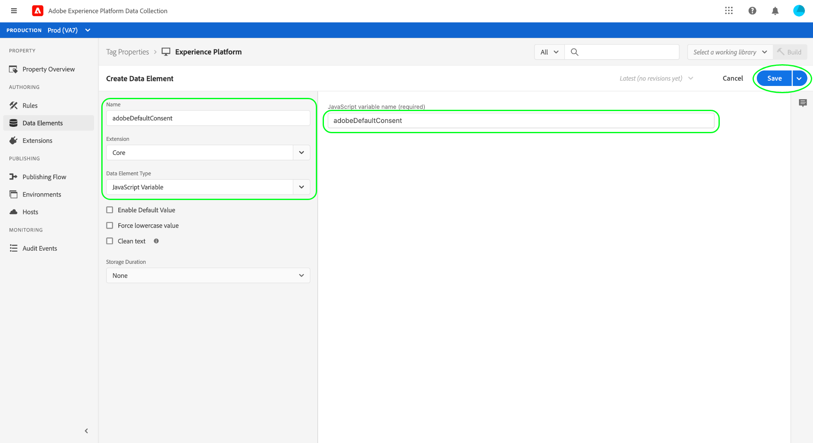

# Intégration du SDK Web de la plate-forme pour traiter les données de consentement des clients à l’aide de la norme Adobe 2.0

Le Adobe Experience Platform Web SDK vous permet de récupérer les signaux de consentement des clients générés par les plateformes de gestion du consentement (CMP) et de les envoyer à Adobe Experience Platform chaque fois qu’un événement de modification du consentement se produit.

**Le SDK n’interface pas avec les CMP prêtes à l’emploi**. Il vous appartient de déterminer comment intégrer le SDK à votre site Web, d’écouter les modifications apportées au consentement dans le CMP et d’appeler la commande appropriée. Ce document fournit des conseils généraux sur la façon d&#39;intégrer votre CMP au SDK Web de la plate-forme.

## Conditions préalables

Ce didacticiel suppose que vous avez déjà déterminé comment générer des données de consentement dans votre CMP et que vous avez créé un jeu de données contenant des champs de consentement qui a été activé pour le Profil client en temps réel. Pour en savoir plus sur ces étapes, consultez la présentation du traitement du consentement [en Experience Platform](./overview.md) avant de revenir à ce guide.

En outre, ce guide nécessite une bonne compréhension des extensions Adobe Experience Platform Launch et de leur installation dans les applications Web. Consultez la documentation suivante pour plus d’informations :

* [Présentation du platform launch](https://experienceleague.adobe.com/docs/launch/using/home.html)
* [Guide de démarrage rapide](https://experienceleague.adobe.com/docs/launch/using/get-started/quick-start.html)
* [Présentation de la publication](https://experienceleague.adobe.com/docs/launch/using/publish/overview.html)

## Configuration d’une configuration de bord

Pour que le SDK envoie des données à l’Experience Platform, vous devez disposer d’une configuration de périphérie existante pour la plateforme configurée dans Adobe Experience Platform Launch. En outre, le [!UICONTROL jeu de données de Profil] que vous sélectionnez pour la configuration doit contenir des champs de consentement normalisés.

Après avoir créé une nouvelle configuration ou sélectionné une configuration existante à modifier, sélectionnez le bouton bascule en regard de **[!UICONTROL Adobe Experience Platform]**. Ensuite, utilisez les valeurs répertoriées ci-dessous pour remplir le formulaire.


| Champ de configuration Edge | Valeur |
| --- | --- |
| [!UICONTROL Environnement de test] | Nom de la plate-forme [sandbox](../../../../sandboxes/home.md) qui contient la connexion de flux continu et les jeux de données nécessaires pour configurer la configuration du bord. |
| [!UICONTROL Entrée de diffusion en continu] | Connexion de flux continu valide pour l’Experience Platform. Consultez le didacticiel sur [la création d&#39;une connexion de diffusion](../../../../ingestion/tutorials/create-streaming-connection-ui.md) si vous n&#39;avez pas d&#39;entrée de diffusion existante. |
| [!UICONTROL Jeu de données événement] | Jeu de données [!DNL XDM ExperienceEvent] que vous prévoyez d’envoyer aux utilisateurs du SDK pour envoyer des données de événement. Bien que vous soyez tenu de fournir un jeu de données de événement pour créer une configuration de bord de plate-forme, notez que l&#39;envoi direct de données de consentement via des événements n&#39;est pas actuellement pris en charge. |
| [!UICONTROL Jeu de données profil] | Jeu de données activé [!DNL Profile] avec les champs de consentement du client que vous avez créés précédemment. |

Lorsque vous avez terminé, sélectionnez **[!UICONTROL Enregistrer]** en bas de l’écran et continuez à suivre les invites supplémentaires pour terminer la configuration.


## Installation et configuration de l’extension Platform Web SDK

Une fois que vous avez créé une configuration Edge comme décrit dans la section précédente, vous devez configurer l&#39;extension Platform Web SDK que vous allez déployer sur votre site. Si l’extension SDK n’est pas installée sur votre propriété de Platform launch, sélectionnez **[!UICONTROL Extensions]** dans le volet de navigation de gauche, suivi de l’onglet **[!UICONTROL Catalogue]**. Sélectionnez ensuite **[!UICONTROL Installer]** sous l’extension Platform SDK dans la liste des extensions disponibles.


Lors de la configuration du SDK, sous **[!UICONTROL Edge Configurations]**, sélectionnez la configuration que vous avez créée à l’étape précédente.


Sélectionnez **[!UICONTROL Enregistrer]** pour installer l&#39;extension.

### Créer un élément de données pour définir le consentement par défaut

Une fois l’extension SDK installée, vous avez la possibilité de créer un élément de données représentant la valeur de consentement de collecte de données par défaut (`collect.val`) pour vos utilisateurs. Cela peut s’avérer utile si vous souhaitez que les valeurs par défaut varient en fonction de l’utilisateur, par exemple `pending` pour les utilisateurs d’Union européenne et `in` pour les utilisateurs d’Amérique du Nord.

Dans ce cas d’utilisation, vous pouvez implémenter les éléments suivants pour définir le consentement par défaut en fonction de la région de l’utilisateur :

1. Déterminez la région de l’utilisateur sur le serveur Web.
1. Avant la balise de script de Platform launch (code incorporé) sur la page Web, effectuez le rendu d’une balise de script distincte qui définit une variable `adobeDefaultConsent` en fonction de la région de l’utilisateur.
1. Configurez un élément de données qui utilise la variable JavaScript `adobeDefaultConsent` et utilisez cet élément de données comme valeur de consentement par défaut pour l’utilisateur.

Si la région de l’utilisateur est déterminée par un CMP, vous pouvez utiliser les étapes suivantes à la place :

1. Gérez le événement &quot;CMP loaded&quot; sur la page.
1. Dans le gestionnaire de événements, définissez une variable `adobeDefaultConsent` en fonction de la région de l’utilisateur, puis chargez le script de bibliothèque de Platform launchs à l’aide de JavaScript.
1. Configurez un élément de données qui utilise la variable JavaScript `adobeDefaultConsent` et utilisez cet élément de données comme valeur de consentement par défaut pour l’utilisateur.

Pour créer un élément de données dans l’interface utilisateur du Platform launch, sélectionnez **[!UICONTROL Éléments de données]** dans le volet de navigation de gauche, puis **[!UICONTROL Ajouter l’élément de données]** pour accéder à la boîte de dialogue de création de l’élément de données.

A partir de là, vous devez créer un élément de données [!UICONTROL JavaScript Variable] basé sur `adobeDefaultConsent`. Sélectionnez **[!UICONTROL Enregistrer]** une fois terminé.



Une fois l’élément de données créé, accédez à la page de configuration de l’extension du SDK Web. Dans la section [!UICONTROL Confidentialité], sélectionnez **[!UICONTROL Fourni par l’élément de données]** et utilisez la boîte de dialogue fournie pour sélectionner l’élément de données de consentement par défaut que vous avez créé précédemment.


### Déployer l’extension sur votre site Web

Une fois que vous avez terminé de configurer l’extension, elle peut être intégrée à votre site Web. Consultez le [guide de publication](https://experienceleague.adobe.com/docs/launch/using/publish/overview.html) dans la documentation du Platform launch pour obtenir des informations détaillées sur la façon de déployer votre bibliothèque mise à jour.

## Commandes de modification du consentement

Une fois que vous avez intégré l’extension SDK à votre site Web, vous pouvez début à l’aide de la commande Platform Web SDK `setConsent` pour envoyer les données de consentement à Platform.

Il existe deux scénarios dans lesquels `setConsent` doit être appelé sur votre site :

1. Lorsque le consentement est chargé sur la page (en d’autres termes, à chaque chargement de page)
1. Dans le cadre d&#39;un hook CMP ou d&#39;un écouteur de événement qui détecte les modifications apportées aux paramètres de consentement

>[!NOTE]
>
>Pour une introduction à la syntaxe commune des commandes du SDK de plate-forme, voir le document sur [l&#39;exécution des commandes](../../../../edge/fundamentals/executing-commands.md).

La commande `setConsent` attend deux arguments :

1. Chaîne indiquant le type de commande (dans ce cas, `"setConsent"`)
1. Objet de charge utile contenant une propriété de type tableau unique : `consent`. Le tableau `consent` doit contenir au moins un objet qui fournit les champs de consentement requis pour la norme Adobe.

Les champs de consentement requis pour la norme Adobe sont indiqués dans l&#39;exemple suivant `setConsent` appel :

```js
alloy("setConsent", {
  consent: [{
    standard: "Adobe",
    version: "2.0",
    value: {
      collect: {
        val: "y"
      },
      share: {
        val: "y"
      },
      personalize: {
        content: {
          val: "y"
        }
      },
      metadata: {
        time: "2020-10-12T15:52:25+00:00"
      }
    }
  }]
});
```

| Propriété Payload | Description |
| --- | --- |
| `standard` | Norme de consentement utilisée. Pour la norme Adobe, cette valeur doit être définie sur `Adobe`. |
| `version` | Numéro de version de la norme de consentement indiquée sous `standard`. Cette valeur doit être définie sur `2.0` pour le traitement du consentement standard par Adobe. |
| `value` | Informations de consentement mises à jour du client, fournies sous la forme d’un objet XDM conforme à la structure des champs de consentement du jeu de données pris en charge par le Profil. |

>[!NOTE]
>
>Si vous utilisez d&#39;autres normes de consentement conjointement avec `Adobe` (par exemple `IAB TCF`), vous pouvez ajouter des objets supplémentaires à la baie `consent` pour chaque norme. Chaque objet doit contenir les valeurs appropriées pour `standard`, `version` et `value` pour la norme de consentement qu&#39;il représente.

Le code JavaScript suivant fournit un exemple de fonction qui gère les modifications des préférences de consentement sur un site Web, qui peuvent être utilisées comme rappel dans un écouteur de événement ou un hook CMP :

```js
var setConsent = function () {

  // Retrieve the current consent data.
  var categories = getConsentData();

  // If the script is running on a consent change, generate a new timestamp.
  // If the script is running on page load, set the timestamp to when the consent values last changed.
  var now = new Date();
  var collectedAt = consentChanged ? now.toISOString() : categories.collectedAt;

  //  Map the consent values and timestamp to XDM
  var consentXDM = {
    collect: {
      val: categories.collect !== -1 ? "y" : "n"
    },
    personalize: {
      content: {
        val: categories.personalizeContent !== -1 ? "y" : "n"
      }
    },
    share: {
      val: categories.share !== -1 ? "y" : "n"
    },
    metadata: {
      time: collectedAt
    }
  };

  // Pass the XDM object to the Platform Web SDK
  alloy("setConsent", {
    consent: [{
      standard: "Adobe",
      version: "2.0",
      value: consentXDM
    }]
  });
});
```

## Gestion des réponses au SDK

Toutes les commandes [!DNL Platform SDK] renvoient des promesses indiquant si l&#39;appel a réussi ou échoué. Vous pouvez ensuite utiliser ces réponses pour une logique supplémentaire, telle que l’affichage de messages de confirmation à l’intention du client. Pour obtenir des exemples spécifiques, reportez-vous à la section [gestion des réussites ou des échecs](../../../../edge/fundamentals/executing-commands.md#handling-success-or-failure) du guide sur l’exécution des commandes du SDK.

## Étapes suivantes

En suivant ce guide, vous avez configuré l&#39;extension Platform Web SDK pour envoyer des données de consentement à l&#39;Experience Platform. Vous pouvez maintenant revenir à l’aperçu du traitement du consentement pour connaître les étapes de [test de votre implémentation](./overview.md#test-implementation).