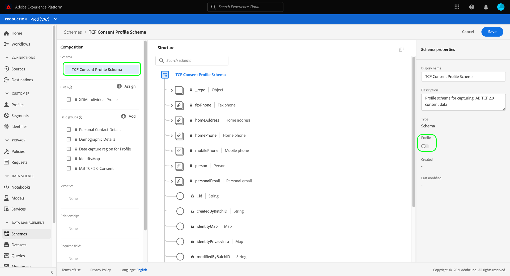

# Créer des jeux de données pour capturer les données de consentement IAB TCF 2.0

Pour que Adobe Experience Platform puisse traiter les données de consentement des clients conformément à la norme IAB [!DNL Transparency & Consent Framework] (TCF) 2.0, ces données doivent être envoyées aux jeux de données dont les schémas contiennent des champs de consentement TCF 2.0.

Plus précisément, deux jeux de données sont requis pour capturer les données de consentement TCF 2.0 :

* Jeu de données basé sur la classe [!DNL XDM Individual Profile], activé pour une utilisation dans [!DNL Real-Time Customer Profile].
* Un jeu de données basé sur la classe [!DNL XDM ExperienceEvent].

>[!IMPORTANT]
>
>Experience Platform applique uniquement les chaînes TCF collectées dans le jeu de données Profil individuel. Bien qu’un jeu de données ExperienceEvent soit toujours nécessaire pour créer un flux de données dans le cadre de ce workflow, il vous suffit d’ingérer des données dans le jeu de données de profil. Le jeu de données ExperienceEvent peut toujours être utilisé si vous souhaitez suivre les événements de changement de consentement au fil du temps, mais ces valeurs ne sont pas utilisées dans lors de l’application sur l’activation des segments.

Ce document décrit les étapes à suivre pour configurer ces deux jeux de données. Pour une présentation du workflow complet de configuration des opérations de données Experience Platform pour le TCF 2.0, reportez-vous à la section [Présentation de la conformité au TCF 2.0 de l’IAB](./overview.md).

## Conditions préalables

Ce tutoriel nécessite une compréhension du fonctionnement des composants suivants d’Adobe Experience Platform :

* [Modèle de données d’expérience (XDM)](../../../../xdm/home.md) : cadre normalisé selon lequel [!DNL Experience Platform] organise les données d’expérience client.
   * [Notions de base de la composition du schéma](../../../../xdm/schema/composition.md) : en savoir plus sur les blocs de création de base des schémas XDM.
* [Adobe Experience Platform Identity Service](../../../../identity-service/home.md) : permet de relier les identités des clients à partir de vos sources de données disparates sur les appareils et systèmes.
   * [Espaces de noms d’identité](../../../../identity-service/features/namespaces.md) : les données d’identité client doivent être fournies sous un espace de noms d’identité spécifique reconnu par Identity Service.
* [Real-Time Customer Profile](../../../../profile/home.md) : utilise des [!DNL Identity Service] pour vous permettre de créer des profils client détaillés à partir de vos jeux de données en temps réel. [!DNL Real-Time Customer Profile] extrait les données du lac de données et conserve les profils clients dans sa propre banque de données distincte.

## Groupes de champs TCF 2.0 {#field-groups}

Le groupe de champs de schéma [!UICONTROL Détails du consentement IAB TCF 2.0] fournit des champs de consentement client qui sont requis pour la prise en charge de TCF 2.0. Il existe deux versions de ce groupe de champs : l’une compatible avec la classe [!DNL XDM Individual Profile] et l’autre avec la classe [!DNL XDM ExperienceEvent].

Les sections ci-dessous expliquent la structure de chacun de ces groupes de champs, y compris les données attendues pendant l’ingestion.

### Groupe de champs de profil {#profile-field-group}

Pour les schémas basés sur [!DNL XDM Individual Profile], le groupe de champs [!UICONTROL Détails du consentement IAB TCF 2.0] fournit un champ unique de type map, `identityPrivacyInfo`, qui mappe les identités des clients à leurs préférences de consentement TCF. Ce groupe de champs doit être inclus dans un schéma basé sur les enregistrements activé pour le profil client en temps réel pour que l’application automatique ait lieu.

Pour en savoir plus sur sa structure et son cas d’utilisation[&#128279;](../../../../xdm/field-groups/profile/iab.md) consultez le  guide de référence pour ce groupe de champs .

### Groupe de champs Événement {#event-field-group}

Si vous souhaitez effectuer le suivi des événements de changement de consentement au fil du temps, vous pouvez ajouter le groupe de champs [!UICONTROL Détails du consentement IAB TCF 2.0] à votre schéma [!UICONTROL XDM ExperienceEvent].

Si vous ne prévoyez pas de suivre les événements de changement de consentement au fil du temps, vous n’avez pas besoin d’inclure ce groupe de champs dans votre schéma d’événement. Lors de l’application automatique des valeurs de consentement TCF, Experience Platform utilise uniquement les dernières informations de consentement ingérées dans le [groupe de champs de profil](#profile-field-group). Les valeurs de consentement capturées par les événements ne participent pas aux workflows d’application automatiques.

Pour plus d’informations sur sa structure et son cas d’utilisation[&#128279;](../../../../xdm/field-groups/event/iab.md) consultez le  guide de référence pour ce groupe de champs .

## Création de schémas de consentement client {#create-schemas}

Pour créer des jeux de données qui capturent des données de consentement, vous devez d’abord créer des schémas XDM sur lesquels baser ces jeux de données.

Comme mentionné dans la section précédente, un schéma qui utilise la classe [!UICONTROL XDM Individual Profile] est nécessaire pour appliquer le consentement dans les workflows Experience Platform en aval. Vous pouvez également créer un schéma distinct basé sur [!UICONTROL XDM ExperienceEvent] si vous souhaitez suivre les modifications de consentement au fil du temps. Les deux schémas doivent contenir un champ `identityMap` et un groupe de champs TCF 2.0 approprié.

Dans l’interface utilisateur d’Experience Platform, sélectionnez **[!UICONTROL Schémas]** dans le volet de navigation de gauche pour ouvrir l’espace de travail [!UICONTROL Schémas]. À partir de là, suivez les étapes des sections ci-dessous pour créer chaque schéma requis.

>[!NOTE]
>
>Si vous souhaitez utiliser des schémas XDM existants pour capturer des données de consentement à la place, vous pouvez modifier ces schémas au lieu d’en créer de nouveaux. Cependant, si un schéma existant a été activé pour une utilisation dans le profil client en temps réel, son identité principale ne peut pas être un champ directement identifiable qui ne peut pas être utilisé dans la publicité en fonction des intérêts, telle qu’une adresse e-mail. Consultez votre service juridique si vous n’êtes pas sûr des champs restreints.
>
>En outre, lors de la modification de schémas existants, seules des modifications additionnelles (sans rupture) peuvent être apportées. Pour plus d’informations, consultez la section sur les [principes de l’évolution des schémas](../../../../xdm/schema/composition.md#evolution).

### Création d’un schéma de consentement de profil {#profile-schema}

Sélectionnez **[!UICONTROL Créer un schéma]**, puis choisissez **[!UICONTROL Profil individuel XDM]** dans le menu déroulant.

La boîte de dialogue **[!UICONTROL Ajouter des groupes de champs]** s’affiche, vous permettant de commencer à ajouter immédiatement des groupes de champs au schéma. À partir de là, sélectionnez **[!UICONTROL Détails du consentement IAB TCF 2.0]** dans la liste. Vous pouvez éventuellement utiliser la barre de recherche pour affiner les résultats afin de localiser plus facilement le groupe de champs.

Recherchez ensuite le groupe de champs **[!UICONTROL IdentityMap]** dans la liste et sélectionnez-le également. Une fois que les deux groupes de champs sont répertoriés dans le rail de droite, sélectionnez **[!UICONTROL Ajouter des groupes de champs]**.

La zone de travail réapparaît, indiquant que les champs `identityPrivacyInfo` et `identityMap` ont été ajoutés à la structure du schéma.

Avant d’ajouter d’autres champs au schéma, sélectionnez le champ racine pour afficher **[!UICONTROL Propriétés du schéma]** dans le rail de droite, où vous pouvez fournir un nom et une description pour le schéma.

Après avoir fourni un nom et une description, vous pouvez éventuellement ajouter d’autres champs au schéma en sélectionnant **[!UICONTROL Ajouter]** sous la section **[!UICONTROL Groupes de champs]** sur le côté gauche de la zone de travail.

Si vous modifiez un schéma existant qui a déjà été activé pour une utilisation dans [!DNL Real-Time Customer Profile], sélectionnez **[!UICONTROL Enregistrer]** pour confirmer vos modifications avant de passer à la section [Création d’un jeu de données basé sur votre schéma de consentement](#dataset). Si vous créez un schéma, continuez à suivre les étapes décrites dans la sous-section ci-dessous.

#### Activer le schéma pour l’utiliser dans [!DNL Real-Time Customer Profile]

Pour qu’Experience Platform puisse associer les données de consentement qu’il reçoit à des profils de clients spécifiques, le schéma de consentement doit être activé pour une utilisation dans [!DNL Real-Time Customer Profile].

>[!NOTE]
>
>L’exemple de schéma illustré dans cette section utilise son champ `identityMap` comme identité principale. Si vous souhaitez définir un autre champ comme identité principale, assurez-vous d’utiliser un identifiant indirect comme un identifiant de cookie, et non un champ directement identifiable qui ne peut pas être utilisé dans la publicité en fonction des intérêts, telle qu’une adresse e-mail. Consultez votre service juridique si vous n’êtes pas sûr des champs restreints.
>
>Vous trouverez la procédure de définition d’un champ d’identité principale pour un schéma dans le guide de l’interface utilisateur [[!UICONTROL Schémas]](../../../../xdm/ui/fields/identity.md).

Pour activer le schéma pour [!DNL Profile], sélectionnez le nom du schéma dans le rail de gauche pour ouvrir la section **[!UICONTROL Propriétés du schéma]**. À partir de là, sélectionnez le bouton bascule **[!UICONTROL Profil]**.

Une fenêtre contextuelle s’affiche, indiquant une identité principale manquante. Cochez la case permettant d’utiliser une autre identité principale, car l’identité principale sera contenue dans le champ `identityMap` .

Enfin, sélectionnez **[!UICONTROL Enregistrer]** pour confirmer vos modifications.

### Créer un schéma de consentement pour les événements {#event-schema}

>[!NOTE]
>
>Les schémas de consentement d’événement ne sont utilisés que pour suivre les événements de changement de consentement au fil du temps et ne participent pas aux workflows d’application en aval. Si vous ne souhaitez pas suivre les modifications du consentement au fil du temps, vous pouvez passer à la section suivante sur la [création de jeux de données de consentement](#datasets).

Dans l’espace de travail **[!UICONTROL Schémas]**, sélectionnez **[!UICONTROL Créer un schéma]**, puis choisissez **[!UICONTROL XDM ExperienceEvent]** dans la liste déroulante.

La boîte de dialogue **[!UICONTROL Ajouter des groupes de champs]** s’affiche. À partir de là, sélectionnez **[!UICONTROL Détails du consentement IAB TCF 2.0]** dans la liste. Vous pouvez éventuellement utiliser la barre de recherche pour affiner les résultats afin de localiser plus facilement le groupe de champs.

Recherchez ensuite le groupe de champs **[!UICONTROL IdentityMap]** dans la liste et sélectionnez-le également. Une fois que les deux groupes de champs sont répertoriés dans le rail de droite, sélectionnez **[!UICONTROL Ajouter des groupes de champs]**.

La zone de travail réapparaît, indiquant que les champs `consentStrings` et `identityMap` ont été ajoutés à la structure du schéma.

Avant d’ajouter d’autres champs au schéma, sélectionnez le champ racine pour afficher **[!UICONTROL Propriétés du schéma]** dans le rail de droite, où vous pouvez fournir un nom et une description pour le schéma.

Après avoir fourni un nom et une description, vous pouvez éventuellement ajouter d’autres champs au schéma en sélectionnant **[!UICONTROL Ajouter]** sous la section **[!UICONTROL Groupes de champs]** sur le côté gauche de la zone de travail.

Une fois les groupes de champs dont vous avez besoin ajoutés, terminez en sélectionnant **[!UICONTROL Enregistrer]**.

## Créer des jeux de données en fonction de vos schémas de consentement {#datasets}

Pour chacun des schémas obligatoires décrits ci-dessus, vous devez créer un jeu de données qui ingérera à terme les données de consentement de vos clients. Le jeu de données basé sur le schéma d’enregistrement doit être activé pour [!DNL Real-Time Customer Profile], tandis que le jeu de données basé sur le schéma de série temporelle **ne doit pas** ne doit pas être activé pour [!DNL Profile].

Pour commencer, sélectionnez **[!UICONTROL Jeux de données]** dans le volet de navigation de gauche, puis sélectionnez **[!UICONTROL Créer un jeu de données]** dans le coin supérieur droit.

Sur la page suivante, sélectionnez **[!UICONTROL Créer un jeu de données à partir d’un schéma]**.

Le workflow **[!UICONTROL Créer un jeu de données à partir d’un schéma]** s’affiche, en commençant par l’étape **[!UICONTROL Sélectionner un schéma]**. Dans la liste fournie, recherchez l’un des schémas de consentement que vous avez créés précédemment. Vous pouvez éventuellement utiliser la barre de recherche pour affiner les résultats et localiser plus facilement votre schéma. Sélectionnez le bouton radio en regard du schéma souhaité, puis sélectionnez **[!UICONTROL Suivant]** pour continuer.

L’étape **[!UICONTROL Configurer le jeu de données]** apparaît. Fournissez un nom et une description uniques et facilement identifiables pour le jeu de données avant de sélectionner **[!UICONTROL Terminer]**.

La page de détails du jeu de données nouvellement créé s’affiche. Si le jeu de données est basé sur votre schéma de série temporelle, le processus est terminé. Si le jeu de données est basé sur votre schéma d’enregistrement, l’étape finale du processus consiste à activer le jeu de données pour une utilisation dans [!DNL Real-Time Customer Profile].

Dans le rail de droite, activez le bouton (bascule) **[!UICONTROL Profil]**, puis sélectionnez **[!UICONTROL Activer]** dans la fenêtre contextuelle de confirmation pour activer le schéma à [!DNL Profile].

Suivez à nouveau les étapes ci-dessus pour créer un jeu de données basé sur un événement si vous avez créé un schéma pour celui-ci.

## Étapes suivantes

En suivant ce tutoriel, vous avez créé au moins un jeu de données qui peut désormais être utilisé pour collecter les données de consentement des clients :

* Jeu de données basé sur des enregistrements pouvant être utilisé dans le profil client en temps réel. **(Obligatoire)**
* Un jeu de données basé sur une série temporelle qui n’est pas activé pour [!DNL Profile]. (Facultatif)

Vous pouvez maintenant revenir à la [présentation de l’IAB TCF 2.0](./overview.md#merge-policies) pour poursuivre le processus de configuration d’Experience Platform pour la conformité au TCF 2.0.
