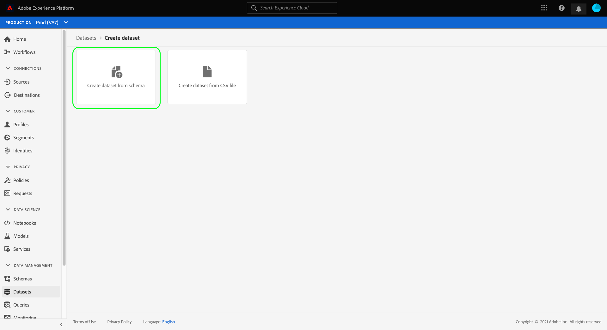

# Création de jeux de données pour la capture des données de consentement du TCF 2.0 de l’IAB

Pour que Adobe Experience Platform traite les données de consentement des clients conformément à l’IAB [!DNL Transparency & Consent Framework] (TCF) 2.0, ces données doivent être envoyées aux jeux de données dont les schémas contiennent des champs de consentement TCF 2.0.

Plus précisément, deux jeux de données sont nécessaires pour capturer les données de consentement TCF 2.0 :

* Un jeu de données basé sur la variable [!DNL XDM Individual Profile] , activée pour une utilisation dans [!DNL Real-Time Customer Profile].
* Un jeu de données basé sur la variable [!DNL XDM ExperienceEvent] classe .

>[!IMPORTANT]
>
>Platform applique uniquement les chaînes TCF collectées dans le jeu de données Individual Profile. Bien qu’un jeu de données ExperienceEvent soit toujours nécessaire pour créer un flux de données dans le cadre de ce processus, vous n’avez qu’à ingérer des données dans le jeu de données de profil. Le jeu de données ExperienceEvent peut toujours être utilisé si vous souhaitez effectuer le suivi des événements de modification du consentement au fil du temps, mais ces valeurs ne sont pas utilisées dans lors de l’application lors de l’activation du segment.

Ce document décrit les étapes à suivre pour configurer ces deux jeux de données. Pour un aperçu du workflow complet de configuration des opérations de données Platform pour TCF 2.0, reportez-vous à la section [Présentation de la conformité IAB TCF 2.0](./overview.md).

## Conditions préalables

Ce tutoriel nécessite une compréhension du fonctionnement des composants suivants d’Adobe Experience Platform :

* [Modèle de données d’expérience (XDM)](../../../../xdm/home.md) : cadre normalisé selon lequel [!DNL Experience Platform] organise les données d’expérience client.
   * [Notions de base de la composition du schéma](../../../../xdm/schema/composition.md) : en savoir plus sur les blocs de création de base des schémas XDM.
* [Service Adobe Experience Platform Identity](../../../../identity-service/home.md): Permet de lier les identités des clients à partir de vos sources de données disparates entre appareils et systèmes.
   * [Espaces de noms d’identité](../../../../identity-service/namespaces.md): Les données d’identité du client doivent être fournies sous un espace de noms d’identité spécifique reconnu par Identity Service.
* [Profil client en temps réel](../../../../profile/home.md): Exploitation [!DNL Identity Service] pour vous permettre de créer des profils client détaillés à partir de vos jeux de données en temps réel. [!DNL Real-Time Customer Profile] Profile extrait les données du lac de données et conserve les profils clients dans sa propre banque de données distincte.

## Groupes de champs TCF 2.0 {#field-groups}

Le [!UICONTROL Détails du consentement IAB TCF 2.0] Le groupe de champs de schéma fournit les champs de consentement du client qui sont requis pour la prise en charge de TCF 2.0. Il existe deux versions de ce groupe de champs : un compatible avec la fonction [!DNL XDM Individual Profile] et l’autre avec la propriété [!DNL XDM ExperienceEvent] classe .

Les sections ci-dessous expliquent la structure de chacun de ces groupes de champs, notamment les données attendues lors de l’ingestion.

### Groupe de champs de profil {#profile-field-group}

Pour les schémas basés sur [!DNL XDM Individual Profile], la variable [!UICONTROL Détails du consentement IAB TCF 2.0] le groupe de champs fournit un champ de type map unique, `identityPrivacyInfo`, qui mappe les identités des clients à leurs préférences de consentement TCF. Ce groupe de champs doit être inclus dans un schéma basé sur les enregistrements activé pour Real-Time Customer Profile afin que l’application automatique soit effectuée.

Voir [guide de référence](../../../../xdm/field-groups/profile/iab.md) pour ce groupe de champs afin d’en savoir plus sur sa structure et son cas d’utilisation.

### Groupe de champs d’événement {#event-field-group}

Si vous souhaitez effectuer le suivi des événements de modification du consentement au fil du temps, vous pouvez ajouter la variable [!UICONTROL Détails du consentement IAB TCF 2.0] groupe de champs à votre [!UICONTROL XDM ExperienceEvent] schéma.

Si vous ne prévoyez pas de suivre les événements de changement de consentement au fil du temps, vous n’avez pas besoin d’inclure ce groupe de champs dans votre schéma d’événements. Lors de l’application automatique des valeurs de consentement TCF, Experience Platform utilise uniquement les dernières informations de consentement ingérées dans la variable [groupe de champs de profil](#profile-field-group). Les valeurs de consentement capturées par des événements ne participent pas aux workflows d’application automatique.

Voir [guide de référence](../../../../xdm/field-groups/event/iab.md) pour ce groupe de champs pour plus d’informations sur sa structure et son cas d’utilisation.

## Création de schémas de consentement du client {#create-schemas}

Pour créer des jeux de données qui capturent des données de consentement, vous devez d’abord créer des schémas XDM pour baser ces jeux de données.

Comme mentionné dans la section précédente, un schéma qui utilise la variable [!UICONTROL XDM Individual Profile] est requise pour appliquer le consentement dans les workflows Platform en aval. Vous pouvez également, si vous le souhaitez, créer un schéma distinct basé sur [!UICONTROL XDM ExperienceEvent] si vous souhaitez effectuer le suivi des modifications du consentement au fil du temps. Les deux schémas doivent contenir un `identityMap` et un groupe de champs TCF 2.0 approprié.

Dans l’interface utilisateur de Platform, sélectionnez **[!UICONTROL Schémas]** dans le volet de navigation de gauche pour ouvrir la [!UICONTROL Schémas] workspace. À partir de là, suivez les étapes des sections ci-dessous pour créer chaque schéma requis.

>[!NOTE]
>
>Si vous souhaitez utiliser des schémas XDM existants pour capturer des données de consentement à la place, vous pouvez modifier ces schémas au lieu d’en créer de nouveaux. Cependant, si un schéma existant a été activé pour une utilisation dans Real-Time Customer Profile, son identité Principale ne peut pas être un champ directement identifiable qui est interdit d’utilisation dans des publicités basées sur des intérêts, telles qu’une adresse électronique. Consultez votre service juridique si vous ne savez pas quels champs sont restreints.
>
>En outre, lors de la modification de schémas existants, seules des modifications additive (insécables) peuvent être effectuées. Consultez la section sur la [principes d’évolution des schémas](../../../../xdm/schema/composition.md#evolution) pour plus d’informations.

### Création d’un schéma de consentement pour un profil {#profile-schema}

Sélectionner **[!UICONTROL Créer un schéma]**, puis choisissez **[!UICONTROL XDM Individual Profile]** dans le menu déroulant.

Le **[!UICONTROL Ajouter des groupes de champs]** s’affiche, ce qui vous permet de commencer immédiatement à ajouter des groupes de champs au schéma. À partir de là, sélectionnez **[!UICONTROL Détails du consentement IAB TCF 2.0]** dans la liste. Vous pouvez éventuellement utiliser la barre de recherche pour affiner les résultats afin de localiser plus facilement le groupe de champs.

Recherchez ensuite le **[!UICONTROL IdentityMap]** groupe de champs dans la liste et sélectionnez-le également. Une fois que les deux groupes de champs sont répertoriés dans le rail de droite, sélectionnez **[!UICONTROL Ajouter des groupes de champs]**.

La zone de travail réapparaît, indiquant que la variable `identityPrivacyInfo` et `identityMap` ont été ajoutés à la structure du schéma.

Avant d’ajouter d’autres champs au schéma, sélectionnez le champ racine à afficher. **[!UICONTROL Propriétés du schéma]** dans le rail de droite, où vous pouvez fournir un nom et une description pour le schéma.

Après avoir fourni un nom et une description, vous pouvez éventuellement ajouter d’autres champs au schéma en sélectionnant **[!UICONTROL Ajouter]** sous le **[!UICONTROL Groupes de champs]** sur le côté gauche du canevas.

Si vous modifiez un schéma existant qui a déjà été activé pour une utilisation dans [!DNL Real-Time Customer Profile], sélectionnez **[!UICONTROL Enregistrer]** pour confirmer vos modifications avant de passer à la section sur [création d’un jeu de données basé sur votre schéma de consentement](#dataset). Si vous créez un nouveau schéma, continuez à suivre les étapes décrites dans la sous-section ci-dessous.

#### Activation du schéma à utiliser dans [!DNL Real-Time Customer Profile]

Pour que Platform associe les données de consentement qu’il reçoit à des profils client spécifiques, le schéma de consentement doit être activé pour une utilisation dans [!DNL Real-Time Customer Profile].

>[!NOTE]
>
>L’exemple de schéma présenté dans cette section utilise son `identityMap` comme son Principale identité. Si vous souhaitez définir un autre champ comme identité Principale, veillez à utiliser un identifiant indirect comme un identifiant de cookie, et non un champ directement identifiable qui est interdit d’utilisation dans des publicités basées sur des intérêts, telles qu’une adresse électronique. Consultez votre service juridique si vous ne savez pas quels champs sont restreints.
>
>Pour savoir comment définir un champ d’identité Principal pour un schéma, reportez-vous à la section [[!UICONTROL Schémas] Guide de l’interface utilisateur](../../../../xdm/ui/fields/identity.md).

Pour activer le schéma pour [!DNL Profile], sélectionnez le nom du schéma dans le rail de gauche pour ouvrir le **[!UICONTROL Propriétés du schéma]** . À partir de là, sélectionnez le **[!UICONTROL Profil]** bouton bascule .

Une fenêtre contextuelle s’affiche, indiquant l’absence d’une identité Principale. Cochez la case pour utiliser une autre identité Principale, car l’identité Principale sera contenue dans la variable `identityMap` champ .

Enfin, sélectionnez **[!UICONTROL Enregistrer]** pour confirmer vos modifications.

### Création d’un schéma de consentement pour un événement {#event-schema}

>[!NOTE]
>
>Les schémas de consentement d’événement sont utilisés uniquement pour suivre les événements de modification du consentement au fil du temps et ne participent pas aux workflows d’application en aval. Si vous ne souhaitez pas suivre les modifications de consentement au fil du temps, vous pouvez passer à la section suivante sur [création de jeux de données de consentement](#datasets).

Dans le **[!UICONTROL Schémas]** espace de travail, sélectionnez **[!UICONTROL Créer un schéma]**, puis choisissez **[!UICONTROL XDM ExperienceEvent]** dans la liste déroulante.

Le **[!UICONTROL Ajouter des groupes de champs]** s’affiche. À partir de là, sélectionnez **[!UICONTROL Détails du consentement IAB TCF 2.0]** dans la liste. Vous pouvez éventuellement utiliser la barre de recherche pour affiner les résultats afin de localiser plus facilement le groupe de champs.

Recherchez ensuite le **[!UICONTROL IdentityMap]** groupe de champs dans la liste et sélectionnez-le également. Une fois que les deux groupes de champs sont répertoriés dans le rail de droite, sélectionnez **[!UICONTROL Ajouter des groupes de champs]**.

La zone de travail réapparaît, indiquant que la variable `consentStrings` et `identityMap` ont été ajoutés à la structure du schéma.

Avant d’ajouter d’autres champs au schéma, sélectionnez le champ racine à afficher. **[!UICONTROL Propriétés du schéma]** dans le rail de droite, où vous pouvez fournir un nom et une description pour le schéma.

Après avoir fourni un nom et une description, vous pouvez éventuellement ajouter d’autres champs au schéma en sélectionnant **[!UICONTROL Ajouter]** sous le **[!UICONTROL Groupes de champs]** sur le côté gauche du canevas.

Une fois les groupes de champs dont vous avez besoin ajoutés, terminez en sélectionnant **[!UICONTROL Enregistrer]**.

## Création de jeux de données basés sur vos schémas de consentement {#datasets}

Pour chacun des schémas requis décrits ci-dessus, vous devez créer un jeu de données qui assimilera en fin de compte les données de consentement de vos clients. Le jeu de données basé sur le schéma d’enregistrement doit être activé pour [!DNL Real-Time Customer Profile], tandis que le jeu de données basé sur le schéma de série temporelle **should not** be [!DNL Profile]-enabled.

Pour commencer, sélectionnez **[!UICONTROL Jeux de données]** dans le volet de navigation de gauche, puis sélectionnez **[!UICONTROL Création d’un jeu de données]** dans le coin supérieur droit.

Sur la page suivante, sélectionnez **[!UICONTROL Création d’un jeu de données à partir d’un schéma]**.

Le **[!UICONTROL Création d’un jeu de données à partir d’un schéma]** s’affiche, en commençant par **[!UICONTROL Sélectionner un schéma]** étape . Dans la liste fournie, recherchez l’un des schémas de consentement que vous avez créés précédemment. Vous pouvez éventuellement utiliser la barre de recherche pour affiner les résultats et faciliter la localisation de votre schéma. Sélectionnez le bouton radio en regard du schéma souhaité, puis sélectionnez **[!UICONTROL Suivant]** pour continuer.

L’étape **[!UICONTROL Configurer le jeu de données]** apparaît. Attribuez un nom et une description uniques et facilement identifiables au jeu de données avant de sélectionner **[!UICONTROL Terminer]**.

La page des détails du nouveau jeu de données s’affiche. Si le jeu de données est basé sur votre schéma de série temporelle, le processus est terminé. Si le jeu de données est basé sur votre schéma d’enregistrement, la dernière étape du processus consiste à activer le jeu de données à utiliser dans [!DNL Real-Time Customer Profile].

Dans le rail de droite, sélectionnez la variable **[!UICONTROL Profil]** bascule, puis sélectionnez **[!UICONTROL Activer]** dans la fenêtre contextuelle de confirmation pour activer le schéma pour [!DNL Profile].

Suivez les étapes ci-dessus pour créer à nouveau un jeu de données basé sur un événement si vous avez créé un schéma pour celui-ci.

## Étapes suivantes

En suivant ce tutoriel, vous avez créé au moins un jeu de données qui peut désormais être utilisé pour collecter les données de consentement du client :

* Jeu de données basé sur des enregistrements activé pour une utilisation dans Real-Time Customer Profile. **(Obligatoire)**
* Jeu de données basé sur des séries temporelles qui n’est pas activé pour [!DNL Profile]. (Facultatif)

Vous pouvez maintenant revenir à la [Présentation du TCF 2.0 de l’IAB](./overview.md#merge-policies) pour poursuivre le processus de configuration de la conformité de Platform pour TCF 2.0.
