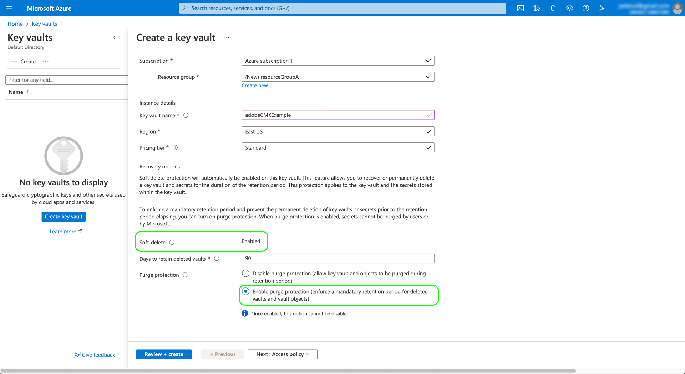

# Clés gérées par le client dans Adobe Experience Platform

Toutes les données stockées sur Adobe Experience Platform sont chiffrées au repos à l’aide de clés au niveau du système. Si vous utilisez une application reposant sur Platform, vous pouvez choisir d’utiliser vos propres clés de chiffrement, ce qui vous permet de mieux contrôler votre sécurité des données.

Ce document couvre le processus d’activation de la fonctionnalité de clés gérées par le client (CMK) dans Platform.

## Résumé du processus

Le CMK est inclus dans les offres d&#39;Adobe du Bouclier de santé et du Bouclier de protection et de confidentialité. Une fois que votre entreprise a acheté l’une de ces offres, vous pouvez lancer un processus unique de configuration de la fonctionnalité.

>[!WARNING]
>
>Après avoir configuré le CMK, vous ne pouvez pas revenir aux clés gérées par le système. Vous êtes responsable de la gestion sécurisée de vos clés et de vos clés dans [!DNL Azure] pour éviter de perdre l’accès à vos données.

Le processus est le suivant :

1. [Créez un [!DNL Microsoft Azure] Key Vault](#create-key-vault), puis [générer une clé de chiffrement ;](#generate-a-key) (en fonction des politiques de votre organisation) qui seront finalement partagées avec Adobe.
1. Utilisez les appels API pour [enregistrer l’application CMK ;](#register-app) avec votre [!DNL Azure] client.
1. [Affectation de l’entité de service pour l’application CMK](#assign-to-role) à un rôle approprié pour le coffre-fort de clé.
1. Utilisez les appels API pour [envoyer votre ID de clé de chiffrement à Adobe](#send-to-adobe).

Une fois le processus de configuration terminé, toutes les données intégrées à Platform dans tous les environnements de test seront chiffrées à l’aide de votre [!DNL Azure] configuration de clé, spécifique à votre [[!DNL Cosmos DB]](https://docs.microsoft.com/fr-fr/azure/cosmos-db/) et [[!DNL Data Lake Storage]](https://docs.microsoft.com/en-us/azure/storage/blobs/data-lake-storage-introduction) ressources. Utilisation de CMK [!DNL Azure]&#39;s [programme d&#39;aperçu public](https://azure.microsoft.com/en-ca/support/legal/preview-supplemental-terms/) pour rendre cela possible.

## Créez un [!DNL Azure] Key Vault {#create-key-vault}

CMK ne prend en charge que les clés d’un [!DNL Microsoft Azure] Key Vault. Pour commencer, vous devez utiliser [!DNL Azure] pour créer un compte d’entreprise ou utiliser un compte d’entreprise existant et suivre les étapes ci-dessous pour créer le Key Vault.

>[!IMPORTANT]
>
>Seuls les niveaux de service Premium et Standard pour [!DNL Azure] Key Vault est pris en charge. [!DNL Azure Managed HSM], [!DNL Azure Dedicated HSM] et [!DNL Azure Payments HSM] ne sont pas pris en charge. Reportez-vous à la section [[!DNL Azure] documentation](https://learn.microsoft.com/en-us/azure/security/fundamentals/key-management#azure-key-management-services) pour plus d’informations sur les services clés de gestion proposés.

>[!NOTE]
>
>La documentation ci-dessous ne couvre que les étapes de base pour créer le coffre-fort de clé. En dehors de ces instructions, vous devez configurer le coffre-fort clé en fonction des stratégies de votre entreprise.

Connectez-vous au [!DNL Azure] Portal et utilisez la barre de recherche pour accéder à **[!DNL Key vaults]** sous la liste des services.


Le **[!DNL Key vaults]** s’affiche après avoir sélectionné le service. À partir de là, sélectionnez **[!DNL Create]**.


À l’aide du formulaire fourni, renseignez les détails de base du coffre-fort de clé, y compris un nom et un groupe de ressources affecté.

>[!WARNING]
>
>Bien que la plupart des options puissent rester comme valeurs par défaut, **assurez-vous d’activer les options de suppression et de purge à l’aide des options de protection.**. Si vous n’activez pas ces fonctionnalités, vous risquez de perdre l’accès à vos données si la coffre-fort de la clé est supprimée.
>
>

À partir de là, continuez à parcourir le workflow de création de coffre-fort clé et configurez les différentes options en fonction des stratégies de votre entreprise.

Une fois que vous êtes parvenu au **[!DNL Review + create]** vous pouvez consulter les détails du coffre-fort pendant la validation. Une fois la validation acceptée, sélectionnez **[!DNL Create]** pour terminer le processus.


## Configuration des options de mise en réseau

Si votre coffre-fort clé est configuré pour restreindre l’accès public à certains réseaux virtuels ou désactiver entièrement l’accès public, vous devez accorder à Microsoft une exception de pare-feu.

Sélectionner **[!DNL Networking]** dans le volet de navigation de gauche. Sous **[!DNL Firewalls and virtual networks]**, cochez la case **[!DNL Allow trusted Microsoft services to bypass this firewall]**, puis sélectionnez **[!DNL Apply]**.


## Générer une clé {#generate-a-key}

Une fois que vous avez créé un coffre-fort de clé, vous pouvez en générer une nouvelle. Accédez au **[!DNL Keys]** et sélectionnez **[!DNL Generate/Import]**.


Utilisez le formulaire fourni pour attribuer un nom à la clé, puis sélectionnez **RSA** pour le type de clé. Au minimum, la variable **[!DNL RSA key size]** doit être au moins **3072** bits requis par [!DNL Cosmos DB]. [!DNL Azure Data Lake Storage] est également compatible avec RSA 3027.

>[!NOTE]
>
>Mémoriser le nom que vous indiquez pour la clé, car il sera utilisé à une étape ultérieure lorsque [envoi de la clé à Adobe](#send-to-adobe).

Utilisez les commandes restantes pour configurer la clé que vous souhaitez générer ou importer selon vos besoins. Lorsque vous avez terminé, sélectionnez **[!DNL Create]**.


La clé configurée apparaît dans la liste des clés de la coffre.


## Enregistrement de l’application CMK {#register-app}

Une fois que votre coffre-fort de clé est configuré, l’étape suivante consiste à s’enregistrer pour l’application CMK qui se connectera à votre [!DNL Azure] client.

>[!NOTE]
>
>L’enregistrement de l’application CMK nécessite que vous exécutiez des appels vers les API Platform. Pour plus d’informations sur la collecte des en-têtes d’authentification requis pour effectuer ces appels, voir la section [Guide d’authentification de l’API Platform](../../landing/api-authentication.md).
>
>Le guide d’authentification fournit des instructions sur la génération de votre propre valeur unique pour la variable `x-api-key` en-tête de requête, toutes les opérations API de ce guide utilisent la valeur statique. `acp_provisioning` au lieu de . Vous devez toujours fournir vos propres valeurs pour `{ACCESS_TOKEN}` et `{ORG_ID}`, cependant.

### Récupération d’une URL d’authentification

Pour lancer le processus d’enregistrement, envoyez une requête GET au point de terminaison d’enregistrement de l’application afin de récupérer l’URL d’authentification requise pour votre organisation.

**Requête**

```shell
curl -X GET \
  https://platform.adobe.io/data/infrastructure/manager/byok/app-registration \ 
  -H 'Authorization: Bearer {ACCESS_TOKEN}' \
  -H 'x-api-key: acp_provisioning' \
  -H 'x-gw-ims-org-id: {ORG_ID}'
```

**Réponse**

Une réponse réussie renvoie une `applicationRedirectUrl` contenant l’URL d’authentification.

```json
{
    "id": "byok",
    "name": "acpebae9422Caepcmkmultitenantapp",
    "applicationUri": "https://adobe.com/acpebae9422Caepcmkmultitenantapp",
    "applicationId": "e463a445-c6ac-4ca2-b36a-b5146fcf6a52",
    "applicationRedirectUrl": "https://login.microsoftonline.com/common/oauth2/authorize?response_type=code&client_id=e463a445-c6ac-4ca2-b36a-b5146fcf6a52&redirect_uri=https://adobe.com/acpebae9422Caepcmkmultitenantapp&scope=user.read"
}
```

Copiez et collez le `applicationRedirectUrl` dans un navigateur pour ouvrir une boîte de dialogue d’authentification. Sélectionner **[!DNL Accept]** pour ajouter l’entité de service de l’application CMK à votre [!DNL Azure] client.


## Affectation de l’application CMK à un rôle {#assign-to-role}

Une fois le processus d’authentification terminé, revenez à [!DNL Azure] Key Vault et sélectionnez **[!DNL Access control]** dans le volet de navigation de gauche. À partir de là, sélectionnez **[!DNL Add]** suivie de **[!DNL Add role assignment]**.


L’écran suivant vous invite à choisir un rôle pour cette affectation. Sélectionner **[!DNL Key Vault Crypto Service Encryption User]** avant de sélectionner **[!DNL Next]** pour continuer.


Dans l’écran suivant, choisissez **[!DNL Select members]** pour ouvrir une boîte de dialogue dans le rail de droite. Utilisez la barre de recherche pour localiser l’entité de service de l’application CMK et sélectionnez-la dans la liste. Lorsque vous avez terminé, sélectionnez **[!DNL Save]**.

>[!NOTE]
>
>Si vous ne trouvez pas votre application dans la liste, votre entité de service n’a pas été acceptée dans votre client. Veuillez travailler avec votre [!DNL Azure] administrateur ou représentant pour vous assurer que vous disposez des privilèges appropriés.

## Envoi de l’URI de clé à Adobe {#send-to-adobe}

Après l’installation de l’application CMK sur [!DNL Azure], vous pouvez envoyer votre identifiant de clé de chiffrement à Adobe. Sélectionner **[!DNL Keys]** dans le volet de navigation de gauche, suivi du nom de la clé à envoyer.


Sélectionnez la dernière version de la clé et sa page de détails s’affiche. À partir de là, vous pouvez éventuellement configurer les opérations autorisées pour la clé. Au minimum, la clé doit être accordée à la fonction **[!DNL Wrap Key]** et **[!DNL Unwrap Key]** autorisations.

Le **[!UICONTROL Identifiant de clé]** affiche l’identifiant d’URI de la clé. Copiez cette valeur d’URI à utiliser à l’étape suivante.


Une fois que vous avez obtenu l’URI de coffre-fort de clé, vous pouvez l’envoyer à l’aide d’une requête de POST au point de terminaison de configuration du CMK.

**Requête**

```shell
curl -X POST \
  https://platform.adobe.io/data/infrastructure/manager/customer/config \ 
  -H 'Authorization: Bearer {ACCESS_TOKEN}' \
  -H 'x-api-key: acp_provisioning' \
  -H 'x-gw-ims-org-id: {ORG_ID}' \
  -d '{
        "name": "Config1",
        "type": "BYOK_CONFIG",
        "imsOrgId": "{ORG_ID}",
        "configData": {
          "providerType": "AZURE_KEYVAULT",
          "keyVaultIdentifier": "https://adobecmkexample.vault.azure.net/keys/adobeCMK-key/7c1d50lo28234cc895534c00d7eb4eb4"
        }
      }'
```

| Propriété | Description |
| --- | --- |
| `name` | Nom de la configuration. Veillez à mémoriser cette valeur, car il sera nécessaire de vérifier l’état de la configuration à l’adresse [étape ultérieure](#check-status). La valeur est sensible à la casse. |
| `type` | Type de configuration. Cette propriété doit être définie sur `BYOK_CONFIG`. |
| `imsOrgId` | Votre identifiant d’organisation IMS. Il doit s’agir de la même valeur que celle fournie sous la variable `x-gw-ims-org-id` en-tête . |
| `configData` | Contient les détails suivants sur la configuration :<ul><li>`providerType` : Cette propriété doit être définie sur `AZURE_KEYVAULT`.</li><li>`keyVaultIdentifier`: URI de coffre-fort clé que vous avez copié [previous](#send-to-adobe).</li></ul> |

**Réponse**

Une réponse réussie renvoie les détails de la tâche de configuration.

```json
{
  "id": "4df7886b-a122-4391-880b-47888d5c5b92",
  "config": {
    "configData": {
      "keyVaultUri": "https://adobecmkexample.vault.azure.net",
      "keyVaultKeyIdentifier": "https://adobecmkexample.vault.azure.net/keys/adobeCMK-key/7c1d50lo28234cc895534c00d7eb4eb4",
      "keyVersion": "7c1d50lo28234cc895534c00d7eb4eb4",
      "keyName": "Config1",
      "providerType": "AZURE_KEYVAULT"
    },
    "name": "acpcf978863Aaepcmkmultitenantapp",
    "type": "BYOK_CONFIG",
    "imsOrgId": "{IMS_ORG}",
    "status": "NEW"
  },
  "status": "CREATED"
}
```

Le traitement de la tâche doit être terminé dans les minutes qui suivent.

### Vérification de l’état de la configuration {#check-status}

Pour vérifier l’état de la demande de configuration, vous pouvez effectuer une demande de GET.

**Requête**

Vous devez ajouter la variable `name` de la configuration que vous souhaitez vérifier sur le chemin (`config1` dans l’exemple ci-dessous) et incluez une `configType` paramètre de requête défini sur `BYOK_CONFIG`.

```shell
curl -X GET \
  https://platform.adobe.io/data/infrastructure/manager/customer/config/config1?configType=BYOK_CONFIG \ 
  -H 'Authorization: Bearer {ACCESS_TOKEN}' \
  -H 'x-api-key: acp_provisioning' \
  -H 'x-gw-ims-org-id: {ORG_ID}'
```

**Réponse**

Une réponse réussie renvoie l’état de la tâche.

```json
{
  "name": "acpcf978863Aaepcmkmultitenantapp",
  "type": "BYOK_CONFIG",
  "status": "COMPLETED",
  "configData": {
    "keyVaultUri": "https://adobecmkexample.vault.azure.net",
    "keyVaultKeyIdentifier": "https://adobecmkexample.vault.azure.net/keys/adobeCMK-key/7c1d50lo28234cc895534c00d7eb4eb4",
    "keyVersion": "7c1d50lo28234cc895534c00d7eb4eb4",
    "keyName": "Config1",
    "providerType": "AZURE_KEYVAULT"
  },
  "imsOrgId": "{IMS_ORG}",
  "subscriptionId": "cf978863-7325-47b1-8fd9-554b9fdb6c36",
  "id": "4df7886b-a122-4391-880b-47888d5c5b92",
  "rowType": "BYOK_KEY"
}
```

Le `status` peut avoir l’une des quatre valeurs ayant la signification suivante :

1. `RUNNING`: Vérifie que Platform a la possibilité d’accéder à la clé et au coffre-fort de clé.
1. `UPDATE_EXISTING_RESOURCES`: Le système ajoute le coffre-fort et le nom de la clé aux banques de données de tous les environnements de test de votre entreprise.
1. `COMPLETED`: La coffre-fort et le nom de la clé ont été ajoutés aux banques de données.
1. `FAILED`: Un problème s’est produit, principalement lié à la configuration de la clé, du coffre-fort de clé ou de l’application multi-locataire.

## Étapes suivantes

En suivant les étapes ci-dessus, vous avez activé le CMK pour votre organisation. Toutes les données ingérées dans Platform seront désormais chiffrées et déchiffrées à l’aide des clés de votre [!DNL Azure] Key Vault. Si vous souhaitez révoquer l’accès de Platform à vos données, vous pouvez supprimer le rôle d’utilisateur associé à l’application du coffre-fort clé dans [!DNL Azure].

Après la désactivation de l’accès à l’application, il faut entre deux et 24 heures pour que les données ne soient plus accessibles dans Platform. La même période s’applique pour que les données soient à nouveau disponibles lors de la réactivation de l’accès à l’application.
