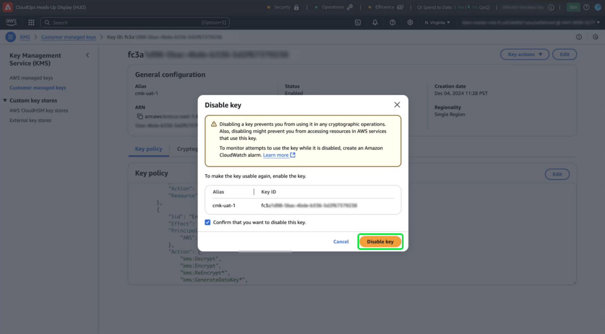
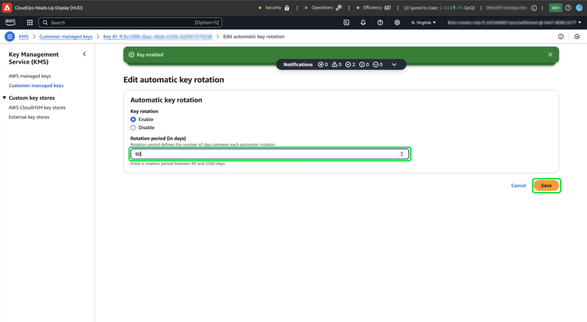

# Configurer des clés gérées par la clientèle avec AWS à l’aide de l’interface utilisateur d’Experience Platform

Utilisez ce guide pour activer les clés gérées par le client (CMK) pour les instances Experience Platform hébergées sur AWS via l’interface utilisateur d’Experience Platform.

>[!IMPORTANT]
>
>Avant de poursuivre avec ce guide, assurez-vous d’avoir terminé la configuration détaillée dans le document [’Configuration d’AWS KMS pour ](./configure-kms.md) CMK’.

## Mettez à jour la stratégie de clé AWS pour intégrer la clé à Experience Platform.

Pour intégrer votre clé AWS à Experience Platform, vous devez modifier le fichier JSON dans la section **[!DNL Key Policy]** de l’espace de travail KMS. Une politique de clé par défaut ressemble au fichier JSON ci-dessous.

<!-- The AWS ID below is fake. Q) Can I refer to it simply as AWS_ACCOUNT_ID ? Is that suitable? -->

```JSON
{
  "Id": "key-consolepolicy-3",
  "Version": "2012-10-17",
  "Statement": [
    {
      "Sid": "Enable IAM User Permissions",
      "Effect": "Allow",
      "Principal": {
        "AWS": "arn:aws:iam::123464903283:root" // this is a mock AWS Principal ID, your ID will differ
      },
      "Action": "kms:*",
      "Resource": "*"
    }
  ]
}
```

Dans l’exemple ci-dessus, toutes les ressources (`"Resource": "*"`) du même compte (`Principal.AWS`) peuvent accéder à la clé. Cette politique permet aux services du compte d’effectuer des opérations de chiffrement et de déchiffrement, limitées au compte spécifié. Pour accorder à votre compte à client(e) unique Experience Platform l’accès à cette clé, ajoutez de nouvelles instructions à la politique AWS par défaut. Vous pouvez obtenir la politique JSON requise à partir de l’interface utilisateur d’Experience Platform et l’appliquer à votre clé AWS KMS pour établir une connexion sécurisée avec Adobe Experience Platform.

Dans l’interface utilisateur d’Experience Platform, accédez à la section **[!UICONTROL Administration]** dans le rail de navigation de gauche, puis sélectionnez **[!UICONTROL Chiffrement]**. Dans l’espace de travail [!UICONTROL Configuration du chiffrement], sélectionnez **[!UICONTROL Configurer]** dans la vignette [!UICONTROL Clés gérées par le client].


La [!UICONTROL configuration des clés gérées par le client] s’affiche. Copiez l’objet `statement` à partir de la politique CMK KMS affichée dans la [!UICONTROL Configuration des clés gérées par le client] [!UICONTROL Configuration du chiffrement].

<!-- Select the copy icon () to copy the CMK KMS policy to your clipboard. A green pop-up notification confirms that the policy was copied.  -->

<!-- I cannot add the 'and the copy icon highlighted.' to the alt text below as i do not have access to this UI. -->


<!-- This part of the workflow was in contention at the time of the demo.  -->

Ensuite, revenez à l’espace de travail AWS KMS et mettez à jour la politique clé affichée ci-dessous.


Ajoutez à la politique par défaut les quatre instructions de l’espace de travail [!UICONTROL Configuration du chiffrement de la plateforme], comme illustré ci-dessous : `Enable IAM User Permissions`, `CJA Flow IAM User Permissions`, `CJA Integrity IAM User Permissions`, `CJA Oberon IAM User Permissions`.

```json
{
    "Version": "2012-10-17",
    "Id": "key-consolepolicy",
    "Statement": [
        {
            "Sid": "Enable IAM User Permissions",
            "Effect": "Allow",
            "Principal": {
                "AWS": "arn:aws:iam::975049898882:root" // this is a mock AWS Principal ID, your ID will differ
            },
            "Action": [
                "kms:Decrypt",
                "kms:Encrypt",
                "kms:ReEncrypt*",
                "kms:GenerateDataKey*",
                "kms:DescribeKey",
                "kms:CreateGrant"
            ],
            "Resource": "*",
            "Condition": {
                "StringEquals": {
                    "aws:PrincipalAccount": "975049898882" // this is a mock AWS Principal ID, your ID will differ
                }
            }
        },
        {
            "Sid": "CJA Flow IAM User Permissions",
            "Effect": "Allow",
            "Principal": {
                "AWS": "arn:aws:iam::767397686373:root"
            },
            "Action": [
                "kms:Decrypt",
                "kms:Encrypt",
                "kms:ReEncrypt*",
                "kms:GenerateDataKey*",
                "kms:DescribeKey",
                "kms:CreateGrant"
            ],
            "Resource": "*",
            "Condition": {
                "StringEquals": {
                    "aws:PrincipalAccount": "767397686373"
                }
            }
        },
        {
            "Sid": "CJA Integrity IAM User Permissions",
            "Effect": "Allow",
            "Principal": {
                "AWS": "arn:aws:iam::730335345392:root"
            },
            "Action": [
                "kms:Decrypt",
                "kms:Encrypt",
                "kms:ReEncrypt*",
                "kms:GenerateDataKey*",
                "kms:DescribeKey",
                "kms:CreateGrant"
            ],
            "Resource": "*",
            "Condition": {
                "StringEquals": {
                    "aws:PrincipalAccount": "730335345392"
                }
            }
        },
        {
            "Sid": "CJA Oberon IAM User Permissions",
            "Effect": "Allow",
            "Principal": {
                "AWS": "arn:aws:iam::891377157113:root"
            },
            "Action": [
                "kms:Decrypt",
                "kms:Encrypt",
                "kms:ReEncrypt*",
                "kms:GenerateDataKey*",
                "kms:DescribeKey",
                "kms:CreateGrant"
            ],
            "Resource": "*",
            "Condition": {
                "StringEquals": {
                    "aws:PrincipalAccount": "891377157113"
                }
            }
        }
    ]
}
```

Sélectionnez **[!DNL Finish]** pour confirmer la politique mise à jour et créer la clé. La configuration comprend désormais cinq instructions, ce qui permet à votre compte AWS de communiquer avec Adobe Experience Platform. Les modifications prennent effet immédiatement.

L’espace de travail [!DNL Customer Managed Keys] mis à jour de l’[!DNL Key Management Service] AWS s’affiche.

### Ajout de détails sur la clé de chiffrement AWS à Experience Platform

Ensuite, pour activer le chiffrement, ajoutez le nom de ressource Amazon (ARN) de la clé à votre configuration Experience Platform [!UICONTROL Clés gérées par le client]. Dans la section [!DNL Customer Managed Keys] d’AWS, sélectionnez l’alias de votre nouvelle clé dans la liste de la [!DNL Key Management Service].


Les détails de votre clé s’affichent. Tout dans AWS possède un nom de ressource Amazon (ARN) qui
est un identifiant unique utilisé pour spécifier les ressources dans les services AWS. Il suit un format normalisé : `arn:partition:service:region:account-id:resource`.

Sélectionnez l’icône de copie pour copier votre ARN. Une boîte de dialogue de confirmation s’affiche.


Revenez maintenant à l’interface utilisateur d’Experience Platform [!UICONTROL Configuration des clés gérées par le client]. Dans la section **[!UICONTROL Ajouter les détails de la clé de chiffrement AWS]**, ajoutez un **[!UICONTROL Nom de configuration]** et la clé **[!UICONTROL KMS ARN]** que vous avez copiée à partir de l’interface utilisateur d’AWS.

.

Sélectionnez ensuite **[!UICONTROL ENREGISTRER]** pour envoyer le nom de la configuration, l’ARN de la clé KMS et commencer la validation de la clé.


Vous revenez alors à l’espace de travail [!UICONTROL Configurations de chiffrement]. Le statut de la configuration du chiffrement s’affiche au bas de la carte **[!UICONTROL Clés gérées par le client]**.

.

Une fois la clé validée, les identifiants du coffre de clés sont ajoutés au lac de données et aux magasins de données de profil pour tous les sandbox.

>[!NOTE]
>
>La durée du processus dépend de la taille des données. Généralement, le processus est terminé en moins de 24 heures. Chaque sandbox est généralement mis à jour en deux à trois minutes.

## Révocation de clé {#key-revocation}

>[!IMPORTANT]
>
>Découvrez les implications de la révocation des clés sur les applications en aval avant de révoquer tout accès.

Voici les principales considérations à prendre en compte pour la révocation des clés :

- La révocation ou la désactivation de la clé rendra vos données Experience Platform inaccessibles. Cette action est irréversible et doit être effectuée avec précaution.
- Tenez compte des délais de propagation lorsque l’accès aux clés de chiffrement est révoqué. Les entrepôts de données de Principal deviennent inaccessibles en quelques minutes à 24 heures. Les entrepôts de données temporaires ou mis en cache deviennent inaccessibles dans les sept jours.

Pour révoquer une clé, accédez à l’espace de travail AWS KMS. La section **[!DNL Customer managed keys]** affiche toutes les clés disponibles pour votre compte AWS. Sélectionnez l’alias de votre clé dans la liste.


Les détails de votre clé s’affichent. Pour désactiver la touche , sélectionnez **[!DNL Key actions]**, puis **[!DNL Disable]** dans le menu déroulant.


Une boîte de dialogue de confirmation s’affiche. Sélectionnez **[!DNL Disable key]** pour confirmer votre choix. L’impact de la désactivation de la clé doit se refléter dans les applications Experience Platform et l’interface utilisateur en cinq minutes environ.

>[!NOTE]
>
>Une fois la clé désactivée, vous pouvez l’activer à nouveau en utilisant la même méthode que celle décrite ci-dessus, si nécessaire. Cette option est disponible à partir de la liste déroulante **[!DNL Key actions]** .



Si votre clé est utilisée dans d’autres services, vous pouvez également supprimer l’accès à Experience Platform directement à partir de la politique de clé. Sélectionnez **[!UICONTROL Modifier]** dans la section **[!DNL Key Policy]**.


La page **[!DNL Edit key policy]** s’affiche. Mettez en surbrillance et supprimez l’instruction de politique, copiée à partir de l’interface utilisateur d’Experience Platform, pour supprimer les autorisations de l’application Clés gérées par le client . Sélectionnez ensuite **[!DNL Save changes]** pour terminer le processus.


## Rotation des clés {#key-rotation}

AWS offre une rotation de clés automatique et à la demande. Pour réduire le risque de compromission de la clé ou répondre aux exigences de conformité en matière de sécurité, vous pouvez générer automatiquement de nouvelles clés de chiffrement à la demande ou à intervalles réguliers. Planifiez la rotation automatique des clés pour limiter la durée de vie d’une clé et vous assurer que si une clé est compromise, elle devient inutilisable après la rotation. Bien que les algorithmes de chiffrement modernes soient hautement sécurisés, la rotation des clés est une mesure de conformité de sécurité importante et démontre le respect des bonnes pratiques de sécurité.

### Rotation automatique des clés {#automatic-key-rotation}

La rotation automatique des clés est désactivée par défaut. Pour planifier la rotation automatique des clés à partir de l&#39;espace de travail KMS, sélectionnez l&#39;onglet **[!DNL Key rotation]** , puis **[!DNL Edit]** dans le **[!DNL Automatic key rotation section]**.


L’espace de travail **[!DNL Edit automatic key rotation]** s’affiche. À partir de là, sélectionnez le bouton radio pour activer ou désactiver la rotation automatique des touches. Utilisez ensuite le champ de saisie de texte ou le menu déroulant pour choisir une période pour la rotation de la clé. Sélectionnez **[!DNL Save]** pour confirmer les paramètres et revenir à l’espace de travail des détails clés.

>[!NOTE]
>
>La période de rotation des clés est de 90 jours au minimum et de 2 560 jours au maximum.



### Rotation des clés à la demande {#on-demand-key-rotation}

Sélectionnez **[!DNL Rotate Now]** pour effectuer une rotation de clé immédiate si la clé actuelle est compromise. AWS limite cette fonctionnalité à 10 rotations. Pour une maintenance régulière, planifiez plutôt des rotations de clés automatiques.


## Étapes suivantes

Vous êtes arrivé au bout de ce document. À présent, vous savez comment créer, configurer et gérer des clés de chiffrement dans AWS KMS pour Adobe Experience Platform. Ensuite, passez en revue les politiques de sécurité et de conformité de votre entreprise afin de mettre en œuvre les bonnes pratiques, telles que la planification des rotations de clés et la sécurisation du stockage des clés.
