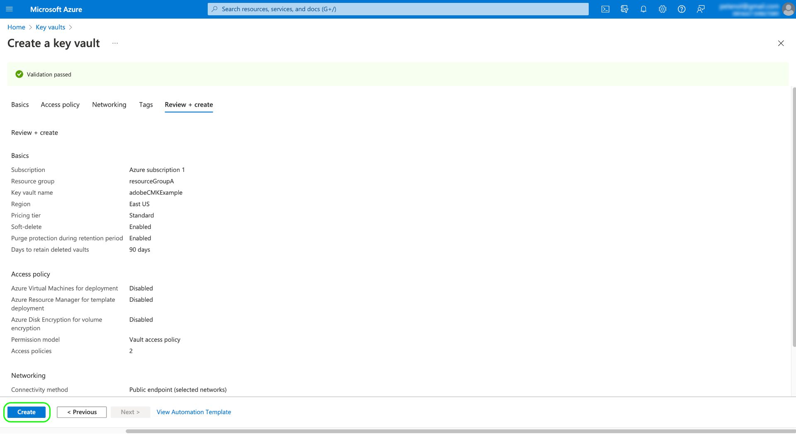

# Configuration d’un coffre de clés [!DNL Azure] pour les clés gérées par le client

Les clés gérées par le client (CMK) prennent en charge les clés des coffres de clés [!DNL Microsoft Azure] et des [!DNL Key Management Service (KMS)] AWS. Si votre implémentation est hébergée sur [!DNL Azure], suivez les étapes ci-dessous pour créer un coffre Key Vault. Pour les implémentations hébergées par AWS, consultez le [guide de configuration d’AWS KMS](../aws/configure-kms.md).

>[!IMPORTANT]
>
>Seuls les niveaux HSM Standard, Premium et Managed pour [!DNL Azure] Key Vault sont pris en charge. [!DNL Azure Dedicated HSM] et [!DNL Azure Payments HSM] ne sont pas pris en charge. Reportez-vous à la documentation d’[[!DNL Azure] ](https://learn.microsoft.com/fr-fr/azure/security/fundamentals/key-management#azure-key-management-services) pour plus d’informations sur les services de gestion de clés proposés.

>[!NOTE]
>
>La documentation ci-dessous ne couvre que les étapes de base pour créer le coffre de clés. En dehors de ces instructions, vous devez configurer le coffre de clés en fonction des politiques de votre entreprise.

Connectez-vous au portail [!DNL Azure] et utilisez la barre de recherche pour accéder à **[!DNL Key vaults]** sous la liste des services.

![La fonction de recherche dans [!DNL Microsoft Azure] avec [!DNL Key vaults] mis en surbrillance dans les résultats de la recherche.](../../../images/governance-privacy-security/customer-managed-keys/access-key-vaults.png)

La page **[!DNL Key vaults]** s’affiche après avoir sélectionné le service. À partir de là, sélectionnez **[!DNL Create]**.

![Tableau de bord [!DNL Key vaults] dans [!DNL Microsoft Azure] avec [!DNL Create] mis en surbrillance.](../../../images/governance-privacy-security/customer-managed-keys/create-key-vault.png)

À l’aide du formulaire fourni, renseignez les détails de base du coffre de clés, y compris un nom et un groupe de ressources affecté.

>[!WARNING]
>
>Bien que la plupart des options puissent rester sur leurs valeurs par défaut, **assurez-vous d’activer les options de suppression réversible et de protection contre le vidage**. Si vous n’activez pas ces fonctionnalités, vous risquez de perdre l’accès à vos données si le coffre de clés est supprimé.
>
>![Le workflow [!DNL Microsoft Azure] [!DNL Create a Key Vault] avec suppression réversible et protection contre le vidage est mis en surbrillance.](../../../images/governance-privacy-security/customer-managed-keys/basic-config.png)

À partir de là, continuez à parcourir le workflow de création du coffre de clés et configurez les différentes options en fonction des politiques de votre entreprise.

Une fois l’étape **[!DNL Review + create]** atteinte, vous pouvez consulter les détails du coffre de clés pendant la validation. Une fois la validation acceptée, sélectionnez **[!DNL Create]** pour terminer le processus.

## Configuration de l’accès {#configure-access}

Ensuite, activez le contrôle d’accès basé sur les rôles Azure pour votre coffre de clés. Sélectionnez **[!DNL Access configuration]** dans la section [!DNL Settings] du volet de navigation de gauche, puis sélectionnez **[!DNL Azure role-based access control]** pour activer le paramètre. Cette étape est essentielle, car l’application CMK doit être associée ultérieurement à un rôle Azure. L’attribution d’un rôle est documentée dans les workflows [API](./api-set-up.md#assign-to-role) et [UI](./ui-set-up.md#assign-to-role).

![Tableau de bord [!DNL Microsoft Azure] avec [!DNL Access configuration] et [!DNL Azure role-based access control] mis en surbrillance.](../../../images/governance-privacy-security/customer-managed-keys/access-configuration.png)

## Configurer les options de mise en réseau {#configure-network-options}

Si votre coffre de clés est configuré pour restreindre l’accès public à certains réseaux virtuels ou pour désactiver entièrement l’accès public, vous devez [!DNL Microsoft] une exception de pare-feu.

Sélectionnez **[!DNL Networking]** dans le volet de navigation de gauche. Sous **[!DNL Firewalls and virtual networks]**, cochez la case **[!DNL Allow trusted Microsoft services to bypass this firewall]**, puis sélectionnez **[!DNL Apply]**.

![Onglet [!DNL Networking] de [!DNL Microsoft Azure] avec [!DNL Networking] et [!DNL Allow trusted Microsoft surfaces to bypass this firewall] exception en surbrillance.](../../../images/governance-privacy-security/customer-managed-keys/networking.png)

### Générer une clé {#generate-a-key}

Une fois que vous avez créé un coffre de clés, vous pouvez générer une nouvelle clé. Accédez à l’onglet **[!DNL Keys]** et sélectionnez **[!DNL Generate/Import]**.

![Onglet [!DNL Keys] de la [!DNL Azure] avec le [!DNL Generate import] mis en surbrillance.](../../../images/governance-privacy-security/customer-managed-keys/view-keys.png)

Utilisez le formulaire fourni pour attribuer un nom à la clé, puis sélectionnez **RSA** ou **RSA-HSM** pour le type de clé. Pour les implémentations hébergées sur [!DNL Azure], la **[!DNL RSA key size]** doit être d’au moins 3 072 bits **&#x200B;**&#x200B;comme requis pour [!DNL Azure Cosmos DB]. [!DNL Azure Data Lake Storage] est également compatible avec RSA 3027.

>[!NOTE]
>
>Mémorisez le nom que vous indiquez pour la clé, car il est nécessaire pour envoyer la clé à l’Adobe.

Utilisez les commandes restantes pour configurer la clé que vous souhaitez générer ou importer selon vos besoins. Lorsque vous avez terminé, sélectionnez **[!DNL Create]**.

![Tableau de bord [!DNL Create a key] avec [!DNL 3072] bits mis en surbrillance.](../../../images/governance-privacy-security/customer-managed-keys/configure-key.png)

La clé configurée apparaît dans la liste des clés du coffre.

![Espace de travail [!DNL Keys] avec le nom de clé en surbrillance.](../../../images/governance-privacy-security/customer-managed-keys/key-added.png)

## Étapes suivantes

Pour poursuivre le processus unique de configuration de la fonctionnalité Clés gérées par le client, suivez les guides de configuration pour l’environnement d’hébergement de votre plateforme :

- Par [!DNL Azure], utilisez les guides de configuration [API](./api-set-up.md) ou [UI](./ui-set-up.md).
- Pour AWS, reportez-vous au guide de configuration de KMS [d’AWS](../aws/configure-kms.md) et au guide de configuration de l’interface utilisateur [IU](../aws/ui-set-up.md).
