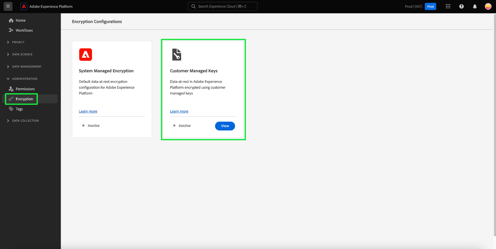
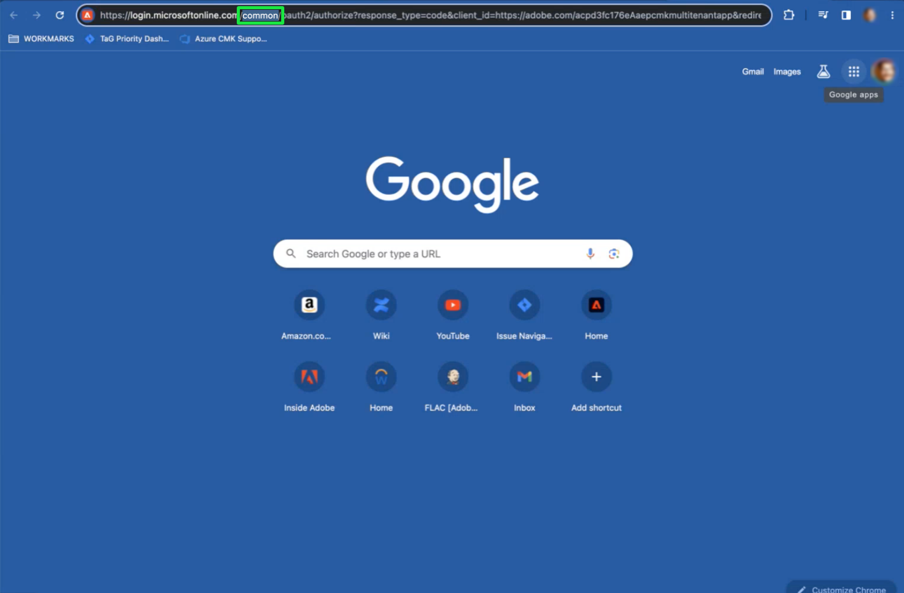

# Configurer des clés gérées par le client pour Azure à l’aide de l’interface utilisateur d’Experience Platform

Ce document présente les instructions spécifiques à Azure pour activer la fonctionnalité Clés gérées par le client (CMK) dans Experience Platform à l’aide de l’interface utilisateur. Pour obtenir des instructions spécifiques à AWS, consultez le [guide de configuration d’AWS](../aws/ui-set-up.md).

Pour plus d’informations sur la manière d’effectuer ce processus pour les instances d’Experience Platform hébergées sur Azure à l’aide de l’API, reportez-vous au document [Configuration de la CMK de l’API](./api-set-up.md).

## Conditions préalables

Pour afficher et consulter la section [!UICONTROL Chiffrement] dans Adobe Experience Platform, vous devez avoir créé un rôle et attribué l’autorisation [!UICONTROL Gérer les clés gérées par le client] à ce rôle. Tout utilisateur disposant de l’autorisation [!UICONTROL Gérer les clés gérées par le client] peut activer la fonction CMK pour son organisation.

Pour plus d’informations sur l’attribution de rôles et d’autorisations dans Experience Platform, reportez-vous à la documentation sur la [configuration des autorisations](https://experienceleague.adobe.com/docs/platform-learn/getting-started-for-data-architects-and-data-engineers/configure-permissions.html).

Pour activer la fonction CMK, votre coffre [[!DNL Azure] Key Vault doit être configuré](./azure-key-vault-config.md) avec les paramètres suivants :

* [Activer la protection contre le vidage](https://learn.microsoft.com/en-us/azure/key-vault/general/soft-delete-overview#purge-protection)
* [Enable soft-delete](https://learn.microsoft.com/en-us/azure/key-vault/general/soft-delete-overview)
* [Configuration de l’accès à l’aide  [!DNL Azure]  contrôle d’accès basé sur les rôles](https://learn.microsoft.com/en-us/azure/role-based-access-control/)
* [Configuration d’un coffre  [!DNL Azure]  Key Vault](./azure-key-vault-config.md)

## Configurer l’application CMK {#register-app}

Une fois que vous avez configuré votre coffre de clés, l’étape suivante consiste à enregistrer l’application CMK qui se connectera à votre client [!DNL Azure].

### Prise en main

Pour afficher le tableau de bord [!UICONTROL Configurations de chiffrement], sélectionnez **[!UICONTROL Chiffrement]** sous l’en-tête [!UICONTROL Administration] de la barre latérale de navigation de gauche.

Sélectionnez **[!UICONTROL Configurer]** pour ouvrir la vue [!UICONTROL Configuration des clés gérées par le client]. Cet espace de travail contient toutes les valeurs nécessaires pour effectuer les étapes décrites ci-dessous et effectuer l’intégration avec votre coffre de clés Azure.

### Copier l’URL d’authentification {#copy-authentication-url}

Pour démarrer le processus d’enregistrement, copiez l’URL d’authentification de l’application pour votre organisation à partir de la vue [!UICONTROL Configuration des clés gérées par le client] et collez-la dans votre **[!DNL Key Vault Crypto Service Encryption User]** d’environnement [!DNL Azure]. Vous trouverez dans la section suivante des informations détaillées sur la [attribution d’un rôle](#assign-to-role).

Sélectionnez l’icône de copie (). par l’URL d’authentification [!UICONTROL Application].

![La vue [!UICONTROL Configuration des clés gérées par le client] avec la section URL d’authentification de l’application mise en surbrillance.](../../../images/governance-privacy-security/customer-managed-keys/application-authentication-url.png)

Copiez et collez l’URL d’authentification [!UICONTROL Application] dans un navigateur pour ouvrir une boîte de dialogue d’authentification. Sélectionnez **[!DNL Accept]** pour ajouter le principal de service de l’application CMK à votre client [!DNL Azure]. La confirmation de l’authentification vous redirige vers la page de destination d’Experience Cloud.

![Boîte de dialogue de demande d’autorisation Microsoft avec [!UICONTROL Accepter] en surbrillance.](../../../images/governance-privacy-security/customer-managed-keys/app-permission.png)

>[!IMPORTANT]
>
>Si vous disposez de plusieurs abonnements [!DNL Microsoft Azure], vous pouvez éventuellement connecter votre instance Experience Platform au mauvais coffre de clés. Dans ce cas, vous devez remplacer la section `common` du nom de l’URL d’authentification de l’application par l’ID de répertoire CMK. Copiez l’ID de répertoire CMK à partir de la page Paramètres du portail, répertoires et abonnements de l’application [!DNL Microsoft Azure] ![Page [!DNL Microsoft Azure] Paramètres du portail d’applications, répertoires et abonnements avec l’ID de répertoire en surbrillance.](../../../images/governance-privacy-security/customer-managed-keys/directory-id.png) Ensuite, collez-le dans la barre d’adresse de votre navigateur. 

### Attribuer l’application CMK à un rôle {#assign-to-role}

Une fois le processus d’authentification terminé, revenez au coffre de clés [!DNL Azure] et sélectionnez **[!DNL Access control]** dans le volet de navigation de gauche. À partir de là, sélectionnez **[!DNL Add]**, puis **[!DNL Add role assignment]**.

![Tableau de bord [!DNL Microsoft Azure] avec [!DNL Add] et [!DNL Add role assignment] mis en surbrillance.](../../../images/governance-privacy-security/customer-managed-keys/add-role-assignment.png)

L’écran suivant vous invite à choisir un rôle pour cette affectation. Sélectionnez **[!DNL Key Vault Crypto Service Encryption User]** avant de sélectionner **[!DNL Next]** pour continuer.

>[!NOTE]
>
>Si vous disposez du niveau de [!DNL Managed-HSM Key Vault], vous devez sélectionner le rôle d’utilisateur **[!DNL Managed HSM Crypto Service Encryption User]**.

![Tableau de bord [!DNL Microsoft Azure] avec le [!DNL Key Vault Crypto Service Encryption User] mis en surbrillance.](../../../images/governance-privacy-security/customer-managed-keys/select-role.png)

Dans l’écran suivant, choisissez **[!DNL Select members]** pour ouvrir une boîte de dialogue dans le rail de droite. Utilisez la barre de recherche pour localiser le principal de service de l’application CMK et sélectionnez-le dans la liste. Lorsque vous avez terminé, sélectionnez **[!DNL Save]**.

>[!NOTE]
>
>Si vous ne trouvez pas votre application dans la liste, votre principal de service n’a pas été accepté dans votre client. Pour vous assurer que vous disposez des privilèges appropriés, contactez votre administrateur ou représentant [!DNL Azure].

Vous pouvez vérifier l’application en comparant l’[!UICONTROL ID d’application] fourni dans la vue [!UICONTROL Configuration des clés gérées par le client] avec l’[!DNL Application ID] fourni dans la présentation de l’application [!DNL Microsoft Azure].

![Vue [!UICONTROL Configuration des clés gérées par le client] avec le [!UICONTROL ID d’application] en surbrillance.](../../../images/governance-privacy-security/customer-managed-keys/application-id.png)

Tous les détails nécessaires à la vérification des outils Azure sont inclus dans l’interface utilisateur d’Experience Platform. Ce niveau de granularité est fourni car de nombreux utilisateurs souhaitent utiliser d’autres outils Azure pour améliorer leur capacité à surveiller et à consigner l’accès de ces applications à leur coffre de clés. La compréhension de ces identifiants est essentielle à cet effet et pour aider les services Adobe à accéder à la clé .

## Activer la configuration de la clé de chiffrement sur Experience Platform {#send-to-adobe}

Après l’installation de l’application CMK sur [!DNL Azure], vous pouvez envoyer votre identifiant de la clé de chiffrement à Adobe. Sélectionnez **[!DNL Keys]** dans le volet de navigation de gauche, suivi du nom de la clé à envoyer.

![Tableau de bord Microsoft Azure avec l’objet [!DNL Keys] et le nom de la clé en surbrillance.](../../../images/governance-privacy-security/customer-managed-keys/select-key.png)

Sélectionnez la dernière version de la clé et sa page de détails s’affiche. À partir de là, vous pouvez éventuellement configurer les opérations autorisées pour la clé.

>[!IMPORTANT]
>
>Les opérations minimales requises pour être autorisées pour la clé sont les autorisations **[!DNL Wrap Key]** et **[!DNL Unwrap Key]**. Vous pouvez inclure [!DNL Encrypt], [!DNL Decrypt], [!DNL Sign] et [!DNL Verify] si vous le souhaitez.

Le champ **[!UICONTROL Identifiant de clé]** affiche l’identifiant d’URI de la clé. Copiez cette valeur d’URI à utiliser à l’étape suivante.

![Détails clés du tableau de bord Microsoft Azure avec les sections [!DNL Permitted operations] et Copier l’URL clé en surbrillance.](../../../images/governance-privacy-security/customer-managed-keys/copy-key-url.png)

Une fois que vous avez obtenu le [!DNL Key vault URI], revenez à la vue [!UICONTROL Configuration des clés gérées par le client] et saisissez un **[!UICONTROL Nom de la configuration]** descriptif. Ajoutez ensuite le [!DNL Key Identifier] extrait de la page Détails de la clé Azure dans l’identifiant **[!UICONTROL Identifiant de clé du coffre de clés]** et sélectionnez **[!UICONTROL Enregistrer]**.

![La vue [!UICONTROL Configuration des clés gérées par le client] avec les sections [!UICONTROL Nom de configuration] et [!UICONTROL Identifiant de clé du coffre Key] mises en surbrillance.](../../../images/governance-privacy-security/customer-managed-keys/configuration-name.png)

Vous revenez au tableau de bord [!UICONTROL Configurations du chiffrement]. Le statut de la configuration [!UICONTROL Clés gérées par le client] s’affiche sous la forme [!UICONTROL  Traitement].

![Tableau de bord [!UICONTROL Configurations de chiffrement] avec [!UICONTROL Traitement] mis en surbrillance sur la vignette [!UICONTROL Clés gérées par le client].](../../../images/governance-privacy-security/customer-managed-keys/processing.png)

## Vérifiez le statut de la configuration {#check-status}

Patientez un temps de traitement important. Pour vérifier le statut de la configuration, revenez à la [!UICONTROL configuration des clés gérées par le client] afficher et faites défiler l’écran jusqu’au [!UICONTROL statut de la configuration]. La barre de progression est passée à l’étape 1 de trois et explique que le système valide qu’Experience Platform a accès à la clé et au coffre de clés.

Il existe quatre statuts potentiels pour la configuration du CMK. En voici la liste :

* Étape 1 : vérifie qu’Experience Platform a la possibilité d’accéder à la clé et au coffre de clés.
* Étape 2 : le coffre de clés et le nom des clés sont en cours d’ajout à tous les magasins de données de votre organisation.
* Étape 3 : le coffre de clés et le nom des clés ont été ajoutés aux magasins de données.
* `FAILED` : un problème s’est produit, principalement lié à la configuration de la clé, du coffre de clés ou de l’application multi-utilisateur.

## Étapes suivantes

En suivant les étapes ci-dessus, vous avez activé le CMK pour votre organisation hébergée dans Azure. Les données ingérées dans les entrepôts de données principaux seront désormais chiffrées et déchiffrées à l’aide des clés de votre coffre de clés [!DNL Azure].

Après avoir activé la fonction CMK pour votre organisation hébergée dans Azure, surveillez l’utilisation des clés, implémentez une politique de rotation des clés pour une sécurité renforcée et assurez-vous que tout est conforme aux politiques de votre organisation.
