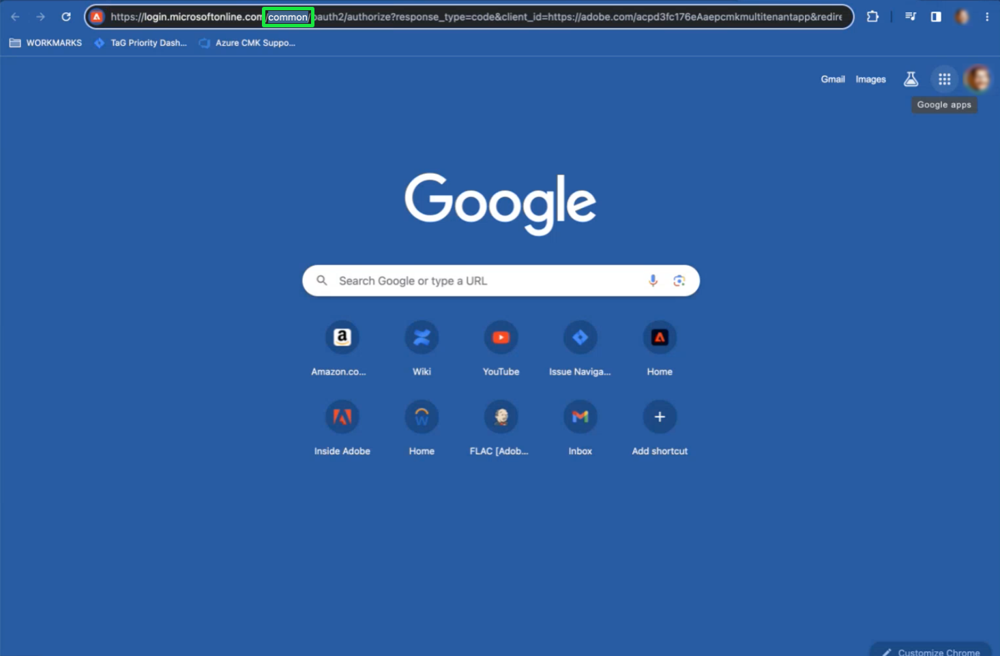

# Configuration et configuration des clés gérées par le client à l’aide de l’interface utilisateur de Platform

Ce document couvre le processus d’activation de la fonctionnalité de clés gérées par le client (CMK) dans Platform à l’aide de l’interface utilisateur. Pour obtenir des instructions sur la façon d’effectuer ce processus à l’aide de l’API, reportez-vous au [document de configuration du CMK de l’API](./api-set-up.md).

## Conditions préalables

Pour afficher et consulter la section [!UICONTROL Chiffrement] dans Adobe Experience Platform, vous devez avoir créé un rôle et lui avoir attribué l’autorisation [!UICONTROL Gérer la clé gérée par le client]. Tout utilisateur disposant de l’autorisation [!UICONTROL Gérer la clé gérée par le client] peut activer le CMK pour son organisation.

Pour plus d&#39;informations sur l&#39;attribution des rôles et des autorisations en Experience Platform, consultez la [documentation sur la configuration des autorisations](https://experienceleague.adobe.com/docs/platform-learn/getting-started-for-data-architects-and-data-engineers/configure-permissions.html).

Pour activer le CMK, votre [[!DNL Azure] Key Vault doit être configuré](./azure-key-vault-config.md) avec les paramètres suivants :

* [Activer la protection contre le vidage](https://learn.microsoft.com/en-us/azure/key-vault/general/soft-delete-overview#purge-protection)
* [Activer soft-delete](https://learn.microsoft.com/en-us/azure/key-vault/general/soft-delete-overview)
* [Configurer l’accès à l’aide du  [!DNL Azure] contrôle d’accès basé sur les rôles](https://learn.microsoft.com/en-us/azure/role-based-access-control/)
* [Configuration d’un Key Vault  [!DNL Azure] ](./azure-key-vault-config.md)

## Configurer l’application CMK {#register-app}

Une fois que votre coffre-fort de clé est configuré, l’étape suivante consiste à enregistrer l’application CMK qui se connectera à votre client [!DNL Azure].

### Commencer

Pour afficher le tableau de bord [!UICONTROL Configurations du chiffrement], sélectionnez **[!UICONTROL Chiffrement]** sous l’en-tête [!UICONTROL Administration] de la barre de navigation de gauche.

Sélectionnez **[!UICONTROL Configurer]** pour ouvrir la vue [!UICONTROL Configuration des clés gérées par le client]. Cet espace de travail contient toutes les valeurs nécessaires pour effectuer les étapes décrites ci-dessous et effectuer l’intégration avec votre coffre de clés Azure.

### Copie de l’URL d’authentification {#copy-authentication-url}

Pour lancer le processus d’enregistrement, copiez l’URL d’authentification de l’application pour votre organisation à partir de la vue [!UICONTROL Configuration des clés gérées par le client] et collez-la dans votre environnement [!DNL Azure] **[!DNL Key Vault Crypto Service Encryption User]**. Vous trouverez des détails sur la façon d&#39; [attribuer un rôle](#assign-to-role) dans la section suivante.

Sélectionnez l’icône de copie () par l’ [!UICONTROL URL d’authentification d’application].

![La vue [!UICONTROL Configuration des clés gérées par le client] avec la section URL d&#39;authentification d&#39;application mise en surbrillance.](../../images/governance-privacy-security/customer-managed-keys/application-authentication-url.png)

Copiez et collez l’ [!UICONTROL URL d’authentification d’application] dans un navigateur pour ouvrir une boîte de dialogue d’authentification. Sélectionnez **[!DNL Accept]** pour ajouter l’entité de service de l’application CMK à votre client [!DNL Azure]. Confirmer l’authentification vous redirige vers la page d’entrée de l’Experience Cloud.

![Boîte de dialogue de demande d’autorisation Microsoft avec [!UICONTROL Accept] surlignée.](../../images/governance-privacy-security/customer-managed-keys/app-permission.png)

>[!IMPORTANT]
>
>Si vous disposez de plusieurs abonnements [!DNL Microsoft Azure], vous pouvez éventuellement connecter votre instance Platform à un coffre de clé incorrect. Dans ce cas, vous devez remplacer la section `common` du nom de l’URL d’authentification de l’application par l’ID de répertoire CMK. Copiez l’ID de répertoire CMK à partir de la page Paramètres du portail, Répertoires et Abonnements de l’ [!DNL Microsoft Azure] application  ![ La page [!DNL Microsoft Azure] Paramètres du portail d’applications, Répertoires et abonnements avec l’ID de répertoire en surbrillance.](../../images/governance-privacy-security/customer-managed-keys/directory-id.png) Ensuite, collez-la dans la barre d&#39;adresse de votre navigateur. 

### Attribuer l’application CMK à un rôle {#assign-to-role}

Une fois le processus d’authentification terminé, revenez au coffre de clés [!DNL Azure] et sélectionnez **[!DNL Access control]** dans le volet de navigation de gauche. À partir de là, sélectionnez **[!DNL Add]**, puis **[!DNL Add role assignment]**.

![ Le tableau de bord [!DNL Microsoft Azure] avec [!DNL Add] et [!DNL Add role assignment] surlignés.](../../images/governance-privacy-security/customer-managed-keys/add-role-assignment.png)

L’écran suivant vous invite à choisir un rôle pour cette affectation. Sélectionnez **[!DNL Key Vault Crypto Service Encryption User]** avant de sélectionner **[!DNL Next]** pour continuer.

>[!NOTE]
>
>Si vous disposez du niveau [!DNL Managed-HSM Key Vault], vous devez sélectionner le rôle d’utilisateur **[!DNL Managed HSM Crypto Service Encryption User]**.

![Tableau de bord [!DNL Microsoft Azure] avec [!DNL Key Vault Crypto Service Encryption User] en surbrillance.](../../images/governance-privacy-security/customer-managed-keys/select-role.png)

Dans l’écran suivant, choisissez **[!DNL Select members]** pour ouvrir une boîte de dialogue dans le rail de droite. Utilisez la barre de recherche pour localiser le principal de service de l’application CMK et sélectionnez-le dans la liste. Lorsque vous avez terminé, sélectionnez **[!DNL Save]**.

>[!NOTE]
>
>Si vous ne trouvez pas votre application dans la liste, votre principal de service n’a pas été accepté dans votre client. Pour vous assurer que vous disposez des privilèges appropriés, contactez votre administrateur ou représentant [!DNL Azure].

Vous pouvez vérifier l’application en comparant l’[!UICONTROL ID d’application] fourni sur la vue [!UICONTROL  Configuration des clés gérées par le client] à la [!DNL Application ID] fournie dans la présentation de l’application [!DNL Microsoft Azure].

![La vue [!UICONTROL Configuration des clés gérées par le client] avec l’[!UICONTROL ID d’application] en surbrillance.](../../images/governance-privacy-security/customer-managed-keys/application-id.png)

Tous les détails nécessaires pour vérifier les outils Azure sont inclus dans l’interface utilisateur de Platform. Ce niveau de granularité est fourni lorsque de nombreux utilisateurs souhaitent utiliser d’autres outils Azure afin d’améliorer leur capacité à surveiller et consigner l’accès de ces applications à leur coffre-fort clé. Pour ce faire, il est essentiel de comprendre ces identifiants et d’aider les services Adobe à accéder à la clé.

## Activer la configuration de la clé de chiffrement sur Experience Platform {#send-to-adobe}

Après l’installation de l’application CMK sur [!DNL Azure], vous pouvez envoyer votre identifiant de la clé de chiffrement à Adobe. Sélectionnez **[!DNL Keys]** dans le volet de navigation de gauche, suivi du nom de la clé à envoyer.

![Le tableau de bord Azure Microsoft avec l’objet [!DNL Keys] et le nom de clé mis en surbrillance.](../../images/governance-privacy-security/customer-managed-keys/select-key.png)

Sélectionnez la dernière version de la clé et sa page de détails s’affiche. À partir de là, vous pouvez éventuellement configurer les opérations autorisées pour la clé.

>[!IMPORTANT]
>
>Les opérations minimales requises autorisées pour la clé sont les autorisations **[!DNL Wrap Key]** et **[!DNL Unwrap Key]**. Vous pouvez inclure [!DNL Encrypt], [!DNL Decrypt], [!DNL Sign] et [!DNL Verify] si vous le souhaitez.

Le champ **[!UICONTROL Identifiant de clé]** affiche l’identifiant d’URI de la clé. Copiez cette valeur d’URI à utiliser à l’étape suivante.

![Détails de la clé de tableau de bord Azure Microsoft avec [!DNL Permitted operations] et les sections Copier la clé URL mises en surbrillance.](../../images/governance-privacy-security/customer-managed-keys/copy-key-url.png)

Une fois que vous avez obtenu le [!DNL Key vault URI], revenez à la vue [!UICONTROL Configuration des clés gérées par le client] et saisissez un **[!UICONTROL nom de configuration]** descriptif. Ajoutez ensuite le [!DNL Key Identifier] extrait de la page de détails de la clé Azure dans l’ **[!UICONTROL identifiant de clé Vault]** et sélectionnez **[!UICONTROL Enregistrer]**.

![ La vue [!UICONTROL Configuration des clés gérées par le client] avec le [!UICONTROL nom de configuration] et les sections [!UICONTROL  Identifiant de clé Vault ] mises en surbrillance.](../../images/governance-privacy-security/customer-managed-keys/configuration-name.png)

Vous revenez au [!UICONTROL tableau de bord des configurations de chiffrement]. L’état de la configuration [!UICONTROL Clés gérées par le client] s’affiche sous la forme [!UICONTROL Traitement].

![Le tableau de bord [!UICONTROL Configurations de chiffrement] avec [!UICONTROL Traitement] surligné sur la carte [!UICONTROL  Clés gérées par le client].](../../images/governance-privacy-security/customer-managed-keys/processing.png)

## Vérifiez le statut de la configuration {#check-status}

Laps de temps important pour le traitement. Pour vérifier l’état de la configuration, revenez à la vue [!UICONTROL Configuration des clés gérées par le client] et faites défiler l’écran jusqu’à l’[!UICONTROL état de configuration]. La barre de progression est passée à l’étape 1 de 3 et explique que le système valide que Platform a accès à la clé et au coffre-fort.

Il existe quatre états potentiels de la configuration du CMK. En voici la liste :

* Étape 1 : valide la capacité de Platform à accéder à la clé et au coffre-fort de la clé.
* Étape 2 : le coffre-fort et le nom de la clé sont en train d’être ajoutés à tous les entrepôts de données de votre organisation.
* Étape 3 : la coffre-fort de la clé et le nom de la clé ont été ajoutés avec succès aux banques de données.
* `FAILED` : un problème s’est produit, principalement lié à la configuration de la clé, du coffre de clés ou de l’application multi-utilisateur.

## Étapes suivantes

En suivant les étapes ci-dessus, vous avez activé le CMK pour votre entreprise. Les données ingérées dans les entrepôts de données principaux seront désormais chiffrées et déchiffrées à l’aide des clés de votre Key Vault [!DNL Azure].
